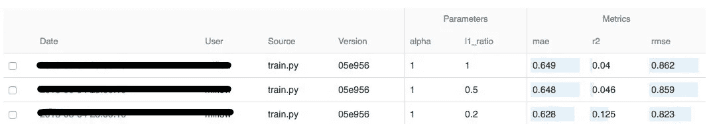

# 释放 MLflow 的力量

> 原文：[`towardsdatascience.com/unleashing-the-power-of-mlflow-36c17a693033`](https://towardsdatascience.com/unleashing-the-power-of-mlflow-36c17a693033)

## 机器学习生命周期管理的快速导览

[](https://ms101196.medium.com/?source=post_page-----36c17a693033--------------------------------)[](https://towardsdatascience.com/?source=post_page-----36c17a693033--------------------------------) [Merlin Schäfer](https://ms101196.medium.com/?source=post_page-----36c17a693033--------------------------------)

·发表于[Towards Data Science](https://towardsdatascience.com/?source=post_page-----36c17a693033--------------------------------) ·6 分钟阅读·2023 年 5 月 30 日

--


图片由[Stephen Dawson](https://unsplash.com/pt-br/@dawson2406?utm_source=medium&utm_medium=referral)提供，来源于[Unsplash](https://unsplash.com/?utm_source=medium&utm_medium=referral)

你是否曾经发现自己花了几个小时训练模型、调整超参数和选择特征，却意识到你已经有一组不错的参数，但却忘记跟踪或保存模型？我知道我有过，可能比我愿意承认的还要多。在你打开一个电子表格，开始记录模型使用的 alpha 值或邻居数量之前，我想向你介绍 MLflow。

MLflow 是一个多功能的开源平台，旨在管理端到端的机器学习生命周期，由 Databricks 开发。它为机器学习从业者、数据科学家和开发人员提供了一系列好处，使实验、重现性和 ML 模型的部署变得更加简便。所以，让我们来探索一下它能为你做些什么吧！

## MLflow 的主要组件

在我们深入探讨使用 MLflow 的细节之前，了解 MLflow 是什么以及它在当今机器学习领域中为何是一个关键工具是至关重要的。

MLflow 帮助管理机器学习生命周期，包括**实验**、**重现性**和**部署**。它兼容任何（Python）机器学习库。它为最常见的库提供了现成的接口，使其具有高度的灵活性，满足你所有的开发需求。

MLflow 由四个主要组件组成：

1.  **MLflow Tracking**：主要 API，记录和组织机器学习实验。它记录参数、指标和工件（如模型、笔记本和脚本），使你能够跟踪实验运行和结果。它配备了一个 UI，你可以通过 localhost 访问来查看、可视化和管理你的实验。

1.  **MLflow Projects**：一种用于重复性和共享的代码打包格式。它定义了 ML 代码的标准结构，使你更容易理解、重用和与他人协作。

1.  **MLflow 模型**：一种用于打包多种 ML 框架的标准格式，以及一个用于存储和共享模型的库。它简化了跨平台的模型部署。

1.  **MLflow 模型注册表**：一个集中管理的模型库，具备模型谱系、版本控制、阶段转换和注释功能。它在需要与团队成员比较和组合模型的协作环境中特别有用。

MLflow 的优势在于其简化和优化 ML 生命周期的能力，使你能够轻松跟踪和比较实验、重现代码、管理模型，并相对容易地部署解决方案。

## 深入了解 MLflow Tracking：管理你的 ML 实验

让我们通过**MLflow Tracking**开始这次实践环节。API 和 UI 用于记录和管理你所有的 ML 实验。

你可以在简单的脚本中使用它，也可以将其扩展到大规模训练环境中。我将通过一个简单的代码片段，使用 Scikit-learn 中的 ElasticNet 回归来演示基本用法。

```py
import mlflow
import mlflow.sklearn
from sklearn.linear_model import ElasticNet
from sklearn.metrics import mean_squared_error
import numpy as np
```

```py
# Initiate a new MLflow run
with mlflow.start_run():
    # Train and fit the model
    model = ElasticNet(alpha=0.5, l1_ratio=0.5)
    model.fit(X_train, y_train)

    # Make predictions and calculate the RMSE
    predictions = model.predict(X_test)
    rmse = np.sqrt(mean_squared_error(y_test, predictions))

    # Log parameters
    mlflow.log_param("alpha", 0.5)
    mlflow.log_param("l1_ratio", 0.5)

    # Log metric
    mlflow.log_metric("rmse", rmse)

    # Log model (artifact)
    mlflow.sklearn.log_model(model, "model")
```

运行此脚本后，你可以在 MLflow Tracking UI 中查看记录的运行详细信息。用户友好的界面允许你根据不同参数和指标过滤和排序运行，从而进行比较分析。



MLflow UI 示例

## MLflow 模型注册表：简化你的模型管理

在开始使用 MLflow Tracking 后，你可能也想开始组织你的模型。这就是 MLflow 模型注册表的用武之地，它是一个与 MLflow Tracking 紧密集成的集中模型库。它是个人和团队审查、共享和协作 ML 模型的绝佳工具。

模型注册表简化了模型从实验到生产的过渡。它通过允许模型谱系跟踪、模型版本控制、阶段转换和模型注释来实现这一点。

你可以这样使用模型注册表：

1.  **从 MLflow Tracking 记录模型**：

```py
mlflow.sklearn.log_model(lr_model, "model")
```

**2\. 在注册表中注册已记录的模型**：

```py
result = mlflow.register_model(
    "runs:/d16076a3ec534311817565e6527539c0/model",
    "ElasticNetWineModel"
)
```

*模型是通过其运行 ID 注册的（*`d16076a3ec534311817565e6527539c0`*在示例中）。*

**3\. 列出所有注册的模型**：

你可以通过列出所有注册的模型来检查你的模型是否已成功注册：

```py
mlflow.search_runs()
```

**4\. 从注册表中加载模型**：

你可以从注册表中加载模型进行预测或评分：

```py
model_uri = "models:/ElasticNetWineModel/1"
model = mlflow.pyfunc.load_model(model_uri)
```

**5\. 在阶段之间转换模型版本**：

模型注册表允许模型阶段的转换。你可以将模型从“无”状态转换为“暂存”、“生产”或“归档”阶段：

```py
client = mlflow.tracking.MlflowClient()
client.transition_model_version_stage(
    name="ElasticNetWineModel",
    version=1,
    stage="Production",
)
```

在这个例子中，我们将模型的版本 1 转移到“生产”阶段以供后续使用。

## 了解 MLflow 模型

MLflow 如何保存你的模型？

MLflow 模型提供了一种标准格式来打包你的机器学习模型，这些模型可以在各种下游工具中使用。例如，通过 REST API 进行实时服务，Spark 集群上的批量推断等。

MLflow 模型使用一种简单的约定来打包模型，每个模型都保存为一个目录，其中包含必要的文件和一个描述符文件，列出模型可以使用的几种“风味”。

一种风味定义了模型可以运行的特定格式或库。对于最重要的库有不同的风味。例如，TensorFlow 模型可以加载为 TensorFlow SavedModel 格式或作为一个 Python 函数应用于输入数据。

如果你有来自自定义库的模型或未内置的模型，你仍然可以在通用 Python 函数风味中使用它：

```py
import mlflow.pyfunc
class ModelWrapper(mlflow.pyfunc.PythonModel):
    def load_context(self, context):
        # Initialization logic
        pass
    def predict(self, context, model_input):
        # Prediction logic
        pass
# Saving the model
mlflow.pyfunc.save_model(path="model_path", python_model=ModelWrapper())
```

当你准备好提供你的模型（例如用于 API）时，你可以使用`mlflow models serve`命令：

```py
mlflow models serve -m models:/ElasticNetWineModel/1 -p 1234
```

此命令将在本地主机的端口`1234`上提供指定版本的模型（此处为`1`）。

## 探索 MLflow 项目：简化你的代码打包

如上所述，MLflow Projects 是一种以可重用和可复现的方式打包你的代码的格式。它主要帮助你在团队之间共享项目，并使其在不同平台上运行。每个项目仅仅是一个包含你的代码和名为`MLproject`的描述符文件的目录或库。

`MLproject`文件定义了项目的结构，包括依赖项、入口点和代码的参数。你的`MLproject`文件可能如下所示：

```py
name: My_Project
conda_env: conda.yaml
entry_points:
  main:
    parameters:
      alpha: float # no default value
      l1_ratio: {type: float, default: 0.5} # default value
    command: "python main.py {alpha} {l1_ratio}" # run script with params
```

在这个例子中，`main.py`是项目的入口点。`alpha`和`l1_ratio`是这个脚本的参数。`conda.yaml`文件列出了项目的 Python 依赖项。

你可以通过`mlflow run`命令运行项目的入口点：

```py
mlflow run . -P alpha=0.42
```

该命令获取必要的依赖项，使用给定的和/或默认参数运行你的代码，并将结果记录到跟踪服务器。

## 总结

这就结束了我们对 MLflow 的快速浏览。

我们现在已经涵盖了 MLflow 的四个组件：MLflow Tracking、MLflow Projects、MLflow Models 和 MLflow Model Registry。这些工具结合在一起，为你提供了一个全面的平台，用于管理机器学习生命周期，促进更好的协作、代码重用和实验跟踪。

无论你是在单独工作还是在多个团队中工作，处理简单模型还是复杂的 ML 管道，我希望你发现 MLflow 是一个值得整合到你的工作流中的工具。

记住，我这里只是简单地触及了 MLflow 功能的表面。要深入了解高级功能、示例和使用方法，请查看[官方 MLflow 文档](https://mlflow.org/docs/latest/index.html)或可能的后续帖子。

和往常一样，我也希望你学到了一些对你有帮助的东西。享受在你的机器学习项目中探索和利用 MLflow 的力量吧！

-Merlin

[](https://ms101196.medium.com/membership?source=post_page-----36c17a693033--------------------------------) [## 使用我的推荐链接加入 Medium - Merlin Schäfer

### 阅读 Merlin Schäfer（以及 Medium 上成千上万其他作家的）每一个故事。你的会员费直接支持…

ms101196.medium.com](https://ms101196.medium.com/membership?source=post_page-----36c17a693033--------------------------------)

*来源：*

*[1]* [*https://mlflow.org/docs/latest/index.html*](https://mlflow.org/docs/latest/index.html)
