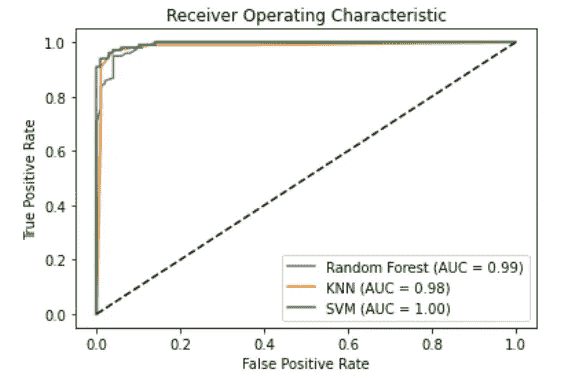
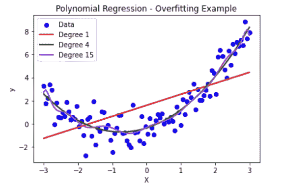
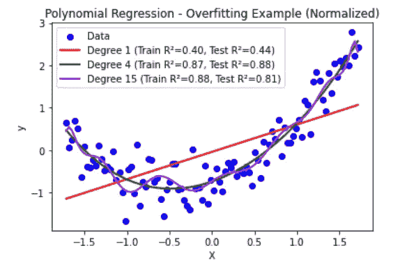

# 发掘数据科学家的提示工程潜力

> 原文：[`towardsdatascience.com/unleashing-the-power-of-prompt-engineering-for-data-scientists-16b6d1f2bf85`](https://towardsdatascience.com/unleashing-the-power-of-prompt-engineering-for-data-scientists-16b6d1f2bf85)

## 如何以及为什么在数据工作中编写有效的提示

[](https://federicotrotta.medium.com/?source=post_page-----16b6d1f2bf85--------------------------------)[](https://towardsdatascience.com/?source=post_page-----16b6d1f2bf85--------------------------------) [Federico Trotta](https://federicotrotta.medium.com/?source=post_page-----16b6d1f2bf85--------------------------------)

·发布于[数据科学之路](https://towardsdatascience.com/?source=post_page-----16b6d1f2bf85--------------------------------) ·18 分钟阅读·2023 年 6 月 7 日

--


图片由[Gerd Altmann](https://pixabay.com/it/users/geralt-9301/?utm_source=link-attribution&utm_medium=referral&utm_campaign=image&utm_content=4126485)提供，来源于[Pixabay](https://pixabay.com/it//?utm_source=link-attribution&utm_medium=referral&utm_campaign=image&utm_content=4126485)

多亏了 GPT 模型，提示工程正成为数据科学中的一个重要领域。最初，我们看到世界各地许多好奇的人在测试 ChatGPT 以尝试欺骗它。然后，虽然这种趋势（终于！）结束了，但使用它来自动化无聊的任务或帮助处理一般任务的人数稳步增加。

开发人员和数据科学家从使用像 ChatGPT 这样的提示系统中受益良多。因此，在本文中，我们将概述提示工程及其如何为数据科学家编写高效提示。

我知道你从 ChatGPT 中受益良多，对吧？！但事实是，有时候我们作为数据科学家并不能完全从中获得我们想要的结果。所以，让我们看看如何通过一些简单的预防措施来提高我们的提示技能。

这篇文章的内容如下：

```py
**Table of Contents:**

The importance of prompt engineering today
How prompt engineering can affect Data Scientists
Examples of effective prompts for Data Scientists
```

# 今天提示工程的重要性

过去 150 年的关键词可能是“自动化”。事实上，世界已经从手工制作的产品演变为生产线。虽然手工艺仍然（高度）有价值，但“批量生产”已成为与“自动化”相伴的词汇。

工作的机械化和自动化在不断增加，这种趋势渗透到了各个领域，不仅限于直接涉及生产商品的领域，例如制造业或农业。

如果我们以软件为例，第一个应该看到的就是自动化。当我大约三年前学习 Python 时，一位导师在审查我的第一个项目时告诉我：“Federico，开发软件意味着自动化事物！” 如果你在问，是的：我的第一个项目是一团糟（就像我们做的所有第一次的事情一样！）。

无论如何，真相是：人类进化的明确目标是：自动化事物。这可以与自动化无聊的事情或“艰苦的工作”相关。无论如何，关键在于朝着自动化的方向前进。

在这种情况下，提示工程只是最新的帮助我们自动化事物的工具。在“代码视角”下，这意味着自动化可自动化的事物：软件开发本质上是自动化，使用提示工程意味着进一步推动自动化。

事实上，即使在软件开发中也存在无聊的任务，即使，例如，我们已经创建了可以导入的类（但需要稍作修改）。

想一想：作为一个数据科学家，你每周开发多少个原型？你有多少时间来开发它们？

你创建一个原型，然后呢？项目的规格发生变化，客户改变主意，你的老板不满意……好吧，你自己说吧。

那么，为什么我们要花费大量精力在低价值但耗时的任务上，而不是自动化它们呢？在我看来，这里是提示工程的核心概念。

那么，让我们看看提示工程如何影响数据科学家，然后看看我们如何创建有用且高效的提示。

# 提示工程如何影响数据科学家

每项新技术都有其优点和缺点，提示工程也不例外。首先，让我们看看优点，然后是缺点。

## 数据科学家的提示工程：优点

1.  **更快的学习**。如果你是数据科学领域（以及软件开发领域）初学者，你会发现像 ChatGPT 这样的工具非常有益，因为它就像是 24/7 随时可用的高级开发人员。不过，仍然不应将其视为万能的，主要因为它仍然会出现一些错误。如果你有兴趣，我写了一篇关于如何在 ChatGPT 时代有效开始编程的专门文章，[点击这里](https://medium.com/towards-data-science/how-to-effectively-start-coding-in-the-era-of-chatgpt-cfc5151e1c42)。

1.  **更快的原型**。在我看来，数据科学家工作中最重要的部分之一是原型开发。事实上，我们经常需要根据数据（通常是可用数据很少，且很脏的数据）快速给出回答。因此，原型可以给出客户需要的回答感，使我们有时间：a) 请求/获取更多数据，b) 请求/获取更多规格，c) 清洗数据，d) 进行必要的研究。

1.  **更快的调试和错误管理**。我们必须诚实地说：在软件开发中，调试和错误管理更多的是一种诅咒而不是一种乐趣。对于机器学习/深度学习算法的软件开发也是如此。ChatGPT 是一个很好的调试和错误管理工具：通过正确的提示，它可以在几秒钟内发现错误和漏洞，节省大量时间和精力。只要提醒一下：由于 ChatGPT（以及类似工具）在云端工作，并且可能使用我们的提示来训练它们的算法，所以要记住不要写包含敏感信息的代码，因为在数据泄露的情况下可能会给你带来麻烦。

1.  **更快的研究**。数据科学家的工作中一个重要部分就是进行研究。我们绝对需要大量的研究来解决问题，例如：特定库及其使用信息、与我们面临的问题领域知识相关的信息等等。好的提示通常对获取所需的信息非常有用。唯一需要记住的是，我们始终需要通过在互联网或书籍上深入验证输出的正确性。特别是对于代码，阅读文档始终很重要：否则，风险就是复制和粘贴代码而实际上不理解它。

## 数据科学家的提示工程：缺点

1.  **可能会失去工作**。是的，我们必须说：AI 工具可能会使我们失去工作。这似乎是一种矛盾：市场对数据专业人员的需求在这些月里不断增加，但像 ChatGPT 这样的工具可能会取代我们。好吧，实话实说：这个可能性在目前还很遥远，因为 AI 工具需要专家的监督，就像我们在优点中讨论的那样。当然，你可以请求一些代码和数据分析，但如果你不知道如何使用这些代码，你怎么办？所以，是的：提示工程可能会导致一些数据专业人员失去工作，但这是一件几年后才会发生的事情，而不是几个月。

1.  **可能会忘记如何编程**。这是一个实际问题。如果我们过于依赖提示工程而不是自己编写代码，我们可能会忘记如何编程。你知道的：编程是一个需要练习的过程，需要每天的练习。当然，就像骑自行车一样：你永远不会忘记如何骑。但你知道：过于依赖提示而不是编写代码会导致你的技能萎缩，因为你变得过于舒适。因此，使用像 ChatGPT 这样的工具，但不要仅仅依赖于这些工具：尽可能多地努力编写代码。因为我知道你喜欢编程，所以不要过多地依赖机器。

1.  **可能无法学习新知识**。从事 IT 工作，尤其是在数据领域，令人兴奋的一点是新话题和技术几乎每天都在诞生。这也是我[转行从事 IT 的原因之一](https://betterhumans.pub/from-gears-to-code-how-i-successfully-transitioned-from-mechanical-engineering-to-tech-44909e31cbb0)：因为我喜欢不断学习新事物，我希望这被视为一件好事（是的，有些领域/公司认为自我提升不是好事）。但如果你只是依赖提示得到的答案并复制粘贴代码（或信息），你不会学到新知识。在代码方面，至少你需要请求解释，然后阅读文档。接着，如果可能的话，在不同的场景中尝试代码，以便你能熟悉你收到的代码。这也是我们在请求一般信息时需要采取的相同方法：始终通过阅读其他来源来深入了解（就像它应该总是那样：但让我们记住这一点！）。

1.  **可能出现“冗长的代码”。** 代码能正常工作并不是保留它的好理由，你知道的。代码质量对未来的读者（可能是你）也很重要。有时，由于各种因素（通常是提示不正确），像 ChatGPT 这样的工具可能会给我们提供带有不必要部分的“冗长代码”。这就需要专业人士的帮助：不要盲目复制和粘贴。如果你复制和粘贴了它，在验证它有效后，尽量将其改进到最佳状态。

# 数据科学家的有效提示示例

现在，考虑到这些优缺点，让我们看看我们可以在 ChatGPT 中创建的一些有效提示，以改善和加速我们作为数据科学家的工作。

## 示例 1：原型

假设我们正在研究一个二分类示例。我们想用学习曲线比较三种 ML 模型，但我们实际上不记得使用的代码。此外，我们的代码库有点乱，我们不想浪费太多时间。

为了加快我们在这种情况下的工作，我们可以向 ChatGPT 提出如下提示：“*用 Python 创建一个二分类问题，使用合成数据。使用标准化器对数据进行标准化，然后将数据拆分为训练集和测试集。然后，使用随机森林、KNN 和 SVM 分类器拟合训练集。最后，绘制 ROC 曲线以比较模型。*” 这些是结果：

> 当然！我可以帮助你使用 Python 创建一个二分类问题，使用标准化器对数据进行标准化。然后，我们可以将数据拆分为训练集和测试集。最后，我们将使用三种分类器来拟合训练集：随机森林、K-最近邻（KNN）和支持向量机（SVM），并绘制 ROC 曲线以比较模型。

```py
import numpy as np
import matplotlib.pyplot as plt
from sklearn.datasets import make_classification
from sklearn.model_selection import train_test_split
from sklearn.preprocessing import StandardScaler
from sklearn.ensemble import RandomForestClassifier
from sklearn.neighbors import KNeighborsClassifier
from sklearn.svm import SVC
from sklearn.metrics import roc_curve, auc

# Generate synthetic data for binary classification
X, y = make_classification(n_samples=1000, n_features=20, n_informative=10,
        n_redundant=10, random_state=42)

# Standardize the data using StandardScaler
scaler = StandardScaler()
X = scaler.fit_transform(X)

# Split the data into train and test sets
X_train, X_test, y_train, y_test = train_test_split(X, y, test_size=0.2,
                                    random_state=42)

# Fit the train set with classifiers
rf_classifier = RandomForestClassifier(random_state=42)
knn_classifier = KNeighborsClassifier()
svm_classifier = SVC(probability=True, random_state=42)

rf_classifier.fit(X_train, y_train)
knn_classifier.fit(X_train, y_train)
svm_classifier.fit(X_train, y_train)

# Generate predictions for the test set
rf_probs = rf_classifier.predict_proba(X_test)[:, 1]
knn_probs = knn_classifier.predict_proba(X_test)[:, 1]
svm_probs = svm_classifier.predict_proba(X_test)[:, 1]

# Calculate false positive rate, true positive rate,
# and area under the curve for ROC curve
rf_fpr, rf_tpr, _ = roc_curve(y_test, rf_probs)
rf_auc = auc(rf_fpr, rf_tpr)

knn_fpr, knn_tpr, _ = roc_curve(y_test, knn_probs)
knn_auc = auc(knn_fpr, knn_tpr)

svm_fpr, svm_tpr, _ = roc_curve(y_test, svm_probs)
svm_auc = auc(svm_fpr, svm_tpr)

# Plot the ROC curve
plt.figure()
plt.plot(rf_fpr, rf_tpr, label=f'Random Forest (AUC = {rf_auc:.2f})')
plt.plot(knn_fpr, knn_tpr, label=f'KNN (AUC = {knn_auc:.2f})')
plt.plot(svm_fpr, svm_tpr, label=f'SVM (AUC = {svm_auc:.2f})')
plt.plot([0, 1], [0, 1], 'k--')
plt.xlabel('False Positive Rate')
plt.ylabel('True Positive Rate')
plt.title('Receiver Operating Characteristic')
plt.legend(loc='lower right')
plt.show()
```

> 提供的代码使用 scikit-learn 的 `make_classification` 函数生成一个合成的二分类问题。然后应用 `StandardScaler` 对数据进行标准化，并将数据拆分为训练集和测试集。
> 
> 然后在训练集上训练三个分类器：随机森林、K-近邻（KNN）和支持向量机（SVM）。为了评估，分类器使用 `predict_proba` 方法为测试集生成概率。
> 
> 下一步涉及绘制接收者操作特征（ROC）曲线，以比较分类器的性能。使用 `roc_curve` 函数计算假正例率（FPR）和真实正例率（TPR），使用 `auc` 函数计算曲线下面积（AUC）。
> 
> 最终，ROC 曲线使用 matplotlib 绘制，每个分类器的 AUC 显示在图例中。该曲线表示每个分类器在真实正例率和假正例率之间的权衡，允许对它们的性能进行可视化比较。
> 
> 通过检查 ROC 曲线并比较 AUC 值，你可以评估随机森林、KNN 和 SVM 分类器在给定二分类问题上的相对性能。

现在，如果我们将这段代码复制并粘贴到 Jupyter Notebook 中，我们会得到：



上述代码生成的 ROC 曲线。图片由 Federico Trotta 提供。

我们得到了想要的结果，所以让我们分析一下这个提示：

1.  **它很具体**。我指定了：a) 语言（Python），b) 问题类型（二分类），c) 需要遵循的过程（数据创建、数据标准化、数据拆分），和 d) 使用的 ML 模型。

1.  **它包含了所需的一切**。没有额外的词语可能会造成混淆。提示直截了当。

1.  **它很简短**。仅有 3 行。较长的提示可能导致错误的输出或使模型添加我们可能不需要的信息。如果你必须插入“长提示”，我的建议是将“大任务”分解成较小的任务，并输入不同的短提示，这些短提示可以是连续的。明确来说，上述提示可以分解成连续的对话，如：a) “*使用 Python 创建一个二分类数据集，对数据进行标准化，并将其拆分为训练集和测试集*”，b) “*用随机森林、SVM 和 KNN 分类器拟合训练集，然后绘制 ROC 曲线*”

## 示例 n°2：研究

假设我们知道多项式回归通常会过拟合，但我们想要证明，因为我们从未见过。提示可能是这样的：“*我知道多项式回归模型通常会过拟合：你能展示一些东西吗，通过在 Python 中创建一些数据*？”

结果如下：

> 当然！我可以生成一些随机数据并演示多项式回归如何导致过拟合。这是一个 Python 示例：

```py
import numpy as np
import matplotlib.pyplot as plt
from sklearn.linear_model import LinearRegression
from sklearn.preprocessing import PolynomialFeatures

# Generate random data
np.random.seed(0)
X = np.linspace(-3, 3, 100)
y = 0.5 * X**2 + X + np.random.normal(0, 1, 100)

# Reshape the input data
X = X.reshape(-1, 1)

# Plot the original data
plt.scatter(X, y, color='b', label='Data')

# Fit polynomial regression models of different degrees
degrees = [1, 4, 15]
colors = ['r', 'g', 'm']
for degree, color in zip(degrees, colors):
    # Create polynomial features
    polynomial_features = PolynomialFeatures(degree=degree)
    X_poly = polynomial_features.fit_transform(X)

    # Fit the polynomial regression model
    model = LinearRegression()
    model.fit(X_poly, y)

    # Predict the values
    y_pred = model.predict(X_poly)

    # Plot the fitted curve
    plt.plot(X, y_pred, color=color, linewidth=2, label=f'Degree {degree}')

# Add labels and title to the plot
plt.xlabel('X')
plt.ylabel('y')
plt.title('Polynomial Regression - Overfitting Example')
plt.legend(loc='upper left')

# Display the plot
plt.show()
```

> 这段代码生成具有二次关系的随机数据点，并向 y 值添加一些噪声。然后，它将不同度数（在这个例子中为 1、4 和 15）的多项式回归模型拟合到数据上，并绘制出结果曲线。
> 
> 你会观察到，随着多项式的度数增加，模型开始拟合数据中的噪声而不是潜在的趋势。这是过拟合的一个例子。线性模型（度数为 1）过于简单，无法捕捉潜在的二次关系，而高次多项式（度数为 15）试图精确拟合每一个数据点，从而导致曲线剧烈震荡。
> 
> 需要注意的是，我提供的这个例子只是多项式回归中过拟合的简单说明。在实践中，你通常会使用更现实和复杂的数据集来评估和解决过拟合问题。

现在，让我们看看在 Jupyter Notebook 中得到什么：



下面的图显示了用上述代码创建的数据拟合差异。图片来自 Federico Trotta。

因此，这个图表显示了，给定一些二次分布的数据：

+   线性模型无法抓住路径。

+   4 度和 15 度的多项式“过于贴合路径”。

现在告诉我：这是否意味着这两个多项式过拟合了？

停下来思考一下。

是的和不是，但主要是“不是”。实际上，正如我们所知，过拟合发生在：

1.  我们定义了评估数据的指标。

1.  指标在训练集和测试集上都进行了计算，我们发现它们之间有很大的数值差异。

因此，这个提示不够令人满意，我们需要提出更多问题。例如，我们可以问：“*好，那就用相同的数据和相同的多项式。然后，归一化数据，将数据集拆分为训练集和测试集，并计算两个集合的 R²*”。

我们得到：

> 当然！这是一个更新版的代码，它归一化数据，将其分为训练集和测试集，并计算这两个集的 R²分数：

```py
import numpy as np
import matplotlib.pyplot as plt
from sklearn.linear_model import LinearRegression
from sklearn.preprocessing import PolynomialFeatures
from sklearn.model_selection import train_test_split
from sklearn.metrics import r2_score

# Generate random data
np.random.seed(0)
X = np.linspace(-3, 3, 100)
y = 0.5 * X**2 + X + np.random.normal(0, 1, 100)

# Reshape the input data
X = X.reshape(-1, 1)

# Normalize the data
X_normalized = (X - np.mean(X)) / np.std(X)
y_normalized = (y - np.mean(y)) / np.std(y)

# Split the data into train and test sets
X_train, X_test, y_train, y_test = train_test_split(
    X_normalized, y_normalized, test_size=0.2, random_state=0
)

# Plot the original data
plt.scatter(X_normalized, y_normalized, color='b', label='Data')

# Fit polynomial regression models of different degrees
degrees = [1, 4, 15]
colors = ['r', 'g', 'm']
for degree, color in zip(degrees, colors):
    # Create polynomial features
    polynomial_features = PolynomialFeatures(degree=degree)
    X_poly_train = polynomial_features.fit_transform(X_train)
    X_poly_test = polynomial_features.transform(X_test)

    # Fit the polynomial regression model
    model = LinearRegression()
    model.fit(X_poly_train, y_train)

    # Predict the values for train and test sets
    y_pred_train = model.predict(X_poly_train)
    y_pred_test = model.predict(X_poly_test)

    # Calculate R² scores
    r2_train = r2_score(y_train, y_pred_train)
    r2_test = r2_score(y_test, y_pred_test)

    # Plot the fitted curve
    plt.plot(X_normalized, model.predict(polynomial_features.transform(X_normalized)), color=color, linewidth=2,
             label=f'Degree {degree} (Train R²={r2_train:.2f}, Test R²={r2_test:.2f})')

# Add labels and title to the plot
plt.xlabel('X')
plt.ylabel('y')
plt.title('Polynomial Regression - Overfitting Example (Normalized)')
plt.legend(loc='upper left')

# Display the plot
plt.show()
```

> 在这个更新的代码中，数据首先通过减去均值并除以标准差进行归一化。然后，使用 scikit-learn 的`train_test_split()`将数据拆分为训练集（80%的数据）和测试集（20%的数据）。
> 
> 多项式回归模型使用归一化的训练数据进行拟合，然后使用来自 scikit-learn 的`r2_score()`计算训练集和测试集的 R²分数。这些 R²分数随后显示在每条拟合曲线的图例中。
> 
> 通过归一化数据并计算训练集和测试集上的 R²分数，你可以评估多项式回归模型的表现，并判断它们是否过拟合或对未见数据的泛化能力如何。

在这种情况下，我们得到：



下面的图显示了用上述代码创建的数据拟合差异。图片来自 Federico Trotta。

那么，我们得到了什么？嗯……我们看不到明显的过拟合迹象，因为测试集上的 4 度多项式 R² 稍微增加，而 15 度多项式的 R² 稍微下降。

这里的错误在于我们继续了开始的聊天。让我们记住，LLM 是神经网络，它们有过拟合的倾向。因此，有时候，如果你继续提示，你会得到相同的答案（或非常相似的东西），即使它返回了一些“对不起，我犯了个错误”的信息。

此外，我不需要任何图表。因此，在这种情况下，我们最好创建另一个聊天。现在让我们尝试更具体一些：“*在 Python 中创建一个 2 度数据集。对数据进行标准化，并将其分割为训练集和测试集。用：线性回归、4 度多项式和 15 度多项式模型来拟合数据。打印每个模型在训练集和测试集上的 R 平方值。*”

然后我们得到：

> 要在 Python 中创建一个 2 度的数据集，对其进行标准化，并将其分割为训练集和测试集，你可以使用 `numpy` 和 `sklearn` 库。以下是你如何实现这一点的示例：

```py
import numpy as np
from sklearn.model_selection import train_test_split
from sklearn.preprocessing import PolynomialFeatures
from sklearn.linear_model import LinearRegression
from sklearn.metrics import r2_score

# Create the dataset
X = np.random.rand(100, 1)  # Independent variable
y = 3 * X**2 + np.random.randn(100, 1)  # Dependent variable (quadratic relationship)

# Normalize the data
X_normalized = (X - np.mean(X)) / np.std(X)
y_normalized = (y - np.mean(y)) / np.std(y)

# Split the data into train and test sets
X_train, X_test, y_train, y_test = train_test_split(X_normalized, y_normalized, test_size=0.2, random_state=42)

# Fit the linear regression model
linear_regression = LinearRegression()
linear_regression.fit(X_train, y_train)

# Fit the 4-degree polynomial regression model
poly_features = PolynomialFeatures(degree=4)
X_poly_train = poly_features.fit_transform(X_train)
X_poly_test = poly_features.transform(X_test)
poly_regression = LinearRegression()
poly_regression.fit(X_poly_train, y_train)

# Fit the 15-degree polynomial regression model
poly_features = PolynomialFeatures(degree=15)
X_poly_train = poly_features.fit_transform(X_train)
X_poly_test = poly_features.transform(X_test)
poly_regression_15 = LinearRegression()
poly_regression_15.fit(X_poly_train, y_train)

# Calculate R-squared for train and test sets
linear_train_r2 = linear_regression.score(X_train, y_train)
linear_test_r2 = linear_regression.score(X_test, y_test)

poly_train_r2 = poly_regression.score(X_poly_train, y_train)
poly_test_r2 = poly_regression.score(X_poly_test, y_test)

poly_15_train_r2 = poly_regression_15.score(X_poly_train, y_train)
poly_15_test_r2 = poly_regression_15.score(X_poly_test, y_test)

# Print the results
print("Linear Regression R-squared (Train):", linear_train_r2)
print("Linear Regression R-squared (Test):", linear_test_r2)

print("4-Degree Polynomial Regression R-squared (Train):", poly_train_r2)
print("4-Degree Polynomial Regression R-squared (Test):", poly_test_r2)

print("15-Degree Polynomial Regression R-squared (Train):", poly_15_train_r2)
print("15-Degree Polynomial Regression R-squared (Test):", poly_15_test_r2)
```

> 在这个例子中，我们生成了一个具有独立变量`X`和依赖变量`y`之间的二次关系的随机数据集。然后，使用 z-score 标准化对数据进行归一化。接下来，使用来自`sklearn.model_selection`模块的`train_test_split`将数据集分割为训练集（80%）和测试集（20%）。
> 
> 然后，我们拟合了三种不同的模型：线性回归、4 度多项式回归和 15 度多项式回归。对于多项式回归，我们使用来自`sklearn.preprocessing`的`PolynomialFeatures`类来创建高达所需度数的多项式特征。使用归一化的训练数据来拟合模型。
> 
> 最后，我们使用各自模型的`score`方法计算每个模型在训练集和测试集上的 R 平方值。R 平方值表示依赖变量中方差的比例，这部分方差可以通过

好的，我们得到了我们想要的结果，并附带了一些解释。现在，如果我们尝试一下，我们得到：

```py
ValueError: X has 16 features, but LinearRegression
is expecting 5 features as input.
```

哎呀！正如我们所说，出现一些错误是很正常的。所以，在这种情况下，我们可以简单地继续聊天，例如：“*我得到：ValueError: X 有 16 个特征，但 LinearRegression 期望输入 5 个特征。*”

现在它返回：

> 对于错误表示歉意。似乎多项式特征转换出现了问题。要解决这个问题，我们需要确保在归一化的`X`数据上应用多项式转换，而不是在原始`X`数据上。以下是修正后的代码：

```py
import numpy as np
from sklearn.model_selection import train_test_split
from sklearn.preprocessing import PolynomialFeatures
from sklearn.linear_model import LinearRegression
from sklearn.metrics import r2_score

# Create the dataset
X = np.random.rand(100, 1)  # Independent variable
y = 3 * X**2 + np.random.randn(100, 1)  # Dependent variable (quadratic relationship)

# Normalize the data
X_normalized = (X - np.mean(X)) / np.std(X)
y_normalized = (y - np.mean(y)) / np.std(y)

# Split the data into train and test sets
X_train, X_test, y_train, y_test = train_test_split(X_normalized, y_normalized, test_size=0.2, random_state=42)

# Fit the linear regression model
linear_regression = LinearRegression()
linear_regression.fit(X_train, y_train)

# Fit the 4-degree polynomial regression model
poly_features = PolynomialFeatures(degree=4)
X_poly_train = poly_features.fit_transform(X_train)
X_poly_test = poly_features.transform(X_test)
poly_regression = LinearRegression()
poly_regression.fit(X_poly_train, y_train)

# Fit the 15-degree polynomial regression model
poly_features_15 = PolynomialFeatures(degree=15)
X_poly_train_15 = poly_features_15.fit_transform(X_train)
X_poly_test_15 = poly_features_15.transform(X_test)
poly_regression_15 = LinearRegression()
poly_regression_15.fit(X_poly_train_15, y_train)

# Calculate R-squared for train and test sets
linear_train_r2 = linear_regression.score(X_train, y_train)
linear_test_r2 = linear_regression.score(X_test, y_test)

poly_train_r2 = poly_regression.score(X_poly_train, y_train)
poly_test_r2 = poly_regression.score(X_poly_test, y_test)

poly_15_train_r2 = poly_regression_15.score(X_poly_train_15, y_train)
poly_15_test_r2 = poly_regression_15.score(X_poly_test_15, y_test)

# Print the results
print("Linear Regression R-squared (Train):", linear_train_r2)
print("Linear Regression R-squared (Test):", linear_test_r2)

print("4-Degree Polynomial Regression R-squared (Train):", poly_train_r2)
print("4-Degree Polynomial Regression R-squared (Test):", poly_test_r2)

print("15-Degree Polynomial Regression R-squared (Train):", poly_15_train_r2)
print("15-Degree Polynomial Regression R-squared (Test):", poly_15_test_r2)
```

> 现在代码应该可以正确工作，对归一化数据应用多项式转换，并相应地拟合模型。

现在，如果我们测试一下，我们得到：

```py
Linear Regression R-squared (Train): 0.5287297254229243
Linear Regression R-squared (Test): 0.4627146369316367

4-Degree Polynomial Regression R-squared (Train): 0.5895312356444804
4-Degree Polynomial Regression R-squared (Test): 0.4601670183046247

15-Degree Polynomial Regression R-squared (Train): 0.6256705123172766
15-Degree Polynomial Regression R-squared (Test): 0.26972190687190367
```

在这里，我们可以看到 4 度模型的轻微过拟合和 15 度模型的明显过拟合。实际上，随着多项式的次数增加，它过拟合数据的概率也会增加。我们来考虑一下：我们有一个 2 度的数据分布，而我们正试图用 15 度的多项式来拟合它。因此，15 度的多项式很容易捕捉到数据中的每一个小的变化，从而导致过拟合。

## 结论

在这篇文章中，我们已经看到提示工程的重要性，它如何影响数据科学家，以及一些针对数据科学家的提示示例。

记住，提示应该简洁明了，我们始终需要验证答案。但正如我们所展示的，收益是巨大的。

**免费 Python 电子书：**

刚开始学习 Python 数据科学却感到困难？[***订阅我的通讯并获取免费的电子书：这将为您提供正确的学习路径，以便通过实践经验学习 Python 数据科学。***](https://federico-trotta.ck.page/a3970f33f4)

享受这个故事吗？通过[我的推荐链接](https://medium.com/@federicotrotta/membership)成为 Medium 会员，费用为 5$/月：我将获得一小笔佣金，而您无需支付额外费用。

[## 通过我的推荐链接加入 Medium - Federico Trotta](https://federicotrotta.medium.com/membership?source=post_page-----16b6d1f2bf85--------------------------------)

### 阅读 Federico Trotta（以及 Medium 上成千上万其他作者）的每一个故事。您的会员费直接支持……

[federicotrotta.medium.com](https://federicotrotta.medium.com/membership?source=post_page-----16b6d1f2bf85--------------------------------)
