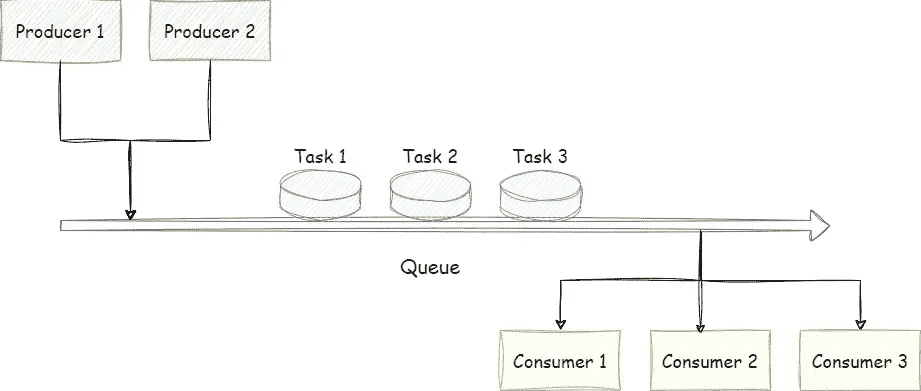
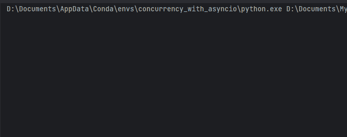
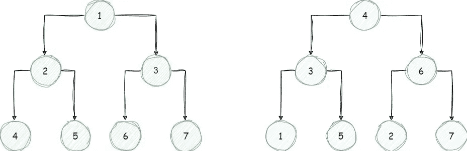
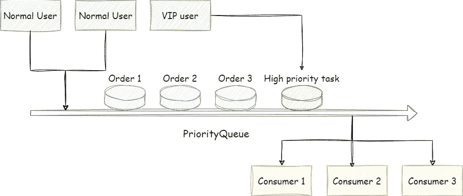
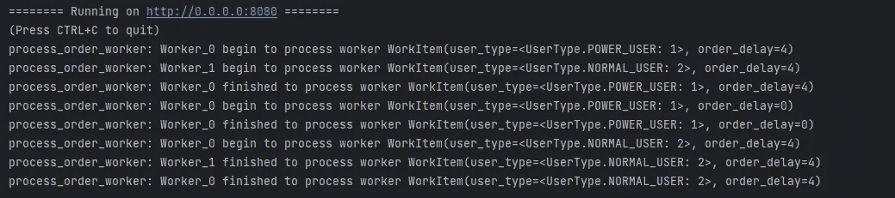

# 释放 Python Asyncio 队列的力量

> 原文：[`towardsdatascience.com/unleashing-the-power-of-python-asyncios-queue-f76e3188f1c4`](https://towardsdatascience.com/unleashing-the-power-of-python-asyncios-queue-f76e3188f1c4)

## [PYTHON CONCURRENCY](https://medium.com/@qtalen/list/python-concurrency-2c979347da3b)

## 通过实际案例掌握使用 asyncio 的生产者-消费者模式

 [Peng Qian](https://qtalen.medium.com/?source=post_page-----f76e3188f1c4--------------------------------)

·发表于 [Towards Data Science](https://towardsdatascience.com/?source=post_page-----f76e3188f1c4--------------------------------) ·8 分钟阅读·2023 年 6 月 6 日

--

图片来源：由作者创建，[Canva](https://www.canva.com/)

在这篇文章中，我将轻松讲解 Python asyncio 中各种队列的 API 用法和应用场景。

在文章末尾，我将展示在经典购物场景中`asyncio.Queue`的实际用法。

# 介绍

## 为什么我们需要 asyncio.Queue

正如阅读过我之前文章的读者所知，我喜欢 asyncio，因为它几乎是并发编程的**终极解决方案**。

然而，在大规模、高度并发的项目中，大量不可控的并发任务等待将占用系统资源，导致性能差。

因此，有必要控制并发任务的数量。

## 为什么我们不能使用`asyncio.Semaphore`

在我之前关于同步原语的文章中，我介绍了使用`Semaphore`锁来控制同时运行的并发任务的数量。

 ## 在 Python Asyncio 中掌握同步原语：全面指南

### asyncio.Lock、asyncio.Semaphore、asyncio.Event 和 asyncio.Condition 的最佳实践

[towardsdatascience.com

首先设置`Semaphore`锁的数量，获得锁的任务将会执行，而没有获得锁的任务则会等待。

然而，`asyncio.Semaphore`只能限制通过 IO 访问资源的任务的并发性；无法限制并发任务的数量。

因此，在这种情况下，`asyncio.Semaphore`不是一个完美的解决方案。

## asyncio.Queue 就是这样的方式

使用`asyncio.Queue`，我们可以在程序启动时启动固定数量的并发任务，然后通过队列将待处理的数据传递给这些任务。

这就是著名的生产者-消费者模式。同时，像多进程队列一样，`asyncio.Queue`也用于在并发任务之间传递消息。

# asyncio 队列的魔法世界

为什么`asyncio.Queue`会扮演如此重要的角色？实际上，我们在现实生活中也会遇到类似的问题：

超市中的人群。由作者创建，[Canva](https://www.canva.com/)

最典型的例子是大型购物超市。在这样的超市里，总是有很多顾客。

每个顾客购物完后需要结账。结账需要一些时间，这可能会导致拥堵。

更直接的解决方案是雇佣更多的收银员，最好每个顾客一个，以实现即时结账。

然而，这并不现实，因为这么多的收银员意味着老板需要承受巨大的成本压力（和资源消耗）。

因此，有人想出了一个好主意：让顾客排队，然后让几个收银员轮流结账。

超市中的顾客正在排队。照片由[Lisanto 李奕良](https://unsplash.com/@lisanto_?utm_source=medium&utm_medium=referral)提供，来源于[Unsplash](https://unsplash.com/?utm_source=medium&utm_medium=referral)

唯一的成本是顾客需要多等一会儿。同时，如果队列太长，经理可以选择临时增加几个收银员。这样，系统可以灵活扩展。

通过将顾客队列比作数据进入队列，将收银员比作并发任务，我们可以看到`asyncio.Queue`带来的好处：

+   它是生产者-消费者模式的良好实现。

+   它可以控制并发任务的数量。

+   这样可以让资源消耗变得可控，并且系统也可以灵活扩展。

# 生产者-消费者模式在 asyncio 中的冒险

## 什么是生产者-消费者模式

想象一下两种任务共享一个队列。任务 A 生成数据并将其放入队列，而任务 B 从队列中取出数据进行处理。

这就是生产者-消费者模式，其中任务 A 是生产者，任务 B 是消费者。

类比超市，顾客是生产者，收银员是消费者，顾客队列代表队列。

## 为什么使用生产者-消费者模式

在高并发程序中，生产者通常会快速生成数据，而消费者处理数据较慢。因此，生产者必须等待消费者完成处理后才能继续生产数据。

有时，消费者处理数据的速度较快，而生产者生成数据的速度较慢。这导致消费者在继续运行之前需要等待生产者生成数据。

为了平衡生产者和消费者，需要一个队列来存储生产者产生的数据。队列充当缓冲区，并将生产者和消费者解耦。

生产者-消费者模式图。图像由作者提供

# 使用 asyncio 的 Queue 实现生产者-消费者模式

现在，让我们使用 `asyncio.Queue` 实现之前提到的超市购物场景。

如代码所示，我们首先实现了 `Customer` 和 `Product` 类，分别表示需要结账的顾客和产品。`Product` 类有一个 `checkout_time` 属性，表示结账所需的时间。

之后，我们实现了一个 `checkout_customer` 方法作为消费者。

只要队列中有数据，该方法将继续循环。在每次迭代中，它使用 `get` 方法来获取一个 `Customer` 实例。

如果队列中没有数据，它将等待。

在检索到一条数据（在本例中是一个 `Customer` 实例）后，它会遍历 `products` 属性，并使用 `asyncio.sleep` 来模拟结账过程。

在处理完数据后，我们使用 `queue.task_done()` 来告诉队列数据已成功处理。

接下来，我们实现了 `generate_customer` 方法作为生产客户的工厂方法。

我们首先定义一个产品系列及每个产品所需的结账时间。然后，我们在每个顾客的购物车中放置 0 到 10 个产品。

此外，我们实现了 `customer_generation` 方法作为生产者。该方法定期生成几个客户实例并将其放入队列。如果队列已满，`put` 方法将会等待。

最后，我们使用 `main` 方法来初始化队列、生产者和消费者，并启动所有并发任务。

实现成功。图像由作者提供

正如预期的那样，实施成功。

# 引入 PriorityQueue

## 为什么使用 [asyncio.PriorityQueue](https://docs.python.org/3/library/asyncio-queue.html#priority-queue)

前面提到的队列是一个 [先进先出 (FIFO) 队列](https://en.wikipedia.org/wiki/FIFO_(computing_and_electronics))，其中第一个进入队列的项目是第一个被取出的。这在队列中的所有任务具有相同优先级时很合适。

然而，考虑以下情况：

假设有一个队列中有待处理的任务，每个任务都需要很长的处理时间。

错误日志或 VIP 用户访问是需要立即关注的高优先级任务。我们该怎么办？

图片来源：[Ethan Hu](https://unsplash.com/@ethanhjy?utm_source=medium&utm_medium=referral) 在 [Unsplash](https://unsplash.com/?utm_source=medium&utm_medium=referral)

这就是`[asyncio.PriorityQueue](https://docs.python.org/3/library/asyncio-queue.html#priority-queue)`发挥作用的地方。

## 简要描述`asyncio.PriorityQueue`的实现

与基于列表的 FIFO 队列不同，`asyncio.PriorityQueue`基于堆。它是通过二叉树结构构建的。

你可能对二叉搜索树比较熟悉，它确保最小的节点始终是最左边的节点。

然而，`asyncio.PriorityQueue`中的二叉树确保最小的节点始终在顶部，因此最高优先级的节点会被优先移除。

左侧是 PriorityQueue 使用的二叉树，右侧是二叉搜索树。 图片来源：作者

## 使用`asyncio.PriorityQueue`的实际例子

让我们通过一个实际存在的场景来说明`asyncio.PriorityQueue`的使用。

想象一下我们有一个订单服务 API。这个 API 需要时间来处理每个订单，但我们不能让用户等待太久。

所以当用户下订单时，API 首先将订单放入队列中，允许后台任务异步处理，同时立即向用户返回一条消息。

这个 API 接受两种类型的用户订单：普通用户和 VIP 用户。它必须确保 VIP 用户的订单以最高优先级处理。

VIP 订单以最高优先级处理。 图片来源：作者

为了保持读者的学习曲线较低，在这个例子中，我们将使用`aiohttp`来实现服务器。具体代码如下：

首先，我们定义一个枚举来标记两种类别：普通用户和 VIP 用户。

接下来，我们使用`dataclass`定义一个用户的订单，其中包含用户类型和订单处理时长。订单时长不考虑在优先级排序中。

然后我们定义消费者方法`process_order_worker`，它从队列中获取订单并模拟订单处理。

不要忘记使用`queue.task_done()`来告诉队列我们已经处理完订单。

接下来，我们使用`aiohttp`实现订单 API。这个 API 响应用户请求，生成一个订单对象，并将其放入`asyncio.PriorityQueue`。

它随后立即返回响应给用户，避免了用户的等待时间。

当程序启动时，我们使用`create_order_queue`来初始化队列和订单消费任务。

当程序结束时，我们使用`destroy_order_queue`来确保队列中的所有订单都被处理，并且后台任务正确关闭。

`queue.join()`将等待队列中的所有数据处理完成。`asyncio.wait_for`设置了 20 秒的超时，超时后将不再等待`queue.join()`完成。

我们可以使用 PyCharm 的 HTTP 请求来测试这个实现：

API 优先处理 VIP 用户的订单。图片来源：作者

正如你所见，两个高优先级的任务按预期处理了。完美！

# 结论

在本文中，我介绍了`asyncio.Queue`的使用及最佳实践。

当你需要控制程序的并发性时，我推荐使用`asyncio.Queue`来有效管理资源消耗。

我介绍了生产者-消费者模式及其优点：

1.  在生产者和消费者之间平衡，最大化资源利用率。

1.  解耦系统，允许生产者和消费者独立扩展。

最后，我展示了如何使用`asyncio.PriorityQueue`通过一个实际示例处理需要优先级的场景。

由于空间限制，我未能覆盖`asyncio.Queue`的所有方面。然而，我希望这篇文章提供了对基本概念和有用示例的扎实理解。

Python 的异步编程是一个强大的工具，使用`asyncio.Queue`的生产者-消费者模式是处理应用程序中的并发和优先级的多功能方法。

你可以通过我的文章列表获取更多关于 Python 并发的知识：

[彭倩](https://qtalen.medium.com/?source=post_page-----f76e3188f1c4--------------------------------)

## Python 并发

[查看列表](https://qtalen.medium.com/list/python-concurrency-2c979347da3b?source=post_page-----f76e3188f1c4--------------------------------)10 个故事！用 Aiomultiprocess 超强提升你的 Python Asyncio: 全面指南 [## 通过我的推荐链接加入 Medium - 彭倩

### 阅读彭倩的每一个故事（以及 Medium 上的其他成千上万位作者）。您的会员费直接支持彭倩……

[qtalen.medium.com](https://qtalen.medium.com/membership?source=post_page-----f76e3188f1c4--------------------------------)

本文最初发布于：[`www.dataleadsfuture.com/unleashing-the-power-of-python-asyncios-queue/`](https://www.dataleadsfuture.com/unleashing-the-power-of-python-asyncios-queue/)
