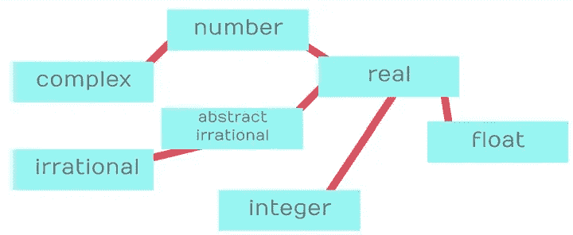

# 释放 Julia 超级类型的力量

> 原文：[`towardsdatascience.com/unleashing-the-power-of-the-julia-supertype-bb369209efca`](https://towardsdatascience.com/unleashing-the-power-of-the-julia-supertype-bb369209efca)

## 使用和操作抽象在 Julia 语言中做有趣的事情

[](https://emmaccode.medium.com/?source=post_page-----bb369209efca--------------------------------)[](https://towardsdatascience.com/?source=post_page-----bb369209efca--------------------------------) [Emma Boudreau](https://emmaccode.medium.com/?source=post_page-----bb369209efca--------------------------------)

·发布于 [Towards Data Science](https://towardsdatascience.com/?source=post_page-----bb369209efca--------------------------------) ·阅读时间 7 分钟·2023 年 10 月 11 日

--


作者提供的图片

## 介绍

我发现不同编程语言探索中最令人着迷的事情之一是不同范式解决不同类型问题的方式。在编程中，现代编程语言可能会有一些预期的特性。这些特性的例子包括范围、多态性和抽象。一些范式在某些领域中的应用会更为突出，数据科学也不例外。这些特性在各种编程范式中通过多种不同的方法得以实现。当一个具有不典型范式的语言实现这些通用编程概念时，这个主题对我而言变得更加有趣。这引出了 Julia 编程语言。

Julia 编程语言是近年来编程世界中较为有趣的发展之一。编程世界对几种经过数十年打磨的选择性范式已经相当熟悉，这些范式创造了非常强大的意识形态方法来解决编程问题。虽然 Julia 采用了许多更通用的编程概念来完成工作，但该语言的范式本身极为独特，常常带来不同的做事方式。这被称为多重分发编程范式。当涉及到数据科学家所做的事情时，这种范式是一种非常有效的编程范式。

有了这种编程范式关系，Julia 会稍微调整其机制，以实现大多数程序员希望使用的更多通用编程概念。Julia 中有许多功能体现了这一点。所有这些概念都反馈到多重分发范式的强大能力中。对于有经验的程序员，我发现这可能是一个极其强大的范式！话虽如此，无论是什么范式，了解可用的工具以便充分利用它们是很重要的。一个非常适合 Julian 范式的技术示例是 Julian 的抽象实现。

抽象在数据科学中将是一个基本的技术。在数据科学中，观察值可能有很多不同的类型，像多态性这样的概念可能非常有效，因为它在不同结构的处理方式之间找到了共同点。

正如预期的那样，Julian 抽象是使用多重分发来实现的。然而，使用多重分发的方式有一些细微差别，这些细节很重要，因此事不宜迟，让我们来回顾一下 Julia 中抽象的方方面面！

## 超类型基础

为了开始创建我们自己的超类型，我们需要熟悉 `abstract type` 语法。`abstract type` 是一个定义松散的类型，仅存在于名称中——没有字段。通过这些名称的不同组织，我们可以将方法应用于我们类型层次结构的受限级别。一个很好的例子就是数字。

在 Julia 中，数字根据几个不同的实际类别进行组织。结果结构以层次结构的方式组织不同类型的数字，这被称为类型层次结构。在 Julia 中，这种类型层次结构始终以 `Any` 开始。`Any` 是一个抽象类型，**每一个** Julia 类型都是其子类型。这个层次结构的数字部分从 `Any` 开始，接着是 `Number`，然后是 `Real` 数字——进一步细化为 `Integers` 及其他。



（图像由作者提供）

[Julia 和虚数：数值层次结构](https://towardsdatascience.com/julia-and-imaginary-numbers-the-numerical-hierarchy-694aef87a7ce?source=post_page-----bb369209efca--------------------------------)

### 深入探讨 Julia 如何处理数字。

[super-type basics](https://towardsdatascience.com/julia-and-imaginary-numbers-the-numerical-hierarchy-694aef87a7ce?source=post_page-----bb369209efca--------------------------------)

我们与 Julia 内部抽象交互的主要工具是子类型操作符`<:`。这是一种按位布尔操作符，意味着它根据两个操作数返回 true 或 false；按位指的是两个操作数，与一元操作相对，而布尔表示返回值的真/假性质。如果第一个操作数是第二个操作数的子类型，则该条件为真。在这个实例中，第一个操作数将是一个`Type`或抽象类型。第二个操作数将始终是抽象类型——因为事物只能是抽象类型的子类型。

```py
# Everything <: Any!
Number <: Any
true

Int64 <: Number
true

Int64 <: AbstractString
false
```

这个操作符还在另外两个实例中使用。一个是多重调度，另一个是将类型指定为子类型。后者可以为超类型或常规类型完成。这是通过在定义后提供子类型操作符，然后跟上我们想要它下面的类型来完成的。

```py
# we do not have to <: as Any, I just put this here to
#  demonstrate how this is done.

abstract type AbstractExample <: Any end

struct Example <: AbstractExample

end
```

## 超类型调度

创建这些类型的层次结构是很好的，但更好的做法是与多重调度结合使用。通过多重调度，我们可以调度到我们想要的确切级别，从而创建仅涵盖特定类别的函数。在以下情况下，任何`Float`或`Integer`都将在此函数中以不同的方式处理：

```py
remainder(x::Integer) = 0

remainder(x::AbstractFloat) = x - floor(x)
```

同样，如果这些函数的功能相同，我们可以上升一个层次并调度`Real`，然后创建一个函数。这是一个非常简单的实现，能够完美完成工作。

在这种情况下使用调度的一个细微差别是将调度子类型作为参数。例如，在某些情况下，我们可能会有一个看起来像这样的参数：

```py
funcexamp(x::Vector{Number}) = begin

end
```

在这种情况下，我们希望任何包含数字的`Vector`都被调度到这个函数。然而，这不是我们编写的函数——相反，我们调度了一个`Vector{Number}` …

```py
julia> myvec = [5, 10]
2-element Vector{Int64}:
  5
 10

julia> funcexamp(myvec)
ERROR: MethodError: no method matching funcexamp(::Vector{Int64})

Closest candidates are:
  funcexamp(::Vector{Number})
   @ Main REPL[1]:1

Stacktrace:
 [1] top-level scope
   @ REPL[3]:1

julia> myvec = Vector{Number}([5, 10])
2-element Vector{Number}:
  5
 10

julia> funcexamp(myvec)
```

这里的解决方案有点晦涩——我们以这种奇怪的方式使用子类型操作符调度参数。

```py
funcexamp(x::Vector{<:Number}) = begin

end
```

奇怪的是，这是对这个操作符的一种一元用法——确实很奇怪，但它完成了工作，并且在其他方面逻辑上是有意义的。不过，这确实是一个需要注意的细微差别。

## 字段

当谈到 Julia 中的抽象时，字段也应该是讨论的一部分。简而言之，Julia 更倾向于不在字段中使用抽象类型。原因是，当类型的字段可以是几种不同类型时，Julia 的性能会受到严重影响。这对于多重调度来说也可能是一个非常不好的做法。利用通用函数构造器可能比使用通用结构更好。例如，以下结构可能不是一个好主意。

```py
mutable struct Calculator
   x::Real
   y::AbstractString
end
```

在这种情况下，`Real`和`AbstractString`是模糊的字段类型。我们可以通过决定一个更好的字段或字段类型，或者使用一个参数来表示类型，来轻松解决这个问题。每当我们使用一个参数时，我们就为该参数可能的每种不同设置创建一个新类型。换句话说，`Calculator{Float64}`是与`Calculator{Int64}`不同的类型，而这两个类型的`x`字段将始终是该参数的类型。为了重新组织，我们在构造函数中添加一个参数，并将字段改为该参数。

```py
mutable struct Calculator{T}
    x::T
    y::AbstractString
end
```

我们还可以对子类型进行显式化，明确我们期望这个字段是什么。

```py
mutable struct Calculator{T <: Real}
    x::T
    y::AbstractString
end
```

至于`y`的情况，这可能是一个更好地使用不同类型的例子。在大多数情况下，`AbstractString`作为一个简单的`String`会更好。

```py
mutable struct Calculator{T <: Real}
    x::T
    y::String
end
```

为了构造这个`Calculator`，现在需要提供这个参数。我们可以通过使用一个内部构造函数创建一个新的调度来改变这一点。

```py
mutable struct Calculator{T <: Real}
    x::T
    y::String
    function Calculator(x::Real, y::AbstractString)
        new{typeof(x)}(x, string(y))
    end
end
```

## 超类型内省

在这个关于超类型的概述中，我想指出的最后一点是能够内省超类型。虽然这显然不像 Julia 中的许多其他内省形式那样有用，但在弄清楚一些事情时这确实会很有帮助。最明显的这种内省形式在前面已经提到，即区分一个类型是否是一个抽象类型的子类型。

```py
Int64 <: Integer
true
```

不幸的是，Julia 也没有提供很多超出这一点的选项。另一件可能有价值的事情是获取特定类型的层级的漂亮打印输出。这里有一个在 Julia 社区广泛流传的相当不错的函数可以做到这一点

```py
function subtypetree(t, level=1, indent=4)
    level == 1 && println(t)
    for s in subtypes(t)
        println(join(fill(" ", level * indent)) * string(s))
        subtypetree(s, level+1, indent)
    end
end
subtypetree (generic function with 3 methods)
```

> 我相信这个特定版本的原始来源来自于[tk3369](https://github.com/tk3369)在 github 上的发布。

```py
julia> subtypetree(Number)
Number
    Complex
    Real
        AbstractFloat
            BigFloat
            Float16
            Float32
            Float64
        AbstractIrrational
            Irrational
        Integer
            Bool
            Signed
                BigInt
......
```

## 结论

抽象是现代高级编程语言中一个极其重要的工具。在多个地方创建相同的函数是繁琐的，程序员已经意识到这一点。许多语言有着截然不同的范式，因此实现这些编程概念的技术可能非常有趣。一个显著的例子就是 Julia 语言及其类型层级。

尽管 Julia 处理这个问题的方法有些不同寻常，但它通过极其强大的能力弥补了这种异常。通过这种抽象形式，我们可以具体到每个参数的精确类型，也可以模糊到允许`Any`通过我们的方法。总体而言，它确实非常强大，值得了解。感谢您的阅读！
