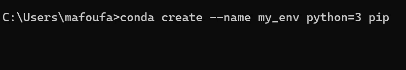
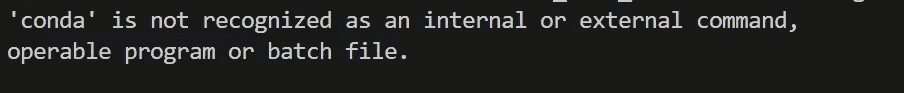
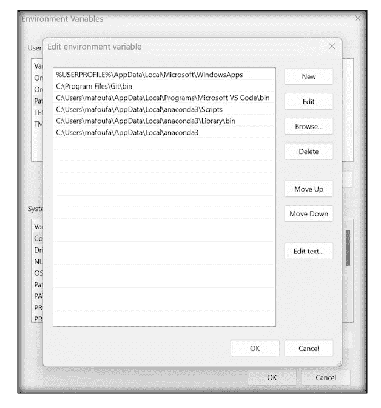
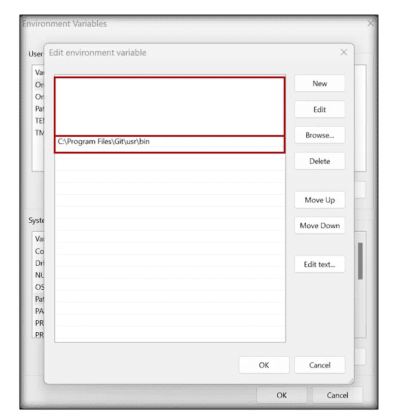
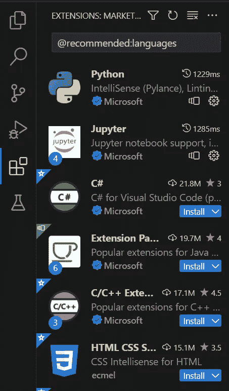
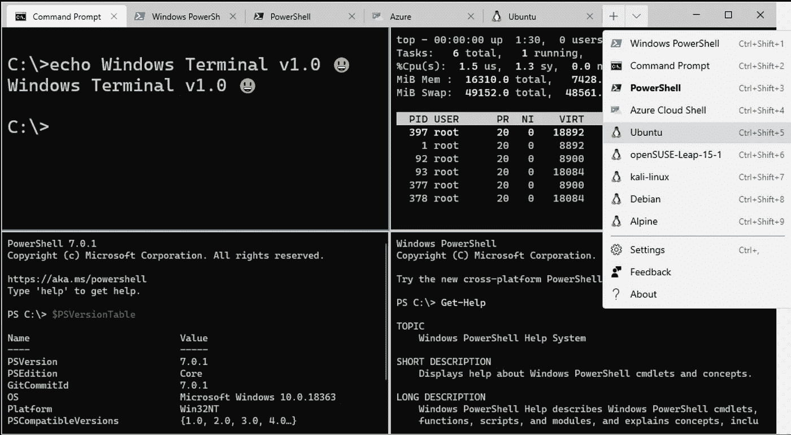

# 用你的笔记本电脑释放数据科学的潜力

> 原文：[`towardsdatascience.com/unlock-data-science-potential-with-your-laptop-64c64652e906`](https://towardsdatascience.com/unlock-data-science_potential_with_your_laptop-64c64652e906)

照片由 [photo nic](https://unsplash.com/@chiro?utm_source=medium&utm_medium=referral) 提供，来源于 [Unsplash](https://unsplash.com/?utm_source=medium&utm_medium=referral)

## 从零到英雄的笔记本电脑

 [Mastafa Foufa](https://medium.com/@mastafa.foufa?source=post_page-----64c64652e906--------------------------------)

·发表于 [Towards Data Science](https://towardsdatascience.com/?source=post_page-----64c64652e906--------------------------------) ·6 分钟阅读·2023 年 11 月 7 日

--

作为数据科学家，你知道拥有一个可靠且高效的笔记本电脑是多么重要，它能够处理你项目所需的所有任务和工具。

无论你是处理大型数据集、复杂模型还是 BI 可视化，你都希望避免任何可能影响结果的技术问题或性能瓶颈。这就是为什么我认为为你的笔记本电脑做好成功准备是你数据科学之旅中的关键一步。

> **注意。本文主要针对 Windows 用户。** 尽管如此，本文中的一些内容可能对 Linux 和 Mac 用户也有兴趣。

通过遵循我们的步骤和提示，你将能够将你的笔记本电脑转变为一个强大且高效的数据科学机器，能够应对你可能遇到的任何任务或挑战。

现在，让我们开始吧，**为成功做好准备**！

## 最重要的是——你不能没有的东西

**1\. 安装 Anaconda Prompt**

令人惊讶的是，并不是每个数据科学家都在使用**Anaconda**。不要成为其中之一。

在安装库时，创建虚拟环境并避免破坏操作系统是至关重要的。对于每个项目，都要创建一个**conda**环境，并仅在该环境中安装相关库。

> **注意**。确保你的 conda 环境中已安装**pip**。通常，当在新的 conda 环境中使用 pip 安装时，你实际上是在使用默认 conda 环境中的 pip，因此它不会使用新的环境。

**资源**。来自作者。

如果你无法从终端使用**conda**，且遇到以下问题，你基本上需要通过更新环境变量将 Anaconda 添加到你的路径中。

**资源**。来自作者。

更具体地说，要将 Anaconda 添加到你的环境变量中，你可以按照 [stackoverflow](https://stackoverflow.com/questions/44515769/conda-is-not-recognized-as-internal-or-external-command) 上给出的步骤进行操作。下面是根据 Anaconda 安装在我个人机器上的位置进行的编辑。

**资源**。来自作者。

我的建议是在安装过程中让 Anaconda 为你处理。当系统询问是否将 Anaconda3 添加到你的路径中时，点击**是**。

[Anaconda 文档](https://docs.anaconda.com/free/anaconda/install/uninstall/#simple-remove)详细说明了如何卸载 Anaconda。

最后，请注意，Anaconda 虚拟环境有替代方案。其中之一是常见的 Python 虚拟环境 (***virtualenv***)。不过，我个人选择的是 **conda**。

> 要创建一个 `virtualenv`，可以调用 `virtualenv YOUR_ENV_NAME`，其中 `*YOUR_ENV_NAME*` 是一个目录，用于放置新的虚拟环境及所有感兴趣的包。

这里最重要的是记住，创建一个包含所有相关包的独立环境对于你的项目是很重要的。例如，如果明天你接到一个新项目，不要急于进入项目，而是先设置一个包含所有必要包的专用环境。这样的环境可以通过多种方式与同事共享。在我的经验中，遵循这一过程也帮助我更快地将模型投入生产。

**2\. 在终端中获取 Linux 命令**

要获取 Linux 命令，可以使用这个方法。你需要安装**git**，传统的安装方式。然后，对于像我这样的 Windows 用户，你需要按如下方式修改环境变量 [*系统变量*]：

+   安装**git**

+   将 **C:\Program Files\Git\usr\bin** 添加到你的路径变量中 [*系统变量*]

> **重要提示。** 如果你在 Git 文件夹中看不到“**usr**”文件夹，那是因为它是隐藏的。即使你看不到它，也要**按照上面和下面显示的准确名称**添加该文件夹。
> 
> **问题**。由于某些原因，“ls”、“clear”等 Linux 命令能够正常工作，但过几周后会消失。有人能告诉我为什么我需要如此频繁地执行上述步骤并编辑环境变量吗？

**资源**。来自作者。

我个人无法在本地机器上编写代码，除非使用这些命令。我的**最常用命令**是：

+   *ls/cd/mkdir*

+   conda 相关命令 (*conda create — name env_name python=3*)

+   pip 相关命令 (*pip install …*)

+   docker 相关命令 *(当使用 docker 时)*

**3\. 获取一个 IDE**

**Visual Studio Code** 或 **PyCharm**。

我曾经重度使用 PyCharm。最近我转向了 Visual Studio Code。两者都是很好的选择。

安装所有相关的扩展。例如，对于 VS code：

+   **python** 扩展

+   **jupyter** 扩展

+   **github copilot** 扩展

**资源**。来自作者。

现在构建干净的代码几乎是必不可少的，特别是在大型科技公司。因此，我建议你使用上述编辑器之一，这样你可以在保持代码整洁和有序的同时调试代码。

**4\. 了解如何在云端复制你的工作**

这实际上并不是你笔记本电脑的一部分，但行业越来越多地使用云来进行各种项目。你可能会在一家利用 Microsoft Azure、Amazon AWS 或 Google 云的公司工作。很常见，你会被要求直接在这些平台上工作。因此，能够在云端复制你在本地所做的工作是一个很好的技能。

我知道在 Azure Machine Learning studio 中，创建你的 **conda** 环境非常简单，因此按照上述步骤将会使你向云端的过渡变得更加顺利。做一些功课以了解这与其他云数据科学平台的关系。另一方面，*Azure Synapses* 的工作方式与 **pyspark** 依赖的后台有所不同。

> **问题**。你将如何优化从本地机器到云端的过渡？

## 更具异国情调

**Windows Terminal**

Linux 命令如 “ls”、 “cd” 等是非常有价值的。我在之前的 Surface 笔记本电脑上已经配置了这些命令。这一次，我在找到相关文档来进行设置时遇到了一些困难。

起初我以为 Windows Terminal 默认支持 Linux 命令。然而，事实并非如此。因此，你可以将 Windows Terminal 视为一个时尚的终端，你可以在其中拆分屏幕并选择多个终端，如命令提示符或 PowerShell。

根据我的经验，这是一个顶级的生产力功能，我通常会在一个终端中进行 **git** 工作，在另一个终端中运行和调试我的 Python 项目，等等。

**资源**。来自 [`en.wikipedia.org/wiki/Windows_Terminal`](https://en.wikipedia.org/wiki/Windows_Terminal)。

> **“Windows Terminal** 是一个 [多标签](https://en.wikipedia.org/wiki/Tabbed) [终端模拟器](https://en.wikipedia.org/wiki/Terminal_emulator)，由 [Microsoft](https://en.wikipedia.org/wiki/Microsoft) 开发，用于 [Windows 10](https://en.wikipedia.org/wiki/Windows_10) 及以后版本[[4]](https://en.wikipedia.org/wiki/Windows_Terminal#cite_note-4) 替代 [Windows Console](https://en.wikipedia.org/wiki/Windows_Console)。[[5]](https://en.wikipedia.org/wiki/Windows_Terminal#cite_note-introducing-windows-terminal-5) 它可以在单独的标签页中运行任何命令行应用。它预配置了运行 [命令提示符](https://en.wikipedia.org/wiki/Windows_Command_Prompt)、[PowerShell](https://en.wikipedia.org/wiki/PowerShell)、[WSL](https://en.wikipedia.org/wiki/Windows_Subsystem_for_Linux)、[SSH](https://en.wikipedia.org/wiki/SSH) 和 Azure Cloud Shell Connector。”[[6]](https://en.wikipedia.org/wiki/Windows_Terminal#cite_note-:1-6)[[7]](https://en.wikipedia.org/wiki/Windows_Terminal#cite_note-:0-7) 来源于维基百科

照片由 [JJ Ying](https://unsplash.com/@jjying?utm_source=medium&utm_medium=referral) 提供，发布在 [Unsplash](https://unsplash.com/?utm_source=medium&utm_medium=referral)

## 深度学习的 GPU。

*Cuda* 通常是你在这里寻找的关键字。不过，对于 macOS，还有其他选项。

深度学习和需要大量计算能力的统计项目通常从 GPU 的运行中受益，因为它比 CPU 快得多。历史上，我在本地机器上运行 GPU 时遇到了许多问题，通常会寻找云解决方案，其中自然嵌入了 GPU，仅需一些 Python 工具，如 **pytorch** 或 **tensorflow** 来将操作推向 GPU。Azure ML、Google Colab 和其他机器学习的替代云解决方案都提供了 GPU 功能，无需安装各种软件。

照片由 [BoliviaInteligente](https://unsplash.com/@boliviainteligente?utm_source=medium&utm_medium=referral) 提供，发布在 [Unsplash](https://unsplash.com/?utm_source=medium&utm_medium=referral)

# 👋 还有最后一件事——想要联系吗？

> 我是微软的数据科学家，曾任教于 EPITA 巴黎。我拥有 8 项 AI 专利，并不断推动 AI 的前沿。
> 
> 我希望你能成为我的前 1000 名粉丝之一。

*另外，关注我的* [*LinkedIn*](https://www.linkedin.com/in/mastafa-foufa-666a1a109/)*.*
