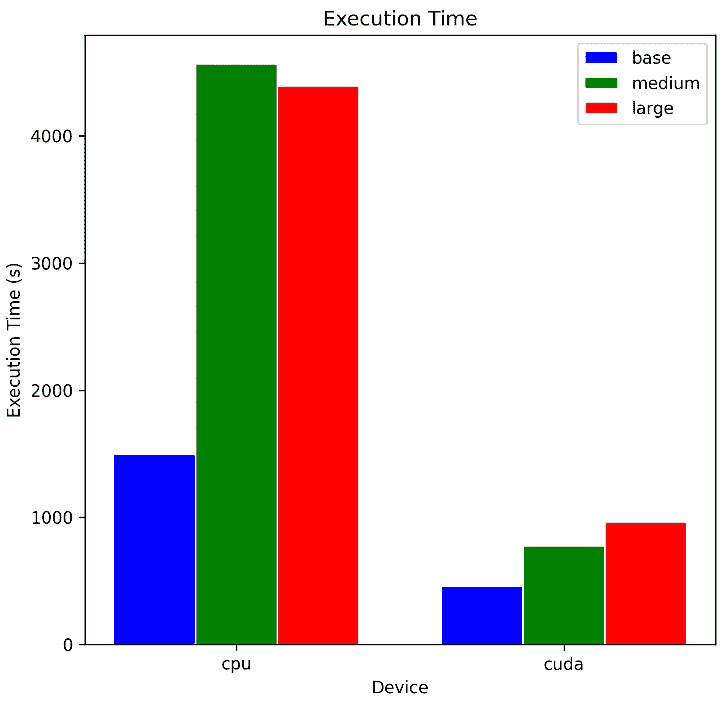

# 解锁音频数据的潜力：使用 Whisper、WhisperX 和 PyAnnotate 进行高级转录和语音分段

> 原文：[`towardsdatascience.com/unlock-the-power-of-audio-data-advanced-transcription-and-diarization-with-whisper-whisperx-and-ed9424307281`](https://towardsdatascience.com/unlock-the-power-of-audio-data-advanced-transcription-and-diarization-with-whisper-whisperx-and-ed9424307281)

## 利用最先进的语音识别和说话人归属技术简化音频分析

[](https://medium.com/@luisroque?source=post_page-----ed9424307281--------------------------------)[](https://towardsdatascience.com/?source=post_page-----ed9424307281--------------------------------) [Luís Roque](https://medium.com/@luisroque?source=post_page-----ed9424307281--------------------------------)

·发表于 [Towards Data Science](https://towardsdatascience.com/?source=post_page-----ed9424307281--------------------------------) ·阅读时间 9 分钟·2023 年 4 月 17 日

--

# 引言

在我们快节奏的世界中，我们生成了大量的音频数据。想想你最喜欢的播客或工作中的会议电话。数据在原始形式中已经非常丰富，我们作为人类可以理解它。即便如此，我们仍然可以进一步处理，例如将其转换为书面格式以便后续搜索。

为了更好地理解当前任务，我们引入了两个概念。第一个是转录，即将口语转化为文本。第二个是我们在本文中探讨的**语音分段**。语音分段帮助我们为无结构的内容提供额外的结构。在这种情况下，我们关注的是将特定的语音片段归属于不同的说话人。

在上述背景下，我们通过使用不同的工具来解决这两个任务。我们使用了 Whisper，这是一个由 OpenAI 开发的通用语音识别模型。它在各种音频样本数据集上进行了训练，研究人员开发了它以执行多种任务。其次，我们使用了 PyAnnotate，这是一个用于说话人归属的库。最后，我们使用了 WhisperX，这是一个研究项目，旨在结合这两者，同时解决 Whisper 的一些局限性。


图 1：与机器对话（[来源](https://unsplash.com/photos/6dDHofabCQ8)）。

本文属于“**大型语言模型纪实：探索 NLP 前沿**”系列文章，该系列每周更新，旨在探讨如何利用大型模型的力量来完成各种 NLP 任务。通过深入了解这些前沿技术，我们的目标是赋能开发者、研究人员和爱好者，充分发挥 NLP 的潜力，开启新的可能性。

目前已发布的文章：

1.  [用 ChatGPT 总结最新的 Spotify 发布](https://medium.com/towards-data-science/summarizing-the-latest-spotify-releases-with-chatgpt-553245a6df88)

1.  [掌握大规模语义搜索：使用 FAISS 和 Sentence Transformers 快速索引数百万文档](https://medium.com/towards-data-science/master-semantic-search-at-scale-index-millions-of-documents-with-lightning-fast-inference-times-fa395e4efd88)

一如既往，代码可在我的 [Github](https://github.com/luisroque/large_laguage_models) 上获得。

# Whisper: 一个通用的语音识别模型

Whisper 是一个通用的语音识别模型，在各种语音处理任务中表现非常好。它在多语言语音识别、语音翻译、口语语言识别和语音活动检测方面相当稳健。

Whisper 的核心是一个 Transformer 序列到序列模型。该模型将各种语音处理任务共同表示为由解码器预测的令牌序列。该模型通过使用特殊令牌作为任务说明符或分类目标，取代了传统语音处理管道的多个阶段。我们可以将其视为语音处理任务的元模型。

Whisper 有五种模型大小，针对边缘设备或大型计算机。它允许用户根据他们的使用情况和系统的容量选择合适的模型。请注意，一些仅支持英语的版本在处理英语用例时表现更好。

# PyAnnotate: 说话人分离库

说话人分离是通过不同说话人识别和分割语音的过程。这项任务在分析呼叫中心的数据时非常有用，例如，当我们想要分开客户和代理的声音时。公司可以利用它来改善客户服务并确保公司政策的合规性。

PyAnnotate 是一个专门设计用于支持这项任务的 Python 库。该过程相对简单。它对数据进行预处理，允许我们从原始音频文件中提取特征。接下来，它根据提取的特征生成相似的语音段集群。最后，它将生成的集群分配给不同的说话人。

# WhisperX: 带有语音活动检测和强制音素对齐的长音频转录

正如我们在前面部分看到的，Whisper 是一个大规模的、弱监督的模型，训练用于在语音处理领域执行多个任务。虽然它在不同领域甚至不同语言中表现良好，但在长音频转录时却有所不足。其限制在于训练过程使用了滑动窗口方法，这可能导致漂移甚至幻觉。此外，它在对齐转录与音频时间戳时也存在严重限制。在进行说话人分离时，这一点尤为重要。

为了应对这些限制，牛津大学的一个研究小组正在积极开发 WhisperX。Arxiv 预印本论文上个月发布。它使用语音活动检测（VAD），检测人声的存在与否，并对输入音频文件进行预分段。然后，它将这些片段裁剪并合并成大约 30 秒的窗口，通过定义在语音概率较低的区域（从语音模型得出的）上界限来实现。这一步还有一个额外的好处：允许使用批量转录与 Whisper 配合。这提高了性能，同时减少了我们上面讨论的漂移或幻觉的概率。最后一步称为强制对齐。WhisperX 使用音素模型将转录与音频对齐。基于音素的自动语音识别（ASR）识别语音的最小单位，例如“big”中的“g”元素。这种后处理操作将生成的转录与音频时间戳在单词级别对齐。

# 整合 WhisperX、Whisper 和 PyAnnotate

在本节中，我们整合了 WhisperX、Whisper 和 PyAnnotate 来创建我们自己的 ASR 系统。我们设计了我们的方法，以处理长形式的音频转录，同时能够分段语音并为每个片段分配特定的说话人。此外，它减少了幻觉的概率，提高了推理效率，并确保转录与音频之间的正确对齐。让我们构建一个流程来执行不同的任务。

我们从转录开始，将从音频文件中识别出的语音转换为书面文本。`transcribe`函数加载由`model_name`指定的 Whisper 模型并转录音频文件。它然后返回一个包含转录片段和语言代码的字典。OpenAI 设计的 Whisper 还具有语言检测功能，是一个多语言模型。

```py
def transcribe(audio_file: str, model_name: str, device: str = "cpu") -> Dict[str, Any]:
    """
    Transcribe an audio file using a speech-to-text model.

    Args:
        audio_file: Path to the audio file to transcribe.
        model_name: Name of the model to use for transcription.
        device: The device to use for inference (e.g., "cpu" or "cuda").

    Returns:
        A dictionary representing the transcript, including the segments, the language code, and the duration of the audio file.
    """
    model = whisper.load_model(model_name, device)
    result = model.transcribe(audio_file)

    language_code = result["language"]
    return {
        "segments": result["segments"],
        "language_code": language_code,
    }
```

接下来，我们使用`align_segments`函数对齐转录片段。如前所述，这一步对准确的说话人分离至关重要，因为它确保每个片段对应到正确的说话人：

```py
def align_segments(
    segments: List[Dict[str, Any]],
    language_code: str,
    audio_file: str,
    device: str = "cpu",
) -> Dict[str, Any]:
    """
    Align the transcript segments using a pretrained alignment model.

    Args:
        segments: List of transcript segments to align.
        language_code: Language code of the audio file.
        audio_file: Path to the audio file containing the audio data.
        device: The device to use for inference (e.g., "cpu" or "cuda").

    Returns:
        A dictionary representing the aligned transcript segments.
    """
    model_a, metadata = load_align_model(language_code=language_code, device=device)
    result_aligned = align(segments, model_a, metadata, audio_file, device)
    return result_aligned
```

对齐转录片段后，我们可以进行说话人分离。我们使用`diarize`函数，它利用了 PyAnnotate 库：

```py
def diarize(audio_file: str, hf_token: str) -> Dict[str, Any]:
    """
    Perform speaker diarization on an audio file.

    Args:
        audio_file: Path to the audio file to diarize.
        hf_token: Authentication token for accessing the Hugging Face API.

    Returns:
        A dictionary representing the diarized audio file, including the speaker embeddings and the number of speakers.
    """
    diarization_pipeline = DiarizationPipeline(use_auth_token=hf_token)
    diarization_result = diarization_pipeline(audio_file)
    return diarization_result
```

在分离说话人后，我们使用`assign_speakers`函数为每个转录片段分配说话人。这是我们流程中的最后一步，完成了将原始音频文件转换为包含说话人信息的转录文本的过程：

```py
def assign_speakers(
    diarization_result: Dict[str, Any], aligned_segments: Dict[str, Any]
) -> List[Dict[str, Any]]:
    """
    Assign speakers to each transcript segment based on the speaker diarization result.

    Args:
        diarization_result: Dictionary representing the diarized audio file, including the speaker embeddings and the number of speakers.
        aligned_segments: Dictionary representing the aligned transcript segments.

    Returns:
        A list of dictionaries representing each segment of the transcript, including the start and end times, the
        spoken text, and the speaker ID.
    """
    result_segments, word_seg = assign_word_speakers(
        diarization_result, aligned_segments["segments"]
    )
    results_segments_w_speakers: List[Dict[str, Any]] = []
    for result_segment in result_segments:
        results_segments_w_speakers.append(
            {
                "start": result_segment["start"],
                "end": result_segment["end"],
                "text": result_segment["text"],
                "speaker": result_segment["speaker"],
            }
        )
    return results_segments_w_speakers
```

最后，我们将所有步骤合并到一个`transcribe_and_diarize`函数中。该函数返回一个字典列表，表示每个转录片段，包括开始和结束时间、发言文本以及说话人标识符。请注意，你需要一个 Hugging Face API 令牌才能运行该流程。

```py
def transcribe_and_diarize(
    audio_file: str,
    hf_token: str,
    model_name: str,
    device: str = "cpu",
) -> List[Dict[str, Any]]:
    """
    Transcribe an audio file and perform speaker diarization to determine which words were spoken by each speaker.

    Args:
        audio_file: Path to the audio file to transcribe and diarize.
        hf_token: Authentication token for accessing the Hugging Face API.
        model_name: Name of the model to use for transcription.
        device: The device to use for inference (e.g., "cpu" or "cuda").

    Returns:
        A list of dictionaries representing each segment of the transcript, including the start and end times, the
        spoken text, and the speaker ID.
    """
    transcript = transcribe(audio_file, model_name, device)
    aligned_segments = align_segments(
        transcript["segments"], transcript["language_code"], audio_file, device
    )
    diarization_result = diarize(audio_file, hf_token)
    results_segments_w_speakers = assign_speakers(diarization_result, aligned_segments)

    # Print the results in a user-friendly way
    for i, segment in enumerate(results_segments_w_speakers):
        print(f"Segment {i + 1}:")
        print(f"Start time: {segment['start']:.2f}")
        print(f"End time: {segment['end']:.2f}")
        print(f"Speaker: {segment['speaker']}")
        print(f"Transcript: {segment['text']}")
        print("")

    return results_segments_w_speakers
```

# 评估集成 ASR 系统的性能

让我们从测试我自己录制的一个短音频片段开始。视频中有两个发言者，我们需要识别它们。此外，注意到其中一个发言者在讲话中有多个犹豫，使得转录变得困难。我们将使用 Whisper 的*base*模型来评估其能力。为了更好的准确性，你可以使用*medium*或*large*模型。转录文本如下：

> 段落 1：
> 
> 开始时间：0.95
> 
> 结束时间：2.44
> 
> 发言者：SPEAKER_01
> 
> 转录文本：你在看什么电视节目？
> 
> 段落 2：
> 
> 开始时间：3.56
> 
> 结束时间：5.40
> 
> 发言者：SPEAKER_00
> 
> 转录文本：目前我在看《我们这一天》。
> 
> 段落 3：
> 
> 开始时间：6.18
> 
> 结束时间：6.93
> 
> 发言者：SPEAKER_01
> 
> 转录文本：内容是什么？
> 
> 段落 4：
> 
> 开始时间：8.30
> 
> 结束时间：15.44
> 
> 发言者：SPEAKER_00
> 
> 转录文本：这是关于一个家庭在几代人中的生活。
> 
> 段落 5：
> 
> 开始时间：15.88
> 
> 结束时间：21.42
> 
> 发言者：SPEAKER_00
> 
> 转录文本：你可以通过这个系列某种程度上体验他们的生活。
> 
> 段落 6：
> 
> 开始时间：22.34
> 
> 结束时间：23.55
> 
> 发言者：SPEAKER_01
> 
> 转录文本：下一步会是什么？
> 
> 段落 7：
> 
> 开始时间：25.48
> 
> 结束时间：28.81
> 
> 发言者：SPEAKER_00
> 
> 转录文本：也许是牛肉，我听说关于它的评价很好。
> 
> 基础模型的执行时间：8.57 秒
> 
> 基础模型的内存使用：3.67GB

我们的方法通过上述转录实现了其主要目标。首先，注意到转录是准确的，我们成功地忽略了说话中的犹豫。我们生成了语法正确的文本，这有助于可读性。段落被很好地分隔，并且与音频时间戳对齐。最后，发言者分离也得到了妥善执行，两个发言者被准确地分配到每个语音段落。

另一个重要方面是各种模型在长格式音频上的计算效率，特别是在 CPU 和 GPU 上运行推断时。我们选择了一个约 30 分钟的音频文件。以下是结果：



图 2：使用 CPU 和 GPU 的各种模型的执行时间（图片由作者提供）。

主要结论是这些模型非常庞大，需要更高效才能在大规模运行。对于 30 分钟的视频，我们在 CPU 上需要大约 70–75 分钟来完成转录，而在 GPU 上则大约需要 15 分钟。此外，请记住，我们需要大约 10GB 的 VRAM 来运行大型模型。考虑到这些模型仍处于研究阶段，我们应该预期这些结果。

# 结论

本文提供了使用最先进的语音识别和说话人分离技术分析音频数据的全面逐步指南。我们介绍了 Whisper、PyAnnotate 和 WhisperX，这些工具共同形成了一个强大的集成 ASR 系统——我们的方案在处理长格式音频转录时产生了有希望的结果。它还解决了 Whisper 在长格式音频转录中出现的主要限制问题，包括确保转录与音频对齐、准确分割语音以及将说话人归属到每个片段。

尽管如此，这些模型的计算效率仍然是一个挑战，尤其是对于长格式音频以及在有限硬件上运行推理时。即便如此，Whisper、WhisperX 和 PyAnnotate 的集成展示了这些工具在处理和分析音频数据方面的潜力，为各种行业和用例带来了新的应用可能性。

# 关于我

serial entrepreneur 和 AI 领域的领导者。我开发面向企业的 AI 产品，并投资于专注于 AI 的初创公司。

[创始人 @ ZAAI](http://zaai.ai) | [LinkedIn](https://www.linkedin.com/in/luisbrasroque/) | [X/Twitter](https://x.com/luisbrasroque)
