# 解锁因果推断的力量：数据科学家理解“后门调整”公式的指南

> 原文：[`towardsdatascience.com/unlock-the-power-of-causal-inference-a-data-scientists-guide-to-understanding-backdoor-686d2826efa4`](https://towardsdatascience.com/unlock-the-power-of-causal-inference-a-data-scientists-guide-to-understanding-backdoor-686d2826efa4)

## 使用 Python 和 pgmpy 库的“后门调整”公式的完整工作示例

[](https://grahamharrison-86487.medium.com/?source=post_page-----686d2826efa4--------------------------------)[](https://towardsdatascience.com/?source=post_page-----686d2826efa4--------------------------------) [Graham Harrison](https://grahamharrison-86487.medium.com/?source=post_page-----686d2826efa4--------------------------------)

·发布于 [Towards Data Science](https://towardsdatascience.com/?source=post_page-----686d2826efa4--------------------------------) ·9 分钟阅读·2023 年 1 月 19 日

--


照片由 [Roberto Huczek](https://unsplash.com/@tamoio?utm_source=unsplash&utm_medium=referral&utm_content=creditCopyText) 提供，[Unsplash](https://unsplash.com/s/photos/door?utm_source=unsplash&utm_medium=referral&utm_content=creditCopyText)

# 介绍

在概率理论中，查看数据集并根据其他变量的情况计算事件的概率是非常简单的。

例如：

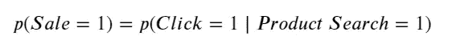

即，销售的概率等于在产品已被搜索的情况下点击链接的概率。

然而，当数据中存在因果效应时，这种方法就会失效，这时因果推断就派上用场了。根据因果关系的模式，有多种方法可以选择，本文将重点介绍如何解锁“后门调整”公式的力量。

“后门标准”存在于 X 对 Y 的因果影响被第三个因素所“混淆”，该因素同时影响 X 和 Y 时 …

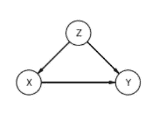

图片由作者提供

在这种情况下，公式 𝑝(𝑌|𝑋) 因为 Z 的混淆效应而不起作用，需要从 Pearlean 的“do”微积分中应用“后门调整”公式以获得正确结果：

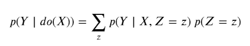

这看起来非常复杂，尤其是对于那些刚接触“do”微积分的人，但实际上很容易理解和应用。

> 在本文结束时，你将理解如何在`Python`和`pgmpy`中应用后门调整公式，它为何如此强大以及幕后发生了什么。

# 入门

要开始，我们需要一些标准导入和一个完全合成和虚构的测试数据集。

数据是从下面的 csv 文件中读取的，但如果你想了解如何生成合成二进制数据，以下文章提供了完整的解释 -

[## 如何在少于 10 行代码中为任何因果推断项目生成合成数据](https://towardsdatascience.com/how-to-generate-synthetic-data-for-any-causal-inference-project-in-less-than-10-lines-of-code-158688a89349?source=post_page-----686d2826efa4--------------------------------)

### 如果 99%的人接种疫苗，1%会出现反应，2%会感染疾病，如何生成具有代表性的合成数据？

[## 如何在少于 10 行代码中为任何因果推断项目生成合成数据](https://towardsdatascience.com/how-to-generate-synthetic-data-for-any-causal-inference-project-in-less-than-10-lines-of-code-158688a89349?source=post_page-----686d2826efa4--------------------------------) 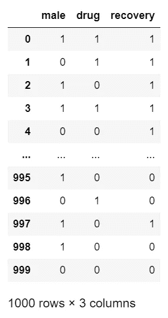

作者提供的图片

合成数据代表了一项虚构的药物试验结果，测试对象为 1000 人，所有人都有药物测试的医疗状况。例如，第一行代表一位男性（male=1），他服用了药物（drug=1）并康复了（recovery=1）。

# 问题

让我们先用一行 Python 代码快速查看数据中的传统概率，涉及康复和患者结果：

```py
drug  recovery
0     1           0.826
      0           0.174
1     1           0.778
      0           0.222
Name: recovery, dtype: float64
```

结果显示，77.8%的服药患者康复，但 82.6%未服药的患者康复。传统的概率方法显然表明药物有负面影响，药物试验应该结束。

然而，特征之间存在因果关系，这意味着需要应用因果推断和“do”操作符来建立真实效果。

# 因果解决方案

数据中的因果关系可以通过简单的有向无环图（DAG）进行可视化……

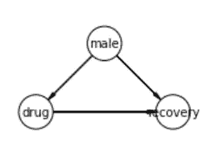

作者提供的图片

创建 DAG 的代码在本文中未列出，但完整的解释可以在这里找到：

[## 如何用交互式有向无环图可视化因果推断模型](https://towardsdatascience.com/how-to-visualise-causal-inference-models-with-interactive-directed-acyclic-graphs-8dd648a64915?source=post_page-----686d2826efa4--------------------------------)

### 如何用一行代码生成交互式有向无环图，以可视化和理解因果推断模型

[## 如何用交互式有向无环图可视化因果推断模型](https://towardsdatascience.com/how-to-visualise-causal-inference-models-with-interactive-directed-acyclic-graphs-8dd648a64915?source=post_page-----686d2826efa4--------------------------------)

因果图显示，虽然药物服用对恢复有因果影响，但事情并非如此简单。性别（男性）对“药物”和“恢复”都有因果影响，因为 …

+   相较于女性，更多的男性决定服用药物

+   男性的恢复率高于女性

因此，我们必须“去混淆” “男性”对药物服用的影响，以获得真实的影响。

理想的情况是我们回到过去，强迫所有人服用药物并测量影响。然后我们再次回到过去，这一次阻止所有人服用药物。我们只需比较这两个结果，就能得到答案！

然而，这种解决方案受到时间旅行的不可行性以及强迫或防止药物服用的伦理、道德和法律方面的影响。

不过，还是有前进的办法。那就是 Pearlean “do”计算，它提供了一个公式，将干预性的“do”转换为仅包含我们已知的观察数据的等效公式。

本文接下来将提供一种使用`pgmpy`库的简单因果解决方案，并提供一个手动执行所有计算的第二版本，以展示其工作原理。

# 解决方案 1：使用 Pgmpy 库

第一阶段是使用在有向无环图中定义的因果关系创建`pgmpy`因果模型。`Pgmpy`创建了一组条件概率表，描述因果关系，可以轻松地显示以了解发生了什么 …

以下代码将调用`TabularCPD.__str__` 在`pgmpy`库中以显示条件概率表 …

… 但我已将它们以更直观和易于理解的格式展示在下面 …

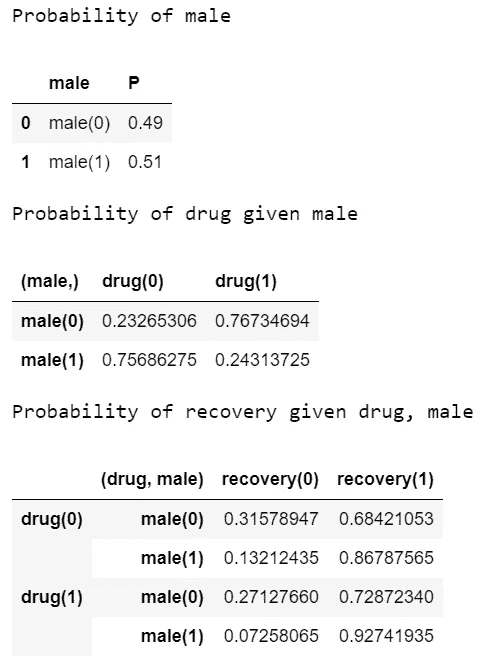

作者提供的图像

下一阶段是对模型运行两次“do”操作，一次为 drug=1，再次为 drug=0。然后可以从第一次结果中减去第二次结果，以计算药物服用的整体影响，独立于“男性”并去混淆 …

```py
If the drug is taken by everyone p(recovery)=0.8301
If the drug is not taken by anyone p(recovery)=0.7779

The improvement in recovery rate by everyone taking the drug is 5.2%
```

因此，`pgmpy`能够实现回到过去并重新运行药物试验的魔法。第一次重新运行强迫所有人服用药物，第二次阻止任何人服用药物，然后通过简单的减法得出答案，但`pgmpy`是如何实现这种魔法的？

# 解决方案 2：手动应用“do”计算

我们已经从 DAG 中得出结论，认为“药物”和“恢复”都受到“男性”的混淆，在因果推断中这种模式称为“后门”标准。

因此，任务是通过编写干预的数学公式来模拟干预（时间旅行的部分！），然后“调整”它，使其以我们可以观察的数据为表达。

“引言”部分的后门调整公式可以表示为以下药物试验数据的形式 -

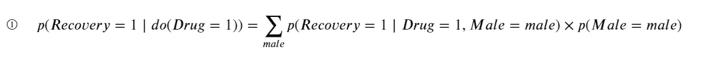

从这里开始，计算药物的整体效果是直接的，结果如下 -

1.  使用后门调整标准计算干预或“do-ing” Drug=1 的效果。

1.  使用后门调整标准计算干预或“do-ing” Drug=0 的效果。

1.  从第一部分的结果中减去第二部分的结果。

1.  如果药物产生积极影响，则整体结果将是一个正数。

结果称为“平均因果效应”，可以表示如下 -

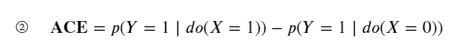

… 以及在药物示例中 …

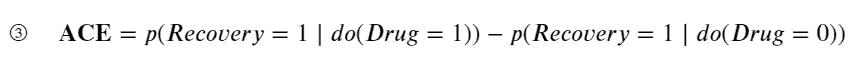

使用后门调整公式替换左侧和右侧，得到如下结果

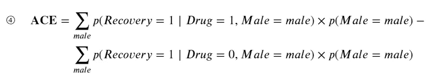

因此，我们需要通过将 Male=1 和 Male=0 的结果相加来解决减号左侧（即所有人都服用药物的干预），具体如下 -

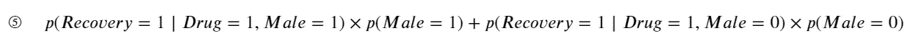

这些概率可以直接从`df_drug` `DataFrame`中轻松计算，但它们已经在条件概率表中很好地总结了，因此可以立即替换如下 …

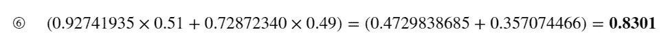

现在我们需要解决扩展 ACE 公式中减号右侧的内容（即防止所有人服用药物的干预） …

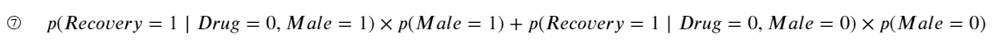

再次，我们可以直接从条件概率表中读取并替换概率 …

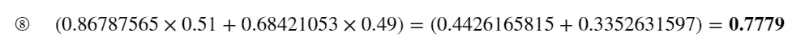

现在可以通过从第一个结果中减去第二个结果来计算平均因果效应 (ACE) …

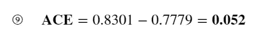

因此，每个人服用药物的恢复率提高了 5.2%，这与使用`pgmpy`库计算出的结果完全一致！

# 结论

传统的概率方法在数据中存在因果关系时无法产生正确答案，需要因果技术来计算正确的结果。

本文使用了一个合成数据集，展示了服用药物对患者恢复的真实效果为 5.2%的正面影响，而传统的概率方法则建议 5%的负面影响。

应用因果推断技术需要一个“有向无环图”来定义因果关系，然后将其与数据集一起作为因果计算的输入，以展示真实效果。

`pgmpy`库完成了看似不可能的魔法，回到过去干预药物试验，不仅一次，而是两次，第一次强制每个人服用药物，然后阻止任何人服用药物。

> 然而，这不是魔法。它是通过应用 Pearlean “do” 计算中的“后门调整公式”来实现的，长期计算已被解释并通过将结果与`pgmpy`库中的结果匹配来验证。

如果您喜欢这篇文章，您可以通过[点击我的推荐链接](https://grahamharrison-86487.medium.com/membership)以每月仅需$5 的价格获得对成千上万更多文章的无限访问（如果您通过此链接注册，我将获得一定比例的费用，而您无需额外支付任何费用）。

[](https://grahamharrison-86487.medium.com/membership?source=post_page-----686d2826efa4--------------------------------) [## 通过我的推荐链接加入 Medium - Graham Harrison

### 阅读 Graham Harrison 的每一个故事（以及 Medium 上的其他成千上万的作家）。增强您对数据的知识…

[grahamharrison-86487.medium.com](https://grahamharrison-86487.medium.com/membership?source=post_page-----686d2826efa4--------------------------------)

[订阅免费电子邮件以便我发布新故事时通知您](https://grahamharrison-86487.medium.com/subscribe)。

[快速浏览我之前的文章](https://grahamharrison-86487.medium.com/)。

[下载我免费的战略数据驱动决策框架](https://relentless-originator-3199.ck.page/5f4857fd12)。

访问我的数据科学网站 — [数据博客](https://www.the-data-blog.co.uk/)。

# 深入阅读

如果您想了解更多关于`pgmpy`库的信息，请参见完整文档：[`pgmpy.org/index.html`](https://pgmpy.org/index.html)。

如果您想了解更多关于因果推断的信息，这本惊人的书籍是一个很好的起点：

[](https://amzn.to/3iCVF8r?source=post_page-----686d2826efa4--------------------------------) [## 《为何之书：因果关系的新科学》（Penguin Science）

### 购买《为何之书：因果关系的新科学》（Penguin Science）01 由 Pearl, Judea, Mackenzie, Dana (ISBN…

[amzn.to](https://amzn.to/3iCVF8r?source=post_page-----686d2826efa4--------------------------------)

而这本书提供了对一些关键概念的更深入和详细的探讨：

[](https://amzn.to/3WblFp1?source=post_page-----686d2826efa4--------------------------------) [## 统计中的因果推断：入门

### 购买《统计中的因果推断：入门》1 由 Pearl, Judea, Glymour, Madelyn, Jewell, Nicholas P. (ISBN…

[amzn.to](https://amzn.to/3WblFp1?source=post_page-----686d2826efa4--------------------------------)

请注意：这些是 Amazon 推荐链接，如果您进行购买，作者将获得一定比例的提成。
