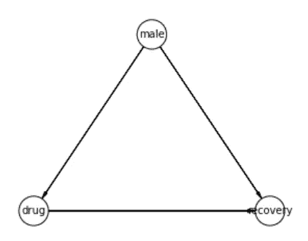
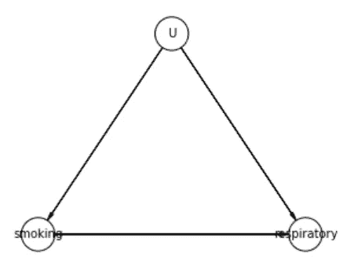
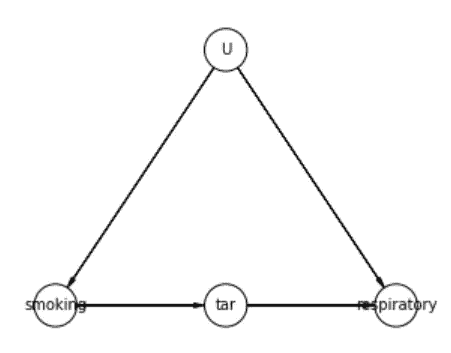
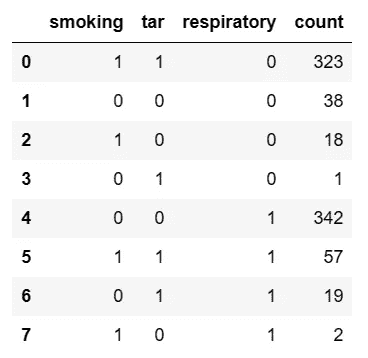
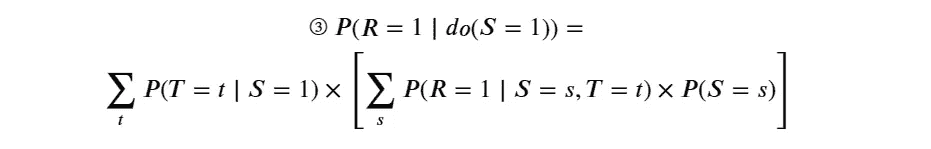
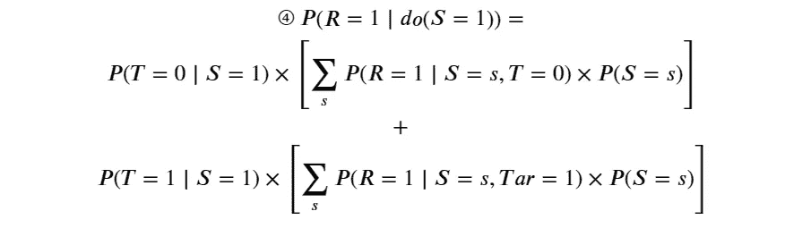
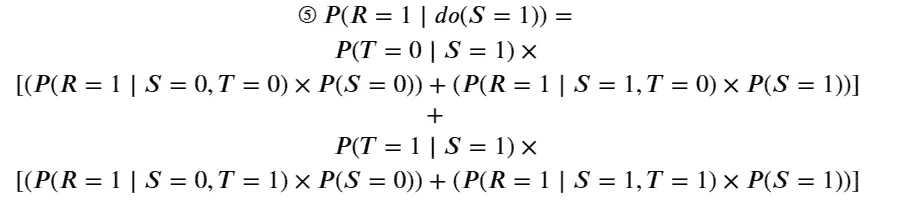
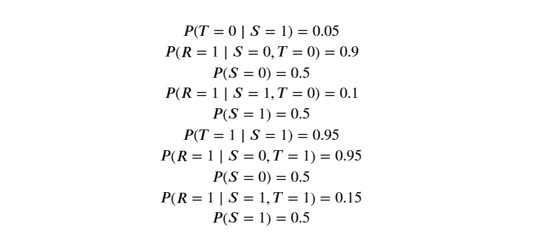
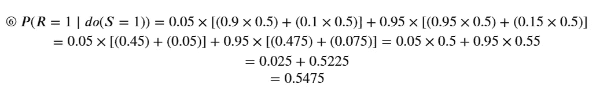

# 解锁因果推断和前门调整的力量：数据科学家的深入指南

> 原文：[`towardsdatascience.com/unlock-the-power-of-causal-inference-front-door-adjustment-an-in-depth-guide-for-data-scientists-8e7b8ba33421`](https://towardsdatascience.com/unlock-the-power-of-causal-inference-front-door-adjustment-an-in-depth-guide-for-data-scientists-8e7b8ba33421)

## 对因果推断前门调整的全面解释，包括所有 Python 源代码的示例

 [Graham Harrison](https://grahamharrison-86487.medium.com/?source=post_page-----8e7b8ba33421--------------------------------)

·发表于 [Towards Data Science](https://towardsdatascience.com/?source=post_page-----8e7b8ba33421--------------------------------) ·11 分钟阅读·2023 年 2 月 14 日

--

图片由 [Evelyn Paris](https://unsplash.com/@evelynparis?utm_source=unsplash&utm_medium=referral&utm_content=creditCopyText) 提供，来源于 [Unsplash](https://unsplash.com/s/photos/front-door?utm_source=unsplash&utm_medium=referral&utm_content=creditCopyText)

# 目标

> 在这篇文章结束时，你将理解因果推断的前门调整的魔力，它可以计算事件对结果的影响，即使存在其他未测量或甚至未知的因素影响两个变量，并且你将能够访问所有 Python 代码。

我在互联网和许多书籍中搜寻，试图找到一个在 Python 中完全工作的前门公式示例，但一无所获，因此，除非有我遗漏的资源，否则你即将阅读的内容确实是独一无二的…

# 介绍

在一篇最近的文章中，我探讨了“后门”调整公式的力量，来计算事件对结果的真实影响，即使存在“混淆”两个因素的可观察因素…

 ## 解锁因果推断的力量：数据科学家理解“后门”调整的指南…

### 使用 Python 和 pgmpy 库的“后门”调整公式的完整示例，包括完整…

towardsdatascience.com

目的是确定服用药物对患者恢复率的真实效果，而后门调整公式的魔力恢复了这一效果，即使“男性”掩盖了这一结果，因为 -

+   男性服用药物的比例高于女性

+   男性的恢复率高于女性

图片作者

在这个例子中，“男性”是一个“混杂因素”，但“男性”的值已包含在观察数据中，然后应用了后门公式来证明药物试验有积极效果。

但是如果“混杂因素”无法测量且未包含在数据中会怎样？

# 现实世界的例子

在 1950 年代，科学家们强烈相信吸烟导致呼吸道疾病，与此同时烟草公司设法提供了相反的“证据”，这场统计战持续不断。

这一证据的实质是烟草公司提出的假设，即遗传因素对吸烟者和发展呼吸道疾病的可能性负责。这对烟草公司来说是一个方便的假设，因为几乎无法测试。

这是关于相关因素之间因果联系的提议…

图片作者

# 一个因果推断解决方案

如果这是你唯一的数据，即来自未观察到的混杂因素到事件和结果的简单后门路径，那么什么也做不了；真实效果无法恢复。

然而，还有其他“模式”可以恢复效果，包括前门标准和工具变量。本文将全面解释这些模式中的第一个。

要满足前门标准，需要在事件和结果之间有一个中介，在吸烟的例子中可能是这样的 -

图片作者

即吸烟导致焦油，焦油导致呼吸道疾病，而不是直接的因果联系。

当这种模式存在时，可以使用“前门调整公式”来隔离和恢复事件（吸烟）对结果（呼吸道疾病）的影响，不受未观察到的混杂因素的影响，如 Judea Pearl 在《为什么的书》和《统计中的因果推断》中所提议的那样。

[## 为什么的书：因果关系的新科学（企鹅科学）](https://amzn.to/3iCVF8r?source=post_page-----8e7b8ba33421--------------------------------)

### 购买《为什么的书：因果关系的新科学》（企鹅科学）01，作者：Judea Pearl, Dana Mackenzie (ISBN…

[## 统计中的因果推断：初学者指南](https://amzn.to/3iCVF8r?source=post_page-----8e7b8ba33421--------------------------------) [##](https://amzn.to/3WblFp1?source=post_page-----8e7b8ba33421--------------------------------) 

### 购买《Causal Inference in Statistics: A Primer 1》由 Pearl, Judea, Glymour, Madelyn, Jewell, Nicholas P.（ISBN…）

[amzn.to](https://amzn.to/3WblFp1?source=post_page-----8e7b8ba33421--------------------------------)

> 排除未观察混杂因素的影响似乎很神奇，实际效果也确实令人惊叹，但如果你按照本文其余部分的步骤，你将能够通过几行 Python 代码将这一惊人技术添加到你的数据科学工具包中！

# 入门

我们首先需要一些测试数据。我使用我的`BinaryDataGenerator`类创建了一个合成数据集。如果你想要完整的源代码，请访问这篇文章 -

[如何在少于 10 行代码中生成任何因果推断项目的合成数据](https://towardsdatascience.com/how-to-generate-synthetic-data-for-any-causal-inference-project-in-less-than-10-lines-of-code-158688a89349?source=post_page-----8e7b8ba33421--------------------------------) [## 如何在少于 10 行代码中生成任何因果推断项目的合成数据

### 如果 99%的人接种疫苗，1%有反应，2%得病，你如何生成具有代表性的合成数据？

[towardsdatascience.com](https://towardsdatascience.com/how-to-generate-synthetic-data-for-any-causal-inference-project-in-less-than-10-lines-of-code-158688a89349?source=post_page-----8e7b8ba33421--------------------------------) 

图片由作者提供

数据的总结分析如下 -

+   样本中有 800 人。

+   50%的样本人口是吸烟者（400/800）

+   95%的吸烟者有焦油沉积物（380/400）

+   5%的非吸烟者有焦油沉积物（20/400）

+   15%有焦油的吸烟者有呼吸系统疾病（47/380）

+   10%没有焦油的吸烟者有呼吸系统疾病（2/20）

+   95%有焦油的吸烟者有呼吸系统疾病（19/20）

+   90%没有焦油的非吸烟者有呼吸系统疾病（342/380）

# 初次尝试：使用 Pgmpy 库

在我关于后门标准的文章中，我首先展示了一个使用`pgmpy`的简单解决方案。

鉴于在那个示例中应用后门标准如此简单，按同样的方式应用前门标准应该非常直接。这是应该能做到的代码……

预期结果是 4.5%（稍后会详细讨论！）但`pgmpy`崩溃，显示`ValueError: Maximum Likelihood Estimator works only for models with all observed variables. Found latent variables: set()`.

经过大量研究并与开发人员沟通后，我得出的结论是，当存在未观察到的混杂因素时，`pgmpy`在应用“do”操作符（即进行干预）时不起作用，并且`pgmpy`无法应用前门调整公式。

更糟的是，`DoWhy`库在这种情况下也不起作用。

`DoWhy`可以处理在计算“平均处理效果”（ATE）时的未观察混杂因素，但当“do”操作符用于模拟干预时，它与`pgmpy`一样失败。

ATE 应用于连续变量，因此我们可以问`DoWhy`一个问题，如“如果二氧化碳排放增加 1 亿吨，对全球温度的因果效应是什么？”`DoWhy`将产生一个结果。

然而，当对离散的二元数据应用“do”干预，例如“在样本中每个人都吸烟的情况下，呼吸道疾病的概率是多少？”时，`pgmpy`或`DoWhy`无法进行计算，并且到目前为止我没有找到其他可以的库。

我的后门文章从`pgmpy`实现转向提供数学示例，以展示`pgmpy`在幕后所做的工作。在这篇文章中，理解数学是前提，以便我们可以在 Python 中构建自己的前门调整公式实现……

# 第二次尝试：手工计算

目标是通过模拟以下内容来计算平均因果效应（ACE） -

1.  回到过去，执行一个干预，强制每个人都吸烟。

1.  再次执行相同的时间旅行技巧，这次强制每个人都戒烟。

1.  从第一个结果中减去第二个结果。

使用“do”操作符在数学上表达，这一惊人的成就看起来像这样 -

由于我们知道数据中存在一个未观察到的混杂因素和一个前门路径，所以我们需要用 Judea Pearl 提出的前门调整公式替换 ACE 公式的每一侧……

让我们从 ACE 公式的左侧开始，用前门调整公式替换，并使用数据中存在的变量代替 x、y 和 z。为了保持整洁，以下缩写将被使用：S = 吸烟，R = 呼吸，T = 焦油……

t 可以取值 {0, 1}，s 可以取值 {0, 1}，因此我们现在需要展开如下……

… 内部的 ∑𝑠 项可以进一步展开如下……

现在只需替换数据中的条件概率即可。在下一节中，将提供一个 Python 函数来计算数据中的任何条件概率，但现在需要的值如下……

替换这些条件概率得到……

所以……

… 如果你重新计算上面所有的步骤，得到𝑃(𝑅=1∣𝑑𝑜(𝑆=0))的答案是……

因此，整体的平均因果效应（ACE）是……

手动计算平均因果效应是相当费力的！幸运的是，现在前门调整公式的工作原理已完全理解，将所有这些转换为 Python 相对简单，以便可以针对任何特征为离散值的数据集完全自动化整个过程…

# 第三次尝试：一个可重复使用的 Python 函数

第三次尝试涉及构建一个可重复使用的 Python 函数，该函数实现了前一节中的数学，适用于任何简单的 DAG 和任何`DataFrame`，以便在理解数学后可以将其搁置一边。

该函数的实现需要使用条件概率，并且需要一个简单的 Python 函数来从任何`DataFrame`计算这些概率。

我将 `calc_cond_prob` 函数的细节留在了本文之外，以便专注于前门调整，但你可以从这篇文章中阅读完整的解释并下载源代码…

 ## 如何在 3 行代码中从任何 DataFrame 计算条件概率

### 学习编写一个简单的 Python 函数，使用诸如 p(exam=1 |… 的符号来计算条件概率

towardsdatascience.com

一旦你下载了 `calc_cond_prob`，就可以像这样轻松地从任何 `DataFrame` 计算条件概率…

𝑝(𝑟𝑒𝑠𝑝𝑖𝑟𝑎𝑡𝑜𝑟𝑦=0∣𝑠𝑚𝑜𝑘𝑖𝑛𝑔=0,𝑡𝑎𝑟=0)=0.1

… 或者可以明确指定 `outcome / result` 和 `events` 如下…

𝑝(𝑟𝑒𝑠𝑝𝑖𝑟𝑎𝑡𝑜𝑟𝑦=0∣𝑠𝑚𝑜𝑘𝑖𝑛𝑔=0,𝑡𝑎𝑟=0)=0.1

前一节解释了 Pearlean 前门调整公式背后的数学，并提供了一个完整的示例。

根据这些构建块（以及 `calc_cod_prob` 函数），可以开发一个 Python 函数，该函数将计算前门调整公式，用于包含以下特征的任何 `DataFrame` -

+   X — 处理

+   Y — 结果

+   Z — 中介

这是前门调整的完整源代码…

… 并且可以像这样调用该函数…

# 结论

首先讨论问题，如果吸烟对呼吸系统疾病的平均概率仅增加了 4.5%，这不会说服许多吸烟者戒烟。

然而，我们看到给定吸烟的呼吸系统疾病的单独概率 𝑃(𝑟𝑒𝑠𝑝𝑖𝑟𝑎𝑡𝑜𝑟𝑦=1∣𝑑𝑜(𝑠𝑚𝑜𝑘𝑖𝑛𝑔=1))=54.75%。

平均因果效应之所以如此低，是因为我们的虚构烟草公司使用了卑劣的手段，通过确保大量有呼吸系统疾病的非吸烟者被纳入样本，以掩盖真相，即吸烟确实会导致呼吸系统疾病。

即使数据中有这些噪音，即使我们接受一个不太可能的假设，即存在一个无法测量的遗传因素，使事件和结果都受到混淆，前门调整公式的魔力仍然揭示了吸烟与呼吸系统疾病之间的正向因果关系！

这个惊人的结果与我在其他数据科学技术中发现的任何东西都不同，它涉及到我的机器学习预测的客户总是问的最常见的问题，即 -

+   为什么会发生这种情况？

+   我应该做什么来改变结果并改善情况？

这些类型的“为什么？”问题使得应用前门调整以计算“干预”效果所需的知识、能力和理解成为数据科学工具包中不可或缺的补充。

不幸的是，目前可用的库，包括 `pgmpy` 和 `DoWhy`，在对包含未观察到的混淆变量和前门路径的离散数据集应用“do”操作时无法正常工作。

这是这些库功能上的一个巨大缺陷，经过长时间的搜索，包括在线和书籍中的实际示例，我找不到任何解决方案。

除非我遗漏了一些示例，使得这篇文章独一无二，我希望在前门调整开始吸引我时能够阅读这篇文章，而不是自己做所有这些研究。

不过这非常有趣，我真的希望你喜欢这个结果！

# 附加部分

既然如此，`pgmpy` 在这种情况下不起作用，并且在我的学习过程中已经走了这么远，我决定用 Python 编写一个前门调整公式的版本，以纠正这一遗漏。

仅仅是为了说明，我决定重构公式，使得 Python 实现更简洁，改动了这个 …

改成这样 ..

… 这是数学上等效的，就像是在说 —

4 x 3 x 1 x 2 x 2 = 4 x 1 x 2 x 2 x 3

注：有关这一等效性的完整解释，请参见 Pearl、Glymour 和 Jewell 的《统计学中的因果推断》，第 68 页（3.15）和第 69 页（3.16）。

回到解决方案，第一步是使用 `pgmpy` 类创建因果模型。需要注意的是：未观察到的混淆变量必须从 `edges` 列表中删除，因为这会导致 `BayesianNetwork.fit()` 方法因 `ValueError` 崩溃 …

一旦设置完成，前门公式可以在 Python 中实现如下 …

只是为了证明它的有效性，计算结果与手动计算以及之前直接在 `DataFrame` 上工作的 Python 函数完全一致 …

# 联系并保持联系 …

如果你喜欢这篇文章，你可以通过[点击我的推荐链接](https://grahamharrison-86487.medium.com/membership)以每月仅需$5 成为 Medium 会员，享受对成千上万篇文章的无限访问（如果你通过此链接注册，我将获得费用的一部分，对你没有额外费用）。

 [## 使用我的推荐链接加入 Medium — Graham Harrison

### 阅读 Graham Harrison 的每个故事（以及 Medium 上成千上万其他作家的作品）。提升你对数据的知识…

grahamharrison-86487.medium.com](https://grahamharrison-86487.medium.com/membership?source=post_page-----8e7b8ba33421--------------------------------)

… 或通过 … 连接

[订阅我的免费电子邮件，以便每当我发布新故事时你都会收到通知](https://grahamharrison-86487.medium.com/subscribe)。

[快速查看我的上一篇文章](https://grahamharrison-86487.medium.com/)。

[下载我免费的战略数据驱动决策框架](https://relentless-originator-3199.ck.page/5f4857fd12)。

访问我的数据科学网站 — [数据博客](https://www.the-data-blog.co.uk/)。
