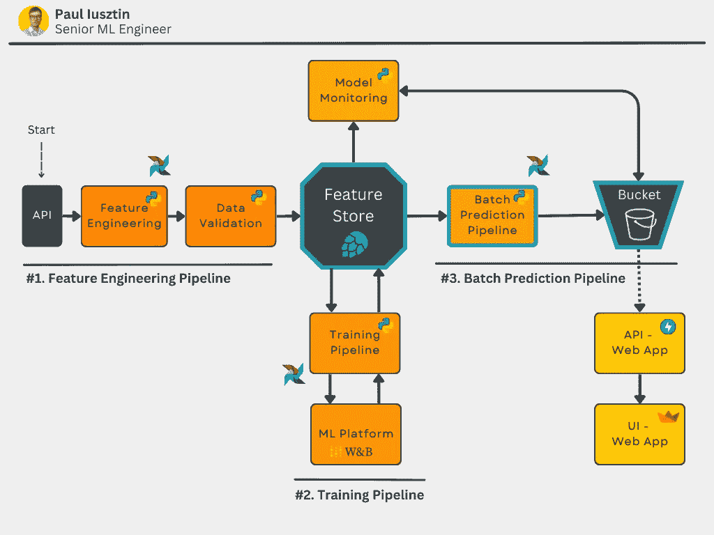
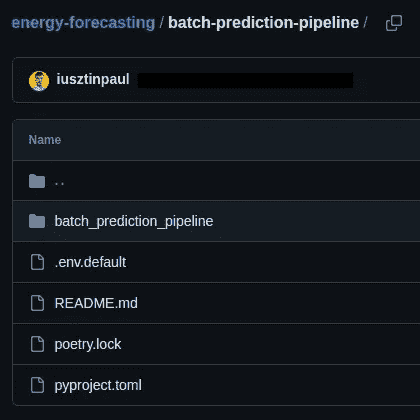
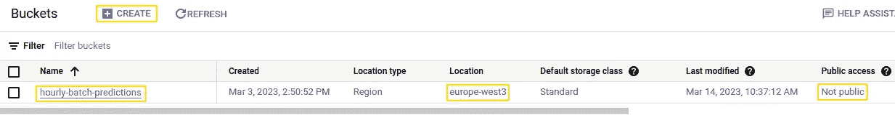

# 解锁使用 Python、特征存储和 GCS 的高效批量预测管道的秘密

> 原文：[`towardsdatascience.com/unlock-the-secret-to-efficient-batch-prediction-pipelines-using-python-a-feature-store-and-gcs-17a1462ca489`](https://towardsdatascience.com/unlock-the-secret-to-efficient-batch-prediction-pipelines-using-python-a-feature-store-and-gcs-17a1462ca489)

## [完整堆栈 7 步 MLOps 框架](https://towardsdatascience.com/tagged/full-stack-mlops)

## 课程 3：批量预测管道。使用 Poetry 打包 Python 模块

[](https://pauliusztin.medium.com/?source=post_page-----17a1462ca489--------------------------------)[](https://towardsdatascience.com/?source=post_page-----17a1462ca489--------------------------------) [Paul Iusztin](https://pauliusztin.medium.com/?source=post_page-----17a1462ca489--------------------------------)

·发表于 [Towards Data Science](https://towardsdatascience.com/?source=post_page-----17a1462ca489--------------------------------) ·阅读时间 15 分钟·2023 年 5 月 12 日

--


由 [Hassan Pasha](https://unsplash.com/@hpzworkz?utm_source=medium&utm_medium=referral) 拍摄，来自 [Unsplash](https://unsplash.com/?utm_source=medium&utm_medium=referral)

本教程代表了**一个包含 7 节课程中的第三部分**，将逐步指导你如何**设计、实施和部署 ML 系统**，并运用**MLOps 的良好实践**。在课程中，你将构建一个生产就绪的模型，以预测来自丹麦的不同消费者类型在接下来的 24 小时内的能源消耗水平。

*在本课程结束时，你将理解使用批量服务架构设计、编码和部署 ML 系统的所有基础知识。*

本课程*面向中级/高级机器学习工程师*，他们希望通过构建自己的端到端项目来提升技能。

> 现在，证书无处不在。构建高级端到端项目，并在之后展示出来，是获得专业工程师认可的最佳方式。

# 目录：

+   课程介绍

+   课程内容

+   数据来源

+   课程 3：批量预测管道。使用 Poetry 打包 Python 模块。

+   课程 3：代码

+   结论

+   参考资料

# 课程介绍

***在这 7 节课程结束时，你将学会：***

+   设计一个批量服务架构

+   使用 Hopsworks 作为特征存储

+   设计一个从 API 读取数据的特征工程管道

+   构建一个带有超参数调优的训练管道

+   使用 W&B 作为 ML 平台来跟踪你的实验、模型和元数据

+   实现一个批量预测管道

+   使用 Poetry 构建你自己的 Python 包

+   部署你自己的私有 PyPi 服务器

+   使用 Airflow 协调一切

+   使用预测来编写一个使用 FastAPI 和 Streamlit 的 Web 应用

+   使用 Docker 对代码进行容器化

+   使用 Great Expectations 确保数据验证和完整性

+   随时间监控预测的性能

+   将所有内容部署到 GCP

+   使用 GitHub Actions 构建 CI/CD 管道

如果这些听起来很多，不用担心。完成这门课程后，你会理解我之前说的所有内容。最重要的是，你将知道**为什么**我使用了这些工具以及它们如何作为一个系统协同工作。

**如果你想从这门课程中获得最大收益，** [**我建议你访问包含所有课程代码的 GitHub 仓库**](https://github.com/iusztinpaul/energy-forecasting) **。这门课程的设计目的是快速阅读和复现文章中的代码。**

在课程结束时，你将知道如何实现下面的图示。不要担心如果有些地方不太明白。我会详细解释所有内容。


你将在课程中构建的架构图 [作者提供的图片]。

在**第 3 课结束时**，你将学会如何实现和集成**批量预测管道**以及**使用 Poetry 打包所有 Python 模块**。

# 课程内容：

1.  [批量服务。特征存储。特征工程管道。](https://medium.com/towards-data-science/a-framework-for-building-a-production-ready-feature-engineering-pipeline-f0b29609b20f)

1.  [训练管道。ML 平台。超参数调整。](https://medium.com/towards-data-science/a-guide-to-building-effective-training-pipelines-for-maximum-results-6fdaef594cee)

1.  **批量预测管道。使用 Poetry 打包 Python 模块。**

1.  [私有 PyPi 服务器。使用 Airflow 协调一切。](https://medium.com/towards-data-science/unlocking-mlops-using-airflow-a-comprehensive-guide-to-ml-system-orchestration-880aa9be8cff)

1.  使用 GE 进行数据验证以确保质量和完整性。模型性能持续监控。

1.  [使用 FastAPI 和 Streamlit 消费和可视化模型预测。对一切进行 Docker 化。](https://medium.com/towards-data-science/fastapi-and-streamlit-the-python-duo-you-must-know-about-72825def1243)

1.  [将所有 ML 组件部署到 GCP。使用 GitHub Actions 构建 CI/CD 管道。](https://medium.com/towards-data-science/seamless-ci-cd-pipelines-with-github-actions-on-gcp-your-tools-for-effective-mlops-96f676f72012)

1.  [[额外内容] ‘不完美’ ML 项目的幕后 — 教训与见解](https://medium.com/towards-data-science/imperfections-unveiled-the-intriguing-reality-behind-our-mlops-course-creation-6ff7d52ecb7e)

如果你想全面掌握本节内容，我们建议你查看我们的[上一篇课程](https://medium.com/towards-data-science/a-guide-to-building-effective-training-pipelines-for-maximum-results-6fdaef594cee)，其中讲述了设计一个使用特征存储和 ML 平台的训练管道：

[](/a-guide-to-building-effective-training-pipelines-for-maximum-results-6fdaef594cee?source=post_page-----17a1462ca489--------------------------------) ## 建立有效训练管道以获得最佳结果指南

### 第二部分：训练管道。ML 平台。超参数调整。

towardsdatascience.com

# 数据来源

我们使用了一个免费的开放 API，提供丹麦所有能源消费者类型的每小时能源消耗值[1]。

它们提供了一个直观的界面，您可以轻松查询和可视化数据。[您可以在这里访问数据](https://www.energidataservice.dk/tso-electricity/ConsumptionDE35Hour) [1]。

数据有 4 个主要属性：

+   **小时 UTC：** 观察到数据点的 UTC 日期时间。

+   **价格区域：** 丹麦被分为两个价格区域：DK1 和 DK2——由大贝尔特分隔。DK1 位于大贝尔特以西，DK2 位于大贝尔特以东。

+   **消费者类型：** 消费者类型是工业代码 DE35，由丹麦能源公司拥有和维护。

+   **总消耗：** 总电力消耗（以千瓦时为单位）

**注意：** 观察数据有 15 天的延迟！但对于我们的演示用例，这不是问题，因为我们可以模拟实时中的相同步骤。


我们的网页应用程序的截图，显示了我们如何预测区域=1 和消费者类型=212 的能源消耗[作者提供的图片]。

数据点具有每小时分辨率。例如：“2023–04–15 21:00Z”，“2023–04–15 20:00Z”，“2023–04–15 19:00Z”等。

我们将数据建模为多个时间序列。每个独特的**价格区域**和**消费者类型元组代表其**独特的时间序列。

因此，我们将构建一个模型，独立预测每个时间序列的未来 24 小时能源消耗。

*查看下面的视频，以更好地了解数据的样子* 👇

课程和数据来源概览[作者提供的视频]。

# **第三部分：批量预测管道。使用 Poetry 打包 Python 模块。**

## 第三部分的目标

本课程将教你如何构建批量预测管道。此外，它还将展示如何使用 Poetry 将我们在第 1、第 2 和第三部分中完成的所有管道代码打包成 Python PyPi 模块。👇

**注意：** 在下一节中，我们将把这些 Python 模块上传到我们自己的私有 PyPi 服务器，并从 Airflow 中安装它们。



最终架构图，其中第 3 课的组件以蓝色突出显示 [作者提供的图片]。

如果你记得第 1 课，模型可以通过以下方式进行部署：

+   批处理模式

+   请求-响应（例如，RESTful API 或 gRPC）

+   流式模式

+   嵌入式

本课程将*以批处理模式部署模型*。

我们将讨论在构建 web 应用程序时如何从批处理过渡到其他方法。你会发现这非常自然。

但是，如果你渴望比较批处理模式与请求-响应服务模式，[可以查看我写的 5 分钟文章，解释如何使用请求-响应方法服务模型](https://faun.pub/key-concepts-for-model-serving-38ccbb2de372Q)。

**批处理模式下部署模型的主要步骤是什么，也就是构建批量预测管道的步骤？**

**步骤 1：** 你将从特征库中以批处理模式加载特征。

**步骤 2：** 你将从模型注册表中加载训练好的模型（在我们的例子中，我们使用 Hopsworks 作为模型注册表）。

**步骤 3：** 你将预测未来 24 小时的能源消耗水平。

**步骤 4：** 你将把预测结果保存到 GCP 存储桶中。

之后，各种消费者将从 GCP 存储桶中读取预测并相应使用它们。在我们的案例中，我们使用 FastAPI 和 Streamlit 实现了一个仪表板。

*通常，你的初始部署策略将是批处理模式。*

**为什么？**

因为这样做，你不必关注延迟和吞吐量等限制。通过将预测保存到某些存储中，你可以快速使模型上线。

因此，批处理模式是部署模型的最简单和最快的方式，同时保持应用程序最终用户的良好体验。

当应用程序可以实时访问预测时，模型是在线的。

请注意，预测不是实时生成的，仅在实时访问（例如，从存储读取）中进行。

使用此方法的*最大缺点*是你的预测将有一定的滞后。例如，在我们的用例中，你生成并保存未来 24 小时的预测。假设经过 2 小时没有新的预测，现在你只有未来 22 小时的预测。

当你必须存储的预测数量是合理的时，你可以通过频繁生成预测来绕过这个问题。在我们的示例中，我们将每小时生成预测——我们的数据分辨率为 1 小时。因此，我们通过不断生成和存储新预测来解决延迟问题。

*但这里出现了批量预测策略的第二个问题*。假设预测集合很大。例如，你想预测 100 万用户的推荐，而数据库中有 1 亿个项目。那么，频繁计算预测将是非常昂贵的。

然后，你必须强烈考虑使用其他服务方法。

***但这里有一个陷阱。***

你的应用程序可能不会一开始就有 100 万用户和 1 亿条数据。这意味着你可以安全地从批处理模式架构开始，并在有必要时逐步转向其他方法。

这就是大多数人做的事情！

要了解如何转向其他方法，[请查看这篇文章](https://medium.com/mlearning-ai/this-is-what-you-need-to-know-to-build-an-mlops-end-to-end-architecture-c0be1deaa3ce)，了解*Google Cloud* *建议的* *标准化 ML 架构*。

## 理论概念与工具

**GCS：** GCS 代表 Google Cloud Storage，是 Google 在 GCP 中的存储解决方案。如果你更熟悉 AWS S3，它类似于此。

你可以向 GCS 写入任何文件。在我们的课程中，我们将 Pandas DataFrames 写入 parquet 文件。

**GCS 与 Redis：** 我们选择将预测结果写入 GCS 主要有 4 个原因：

+   易于设置

+   无需维护

+   访问免费层

+   我们还将使用 GCP 来部署代码。

Redis 是缓存预测结果以便后续由各种客户端访问的热门选择。

*为什么？*

由于你可以以低延迟访问数据，从而改善用户体验。

本来这是一个不错的选择，但我们想要简化事情。

此外，将预测结果写入 GCS 以便长期存储，并在 Redis 中缓存以供实时访问也是一种良好的做法。

**Poetry：** Poetry 是我最喜欢的 Python 虚拟环境管理工具。它类似于 Conda、venv 和 Pipenv。依我看，它更优，因为：

+   它提供了一个**.lock**文件，反映了所有子依赖项的版本。因此，复制代码非常简单和安全。

+   你可以直接使用 Poetry 快速构建你的模块。无需其他设置。

+   你可以使用 Poetry 快速将模块部署到 PiPy 服务器。无需其他设置，还有更多……

# 第 3 课：代码

[你可以在这里访问 GitHub 仓库。](https://github.com/iusztinpaul/energy-forecasting)

**注意：** 所有安装说明都在仓库的 README 文件中。这里我们将直接跳到代码。

*第 3 课中的所有代码都位于* [***batch-prediction-pipeline***](https://github.com/iusztinpaul/energy-forecasting/tree/main/batch-prediction-pipeline)*文件夹中。*

[**batch-prediction-pipeline**](https://github.com/iusztinpaul/energy-forecasting/tree/main/batch-prediction-pipeline) 文件夹下的文件结构如下：



显示批量预测管道文件夹结构的屏幕截图 [作者提供的图片]。

所有代码都位于 [**batch_prediction_pipeline**](https://github.com/iusztinpaul/energy-forecasting/tree/main/batch-prediction-pipeline/batch_prediction_pipeline) 目录下（注意“_”而不是“-”）。

直接在你的 git 仓库中存储凭据是一个巨大的安全风险。这就是为什么你将使用**.env**文件来注入敏感信息。

**.env.default**是你必须配置的所有变量的示例。它还可以帮助存储那些不敏感的属性的默认值（例如，项目名称）。


.env.default 文件的截图[图片由作者提供]。

## 准备凭据

首先，你需要创建一个**.env**文件，在其中添加我们所有的凭据。

我已经在第 1 课中向你展示了如何设置你的**.env**文件。同时，我在第 1 课中解释了如何将**.env**文件中的变量从**ML_PIPELINE_ROOT_DIR**目录加载到**SETTINGS** Python 字典中，以便在代码中使用。

因此，如果你想复制我所做的，我强烈建议查看第 1 课。

*如果你只是想轻松阅读，可以完全跳过“****准备凭据****”步骤。*

在第 3 课中，你将使用两个服务：

1.  [Hopsworks](https://www.hopsworks.ai/)

1.  [GCP — Cloud Storage](https://cloud.google.com/storage)

[***Hopsworks***](https://www.hopsworks.ai/) ***(免费)***

我们已经在[第 1 课](https://medium.com/towards-data-science/a-framework-for-building-a-production-ready-feature-engineering-pipeline-f0b29609b20f)中向你展示了如何设置**Hopsworks**的凭据。请访问[第 1 课中的“准备凭据”部分](https://medium.com/towards-data-science/a-framework-for-building-a-production-ready-feature-engineering-pipeline-f0b29609b20f)，在那里我们详细展示了如何设置 Hopsworks 的 API KEY。

[***GCP — Cloud Storage***](https://cloud.google.com/storage) ***(免费)***

在复制本课程时，你将坚持使用*GCP — Cloud Storage 免费层*。你可以在 GCP — Cloud Storage 中免费存储最多 5GB，这对我们的使用情况绰绰有余。

这个配置步骤会稍长一些，但我保证它并不复杂。顺便说一下，你将学习使用像 GCP 这样的云服务提供商的基础知识。

首先，访问 GCP 并创建一个名为“**energy_consumption**”（或其他任意名称）的项目**。** 随后，前往 GCP 项目的“Cloud Storage”部分，创建一个名为“**hourly-batch-predictions**”的**非公开存储桶**。** 选择任何区域，但请注意这一点—[创建 GCP 存储桶的官方文档](https://cloud.google.com/storage/docs/creating-buckets) [2]。

**注意：** *由于平台规则的不断变化，你可能需要选择不同的名称*。这不是问题，只需根据你的需求命名，并在**.env**文件中进行更改：*GOOGLE_CLOUD_PROJECT*（我们的“energy_consumption”）和*GOOGLE_CLOUD_BUCKET_NAME*（我们的“hourly-batch-predictions”）。



GCP — Cloud Storage 视图的截图，你需要在其中创建你的桶 [图片由作者提供]。

现在你已经完成了所有 GCP 资源的创建。最后一步是创建一种方式，以便通过你的 Python 代码直接访问 GCP 桶的读写权限。

你可以通过 GCP *服务账户*轻松做到这一点。我不想把整篇文章都挤占于 GCP 配置。因此，[这份 GCP 官方文档展示了如何创建服务账户](https://cloud.google.com/iam/docs/service-accounts-create) [3]。

*创建服务账户时，请注意一件事！*

服务账户具有不同的角色。角色是一种配置服务账户权限的方式。

因此，你需要配置你的服务账户以拥有对你的“**hourly-batch-predictions**”桶的读写访问权限。

你可以通过在创建服务账户时选择“**Storage Object Admin**”角色来轻松做到这一点。

最后一步是找到一种方法，在你的 Python 代码中使用新创建的服务账户进行身份验证。

你可以通过访问你的服务账户并创建一个 JSON 密钥来轻松做到这一点。再次，[这里是官方 GCP 文档，它会告诉你如何为你的服务账户创建 JSON 密钥](https://cloud.google.com/iam/docs/keys-create-delete) [4]。

*再次，请记住一件事！*

创建 JSON 密钥时，你将下载一个 JSON 文件。

下载 JSON 文件后，将其放在安全的地方，并转到你的**.env**文件。在那里，将*GOOGLE_CLOUD_SERVICE_ACCOUNT_JSON_PATH*的值更改为 JSON 文件的绝对路径。


**.env.default** 文件的截图 [图片由作者提供]。

**注意：** 记得将*GOOGLE_CLOUD_PROJECT*和*GOOGLE_CLOUD_BUCKET_NAME*变量更改为你的名称。

*恭喜！你已经完成了 GCS — Cloud Storage 的配置。*

现在你已经创建了一个 GCP 项目和桶。此外，你可以通过服务账户使用你的 Python 代码进行读写访问。你使用 JSON 文件的帮助登录到服务账户。

如果有什么问题，请在下面的评论中告诉我，或直接在[LinkedIn](https://www.linkedin.com/feed/)上联系我。

## 批量预测管道 — 主功能

如你所见，主功能遵循批量预测管道的四个步骤：

1.  从特征存储中以批处理模式加载数据。

1.  从模型注册表中加载模型。

1.  进行预测。

1.  将预测结果保存到 GCS 桶中。

大部分功能都是日志行 😆

在这四个主要步骤中，你必须从之前步骤生成的元数据中加载所有参数，例如**feature_view_version**和**model_version**。

另外，你需要获得对 Hopsworks 特征存储的引用。

然后，你直接进入我们将在后面的教程中详细介绍的四个主要步骤 👇

## 步骤 1：以批处理模式从特征存储加载数据

这一步类似于我们在第 2 课中加载训练数据时所做的。

但这一次，我们不是从训练数据集中下载数据，而是直接请求一个日期时间范围内的数据批次，使用**get_batch_data()**方法。

这样做允许我们时间旅行到所需的日期时间范围，并请求所需的特征。这种方法使批量推理变得非常简单。

最后一步是按照**sktime**的预期准备 DataFrame 的索引，并将其分割为 X 和 y。

**注意：** 这是一个自回归过程：我们从过去的 y 值中学习以预测未来的 y 值（y = 能源消耗水平）。因此，我们将只使用 X 作为模型的输入。我们将仅将 y 用于可视化目的。

## 第二步：从模型注册表加载模型

从 Hopsworks 模型注册表加载模型非常简单。

下面的函数有一个参数是对 Hopsworks 项目的引用和我们要下载的模型版本。

使用这两个变量，你可以获得对模型注册表的引用。之后，通过模型的名称，你可以获得对模型本身的引用。在这种情况下，它是**best_model**。

最后，你下载工件/模型并将其加载到内存中。

这里的诀窍是你的模型是有版本控制的。因此，你总是知道你使用的是哪个模型。

**注意：** 我们使用在[第 2 课](https://medium.com/towards-data-science/a-guide-to-building-effective-training-pipelines-for-maximum-results-6fdaef594cee)中解释的训练管道上传了**best_model**到模型注册表。训练管道还提供了一个包含最新 model_version 的元数据字典。

## 第三步：预测未来 24 小时的能源消耗水平

**Sktime**使预测变得极其简单。下面代码片段中的关键行是“**predictions = model.predict(X=X_forecast)**”，它预测了未来 24 小时的能源消耗值。

模型训练时设置了 24 小时的预测时间范围。因此，它已经知道未来要预测多少个数据点。

另外，你需要准备外生变量**X_forecast**。在时间序列预测中，外生变量是你已经知道未来会发生的特征。例如，节假日。因此，基于你的训练数据 X，其中包含所有区域和消费者类型 ID，你可以通过将日期时间范围映射到预测范围来生成**X_forecast**变量。

## 第四步：将预测结果保存到存储桶

最后一个组件是将所有内容保存到 GCP 存储桶的函数。

这一步相对简单，难点在于配置你的存储桶和访问凭证。

我们获取对存储桶的引用，遍历 X、y 和预测，将它们作为 blob 写入存储桶。

**注意：** 除了预测结果外，我们还保存 X 和 y，以便将所有内容集中在一个地方，方便快速访问所有所需内容，并在网页应用中漂亮地呈现它们。

要获取桶的引用，你必须访问在教程开始时配置的设置。

如你所见，你创建了一个 GCS 客户端，并指定了项目名称和 JSON 凭据文件路径。之后，你可以快速获取你指定桶的引用。

将 blob 写入桶与写入普通文件非常相似。

你获取你要写入的 blob 的引用，并使用"**with blob.open("wb") as f**"打开资源。

注意你以二进制格式打开了 blob。

你将数据以 parquet 格式写入，因为它在存储大小和写入&读取性能之间是一个很好的折衷。

## 使用 Poetry 打包 Python 模块

[Poetry](https://python-poetry.org/)使构建过程变得极其简单。

第一步显而易见，就是使用 Poetry 作为你的虚拟环境管理器。这意味着你已经拥有了"**pyproject.toml**"和"**poetry.lock**"文件——我们已经为你提供了这些文件。

现在，你只需进入与你的 Poetry 文件（上述文件）同一层级的项目目录（例如，进入你的[batch-prediction-pipeline](https://github.com/iusztinpaul/energy-forecasting/tree/main/batch-prediction-pipeline)目录）并运行：

```py
poetry build
```

这将创建一个包含你的包的**dist**文件夹作为**wheel**。现在你可以直接使用 wheel 文件安装你的包，或将其部署到 PyPi 服务器上。

要进行部署，请使用以下配置你的 PyPi 服务器凭据：

```py
poetry config repositories.<my-pypi-server> <pypi server URL>
poetry config http-basic.<my-pypi-server> <username> <password>
```

最后，使用以下命令进行部署：

```py
poetry publish -r <my-pypi-server>
```

就这样。我对 Poetry 如何简化这个过程感到惊讶。

否则，构建和部署你的 Python 包是一个繁琐且漫长的过程。

在第 4 课中，你将部署你的私人 PyPi 服务器，并使用我在上面展示的命令部署到目前为止你编写的所有代码。

# 结论

恭喜你！你完成了**Full Stack 7-Steps MLOps Framework**课程的**第三课**。

如果你已经走到这一步，你知道如何：

+   选择正确的架构

+   以批量模式从特征存储中访问数据

+   从模型注册中心下载你的模型

+   构建推理管道

+   将你的预测结果保存到 GCS

现在你了解了使用和实现批量预测架构的强大功能，你可以快速实时提供模型，同时为其他更高级的服务方法铺平道路。

查看第 4 课，了解如何托管你自己的私人 PyPi 服务器以及如何使用 Airflow 编排所有管道。

**另外，** [**你可以在这里访问 GitHub 仓库**](https://github.com/iusztinpaul/energy-forecasting)**。**

💡 我的目标是帮助机器学习工程师在设计和生产化机器学习系统方面提升水平。关注我在 [LinkedIn](https://www.linkedin.com/in/pauliusztin/) 或订阅我的 [每周通讯](https://pauliusztin.substack.com/)以获取更多见解！

🔥 如果你喜欢阅读这样的文章并希望支持我的写作，可以考虑 [成为 Medium 会员](https://pauliusztin.medium.com/membership)。通过使用 [我的推荐链接](https://pauliusztin.medium.com/membership)，你可以在没有额外成本的情况下支持我，同时享受 Medium 丰富故事的无限制访问权限。

[](https://pauliusztin.medium.com/membership?source=post_page-----17a1462ca489--------------------------------) [## 使用我的推荐链接加入 Medium - Paul Iusztin]

### 🤖 加入以获取有关设计和构建生产就绪的机器学习系统的独家内容 🚀 解锁完整访问权限…

pauliusztin.medium.com](https://pauliusztin.medium.com/membership?source=post_page-----17a1462ca489--------------------------------)

## 参考资料

[1] [丹麦 API 的 DE35 行业代码能源消耗](https://www.energidataservice.dk/tso-electricity/ConsumptionDE35Hour)，[丹麦能源数据服务](https://www.energidataservice.dk/about/)

[2] [创建存储桶](https://cloud.google.com/storage/docs/creating-buckets)，GCP Cloud Storage 文档

[3] [创建服务账户](https://cloud.google.com/iam/docs/service-accounts-create)，GCP IAM 文档

[4] [创建和删除服务账户密钥](https://cloud.google.com/iam/docs/keys-create-delete)，GCP IAM 文档
