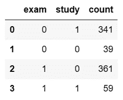
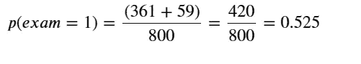
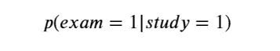
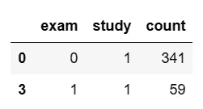
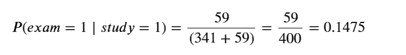
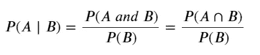
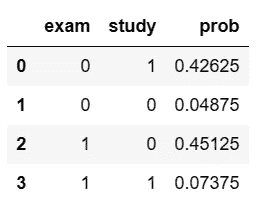
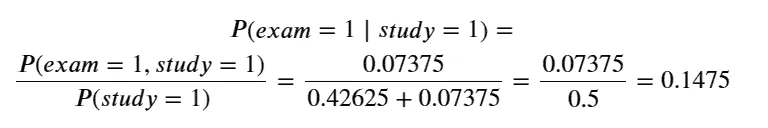
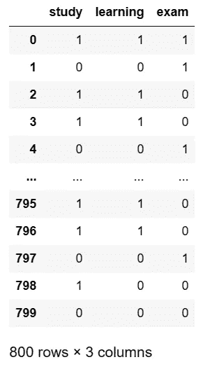
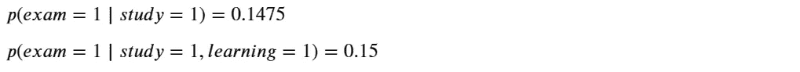

# 如何在 3 行代码中从任何 DataFrame 计算条件概率

> 原文：[`towardsdatascience.com/unlock-the-secret-to-effortlessly-calculating-conditional-probabilities-from-any-dataframe-a232ca71e33c`](https://towardsdatascience.com/unlock-the-secret-to-effortlessly-calculating-conditional-probabilities-from-any-dataframe-a232ca71e33c)

## 学会编写一个简单的 Python 函数，该函数将使用诸如 p(exam=1 | study=1) 的符号来计算条件概率。

[](https://grahamharrison-86487.medium.com/?source=post_page-----a232ca71e33c--------------------------------)[](https://towardsdatascience.com/?source=post_page-----a232ca71e33c--------------------------------) [Graham Harrison](https://grahamharrison-86487.medium.com/?source=post_page-----a232ca71e33c--------------------------------)

·发表于 [Towards Data Science](https://towardsdatascience.com/?source=post_page-----a232ca71e33c--------------------------------) ·阅读时间 6 分钟·2023 年 2 月 10 日

--


图片由 [Dan Cristian Pădureț](https://unsplash.com/@dancristianpaduret?utm_source=unsplash&utm_medium=referral&utm_content=creditCopyText) 提供，来源于 [Unsplash](https://unsplash.com/photos/xJLN32FO7AY?utm_source=unsplash&utm_medium=referral&utm_content=creditCopyText)

# 背景

随着我继续深入探讨因果推断，我达到了一个阶段，在这个阶段我需要构建使用复杂条件概率组合的公式，而代码变得难以阅读和维护。这促使我开发了一种简单的计算条件概率的方法。

> 在本文结束时，你将掌握一个简短的 Python 函数，该函数可以将条件概率直接应用于任何 pandas `DataFrame` 并返回结果。

# 回顾

条件概率是指在另一个事件已经发生的情况下，某个事件发生的概率。符号 𝑃(𝐴∣𝐵) 可以理解为事件 A 的概率（P），给定（|）事件 B 已经发生。

向前迈进一步，符号 𝑃(𝐴∣𝐵,𝐶) 意味着在事件 B 和事件 C 都已经发生的情况下，事件 A 的概率。

# 示例

我们都知道，如果公平的硬币被抛掷两次，得到两个正面的概率是 0.25，因为第一次事件（抛掷第一次硬币并得到正面）的概率是 0.5 乘以第二次事件（抛掷第二次硬币并得到正面）的概率，也是 0.5，即 0.5 x 0.5 = 0.25。

当两个事件完全独立时，简单的乘法法则适用，即第一个硬币抛掷的结果不会影响第二个事件，因此在执行这两个事件之前，两个正面朝上的概率是 0.25。

然而，并不是所有的事件都是独立的，这最好通过一个例子来解释 …

这是一个合成数据的表格，代表了一个虚构的 800 人样本，其中是否学习和是否通过考试都被观察和记录了 …



作者提供的图像

通过考试（exam=1）的概率如下 -



那么如果我们问以下问题会怎样：

其中一个测试对象被随机选中，结果发现他们学习了（study=1）。他们通过考试（exam=1）的概率是多少？

这些概率不是像抛硬币那样独立的，因为我们已经知道所选择的对象学习了。这个问题的答案可以表示如下 -



即，给定 study = 1，exam = 1 的概率是多少？

有两种方法可以计算这个结果：直观方法和概率方法。

# 直观方法

通过查看汇总表中 study = 1 的行，很容易看到有 400 个学习者（341 + 59） -



作者提供的图像

如果我们已经选择了一个学习者，他们必须来自这个样本中的这一部分。在这 400 人中，很容易看出 59 人通过了考试，因此 …



# 数学方法

计算条件概率的公式如下 -



注 - 符号 P(A|B)可以读作 - 条件概率或事件 A 在事件 B“给定”的情况下。

我个人发现这个方法不如第一个解决方案直观，因为我可以很容易地在`DataFrame`中可视化发生的情况，但这种方法确实有一个大优点。如果你只能访问概率而无法访问所有底层数据，那么“直观方法”就不适用了。

请考虑以下内容，这与汇总表相同，但使用的是概率而不是计数 …



作者提供的图像

现在 p(exam=1 | study=1)可以按如下方式计算 -



# Python 函数解决方案

鉴于条件概率的解释，现在的目标是开发一个 Python 函数，可以消除所有的麻烦，并为任何 pandas `DataFrame`进行计算。

我们首先需要一些测试数据。我使用我的`BinaryDataGenerator`类创建了一个合成数据集。如果你想要完整的源代码，请访问这篇文章 …

[](/how-to-generate-synthetic-data-for-any-causal-inference-project-in-less-than-10-lines-of-code-158688a89349?source=post_page-----a232ca71e33c--------------------------------) ## 如何在少于 10 行代码中生成任何因果推断项目的合成数据

### 如果 99% 的人接种了疫苗，1% 的人出现反应，2% 的人得病，你如何生成具有代表性的合成数据？

towardsdatascience.com 

图片来源：作者

# 版本 1：基本函数

使用承诺的“三行代码”实现的最基本版本的函数如下 -

```py
0.1475
```

# 版本 2：基本函数加 LaTeX 输出

然而，我很快就厌倦了所有的 `print` 语句来显示结果，这导致了第二个版本，它可以选择性地输出计算的 LaTeX 表示...



# 版本 3：高级函数

到目前为止，我真的希望有一个最终版本，其中可以直接说 P(exam=1 | study=1) 并获得结果，但我也希望保留 `outcome` 和 `events` 作为可选参数，以便我可以选择使用哪种方法...


# 结论

条件概率在各种统计和机器学习解决方案中非常有用，但从 pandas `DataFrame` 中计算条件概率没有简单、可读和可重复的方法。

本文解释了什么是条件概率，给出了一个示例，并提供了一个 Python 函数的所有源代码，该函数可以接受任何 `DataFrame` 并计算和显示结果。

如果你喜欢这篇文章，你可以通过成为 Medium 会员，每月只需 $5 即可无限访问更多内容，通过 [点击我的推荐链接](https://grahamharrison-86487.medium.com/membership)（如果你通过此链接注册，我将获得一定比例的费用，且对你没有额外费用）。

[](https://grahamharrison-86487.medium.com/membership?source=post_page-----a232ca71e33c--------------------------------) [## 通过我的推荐链接加入 Medium - Graham Harrison

### 阅读 Graham Harrison 的每一个故事（以及 Medium 上的其他成千上万位作者的故事）。提升你的数据知识…

grahamharrison-86487.medium.com](https://grahamharrison-86487.medium.com/membership?source=post_page-----a232ca71e33c--------------------------------)

[订阅我的免费电子邮件，每当我发布新故事时](https://grahamharrison-86487.medium.com/subscribe)。

[快速查看我的以前文章](https://grahamharrison-86487.medium.com/)。

[下载我免费的战略数据驱动决策框架](https://relentless-originator-3199.ck.page/5f4857fd12)。

访问我的数据科学网站 — [数据博客](https://www.the-data-blog.co.uk/)。
