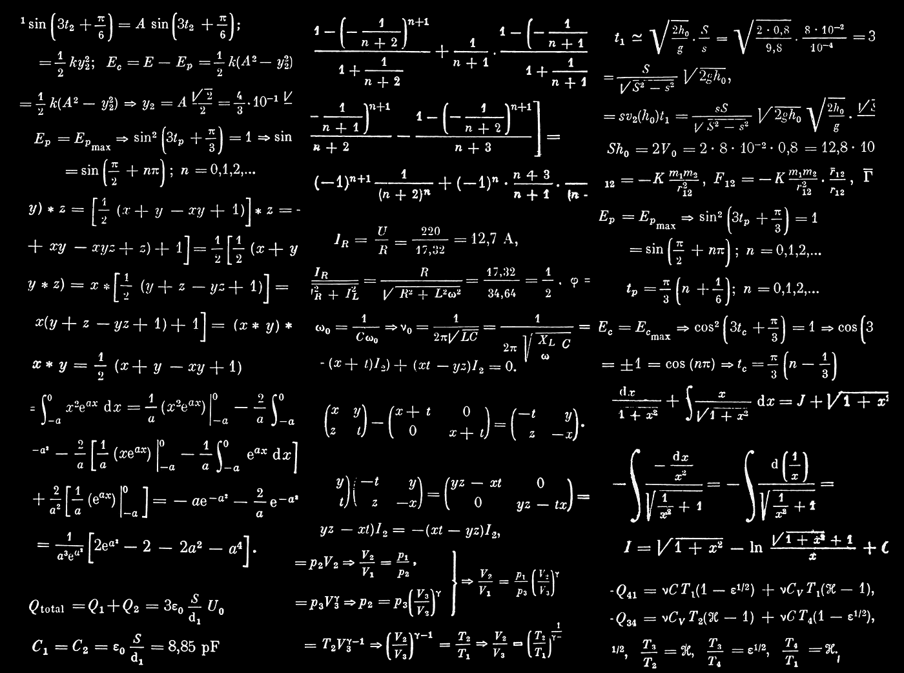

# 如何在 3 行代码中从任何数据框计算条件概率

> 原文：[`towardsdatascience.com/unlock-the-secret-to-effortlessly-calculating-conditional-probabilities-from-any-dataframe-a232ca71e33c?source=collection_archive---------6-----------------------#2023-02-10`](https://towardsdatascience.com/unlock-the-secret-to-effortlessly-calculating-conditional-probabilities-from-any-dataframe-a232ca71e33c?source=collection_archive---------6-----------------------#2023-02-10)

## 学习编写一个简单的 Python 函数，该函数将使用类似 p(exam=1 | study=1) 的符号来计算条件概率。

 [Graham Harrison](https://grahamharrison-86487.medium.com/?source=post_page-----a232ca71e33c--------------------------------)

·

[关注](https://medium.com/m/signin?actionUrl=https%3A%2F%2Fmedium.com%2F_%2Fsubscribe%2Fuser%2Fbd1c93739f33&operation=register&redirect=https%3A%2F%2Ftowardsdatascience.com%2Funlock-the-secret-to-effortlessly-calculating-conditional-probabilities-from-any-dataframe-a232ca71e33c&user=Graham+Harrison&userId=bd1c93739f33&source=post_page-bd1c93739f33----a232ca71e33c---------------------post_header-----------) 发表在 [Towards Data Science](https://towardsdatascience.com/?source=post_page-----a232ca71e33c--------------------------------) ·6 分钟阅读·2023 年 2 月 10 日

--

图片由 [Dan Cristian Pădureț](https://unsplash.com/@dancristianpaduret?utm_source=unsplash&utm_medium=referral&utm_content=creditCopyText) 提供，[Unsplash](https://unsplash.com/photos/xJLN32FO7AY?utm_source=unsplash&utm_medium=referral&utm_content=creditCopyText)

# 背景

随着我不断深入因果推断的研究，我达到了一个阶段，需要能够构建使用复杂条件概率组合的公式，而代码开始变得难以阅读和维护。这促使我开发了一种简单的方法来计算条件概率。

> 在本文结束时，你将掌握一个简短的 Python 函数，该函数可以直接应用条件概率到任何 pandas `DataFrame` 上，并返回结果。

# 回顾

条件概率是指在另一个事件已经发生的前提下，某个事件发生的概率。符号 𝑃(𝐴∣𝐵) 可以理解为事件 A 的概率 (P)，条件是事件 B 已经发生 (|)。

将此进一步扩展，符号 𝑃(𝐴∣𝐵,𝐶) 表示事件 A 的概率，前提是事件 B 和事件 C 都已经发生。

# 示例
