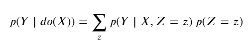
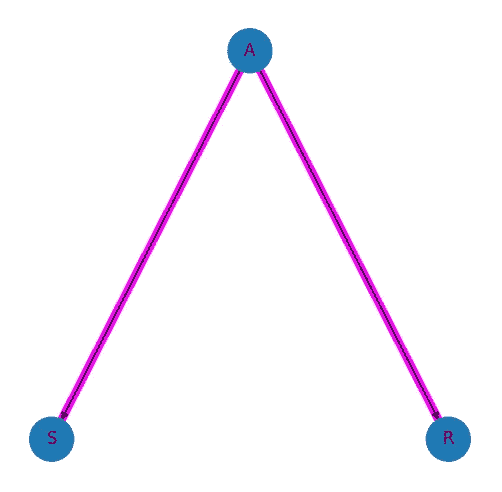
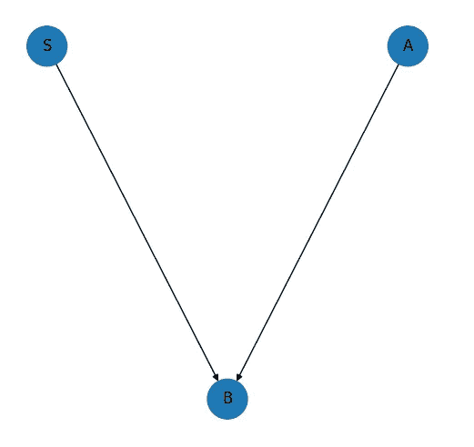

# 解锁因果推断的秘密，通过有向无环图的硕士班

> 原文：[`towardsdatascience.com/unlock-the-secrets-of-causal-inference-with-a-master-class-in-directed-acyclic-graphs-f2d3b40738e`](https://towardsdatascience.com/unlock-the-secrets-of-causal-inference-with-a-master-class-in-directed-acyclic-graphs-f2d3b40738e)

## 从基础到更高级方面的有向无环图的逐步解释

 [Graham Harrison](https://grahamharrison-86487.medium.com/?source=post_page-----f2d3b40738e--------------------------------)

·发表于 [Towards Data Science](https://towardsdatascience.com/?source=post_page-----f2d3b40738e--------------------------------) ·阅读时长 36 分钟·2023 年 4 月 6 日

--

[Caleb Jones](https://unsplash.com/es/@gcalebjones?utm_source=unsplash&utm_medium=referral&utm_content=creditCopyText)拍摄的照片，来自[Unsplash](https://unsplash.com/s/photos/paths?utm_source=unsplash&utm_medium=referral&utm_content=creditCopyText)

# 目标

在花费大量时间研究因果推断之后，我开始意识到自己对有向无环图（DAGs）的理解不够全面，这影响了我将其应用于解决实际问题的能力。

本文的目标是记录我的学习历程，并分享你需要了解的关于 DAG 的一切，以便将你对因果推断的理解提升到一个新的水平。

# 背景

我想从提出因果推断的定义开始—

> **因果推断是推理的过程，是应用从变量之间的因果关系中得出的结论，同时考虑潜在的混杂因素和偏差。**

这确实很复杂，但它概括了关键点—

1.  这是一种因果关系的研究。

1.  关键在于得出可以应用于解决实际问题的结论。

1.  任何偏差或“混杂”都必须考虑在内并进行补偿。

超越定义，有一句古老的格言是“相关性不等于因果性”，这引出了“那究竟是什么？”的问题

事实证明，因果关系不能仅从一组数据中推断或计算出来。数据需要扩展和补充额外的信息，以提出、可视化和表示因果关系，一种常见的方法是使用“有向无环图”。

# 一个简单的 DAG

从最基本的层面上看，DAG 确实非常简单。下面的例子表示服用药物“D”和恢复“R”之间的拟议关系，箭头表明服用药物对恢复有因果影响……

作者提供的图片

这个 DAG 说明了两个关键术语——“treatment”（处理）和“outcome”（结果）。

+   “treatment”（在这个例子中是药物）指的是被研究或操控的行动或干预，以确定其对结果的影响。

+   “outcome”（在这个例子中是恢复）指的是用来测量处理效果的变量。

在传统机器学习术语中，处理是自变量，结果是因变量。

当我第一次研究 DAG 时，我对术语感到困惑，因为“treatment”（处理）和“outcome”（结果）通常是医学术语，我曾怀疑 DAG 和因果推断是否仅限于医学领域。事实并非如此；因果推断可以应用于任何领域中的变量集合，我怀疑医学听起来的术语被借用是因为药物和治疗试验与因果推断有显著的重叠。

# 一个带有“混杂因素”的 DAG

作者提供的图片

这个例子增加了另一个因素——“G”或性别。箭头显示性别（G）对药物（D）和恢复（R）都有因果影响。解释如下——

+   更多的男性比女性决定服用药物，因此“性别”导致“药物”。

+   女性的自然恢复率比男性更高，因此“性别”导致“恢复”。

这使事情变得复杂。目标是确定服用药物对恢复的真实效果，但性别影响两者，因此仅仅观察试验中有多少人服用了药物并恢复，并不能提供准确的答案。

这种混合效应称为“混杂”，造成这种效应的变量称为“混杂因素”，必须“去混杂”以确定药物的真实效果……

# 随机对照试验、分层、条件控制、控制变量和协变量

为了计算 D 对 R 的真实效果，我们需要隔离并去除 G 的影响。有几种方法可以应用，包括以下几种……

# 随机对照试验

如果这是一个正在规划的未来试验，一种经过验证的方法是创建一个“随机对照试验”（RCT）。这将涉及将药物试验对象随机分配到一个接受药物的实验组和一个接受安慰剂的对照组中。（注意：重要的是不要告诉受试者他们被分配到哪个组）。

由于受试者被随机分配，现在不可能是性别在造成或影响谁接受药物。这有效地“抹去了” “G”和“D”之间的因果关系，这意味着药物对恢复的任何观察到的效果现在将与混杂效应无关 -

作者提供的图片

然而，如果研究基于历史试验，数据已经被记录，那么随机分配测试组和对照组就已经为时已晚，不能使用 RCT。

RCT 的另一个大挑战是，如果所研究的“治疗”是吸烟或肥胖，就不能随机分配到吸烟组或肥胖组，因此显然存在限制 RCT 适用性的道德和伦理界限。

幸运的是，还有其他方法可以应用于历史的观察数据，以缓解这些挑战，包括“分层”…

# 分层

在我们的例子中，如果受试者是 60%男性和 40%女性，则药物“D”对恢复“R”的影响可以如下隔离和计算 -

1.  计算男性的恢复情况，并乘以 0.6（因为 60%是男性）。

1.  计算女性的恢复情况，并乘以 0.4（因为 40%是女性）。

1.  将这两个数字加在一起，这显示了药物对恢复的影响，与性别的影响无关。

不幸的是，如果有大量变量，分层可能变得非常复杂。例如，如果有 10 个变量，每个变量有 10 个可能的值，我们将已经达到 100 个层次，而如果一个或多个变量是连续的，排列将很快变得压倒性。

# 条件化

使用因果推断技术可以模拟现实世界中的随机对照试验对历史和观察数据的影响。

这听起来像魔法，但它使用了多年来由包括犹太·佩尔在内的专家们建立、定义和描述的成熟数学技术，佩尔在学术期刊和书籍中发表了他的发现，包括以下内容 -

+   《为何之书》

+   统计中的因果推断

这种 RCT 的“模拟”是通过应用所谓的**反向调整**来**条件**于所有的**混杂因素**即影响处理和结果的变量来实现的。

这是针对一个单一处理变量（X）和一个单一结果变量（Y），以及一个单一混杂因素（Z）的**反向调整公式** -

作者提供的图片

关键点是，左侧描述了一个“干预”，例如“让每个人都服用药物”（do(X)），这在右侧被重新编写并用纯粹的观察数据来表示。

数学的详细解释超出了本文的范围，但如果你想查看一个完全的示例，请查看这个链接……

 ## 解锁因果推断的力量：数据科学家的后门理解指南……

### 一个使用 Python 和 pgmpy 库的完整回门调整公式示例，包括完整的……

towardsdatascience.com

# 控制

控制是一种统计技术，指的是保持一个变量的值不变，以免它对试验结果产生不利影响。

例如，在一个研究维生素 D 对警觉性影响的试验中，试验设计者可能会决定给所有参与者提供关于饮食、进食时间、咖啡因摄入、屏幕时间、运动和酒精摄入的具体指示，以试图隔离真实效果。

目前文献中似乎存在一些健康的分歧。统计学家通常似乎会控制他们能控制的所有因素，即使在随机对照试验中也是如此。

因果推断的支持者，尤其是 Judea Pearl，似乎主张只控制（或条件化）那些具体干扰治疗效果对结果影响的变量。

我确实同意 Pearl 的观点，即在实验中控制所有因素可能并非必要，甚至可能对结果产生意想不到的负面影响。我的理由是，在随机对照试验中，诸如咖啡因摄入等外部因素由于参与者的随机选择而在各组内外会趋于平均化，我们又怎么能确定参与者确实遵循了指示呢？

此外，因果推断理论确实强烈主张识别一个最佳变量集进行条件设置，并相应地限制调整（更多内容稍后讨论）。

# 协变量

协变量的一个定义是**影响响应变量但在研究中不感兴趣的变量**。请考虑以下 DAG……

图片由作者提供

H 代表学习时间，是处理因素，E 代表考试成绩（结果），这是唯一感兴趣的变量。

然而，一位领域专家指出，先前的学生能力也会影响考试成绩，尽管它与研究无关，他们还是将其引入模型中。

在这种情况下，G 满足协变量的定义。

我个人观察到，协变量似乎是一个在统计和观察分析中使用的概念，因此受到统计学家的青睐，而因果推断的支持者可能倾向于认为，除非 G 是 H 和 E 的混杂因素，否则不需要将其引入模型中。

请注意，我包含了**协变量**的解释以求完整，因为在文献中经常提到协变量，并且理解协变量与混杂因素之间的区别是很重要的。

# 回顾

到目前为止，我们已经定义了因果推断，探索了 DAG 的目的，并解释了混杂因素、RCTs、分层、条件和控制。

RCTs、分层和控制都是与实际试验相关的统计技术。

条件化是一种因果推断技术，可以应用于历史性观察数据，以得出关于治疗对结果的影响的结论，即使原始调查的参与者并非随机选择。

这立即打开了机会之门，因为现在有很多历史性的观察数据集可以用来探索因果关系，这只是因果推断和有向无环图众多好处之一。

掌握了这些理解和术语后，我们现在准备探索 DAGs 的更复杂方面，这些方面在现有的书籍和在线文章中通常没有明确解释……

# 路径

路径是一个难以掌握的主题，因为这些概念和技术相互关联，使得学习的顺序变得困难。在下面的部分中，我将从高层次介绍路径，然后深入探讨分叉、链条和碰撞体的模式。

这引出了条件、阻断和解阻的讨论，只有在学习如何对整个 DAG 进行条件设置以消除混杂效应并得出因果结论之后，这些概念才有意义。

让我们从考虑以下有向无环图（DAG）开始……

图片由作者提供

这比药物、性别、恢复的例子要复杂，但一旦关键概念**路径**被解读出来，就会变得相当简单。我在文献中未能找到“路径”的明确定义，所以这是我的定义……

**路径是一系列因果链路，在因果图中连接了处理和结果。**

因此，在上述 DAG 中，一条单独的路径是 𝑋←𝑍1→𝑍3→𝑌。

起初这可能不直观，因为我们习惯于将自然路径从左到右流动地思考，比如 𝐴→𝐵→𝐶，但我希望你能暂时抛开这种直观的看法。在因果图中，箭头的方向并不重要，任何从 X 到 Y 的边的集合都构成了一条路径。

一旦完全理解了这一点，DAG 与扁平形式如 𝐷←𝐺→𝑅 的区别就会变得清晰。

有向无环图是描述一组因果关系的可视化，它包含多个路径。每当现有文献检查扁平形式时，它是在查看必须与其他路径一起存在以描述所有因果关系的单一路径。

为了说明这个解释，以下是示例 DAG 中所有“扁平化”路径的列表……

1) 𝑋←𝑍1→𝑍3→𝑌

2) 𝑋←𝑍1→𝑍3←𝑍2→𝑌

3) 𝑋←𝑍3→𝑌

4) 𝑋←𝑍3←𝑍2→𝑌

5) 𝑋→𝑊←𝑌

相对于扁平视图的另一种可视化方法是突出显示 DAG 中每条路径的单独副本，如下例所示……

图片由作者提供

一旦这些关键点被解读，路径就不难理解。我常常想，现有书籍和文章的作者是否在他们的领域如此专家，以至于忽略了从初学者角度建立理解的感觉。

这样可视化 DAG 和路径确实帮助我建立了对下一阶段至关重要的理解……

# 交汇点、分叉、链条和碰撞器

在任何“扁平化”的路径中，将会有一系列表示感兴趣变量的节点，每个节点通过单向箭头或边连接到下一个节点，例如 𝐴→𝐵→𝐶。

任何有两个箭头的节点必须位于路径的中间而不是两端，这称为**交汇点**。

交汇点只能是三种模式之一——分叉、链条或碰撞器，这些将在下面的部分中探讨和解释。

# 分叉

分叉是熟悉的，因为药物（D）、康复（R）和性别（G）之间的关系遵循这一模式。以下是一个在 DAG 中可视化的示例以及一个扁平路径的示例……

图片由作者提供

1) 𝑆←𝐴→𝑅

这个示例表示了儿童年龄（A）、鞋码（S）和阅读能力（R）之间的因果关系。它被称为“分叉”，因为路径从中间变量 A 处分叉成两个不同的方向。

因果推断的规则认为 S 到 R 通过 A 的路径是**开放的**，即关于 S 的信息可以通过混杂因子 A 传递到 R，除非我们在 A 上“条件化”，否则路径是**封闭的**。

这个规则让我困惑了很长时间，但通过查看一个实际的例子和一些数据，这个问题很容易解释。

以下合成数据集包含了 1000 个 S、A 和 R 的数据点……

图片由作者提供

合成数据集反映了 DAG 中描述的因果关系，因此我们可以预期年龄与鞋码之间以及年龄与阅读能力之间的相关性。以下是两个可视化这些关联的散点图……

图片由作者提供

确实，它们的相关性很强，r 值很高。但当我们查看鞋码与阅读能力之间的相关性时，会发生什么呢？虽然没有因果关系，但我们仍会看到相关性，因为年龄对这两个变量产生了**混淆**效应。

这显然使得可以从年龄预测阅读能力，在传统的预测机器学习算法中这可能有效，但没有因果关系，因为买大号鞋子不会让任何人更聪明，反之亦然。

下一步是理解在年龄上**加条件**会发生什么。加条件（和控制）实际上是将我们加条件的变量保持或冻结在一个单一值或狭窄范围或层次上。不同之处在于，加条件通过数学公式实现效果，而控制是在实际试验中隔离一个感兴趣的组。

因此，鞋码与年龄之间的关联可以通过考虑所有年龄段的值来进行无条件检查，或者通过选择一个单一年龄值来进行加条件检查，这可以很容易地可视化如下……

图片来源：作者

第一张图没有条件限制（即显示所有年龄段），我们可以看到 S 和 R 之间有很强的相关性。

第二张图的年龄条件限制在 8 岁儿童上。显然，在单一年龄段内，鞋码与阅读能力之间没有相关性，回归线平坦，r 值很低。

在未加条件的图表中，可以使用回归线选择一个鞋码并读取来预测阅读能力，这就是**未阻塞**一词所指的。

在加条件的图表中，无法使用回归线进行预测，因为该线是水平的，这就是**阻塞**一词所指的。

**在分叉的中间节点上加条件会阻塞路径，而不加条件则保持路径开放。**

在图表中添加了一个附加特性来帮助理解这种效应。在未加条件的图表中，单独的年龄已被着色，以便可以区分，并且每个年龄的回归线以浅灰色添加。

考虑到这些视觉特征，立即显而易见，对于任何单一年龄段，回归线是平坦的，相关性较低，但当考虑所有年龄段时，综合相关性较高。

这种现象被称为**辛普森悖论**，这是文献中使用的另一个术语，难以用语言解释，但用图示理解很容易。

# 链

链是两个节点之间通过中介的最简单模式。第一个变量对中介有因果影响，中介对最终变量有因果影响。

请注意，交汇点中的中间节点被称为**中介**节点，但链中的中间节点也可以称为**中介**节点，因为它调解了源节点（第一个）和目标节点（第三个）之间的变化。

这是一个**链**的示例，其中 D 代表药物使用，B 代表患者血压，R 代表患者恢复。因果箭头表示药物导致血压变化，而血压变化又导致恢复……

图片由作者提供

1) 𝐷→𝐵→𝑅

对链进行条件限制的效果与对分叉进行条件限制完全相同，即条件限制会阻断路径，而不进行条件限制则会使路径畅通。

通过可视化示例来理解这一违反直觉的说法要容易得多，因此让我们从一个合成数据集开始，表示 DAG 中的因果关系……

图片由作者提供

如果我们查看药物与血压以及血压与恢复之间的散点图，我们会期待看到一种相关性……

图片由作者提供

第一个散点图显示，药物使用量越多，血压越低；第二个图则显示血压越低，恢复率越高，因此合成数据准确地表示了 DAG 中的因果关系。

现在让我们来看一下对中间变量（血压）进行条件限制的影响……

图片由作者提供

在没有条件限制的情况下，D 与 R 之间有很强的相关性，而当我们对 B 的单一值（或在连续变量的情况下，对一个狭窄的层次）进行条件限制时，相关性较低。

散点图显示，若在链中的中间节点不进行条件限制，则路径不会被阻断，而对其进行条件限制则会阻断路径。

如果这仍然有些违反直觉，可以考虑一下对特定血压值（例如 6.5）进行条件限制的情况，这意味着 B 被固定且不能改变。这就意味着 D 和 R 的变化不会很大，D 和 R 的任何变化都是由于数据中的误差项而非任何因果效应。

解决违反直觉的最终方法是查看未进行条件限制的散点图中点的颜色。每种颜色代表 B（血压）的固定值，就像在分叉例子中一样，很容易看到单一颜色的回归线是平的，但当所有数据点作为一个整体来看时，有很强的相关性。

> **对链中的中间节点进行条件限制会阻断并关闭路径，而不对其进行条件限制则使路径保持畅通。**

一个值得关注的最后一点是，数据中的模式对于分叉和链条是相同的，这加强了因果关系不能仅仅通过数据确定的观点。实际上，需要一个 DAG 来补充数据，以揭示因果关系，这支持了因果关系倡导者的观点，而非纯粹统计学家的观点。

# 碰撞器

这个第三种也是最终的模式是碰撞器，它与分叉和链条有一些有趣的不同 …

作者提供的图像

1) 𝑆→𝐵←𝐴

这个 DAG 表示了一个假设中的专注于体育的学院中的因果关系 -

1.  体育能力（S）导致学生奖学金的授予（B）。

1.  学术能力（A）也导致学生奖学金的授予（B）。

与其他模式一样，我们将从一组数据开始，以可视化和理解包含碰撞器的路径内部发生的情况 …

作者提供的图像

体育能力与奖学金、学术能力与奖学金的散点图如下 …

作者提供的图像

两种能力与学院给予奖学金的得分之间有相当强的相关性。现在让我们可视化留下注间变量（奖学金）不条件化或固定并条件化的影响 …

作者提供的图像

最大的惊讶是，留下一个碰撞器不进行条件化意味着路径是**阻塞的**，这可以通过考虑体育能力与学术能力之间的低相关性来证明。

在现实世界中，这并不令人惊讶。拥有高水平体育能力的人是不寻常的，而具有高学术能力的人也不常见，而在这两个领域都具有卓越能力的人非常稀有，这就是为什么相关性是平坦的。

然而，如果我们通过固定一个特定的奖学金得分来进行条件化，我们实际上解开了一个自然被阻塞的路径，这也是容易解释的。如果我们查看一个特定的奖学金得分，而这个人的体育能力较低，他们很可能具有较高的学术能力，反之亦然。

> **在碰撞器中的中间节点条件化会解开并打开路径，而不进行条件化则会使路径被阻塞和关闭。**

# 回顾

回顾一下，DAG 将有多个路径连接处理节点和结果，每个路径可以通过突出显示 DAG 的副本或以“扁平化”形式 𝐴→𝐵→𝐶 来可视化。

在路径中，如果我们排除处理和结果节点，每个剩下的节点将有两个箭头，每个箭头连接到一个节点，这种 3 个节点和两个方向箭头的模式称为交点。

每个交点可以用仅有的 3 种模式之一连接——分叉、链条或碰撞器，了解每种模式的条件化效果（或不条件化）是很重要的。

直观地了解对每种模式进行条件化的效果是一个复杂的话题，但本质上只需要记住 3 条规则——

+   在分叉处对中间节点进行条件化会阻断路径，而不对其进行条件化则会使路径保持畅通。

+   在链中的中间节点进行条件化会阻断并关闭路径，而不对其进行条件化则会使路径保持畅通。

+   在碰撞器中对中间节点进行条件化会解除阻断并打开路径，而不对其进行条件化则会使路径保持阻断状态。

这些都是理解如何对复杂的 DAG 进行调整和条件化所需的基础知识，并了解其重要性，但在继续之前，还有一个话题需要探讨…

# 阻断和解除复杂路径的阻断

考虑以下路径…

𝑋←𝑍1←𝑍3←𝑍2→𝑌

X 是治疗，Y 是结果。其他节点中，Z1 和 Z3 是链，而 Z2 是分叉。问题是——“我们如何阻断这条路径？”

答案是，在任何路径中，无论它多长或多复杂，只要一个节点被阻断，那么整条路径就会被阻断。

这意味着，仅对 Z2 进行条件化会阻断路径，因为它是一个分叉，但仅对 Z1 或 Z2 进行条件化也会阻断路径，因为它们是链。实际上，任何组合都有效——{Z1}、{Z2}、{Z3}、{Z1, Z2}、{Z1, Z3}、{Z2, Z3}、{Z1, Z2, Z3}。

阻断路径的最佳调整集是包含单个节点的任何一个集合，即我们应该尽量少地进行条件化以阻断路径。

现在已经解释了如何阻断复杂路径，你一定会问——“为什么我要费心去阻断一条路径？”答案将在下一节中揭示，并展示有向无环图的全部威力。

# 回门调整

我们已经探讨了混杂变量如何导致治疗对结果的孤立效应丧失，因为混杂变量的效应与该孤立效应混合在一起。

我们还看到，对混杂变量进行条件化可以解决这个问题，使治疗的真实效应得以恢复…

由作者提供的图像

1) 𝑋←𝑍→𝑌

在这个 DAG 中，如果我们对 Z 进行条件化，它会阻断该路径，从而达到预期效果。被突出显示的路径称为回门路径，而从 X 到 Y 的直接路径称为前门路径。

对回门路径的一个常识性定义是“从治疗到结果的任何包含分叉的路径”，但我找到了由 Judea Pearl 提出的更正式的定义…

**回门路径是从 X 到 Y 的任何一条路径，只要它以指向 X 的箭头开始。** 《为什么这本书》，Pearl 和 Mackensie，第 158 页

同样，任何不是回门路径的路径都是前门路径，因此…

**前门路径是从 X 到 Y 的任何一条路径，只要它以指向 X 的箭头开始。**

# 有效调整集

一个有效的调整集是任何一个节点集合，当对这些节点进行条件化时，可以去除混淆效应并隔离处理对结果的影响，在任何给定的有向无环图（DAG）中，这些有效的调整集可以是零个、一个或多个。

这里是 Judea Pearl 提出的定义有效调整集的一组规则……

1.  我们阻断 X 和 Y 之间的所有虚假路径。

1.  我们保持从 X 到 Y 的所有有向路径不变。

1.  我们不创建新的虚假路径。

(Pearl, Glymour 和 Jewell，《统计中的因果推断》，第 61 页)

我认为这个定义不令人满意，因为“虚假”的含义对我来说不清楚，并且我也不喜欢“未扰动”，因为我认为有时需要扰动路径以产生期望的效果（稍后会详细说明）。

鉴于我对官方定义的不满，这里是我自己的提议……

> **一个有效的调整集是任何一个节点集合，当对这些节点进行条件化时，可以阻断并关闭处理和结果之间的所有后门路径，同时保留至少一条前门路径未被阻断且开放。**

## 一个实例

为了测试我的定义并提供一个实例，我们回到之前的一个复杂有向无环图的例子……

图片由作者提供

1) 𝑋←𝑍1→𝑍3→𝑌

2) 𝑋←𝑍1→𝑍3←𝑍2→𝑌

3) 𝑋←𝑍3→𝑌

4) 𝑋←𝑍3←𝑍2→𝑌

5) 𝑋→𝑊←𝑌

使用 Pearl 的定义，很容易看出前四条路径是后门路径，而最后一条路径是前门路径，只需查看指向或离开 X 的箭头方向即可。

为了找到有效的调整集，我们需要确定**任何节点集合，当对这些节点进行条件化时，可以阻断并关闭处理和结果之间的所有后门路径，同时保留至少一条前门路径未被阻断且开放。**

Z3 是一个明显的条件节点，因为它明显混淆了处理 X 和结果 Y。对 Z3 进行条件化可以阻断并且消除路径 3 的混淆。

到目前为止，一切顺利，但这是我长期无法理解的部分，而且现有文献也没有很好地解释这一点……

在路径 3 中，Z3 是一个分叉点，但在 M 形的路径 2 中，Z3 是一个碰撞点，我们知道对碰撞点进行条件化会解除阻断并开放路径。因此，我们已经阻断了 Z3 来关闭并阻断路径 3，但这样做的结果是我们无意中解除阻断并开放了路径 2！对 Z3 进行条件化解决了一个问题，但产生了另一个问题。

然而，这个问题很容易解决。除了对 Z3 进行条件化外，对 Z1 进行条件化也会阻断路径 2。逻辑如下—

+   Z3 必须保持条件化以阻断路径 3，但这样做会打开路径 2。

+   Z1 可以额外进行条件化，这样可以阻断路径 2，因为 Z1 是这条路径中的一个分叉点。

整个 DAG 的解决方案几乎完成，但还差一点……

当然，对 Z1 进行条件化是有效的，但我们也可以对 Z2 进行条件化，实际上对 Z1 和 Z2 都进行条件化也有效，因此 {Z1}、{Z2} 和 {Z1, Z2} 都是同样有效的调整集。

拼图的最后一部分是路径 5 是唯一的正向路径。我们之前的定义告诉我们，必须保留至少一条正向路径不被阻塞，但 W 是一个碰撞器，如果不进行条件化，它将阻塞并关闭路径 5。

因此，我们还必须对 W 进行条件化，以打开 X 到 Y 的正向路径。请注意，这也是我不同意使用“未扰动”一词的原因，因为在这个例子中，路径 5 必须被扰动以确保 X 到 Y 有一条开放的正向路径。

如果解释有些复杂，可视化会更容易。以下是 DAG 的所有有效调整集……

图片由作者提供

选择任意一个这三个调整集将正确调整和条件化 DAG，通过阻止并关闭所有 4 条反向路径，保留单一的正向路径不被阻塞。

调整集中的最终概念是**最优调整集**，即选择有效调整集中节点最少的一个。

在这个例子中，最优调整集可以是 {Z1, Z3, W} 或 {Z2, Z3, W}。第 3 个有效调整集 {Z1, Z2, Z3, W} 不是最优的，因为它涉及的调整数量多于最小数量。

## 为什么这很重要？

去混淆对于识别 X 和 Y 的孤立因果效应至关重要，同时去除了任何混淆变量的混合效应。

例如，我们想知道服用药物对恢复的真实影响，无论药物的性别偏好如何，或运动对学术表现的真实影响，无论潜在的体能如何，唯一的办法是构建 DAG，并在正确的节点集上进行条件化或控制。

我的观点是，识别最优调整集在条件化历史观测数据或控制现实世界试验中的因素时同样有效。

如果应调整的因素未被调整，结果将会错误；如果调整了过多因素，则数学计算将因条件设置而变得不必要地复杂，或实验和试验在实际中变得繁琐和笨重。

# 行话破解

在将所有内容汇总并应用于解决一些示例问题之前，还有一些因果术语需要解析……

# d-分离

**d-分离**的一个正式定义如下：

如果一个路径 p 被一组条件节点 Z 阻塞，当且仅当

1.  p 包含一个节点链 A -> B -> C 或叉 A <- B -> C，使得中间节点 B 在 Z 中（即被条件化），或

1.  p 包含一个碰撞器 A -> B <- C，使得碰撞节点 B 不在 Z 中，且 B 的任何后代不在 Z 中。

统计中的因果推断，Pearl、Glymour 和 Jewell，第 46 页

语言最初难以解读，但结合上述对叉、链、碰撞器、条件等的解释和示例，可能更直接的定义是……

> **d-分离是应用一组条件节点到路径上，使其被阻塞的行为。**

正式定义中唯一新的部分是**且 B 的后代不在 Z 中。**但这很容易解释。

考虑以下有向无环图……

作者提供的图片

在这个有向无环图 (DAG) 中，Z1 是路径 X -> Z1 <- Y 上的一个碰撞点，因此对 Z1 进行条件化会解锁并打开该路径，而不对 Z1 进行条件化则会使路径保持封闭。

**且 B 的后代不在 Z 中** 的陈述意味着，对 Z2 进行条件化（或不条件化）与对 Z1 进行操作的效果完全相同，打开路径 X -> Z1 <- Y 的有效节点集是 {Z1}、{Z2}。

这个额外的条件很难可视化和理顺，因此我采纳了这样的方式，鉴于描述作者的资历，并且也认识到它的使用可能是稀少的。碰撞点是三种模式中最不寻常的，而碰撞点的后代则更加不寻常。

但值得注意的是，文献中的许多示例确实包含了碰撞点的后代，因此要注意！

# d-连接

**d-连接** 是 d-分离的对立面。我在文献中没有看到正式的定义，但逆转 d-分离的定义会得到以下结果 -

路径 p 只有在条件节点集 Z 的影响下才能被解锁，当且仅当

1.  p 包含一个节点链 A -> B -> C 或者一个分叉 A <- B -> C，条件是中间节点 B 不在 Z 中（即，没有进行条件化），或者

1.  p 包含一个碰撞点 A -> B <- C，使得碰撞节点 B 在 Z 中，或者 B 的后代在 Z 中。

更简单、非正式的定义可能是

> **d-连接是应用一组条件节点到路径上，使其被解锁的行为。**

请注意，条件节点集可以是空集 {}，实际上，除非路径包含碰撞点，否则将是空集。

# 关于 d-分离和 d-连接的说明

我的观点是，d-分离和 d-连接非常复杂，它们单独存在并没有实际意义。最终目标是确定一个有效的调整集或最佳调整集，以便对正确的节点集进行条件化，从而隔离处理对结果的影响。

我提供了一个解释，因为文献中使用了这些术语，因此理解它们的含义有助于阅读文献，但我的重点在于调整集。

# 无条件依赖、无条件独立、条件依赖和条件独立

这四个术语在文献中常被使用，通常没有明确的解释。这些是我的定义 -

+   **无条件依赖：** 特定路径自然是未被阻塞和开放的，没有任何条件化。

+   **无条件独立：** 特定路径自然是被阻塞和封闭的，没有任何条件化。

+   **条件依赖性：**一个特定的路径在进行条件化后是开放的，没有被阻塞。

+   **条件独立性：**一个特定的路径在进行条件化后被阻塞且关闭。

**依赖性**意味着结果依赖于治疗，即治疗值的变化会改变结果值。

**独立性**意味着结果不依赖于治疗，即治疗值的变化不会改变结果值。

# 外生变量与内生变量

文献中还有两个常用的术语，通过可视化容易理解。考虑以下 DAG……

作者提供的图像

浅蓝色节点是**外生变量**，深蓝色节点是**内生变量**。

**外生变量**的正式定义可能是：

> **模型外部的变量，即我们选择不解释它们是如何产生的变量，不论出于何种原因。**

更简单地说，外生节点没有输入，只有输出，即它们没有任何原因，但它们会导致其他变量发生变化。

内生节点则相反，它们确实有内部“系统”中的输入或原因。

在文献中，常见的结构因果模型使用 U 来表示外生变量，V 来表示内生变量，如下所示……

+   V = {Z, W, U, X, Y}

+   U = {Uz, Uu, Uw, Ux, Uy}

# 未观察到的混杂因素

未观察到的混杂因素通常在因果图上表示为“U”节点，但不应与**外生变量**混淆。

> **未观察到的混杂因素是一个同时影响治疗和结果的变量，但未在分析中测量或包含该变量**。

一个例子可能是我们怀疑性别影响了药物的摄取和效果，但在分析中未测量性别。

有几种因果技术可以用来考虑未观察到的混杂因素，但这些超出了本文的范围。

# 将所有内容结合起来，并用一些实际例子进行说明

现在已经涵盖了理解绝大多数有向无环图所需的所有技术，因此是时候利用这些知识来测试并分析一些 DAG 了。

这里是一种解决 DAG 和识别最佳调整集的方法……

1.  研究 DAG 并识别治疗与结果之间的所有路径。

1.  将路径分为后门路径（箭头指向治疗）和前门路径（箭头指向结果）。

1.  前门路径（通常只有一条）不需要条件化，除非它包含碰撞点，在这种情况下将碰撞点添加到条件化节点集合中。

1.  每条后门路径都需要通过选择路径上的节点中的叉或链来进行条件化。将这些节点添加到条件化节点集合中。

1.  考虑你所选择的节点，以确保它们符合以下标准 — a. 所有的后门路径都已经被阻断和关闭。b. 至少有一条前门路径保持开放或未被阻断。

1.  如果有多个调整集满足第 4 步的标准，则选择节点数量最少的一个。

通过遵循这种方法论，你将能够从任何有向无环图中识别出最优调整集。

以下示例应用了这种方法论，并为每个示例提供了解决方案和解释。

# 示例 1

图片来源：作者

1) 𝑋→𝐴→𝑌

让我们从一个简单的开始。没有后门路径，且唯一的前门路径是 X -> A -> Y，这条路径未被阻断，因此不需要任何条件处理（即，最优调整集是空集{}）。

# 示例 2

图片来源：作者

1) 𝑋←𝐴→𝐵←𝐷→𝐸→𝑌

2) 𝑋→𝐸→𝑌

这个需要多一些思考。有一条后门路径（路径 1）和一条前门路径（路径 2）。前门路径 2 没有被阻断，因此不需要条件处理以保持有效和开放。后门路径 1 在 B 处有一个碰撞点，因此自然被阻断，也不需要任何操作。

总结一下，所有的后门路径自然被阻断，前门路径自然被打开，因此最优调整集仍然是空集{}。

故事并没有就此结束。需要注意的是，节点 C 可以被条件处理，这不会造成任何伤害，因为它不影响任何东西。

同样，A 处的分叉也可以进行条件处理，这将进一步阻断后门路径 1，除了未条件处理的碰撞点 B 的阻断，再次使有向无环图得到正确调整。

这说明了调整或条件化有向无环图以获得“正确”结果的方式可能不止一种，并且统计学家和因果推断专家在决定如何行动时可能会有所不同。

Pearl 引用了一位领先的统计学家（匿名）的说法：“避免对某些观察到的协变量进行条件处理……是不科学的临时措施”（《为什么的书》，Pearl 和 Mackenzie，第 160 页），但通过这个例子可以反驳条件处理一切的粗暴方法。

对 B 或 C 进行条件处理会打开并解锁后门路径 1，而这需要被关闭（B 因为它是一个碰撞点，C 因为它是碰撞点的后代）。如果对 B 或 C 进行条件处理或控制，那么通过额外控制 A 或 E（或两者）可以重新阻断路径 1，但这可能导致复杂的数学问题（对于条件处理）或难以调节的现实试验（对于控制）。

我的偏好是使用历史和观察数据，优化调整集，简化数学计算并使用条件处理，但其他人可能有不同的看法。

# 示例 3

图片来源：作者

1) 𝑋←𝐵→𝑌

2) 𝑋→𝐴←𝐵→𝑌

3) 𝑋→𝑌

路径 3 是一个开放的、未被阻断的前门路径，不需要任何条件处理。

有两个后门路径。路径 1 包含一个分叉点 B，必须对其进行条件调整。路径 2 包含一个碰撞点 A，因此路径 2 是无条件阻塞的。

最佳调整集是 {B}，但需要注意的是，对 {A, B} 进行条件调整也会有效，因为尽管对 A 的条件调整会解锁碰撞点，但路径 2 会被对 B 的条件调整所阻塞。

统计解决方案可能是对 A 和 B 进行控制，但最佳因果解决方案是仅对 B 进行条件调整。

# 示例 4

图片由作者提供

1) 𝑋→𝐴←𝑌

这个例子有点狡猾！它是示例 1 的变体，具有单一的前门路径，但这次 A 是一个碰撞点。

由于 A 是一个碰撞点，它将关闭并阻塞前门路径 1，因此完全有效的解决方案是对 A 进行条件调整。

然而，B 是 A 的后代，并且回顾上述 d-分离的定义，即…

1.  p 包含节点链 A -> B -> C 或分叉 A <- B -> C，使得中间节点 B 在 Z 中（即被条件调整），或

1.  p 包含碰撞点 A -> B <- C，使得碰撞节点 B 不在 Z 中，并且 B 的任何后代不在 Z 中。

… 对 B 的条件调整与对 A 的条件调整效果完全相同。

因此，有效的调整集是 {A}、{B} 和 {A, B}，最佳调整集是 {A} 或 {B}。

# 示例 5

图片由作者提供

1) 𝐺→𝑄→𝐻

2) 𝐺→𝑄←𝐼→𝐻

3) 𝐺→𝐻

在这个 DAG 中，节点代表以下变量 -

+   G : 性别（处理）

+   H : 招聘（结果）

+   Q : 资格

+   I : 收入

目标是捕捉性别（处理）对招聘（结果）的因果关系。此外，DAG 提出了性别对资格的因果影响和收入对资格及招聘的因果影响。

看起来非常复杂，但实际上很容易解决。没有箭头指向处理 G，因此没有后门路径。所有 3 条路径都是前门路径，均开放且未被阻塞，无需任何条件调整，因此最佳调整集是 {}。

注意，虽然有几个节点集可以进行条件调整以产生正确结果，但不采取任何行动是最佳选择。例如，对 I 进行条件调整会阻塞路径 2，但其他前门路径仍会保持开放。

这是因果推断视角选择不采取行动以保持数学简单的另一实例，而统计视角可能选择对某些变量进行控制。

# 示例 6

图片由作者提供

这个例子看起来更复杂，但实际上非常简单。浅蓝色节点是**外生**变量，即我们选择不解释其原因的变量。

这可能引发“为什么要包含这些变量？”的问题。在前面关于分叉的部分中，鞋码在模型中的定义如下（其中鞋码 = S 和年龄 = A） -

𝑆 = 2 + 2 + 𝜖

这个例子显示了年龄是外生变量——没有关于年龄的“原因”的解释，但年龄对模型至关重要，因为鞋码是从年龄派生的。

这也有助于说明外生变量和未观察到的混杂因素之间的区别。在因果模型中，我们会有外生变量的数据，但我们没有未观察到的混杂因素的数据。

在计算有效和最佳调整集时，未观察到的混杂因素应始终排除在考虑范围之外，因为我们没有关于它们的数据，因此无法对其进行条件化。

外生变量可以被纳入条件化集合。在年龄和鞋码的例子中，对年龄进行条件化是非常合理的，因为它干扰了鞋码和学术能力，而在这个例子中，条件化外生变量不会造成任何损害，但也不会是最佳选择，因为它们都没有出现在唯一的路径（路径 1）中。

那么，这个例子的最佳调整集是什么呢？

假设 Z 是处理变量，Y 是结果变量，则没有回门路径，只有 1 条前门路径。该路径被碰撞器 W 阻挡，可以通过对 W 进行条件化来开放和解锁它。

还应该注意，U 是碰撞器 W 的后代，因此对 U 进行条件化将与对 W 进行条件化有相同的效果。

因此，有 3 个有效调整集——{W}、{U} 和 {W, U}，其中前两个是最佳的。

# 示例 7

作者提供的图像

1) 𝑍→𝑊←𝑋→𝑌

2) 𝑍←𝑇→𝑌

示例 7 是示例 6 的扩展。这次添加了一个回门路径，在处理 Z 和结果 Y 之间的 T 处有一个分叉。

必须对 T 进行条件化以阻断回门路径 2，因此有两个最佳调整集——{T, W} 和 {T, U}。

# 示例 8

作者提供的图像

1) 𝑇←𝐴→𝐼

2) 𝑇→𝐼

3) 𝑇←𝐸→𝐼

4) 𝑇←𝐵→𝐼

5) 𝑇←𝑆→𝐼

6) 𝑇←𝑈→𝐼

这个 DAG 中的节点表示以下变量…

+   T : 培训

+   I : 收入

+   A : 年龄

+   E : 教育

+   B : 福利

+   S : 单身

+   U : 大学学位

这个 DAG 表示培训课程 T 对收入 I 的因果影响，同时也表示年龄、教育、福利、单身（与已婚相比）和大学学位都对个人是否参加培训和收入造成了混杂。

有 5 条回门路径（路径 1、3、4、5 和 6）和 1 条前门路径（路径 2）。

前门路径是开放的和未被阻塞的，无需任何条件化处理。

所有的回门路径都有一个分叉，并且没有中间节点出现在多个回门路径上，因此所有的分叉都需要进行条件化处理。

最佳（也是唯一的）调整集是 {A, E, B, S, U}，其中 U = 大学学位，不能与未观察到的混杂因素混淆。

# 示例 9

作者提供的图像

这个 DAG 中的节点表示以下变量…

+   A : 父母吸烟

+   B : 儿童哮喘

+   C : 潜在过敏体质（未观察到）

+   D : 父母哮喘

+   E : 慢性支气管炎

+   F : 性别

+   G : 社会经济状态

+   X : 吸烟

+   Y : 哮喘

这是一个极其复杂的 DAG。总共有 20 条路径可以通过 DAG 进行可视化，如下所示…

作者提供的图片

这里有一条正向路径（倒数第二行中的 X 到 Y 的直接路径），其他 19 条都是反向路径。

共有 64 种可能的节点组合可以成功条件化 DAG，例如{D}、{D, B}、{D, B, E}等，且每个可能的节点组合需要测试 20 条不同路径，总共 1,280 种排列组合。

准确地说，有两个有效的调整集——{A, B, E, F, G} 和 {A, B, D, E, F, G}，其中第一个是最佳调整集…

作者提供的图片

人工检查所有 1,280 种排列组合并确保所有的反向路径都被阻塞且正向路径未被阻塞将是非常困难且耗时的。

你可能已经从所有 DAG 的图片和我处理过的例子中猜到，我开发了一个代码库，它为我完成了所有绘图、计算和路径查找工作。

本文记录了我在开发该库时所学到的一切，未来的文章将展示、探索和解释该代码库的工作原理以及如何用几行 Python 代码自动化你可能想知道的关于 DAG 的一切。

# 结论

对于任何坚持读完这样一篇长且详细的文章的人，我感谢你的坚持！我的大多数文章相对较短且集中，包含所有源代码，而这篇正好相反！

然而，这篇文章详细说明了我希望在开始我的因果推断之旅时了解的所有关于有向无环图的内容。

有许多文章和书籍，但在我看来，它们未能击中要点。它们通常直接跳入公式和方程，而忽略了需要通过示例和可视化来解释的基础知识和基本概念。

捕捉因果关系的 DAG 是因果推断中最重要的部分之一。如果没有对它们的全面理解，其余部分都没有意义，需要理解它们是什么、为什么存在以及它们如何帮助识别调整集，这是在应用反向（或正向）调整之前必须了解的关键问题。

# 联系并保持联系…

如果你喜欢这篇文章，你可以通过[点击我的推荐链接](https://grahamharrison-86487.medium.com/membership)以每月仅 5 美元成为 Medium 会员，获得对更多成千上万篇文章的无限访问（如果你通过此链接注册，我将获得部分费用，对你没有额外费用）。

[## 通过我的推荐链接加入 Medium - Graham Harrison](https://grahamharrison-86487.medium.com/membership?source=post_page-----f2d3b40738e--------------------------------)

### 阅读 Graham Harrison 的每个故事（以及 Medium 上的成千上万的其他作家）。提升你对数据的知识……

[grahamharrison-86487.medium.com](https://grahamharrison-86487.medium.com/membership?source=post_page-----f2d3b40738e--------------------------------)

……或通过以下方式连接……

[订阅免费电子邮件，获取我发布的新故事](https://grahamharrison-86487.medium.com/subscribe)。

[快速查看我之前的文章](https://grahamharrison-86487.medium.com/)。

[下载我的免费战略数据驱动决策框架](https://relentless-originator-3199.ck.page/5f4857fd12)。

访问我的数据科学网站——[数据博客](https://www.the-data-blog.co.uk/)。

# 进一步阅读

如果你想了解更多关于因果推断的内容，这本精彩的书籍是一个很好的起点……

[## 为什么的书：因果关系的新科学（企鹅科学）](https://amzn.to/3iCVF8r?source=post_page-----f2d3b40738e--------------------------------)

### 购买《为什么的书：因果关系的新科学（企鹅科学）》01 由 Pearl, Judea, Mackenzie, Dana (ISBN……

[amzn.to](https://amzn.to/3iCVF8r?source=post_page-----f2d3b40738e--------------------------------)

本书对一些关键概念进行了更深入和详细的探讨……

[## 统计中的因果推断：入门](https://amzn.to/3WblFp1?source=post_page-----f2d3b40738e--------------------------------)

### 购买《统计中的因果推断：入门》 1 由 Pearl, Judea, Glymour, Madelyn, Jewell, Nicholas P. (ISBN……

[amzn.to](https://amzn.to/3WblFp1?source=post_page-----f2d3b40738e--------------------------------)

注：这些是附属链接，如果你通过这些链接购买，我将获得一小部分佣金，对你没有额外费用。
