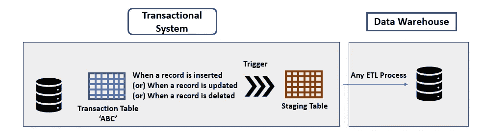
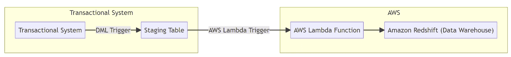
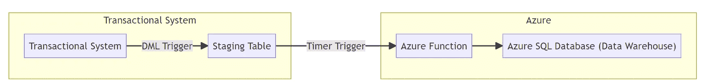

# 解锁数据访问：在没有 API 端点的情况下利用触发器

> 原文：[`towardsdatascience.com/unlocking-data-access-harnessing-triggers-in-the-absence-of-api-endpoints-4b5c8b775058`](https://towardsdatascience.com/unlocking-data-access-harnessing-triggers-in-the-absence-of-api-endpoints-4b5c8b775058)

## 使用触发器填补数据拼图中的缺失部分

[](https://mg-subha.medium.com/?source=post_page-----4b5c8b775058--------------------------------)[](https://towardsdatascience.com/?source=post_page-----4b5c8b775058--------------------------------) [Subha Ganapathi](https://mg-subha.medium.com/?source=post_page-----4b5c8b775058--------------------------------)

·发表在 [Towards Data Science](https://towardsdatascience.com/?source=post_page-----4b5c8b775058--------------------------------) ·10 分钟阅读·2023 年 6 月 9 日

--


图片来源：[Pixabay](https://www.pexels.com/photo/abstract-accuracy-accurate-aim-262438/) 来自 [Pexels](https://www.pexels.com/)

# 概述

**你是否曾经遇到过这样的场景：你尝试通过 API 从一个事务系统（如电子商务系统）中提取一个关键数据点，却发现通过提供的端点无法访问所需的信息？如果是这样，请继续阅读，了解如何有效地利用触发器应对这一挑战。**

在没有端点的情况下，我们可能会认为直接从事务表中查询数据是一种选择**。** 直接查询事务表绝对不是一个好主意，因为它可能会对事务系统的性能和稳定性产生重大影响，特别是当涉及到电子商务系统时。当你尝试从实时的电子商务系统中查询数据时，很可能会对用户体验产生不利影响（想象一下在亚马逊购物时需要等待 5 到 10 分钟才能检索到购物车！）。

除此之外，在事务系统的表上运行作业可能会干扰正在进行的事务。如果你考虑在数据仓库表中每天进行“截断-加载”操作，这个问题变得更加重要。此外，上述选项不足以成为可持续的解决方案，因为它不支持平滑的历史数据加载，假设事务系统中定期进行数据清除。

因此，自动化从事务系统中提取数据并将其无缝集成到数据仓库中，同时又不会对系统产生不利影响，就变得至关重要。在这种情况下，数据库触发器提供了一种有效的解决方案。但在我们深入探讨解决方案之前，这里是对触发器的简介。

# 触发器简介

## 数据库触发器

数据库触发器是一个经常被忽视的概念，自关系型数据库诞生以来就存在。数据库触发器是一个函数，每当在源表（在此情况下为事务表）中创建、更新（或甚至删除）记录时，都会触发该函数。

数据库触发器分为两种类型：DDL 触发器和 DML 触发器。

DDL 触发器在你希望获取数据库结构更改通知时设置。例如，当你希望在每次定义新模式时得到警报，或者在创建或删除新表时得到通知时，DDL 触发器非常有用。因此，命名为 DDL（数据定义语言）触发器。

DML 触发器在插入、删除或更新新记录时被触发。换句话说，你会在系统中发生数据操作更改时得到通知。**一个重要的点是，数据库触发器可以被编程来不仅仅提醒你发生了变化，还可以执行如将数据移动到暂存表等操作。**

## **专用触发器**

现代云平台如 Azure 和 AWS 提供了作为其服务一部分的专用触发器。需要注意的是，**专用触发器与数据库触发器并不相同**。数据库触发器是特定于数据库管理系统（DBMS）的，并且在数据库内部运行，而专用触发器具有更广泛的应用范围。它们可以用于各种自动化任务、事件驱动的工作流，并且能够在云服务及其组件之间创建流畅的集成。

以下是 AWS 作为其云服务的一部分提供的一些专用触发器：

+   AWS Lambda 触发器：这些触发器帮助在指定事件发生时启动一个 lambda 函数。换句话说，你可以指定一个事件来触发 lambda 函数。事件可以是 AWS 内部的，也可以是外部的。内部事件可能与 AWS 服务相关，如 Amazon S3、Amazon DynamoDB 流或 Amazon Kinesis。外部事件可能来自 AWS 外部事务系统的数据库触发器或 IoT 事件。

+   Amazon S3 事件通知：这些触发器使你能够在 S3 存储桶被创建、修改或删除时获得通知。它们使用 AWS 的简单通知服务（SNS）来广播消息。

+   AWS Cloudwatch Events：如果你使用过独立的关系数据库，如 Microsoft SQL Server 和 SQL Server Management Studio (SSMS)，你可能使用过 SQL Server Agent 来通知用户作业失败。Cloudwatch 特定于 AWS，不仅用于通知用户作业失败，还用于触发 Lambda 函数和响应事件。CloudWatch Event 和 Lambda Trigger 之间的重要区别在于，虽然 Lambda triggers 指的是 AWS Lambda 响应事件的能力，但 CloudWatch Events 是一个更广泛的事件管理服务，可以处理来自 Lambda 以外来源的事件。顺便提一下，虽然 SQL Server Agent 需要配置邮件服务器，但 Cloudwatch 没有这样的要求。

以下是 Azure 作为其云服务的一部分提供的一些专用触发器：

+   Blob Trigger——Azure blob 类似于 AWS 提供的 S3 buckets。类似于 Amazon S3 通知可以用来获取 S3 buckets 中变化的警报，blob triggers 可以用来获取 Azure blob 容器中变化的通知。

+   Azure Function Trigger——这些是 Azure 相当于 AWS Lambda Function Triggers 的功能。这些触发器可以用来响应 Azure 内部或外部事件来启动 Azure 函数，例如外部事务数据库触发器、HTTP 请求或 IoT 事件中心流。Azure 函数也可以基于预定义的时间表通过 Timer Trigger 启动。

现在我们已经看过了 AWS 和 Azure 提供的不同类型的数据库触发器和专用触发器，让我们回顾一下之前提到的使用案例，以刷新你的记忆。允许我提醒你一下我们之前提到的使用案例。

> 使用案例——你在事务系统的表中看到了一些你需要用于报告指标的数据点，但这些数据点没有通过你的事务系统的 API 端点提供。因此，你无法使用 Python 或 Java 编写脚本通过 API 获取这些数据点。你也不能在你的事务系统上直接查询，因为这可能会对其性能产生负面影响。

为了解决这个问题，我们使用数据库触发器和云服务提供的专用触发器的组合。以下是一个高级别的方法：



**高级别方法（作者提供的图片）**

**前提条件：** 识别你事务系统数据库中那些通过 API 端点无法访问的数据表。一旦识别出这些表，按照以下步骤操作——

**步骤 1：** 创建一个与事务表具有相同列的暂存表。**确保从源事务表中没有任何额外的约束被复制过来。** 这样可以尽可能减少对事务系统的影响。此外，还需添加一列来指示所执行的操作，例如插入、更新、删除。假设你的事务表的后端是 SQL Server，以下是需要创建的事务表和暂存表的示例。

```py
-- Sample transactional table
CREATE TABLE Pricing_info (
    ProductID INT PRIMARY KEY,
    ProductName VARCHAR(50),
    Quantity INT,
    UnitPrice DECIMAL(10, 2),
    OperationDate DATE
);
```

暂存表将是：

```py
-- Create a Staging table without constraints
CREATE TABLE StagingTable_pricing (
    ProductID INT,
    ProductName VARCHAR(50),
    Quantity INT,
    UnitPrice DECIMAL(10, 2),
    OperationDate DATE,
    OperationType VARCHAR(10)
);
```

**步骤 2：** 直接在‘Pricing_info’表（主要事务表）上设置 DML 触发器。

触发器需要被编程，以便每当有新记录插入，或现有记录被更新或删除时，数据将被插入到暂存表中。使用暂存表的目的是避免对主要事务表施加不必要的压力。

以下是相同内容的示例。如下面所示，DML 触发器的两个最重要方面（实际上，任何数据库触发器）是触发事件和触发时间。触发事件指的是应该激活触发器的操作。在这种情况下，我们关注所有 DML 事件，即插入、删除和更新在事务表‘Pricing_info’中。触发时间指的是触发器是在事件发生之前还是之后执行活动。对于我们的用例，显然是‘After’事件触发器。我们创建三个触发器，每个 DML 事件一个。

以下是插入的触发器：

```py
-- Create the trigger
CREATE TRIGGER TransactionTrigger_pricing_Insert
ON Pricing_info
--Trigger Event
AFTER INSERT
AS
BEGIN
    -- Insert new records into the staging table
    INSERT INTO StagingTable_pricing (ID, Column1, Column2, OperationType)
    SELECT ID, Column1, Column2, 'INSERT'
    FROM inserted
END;
```

接下来是更新的触发器：

```py
-- Create the trigger
CREATE TRIGGER TransactionTrigger_pricing_update
ON Pricing_info
--Trigger Event
AFTER UPDATE
AS
BEGIN

    -- Insert record in the staging table with the data that was updated
    INSERT INTO StagingTable_pricing (ID, Column1, Column2, OperationType)
    SELECT ID, Column1, Column2, 'UPDATE'
    FROM inserted
END;
```

最后，我们创建删除的触发器：

```py
-- Create the trigger
CREATE TRIGGER TransactionTrigger_pricing_Delete
ON Pricing_info
--Trigger Event
AFTER DELETE
AS
BEGIN
    -- Insert record in the staging table with the data that was deleted
    INSERT INTO StagingTable_pricing (ID, Column1, Column2, OperationType)
    SELECT ID, Column1, Column2, 'DELETE'
    FROM deleted
END;
```

**步骤 3：** 现在让我们进入设置专用触发器的部分。

**步骤 3a。如果你的数据仓库托管在 AWS 中，** 以下是可以实施的高级解决方案。



**AWS 实现思路 — 使用 DML 触发器和 AWS Lambda（图片由作者提供）**

在上述解决方案中，源是事务系统。我们在事务系统的数据库中设置一个数据库 DML 触发器。每当一个新记录进入事务数据库表时，触发器会将新数据插入到事务数据库中的暂存表中。根据计划（使用 AWS Cloudwatch 事件），Lambda 触发器会触发一个 Lambda 函数，将数据从暂存表抓取到数据仓库（Redshift）中的表中。让我们看看其中的步骤。

**前提条件：** 在数据仓库中创建一个表以保存事务信息。

步骤 3a.（i）创建一个 AWS Lambda 函数：编写 Lambda 函数的代码，该函数将从暂存表中获取记录，并将其插入到数据仓库表中，同时进行任何必要的计算。

步骤 3b. (ii) 创建 AWS Lambda Trigger — 使用 AWS Cloudwatch 服务安排 Lambda 触发器在夜间时间表中运行 Lambda 函数（建议在业务时间之外或事务系统活动较低的时间段运行 Lambda 函数）。

步骤 3c. (iii) 使用 EventBridge 设置事件映射 — 配置 Lambda 触发器为事件，以便触发器基于指定的事件条件启动。一个典型的场景是按计划触发 Lambda — 每天一次。

AWS 提供了有关设置 Lambda 函数的详细文档，因此不在本文的讨论范围内。

**步骤 3b. 如果你的数据仓库托管在 Azure**，我们可以使用 Azure Functions 和定时触发器或 Azure 提供的 Azure Function Trigger。



**Azure 实现方案 — 使用 DML 触发器和 Azure Functions（作者提供的图片）**

在这种情况下，使用定时触发器是一个好主意。当定时触发器激活时，它将运行 Azure Function，然后从暂存表中提取新记录/更新记录/删除记录。（注意：暂存表将具有一个额外的标志变量，指示记录是插入、更新还是删除。）

以下是要遵循的步骤：

步骤 3b. (i)：创建 Azure Function：这类似于设置 AWS Lambda 函数。设置代码以从暂存表中提取记录并将其插入数据仓库表中，同时进行任何必要的计算。

步骤 3b. (ii)：设置 Azure Function Trigger：使用 Azure Function 应用程序，设置一个定时触发器并指定计划和时间戳参数名称。

步骤 3b. (iii)：使用 Azure Eventgrid 设置事件映射：配置触发器将事件数据映射到 Azure Function 中的适当参数。这使得触发器能够基于指定的事件条件启动。

## 处理历史数据加载

到目前为止，我们讨论的解决方案是针对新数据进入感兴趣的数据点。那么我们如何处理历史数据呢？

为此，一个选项是创建暂存表时执行‘CREATE TABLE AS SELECT’（SQL Server 中的 SELECT * INTO）。这将创建一个预先填充了事务表中当前所有数据的暂存表。其余步骤将保持不变（根据具体情况通过专用的 Azure 定时触发器/AWS Lambda 触发器）。

另一个选项是对事务表中的所有记录执行‘EMPTY UPDATE’。以下是基于当前示例/用例的空更新示例 —

```py
UPDATE TABLE Pricing_info SET OperationDate=OperationDate
```

如你所见，没有任何值被更新。然而，从数据库的角度来看，所有记录都已更新，因此触发器将为所有更新触发。因此，所有数据都会到达暂存表。**请注意，这不是推荐的方法**，因为它可能由于生成的更新和撤销语句的数量而拖累交易系统。此外，整个更新操作期间事务表也将被锁定，其他进程无法使用，从而影响交易系统。如果你的事务表非常小，这种方法是可以使用的。

# 结语

在本文中，我们探索了触发器在捕获通过交易系统的标准 API 端点无法轻易获得的关键数据点方面的多样性。

这些有助于确保数据完整性，并消除对人工干预的需求。因此，它们也确保了关键报告指标的有效纳入。这里提供的解决方案是异步的，以确保交易系统不会受到任何负担。如果你的交易系统没有大量流量（或）没有直接被终端用户应用程序使用，那么它可以设置为同步过程。在这种情况下，lambda 或 Azure 函数需要将触发事件设置为交易数据库的暂存表。同时，还需要提供适当的数据库连接信息。

希望这篇文章对你有帮助。如果你有任何问题，请在评论中告诉我。祝学习愉快！
