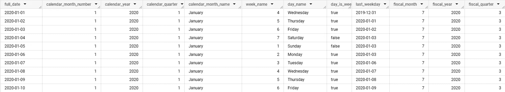
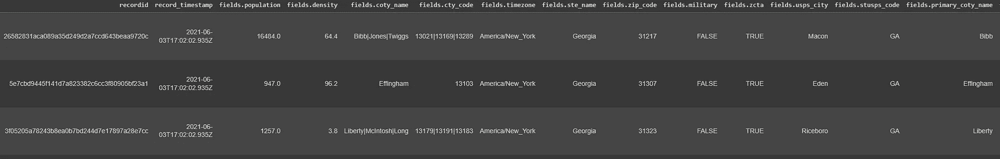
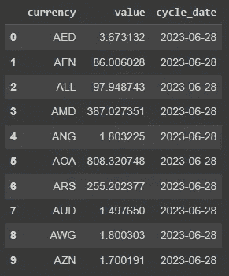

# 解锁数据建模成功：3 个必须拥有的上下文表

> 原文：[`towardsdatascience.com/unlocking-data-modeling-success-3-must-have-contextual-tables-7b9ae9d4ad84?source=collection_archive---------17-----------------------#2023-07-06`](https://towardsdatascience.com/unlocking-data-modeling-success-3-must-have-contextual-tables-7b9ae9d4ad84?source=collection_archive---------17-----------------------#2023-07-06)

## 以及如何免费获取有价值的数据

[](https://medium.com/@mattgazzano?source=post_page-----7b9ae9d4ad84--------------------------------)[](https://towardsdatascience.com/?source=post_page-----7b9ae9d4ad84--------------------------------) [Matthew Gazzano](https://medium.com/@mattgazzano?source=post_page-----7b9ae9d4ad84--------------------------------)

·

[关注](https://medium.com/m/signin?actionUrl=https%3A%2F%2Fmedium.com%2F_%2Fsubscribe%2Fuser%2F626000912ce9&operation=register&redirect=https%3A%2F%2Ftowardsdatascience.com%2Funlocking-data-modeling-success-3-must-have-contextual-tables-7b9ae9d4ad84&user=Matthew+Gazzano&userId=626000912ce9&source=post_page-626000912ce9----7b9ae9d4ad84---------------------post_header-----------) 发表在 [Towards Data Science](https://towardsdatascience.com/?source=post_page-----7b9ae9d4ad84--------------------------------) ·6 分钟阅读·2023 年 7 月 6 日[](https://medium.com/m/signin?actionUrl=https%3A%2F%2Fmedium.com%2F_%2Fvote%2Ftowards-data-science%2F7b9ae9d4ad84&operation=register&redirect=https%3A%2F%2Ftowardsdatascience.com%2Funlocking-data-modeling-success-3-must-have-contextual-tables-7b9ae9d4ad84&user=Matthew+Gazzano&userId=626000912ce9&source=-----7b9ae9d4ad84---------------------clap_footer-----------)

--

[](https://medium.com/m/signin?actionUrl=https%3A%2F%2Fmedium.com%2F_%2Fbookmark%2Fp%2F7b9ae9d4ad84&operation=register&redirect=https%3A%2F%2Ftowardsdatascience.com%2Funlocking-data-modeling-success-3-must-have-contextual-tables-7b9ae9d4ad84&source=-----7b9ae9d4ad84---------------------bookmark_footer-----------)

[照片](https://unsplash.com/photos/PkbZahEG2Ng) 由 [Tobias Fischer](https://unsplash.com/@tofi) 提供，来自 [Unsplash](https://unsplash.com/)

数据建模对于分析团队来说可能是一项具有挑战性的任务。由于每个组织都有独特的业务实体，为每个表找到合适的结构和粒度成为了开放式问题。但不用担心！你需要的一些数据是简单的、免费的，并且占用存储空间极小。

当你的数据完全建模后，你可以看到以下好处：

+   查询生成较为简单，因此更易于阅读。

+   报告更具可扩展性，减少了硬编码的值。

+   你可能花费更少的时间去寻找正确的数据所在位置。

下面是可以简化你团队分析的 3 个通用表，你可以将它们以维度模型的形式导入到你的数据仓库中。

# 🗓️日期维度

***时间序列报告***

如果你曾经需要展示某个商业指标在特定时间点的情况，这几乎是一个必备的表。例如，你可能会被问到：

+   ***“FY23 的销售情况如何？”***

+   ***你能每天展示客户流失情况吗？***

管理层常常从时间序列的角度寻求洞察，提出类似“x 的增长或缩小情况如何？”的问题。日期维度可以根据不同的日期属性灵活分析各种指标。

大多数日期维度表可以通过在数据仓库中直接使用[DDL](https://www.javatpoint.com/ddl-commands-in-sql)语句和日期函数来创建。

在下面的示例中，我使用 BigQuery SQL 来完成这项任务：

```py
CREATE OR REPLACE TABLE `your_project.your_dataset.date_dimension` AS

SELECT
full_date
, EXTRACT(MONTH FROM full_date) AS calendar_month_number
, EXTRACT(YEAR FROM full_date) AS calendar_year
, EXTRACT(QUARTER FROM full_date) AS calendar_quarter
, FORMAT_DATE('%B', full_date) AS calendar_month_name
, EXTRACT(DAYOFWEEK FROM full_date) AS week_name
, FORMAT_DATE('%A', full_date) AS day_name
, CASE
    WHEN EXTRACT(DAYOFWEEK FROM full_date) BETWEEN 2 AND 6
      THEN TRUE
    ELSE FALSE
  END AS day_is_weekday
, CASE
    WHEN EXTRACT(DAYOFWEEK FROM full_date) = 1 THEN DATE_SUB(full_date, INTERVAL 2 DAY) -- Sunday
    WHEN EXTRACT(DAYOFWEEK FROM full_date) = 2 THEN DATE_SUB(full_date, INTERVAL 3 DAY) -- Monday
    ELSE DATE_SUB(full_date, INTERVAL 1 DAY)
  END AS last_weekday
, EXTRACT(MONTH FROM DATE_ADD(full_date, INTERVAL 6 MONTH)) AS fiscal_month
, EXTRACT(YEAR FROM DATE_ADD(full_date, INTERVAL 6 MONTH)) AS fiscal_year
, EXTRACT(QUARTER FROM DATE_ADD(full_date, INTERVAL 6 MONTH)) AS fiscal_quarter
FROM UNNEST(GENERATE_DATE_ARRAY('2020-01-01', '2050-12-31', INTERVAL 1 DAY)) AS full_date
```



**拆解一下：**

+   我们从[GENERATE_DATE_ARRAY](https://cloud.google.com/bigquery/docs/reference/standard-sql/array_functions#generate_date_array)函数开始，它返回一个你指定范围内的日期数组。然后我们使用 UNNEST 函数将数组的每个元素拆分成单独的行，就像在标准数据库表中一样。BigQuery 中的数组使用一行来显示多个值。

+   然后利用我们从展开数组生成的***full_date***列（表示日期格式为*XXXX-MM-DD*），我们可以使用许多 BigQuery 的[EXTRACT](https://cloud.google.com/bigquery/docs/reference/standard-sql/date_functions#extract)函数将***full_date***的各个部分（如月份、日期、年份等）提取到不同的字段中。

+   [FORMAT_DATE](https://cloud.google.com/bigquery/docs/reference/standard-sql/date_functions#format_date)函数的作用类似于 EXTRACT，但提供了更多自定义日期值显示的选项。你可以使用[Google 文档中描述的特殊格式元素](https://cloud.google.com/bigquery/docs/reference/standard-sql/format-elements#format_elements_date_time)来了解每个‘%’字符的意义。

+   我们还使用[DATE_SUB](https://cloud.google.com/bigquery/docs/reference/standard-sql/date_functions#date_sub)函数，它只是从一个日期中减去一个值。这用于获取相关的财政年度，在这个示例中，财政年度将从每个日历年的七月开始。在这个函数中，我们指定一个数量（1 - 无限）和间隔（日、月、年等）。

# 🌎邮政编码维度

***地理空间报告***

如果你被要求创建热图可视化或进行一般的地理空间分析，邮政编码维度将对你的团队非常有用。这让你可以通过纬度和经度可视化元素，按县名、时区聚合，并附加人口数据以进行基准比较。

邮政编码维度是客户表的一个很好的补充表。通过将邮政编码字段作为连接键，你可以附加有意义的上下文数据到你的客户基础所在的位置及其背后的模式。

[Opendatasoft](https://data.opendatasoft.com/pages/home/) 提供各种免费的数据集以及开源 API 连接器。适用于此用例的一个数据集是 [***US Zip Codes Points- United States of America***](https://data.opendatasoft.com/explore/dataset/georef-united-states-of-america-zc-point%40public/table/?rows=) 数据集。在此链接中，移到‘API’标签，配置 URL 以检索 JSON 数据。

几行 Python 代码后，我们可以输出如下 Pandas DataFrame：

```py
import requests
import pandas as pd

url = 'https://data.opendatasoft.com/api/records/1.0/search/?dataset=georef-united-states-of-america-zc-point%40public&q=&facet=stusps_code&facet=ste_name&facet=coty_name&facet=cty_code&facet=zip'
response = requests.get(url)
zips = response.json()

pd.json_normalize(zips,record_path='records')
```



**分解如下：**

+   在这里，我使用 [requests](https://requests.readthedocs.io/en/latest/) 库从‘url’变量中显示的 URL 检索数据，该 URL 在 opendatasoft 网站的 API 标签上生成。

+   使用 Pandas，我使用 ***json_normalize*** 函数将 JSON 数据转换为 Pandas DataFrame。

# 📈FX Rates 事实表

***用于财务分析***

拥有国际客户的组织通常需要将所有交易转换为基础货币以进行财务报告。为了理解外汇汇率波动如何影响收入，每日 FX 汇率数据流是回答这个问题的绝佳解决方案。

当与时间序列报告配合使用时，这也特别具有影响力，可以在特定销售时间附加汇率。在我构建显示客户收入随时间变化的仪表板的经验中，业务用户总是欣赏能够在日期轴上切换不同的外汇汇率值。FX Rates 表格可以让你完成所有这些操作。

[Exchangerate.host](https://exchangerate.host/#/docs) 是另一个开源网站，允许你连接到每日 FX 汇率数据流。以下是如何检索数据的示例 — 更多信息请参见 [他们的文档](https://exchangerate.host/#/docs)：

```py
import requests
import pandas as pd
from datetime import date

#Retrieve the latest dates from the exchangerate api
url = 'https://api.exchangerate.host/latest?base=USD'
response = requests.get(url)
rates = response.json()

# Convert JSON list to a Pandas Dataframe & preview
rates_list = list(rates['rates'].items())
df_rates = pd.DataFrame(rates_list, columns=['currency', 'value'])
df_rates['cycle_date'] = date.today()
df_rates.head(10)
```



**分解如下：**

+   在这里，我们使用 requests 库从‘url’变量中指定的 URL 检索数据，数据形式为 Python 字典。请注意 — 我根据文档编辑了 URL，以指定基础货币为 USD。即，所有汇率将与其 USD 汇率相关。

+   接下来，我们将 Python 字典转换为列表，从‘rates’键中获取数据。

```py
rates_list = list(rates['rates'].items())
```

+   然后，我们将列表转换为 Pandas DataFrame 并标记列标题：

```py
df_rates = pd.DataFrame(rates_list, columns=['currency', 'value'])
```

+   最后，添加了一个名为 ‘cycle_date’ 的列，表示 ETL 周期日期，标示数据何时被摄取到数据仓库中。

# 结论

将公开可用的数据纳入数据仓库可以为分析团队提供即时价值，且付出最少的努力。这些表格以及任何适当建模的数据实体，消除了仅在像 Power BI 或 Tableau 这样的 BI 工具中存储嵌套业务逻辑的需求。它们提供了一个集中化的数据源，多个分析师可以参考并在报告中一致应用。这种数据建模的整体方法使团队能够轻松扩展报告，确保对源数据的透明度。通过利用这些类型的上下文表格，您的组织可以简化分析流程，消除报告中的不一致，并实现更高水平的数据驱动决策。

> 祝建模愉快！
