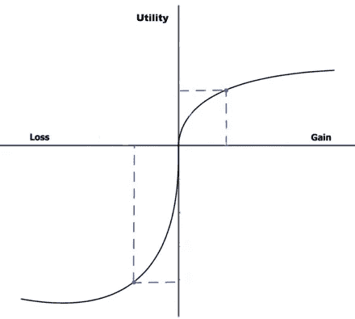
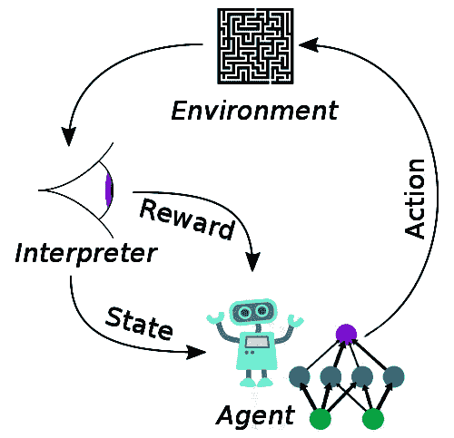

# 解锁决策制定：人工智能桥接理论框架与技术进步

> 原文：[`towardsdatascience.com/unlocking-decision-making-ai-bridges-theoretical-frameworks-with-technological-advancements-9a2d89c4a561`](https://towardsdatascience.com/unlocking-decision-making-ai-bridges-theoretical-frameworks-with-technological-advancements-9a2d89c4a561)

## 数据科学和人工智能如何帮助决策的简要概述

 [Stephanie Shen](https://jshen9889.medium.com/?source=post_page-----9a2d89c4a561--------------------------------)

·发布于 [Towards Data Science](https://towardsdatascience.com/?source=post_page-----9a2d89c4a561--------------------------------) ·12 min read·2023 年 12 月 11 日

--

图片来源：[Jake Melara](https://unsplash.com/@jakemelara?utm_content=creditCopyText&utm_medium=referral&utm_source=unsplash) 于 [Unsplash](https://unsplash.com/photos/selective-focus-photography-of-woman-in-black-t-shirt-standing-on-bridge-ZDhLVO5m5iE?utm_content=creditCopyText&utm_medium=referral&utm_source=unsplash)

我们的生活充满了不断的决策和选择。由于我们的决策可能会带来相当大的经济和社会影响，决策研究从一开始就是高度跨学科的。自 20 世纪中叶以来，来自数学、社会学、心理学、经济学、政治学和计算机科学的科学家们一直在积极研究如何做出更好的决策。在这些领域中，最著名的成就包括预期效用理论、前景理论和博弈论。这些理论由数学模型驱动，但通常面临来自实际场景的经验测试的挑战。

随着计算能力的巨大提升和云技术的蓬勃发展，决策支持系统（DSS）与决策理论同步进步，以帮助人类做出决策，特别是在商业和组织环境中。一个典型的 DSS 包括可扩展的知识数据库，用于收集和存储大量信息，统计和分析算法，用于预测和投射，以及用户界面（包括图表和仪表板），供人类决策者可视化和互动决策过程。

然而，大多数人类决策是通过试错的增量学习得出的。迭代方法在处理新环境中的未知因素时特别有效。它需要探索新信息和评估错误以改进决策。值得注意的是，深度强化学习已经模拟了人类决策的试错性质，并在特定游戏中超越了人类玩家。

强化学习（RL）是从一开始就存在的机器学习领域之一。其重大突破发生在深度神经网络应用于模型之后。深度强化学习只是人工智能和深度学习革命化决策领域的一个例子。我们现在正处于一个人工智能为所有决策学科提供基础的时代，加快了对人类决策过程的理解，并进一步赋能人类做出数据驱动的理性决策。

# **决策过程与决策理论**

决策是一个以选择行动方案为结束的过程。简单来说，这个过程有四个连续的阶段：评估、选项、评估和行动选择。每个阶段都依赖于前一个阶段的成功完成。

## **阶段 1：评估**

第一个决策阶段是识别问题并提出决策。为了正确评估问题，我们应该理想地收集所有相关事实，识别当前状态与期望结果之间的差距，并最终确认是否需要做出决定。

问题评估对于理解环境、条件和可能的限制至关重要。收集到的信息越完整准确，接下来的决策阶段就会越顺利，确保做出更好的选择。跳过这个阶段可能会导致完全错误的决定，并带来不利的后果。文献和我们日常生活中的大量故事都教会我们一个教训：人们因为信息不完整和先前的无根据信念而匆忙做出错误决定。

## **阶段 2：选项**

一旦问题得到确认并且所有前提信息已经收集完毕，下一阶段是制定不同的选项，然后做出最终决定。这一步涉及到基于以往知识和经验预测未来的结果。它包括发明、开发和分析决策备选方案，并在可能的情况下测试每个解决方案的可行性。

这个阶段需要技能和专业知识来做出准确的预测。可能需要工具或计算来制定选项。没有这些工具时，人脑使用想象力来基于记忆可视化未来的行动和潜在后果。时间因素也是这个阶段的一个因素：时间越久，准确预测的难度越大。

## **阶段 3：评估**

面对多个不确定的选项时，大多数建立的决策理论都专注于如何评估这些替代方案，以及人类如何做出最终选择，基于每个选项应该有一个预期值的假设。在生物世界中，这个价值可能是减少饥饿、口渴或其他基本生存需求。在许多不同的情况下，这可能是奖励或惩罚。对金融或经济决策来说，最直接的价值是赚取或失去的金钱。

预期效用理论最初由瑞士数学家尼古拉斯·贝尔努利在 1713 年提出，后来由 20 世纪的其他经济学家和数学家完善。该理论提出，理性代理人应该选择具有最大预期效用的选项。预期效用是根据特定情况下某一行动可能达到的所有效用水平的加权平均值。实质上，效用反映了选择的预期值和风险。

让我们用一个简单的例子来看看预期效用理论如何运作。假设有两个情境，每个情境都有两个选项，我们让参与者选择每个情境中的最佳选项：

情境 1：

+   选项 1：100% 几率获得 450 美元

+   选项 2：50% 几率获得 1000 美元

情境 2：

+   选项 1：100% 几率损失 500 美元

+   选项 2：50% 几率损失 1100 美元

通过将概率与预期的美元价值相乘来推导每个选项的效用。根据预期效用理论，参与者应该在每个情境中选择效用最高的选项：情境 1 的第 2 个选项和情境 2 的第 1 个选项。

预期效用理论从经济学角度发展起来，以确保人们做出的选择与他们的目标一致。它还考虑了边际递减，即当金钱的价值增加时，效用的增加程度会减缓（例如，富人对额外的 100 美元的需求低于穷人）。

在 1979 年，心理学家丹尼尔·卡尼曼和阿莫斯·特沃斯基通过实验发现挑战了预期效用理论。他们的研究揭示了人们并不总是选择最大效用，而是根据价值和风险的相对性有倾向地选择更规避风险或寻求风险的选项。这些发现导致了前景理论的发展。

根据上述相同的例子，大多数参与者在情境 1 中选择选项 1，因为 450 美元是 100%确定的。在情境 2 中，大多数人选择了更具风险的选项 2，尽管它的效用值（550 美元）表示比另一个选项损失更多。换句话说，人们更愿意接受较小的效用收益以避免风险，但在面临损失时则愿意承担更多的风险。

因此，与期望效用理论中对收益和损失的对称最大效用计算相比，前景理论的曲线呈不对称的 S 形，负效用曲线明显比正部分陡峭（见下图）。简而言之，期望效用理论讲的是人们应该做什么以做出理性选择以获得最大效用。而前景理论解释了为什么人们往往由于偏好避免立即损失而不是追求长期收益，导致决策变得更差。

前景理论的曲线呈不对称的 S 形，因为人们对立即获得的收益有风险规避，而在面对损失时则会寻求额外的风险。图片来源于作者。

然而在现实生活中，期望值可能会变得模糊，因为它并不是我们人类思维的固有部分。价值可能依赖于幸福感或其他心理或社会因素。此外，在许多情况下，我们尚未确定每个结果的概率。决策理论的一般挑战在于，它们都具有仅适用于特定领域的假设，并且已经通过小样本进行测试。此外，期望值和概率不是静态的，而是依赖于许多因素，并可能相对于其他选项。决策者必须在每次这些因素或选项发生变化时重新评估效用。

## **第 4 阶段：行动选择**

做出最终决定和选择行动方案有时与第 3 阶段不可分割。人类可以分配期望值，找到最大效用，并立即行动。然而，在许多其他情况下，最佳选项在评估后并不明显或不可用。我们常常遇到两种选择在补充或竞争的方式下提供相等的价值，并且选择一个与另一个相比成本似乎相当的情况。典型的困境可能使决策变得困难或使决策过程停滞不前。这时，人们会寻求他人（例如，家人或朋友）的帮助，或利用社会群体来决定。当一个特定问题有多个决策者时，博弈论已经发展起来以解决这种类型的决策困境（注：博弈论是社会决策中的一个重要领域，但超出了当前文章的范围）。

# **决策支持系统**

深思熟虑的决策是人类智慧的一个重要功能。在面对新问题时，人类必须经历上述典型的四个决策阶段。然而，由于大脑容量的限制和潜在的偏见，我们的人脑往往难以合理化复杂的情况。自 20 世纪中叶以来，决策支持系统（DDS）应运而生，以扩展人类能力，帮助决策者做出更好的决策。DDS 的主要特点包括其知识系统和数据驱动的算法，用于进行预测和评估。

## **知识系统以扩展人类的记忆**

我们需要了解世界以解决新问题。对相关事实的准确和完整的把握对于在决策的后续步骤中做出预测和预报至关重要。对于简单的生活问题，依靠我们对经验和知识的回忆可能已经足够。然而，对于更复杂的问题，我们的记忆并不是完全可信的，主要有两个原因：

首先，人类记忆并不是所有信息都能存储。人们只会关注他们注意到的方面，而忽略许多最初被认为不相关的细节。获取的短期记忆如果不被使用会逐渐衰退，只有一小部分被长期保存。有时，即使一个事实已经存储在大脑中，人们也可能在寻找它时遇到困难（例如，搜索问题）。

其次，我们的记忆会不断被修改和更新。我们的脑袋里没有单独的地方来存储我们经历的不同实例。它使用最初记录和处理信息的相同脑区来存储记忆。每当我们回忆或在脑海中重播时，相同的神经网络会被激活，突触的权重会进行调整。此外，由于神经网络的模式识别和联想性质，我们的大脑可以自动填补最初未被记录或观察到的细节。这解释了初始提问和在解决问题过程中隐性暗示如何扭曲人们的记忆以及影响他们的决策。

相反，计算机知识系统和数据库是忠实存储历史事实的工具，不会遗漏或扭曲。它们将原始事实和汇总信息进行有序存储，以便于访问和搜索。随着云计算的进步，各种类型的数据库可以存储不同种类的信息，并具有高扩展性、可靠性和性能。

## **先进的算法以提供更好的预测**

对于深思熟虑的决策，人脑利用想象力来预测未来。尽管这非常强大，但我们的思维确实存在一些限制：

1.  人类想象力的预测能力有限，因为它往往会重建并填补当前信息的空白。

1.  许多预测需要非线性计算（例如，幂函数），这需要外部工具来帮助完成。

1.  人脑使用工作记忆同时保持多个情境，以比较优缺点。工作记忆的容量有限，并且需要高度集中进行强度计算，这在长时间内不可持续。

相反，DDS（决策支持系统）利用数学、统计和机器学习算法，并借助强大的计算资源来帮助人类进行预测和预报。过去几十年中，众多算法和方法被开发、实施并成熟，这极大地帮助人类在各种行业和组织中做出更好的决策。

## **帮助人类做出理性决策**

我们都知道情绪对我们的决策有着显著的影响，尤其是在选项评估过程中。例如，厌恶风险的情绪会导致偏见决策，这在前景理论中有所体现。人类的认知偏差和启发式也会导致主观评估和次优或错误选择。因此，数据分析可以通过利用效用理论及相关效用函数来缓解情绪的影响，克服潜在的偏见，使人们能够做出最佳选择。此外，DSS（决策支持系统）通常具有用户界面来呈现选项和重播情境，使决策过程更具互动性，帮助决策者做出无偏见的数据驱动决策。

# **未知的未知与强化学习**

> *“…有已知的已知；我们知道我们知道的东西。我们也知道有已知的未知；也就是说，我们知道有些东西我们不知道。但也有未知的未知——那些我们不知道我们不知道的东西。”*
> 
> *– 唐纳德·拉姆斯菲尔德*

决策的挑战在于未来的不确定性，尤其是与前美国国防部长唐纳德·拉姆斯菲尔德（2002 年新闻发布会上的名言）所提到的“未知的未知”相关。如果一切都是已知的（已知的已知），那么不再需要决策，因为结果已经确定。“已知的未知”通过选项的概率和风险来表示，这些概率和风险用于效用函数中，以识别具有最大效用的最佳选择。然而，“未知的未知”强调了无法预测或预报的结果的不确定性，它们只能在特定行动发生后被识别或发现。

试错法是处理未知未知问题的解决方案，人类实际上擅长这种方法。他们探索环境，做出最佳选择，并从结果中学习。这个过程不断迭代，直到他们能够做出完美的决策。这就是人类成为任何他们所做事情的高手的方式，包括决策。由于这种迭代学习模式，我们的大多数选择都是自动化的：一些是由自然完全固定的，如反射（例如，从火中撤回手，眨眼以避开强光），另一些是通过训练学习的结果（例如，赢得游戏，驾驶飞机）。

强化学习（RL）作为最古老的机器学习算法之一，使用与人类相同的试错方法进行学习。尽管 RL 最初在 1950 年代设计，但真正的革命发生在 2013 年，当时 Deep Mind 将深度神经网络应用于 RL，使得模型能够从零开始学习游戏，并最终在这些游戏中超越人类。最著名的例子是击败人类世界冠军的 AlphaGo。

深度强化学习模型具有与本文之前概述的类似决策过程。在模型中，代理进行观察、评估最佳路径、采取行动，并通过环境中的奖励获得反馈。随后，代理将其预期奖励与实际奖励进行比较，并利用差异来调整下一轮的行动。通过时间上的迭代调整，它将以最大化奖励的方式行动。值得注意的是，RL 使用“奖励”一词而非“效用”，因为奖励的计算与效用理论中的效用计算有所不同。

深度强化学习（Deep RL）将深度学习应用于典型的 RL 框架。图片来源：[维基百科](https://en.wikipedia.org/wiki/Reinforcement_learning)

深度强化学习（Deep RL）相较于决策支持系统（DSS）的优势在于，代理可以通过一系列传感器（如摄像头和触觉感应）自行探索环境和收集信息，并能够采取行动，如发送信号激活电机。换句话说，深度强化学习模仿了人类和动物的大脑，作为一个集成系统涵盖了从头到尾的决策过程，具备持续学习和改进的能力。

到目前为止，许多使用案例成功地利用了深度强化学习，包括游戏、自驾车、推荐系统、网络广告投放和交付、金融市场预测等。此外，人工智能和深度学习为在每个层级上连接碎片化的决策学科开辟了新的途径。以下是一些趋势，但肯定不是详尽无遗的：

1.  研究人员使用深度学习算法来评估、测试和推进决策理论，基于大规模实验数据。

1.  决策支持系统利用深度强化学习来替代或增强先前的算法，以进行更准确的预测和优化决策。

1.  新的决策框架，如动态决策和鲁棒决策，已经出现，它们将传统的一次性繁重决策过程拆分为更小的迭代周期，并利用人工智能从以往的决策中学习并应对不确定性。

1.  人工智能和深度神经网络已成为神经科学家研究人类决策机制和寻找预防人类做出如成瘾等错误决策方法的不可或缺的工具。

1.  决策理论的进展和新的脑研究发现将帮助人工智能实现更自动化的决策。

# **结论**

在不同的领域中，个人、组织和社会旨在做出与其目标和宗旨一致的最佳决策。鉴于决策在各种背景下的重要性，它已成为多个关键学科的研究对象。五位诺贝尔奖获得者因其在决策及相关的期望效用理论和前景理论上的重大贡献而获得认可。同时，数据科学家通过实施可扩展的决策支持和预测系统，成功地协助了人类决策者。深度强化学习在模拟甚至超越人类决策方面的最新突破标志着一个变革阶段，人工智能在整合决策学科、实现对人类决策过程的统一理解以及将各种决策系统提升到前所未有的自动化水平方面发挥了关键作用。
