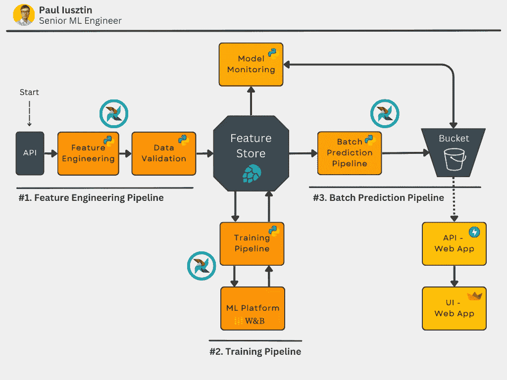
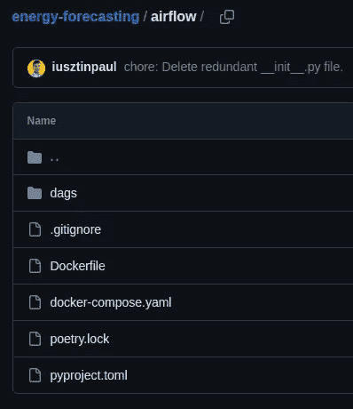
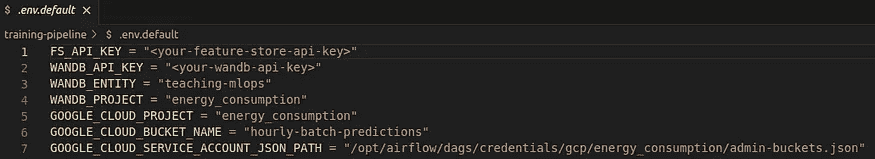
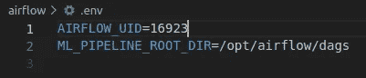
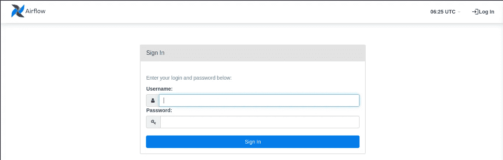
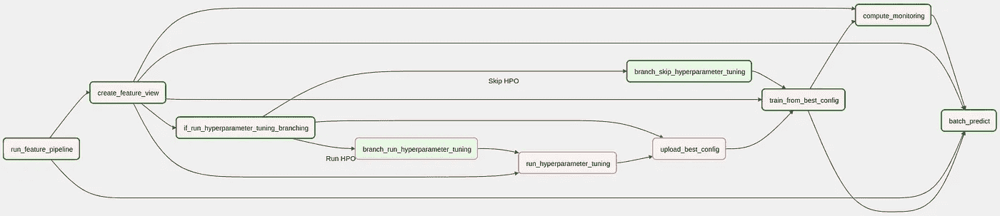
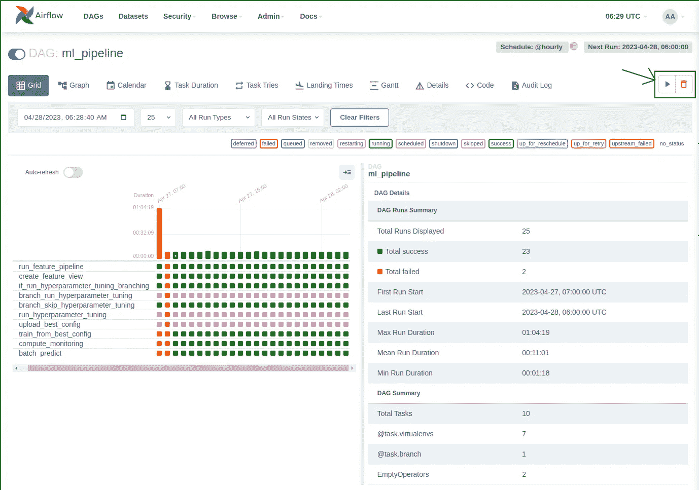

# 使用 Airflow 解锁 MLOps：ML 系统编排的全面指南

> 原文：[`towardsdatascience.com/unlocking-mlops-using-airflow-a-comprehensive-guide-to-ml-system-orchestration-880aa9be8cff`](https://towardsdatascience.com/unlocking-mlops-using-airflow-a-comprehensive-guide-to-ml-system-orchestration-880aa9be8cff)

## [完整的 7 步 MLOps 框架](https://towardsdatascience.com/tagged/full-stack-mlops)

## 第四部分：私人 PyPi 服务器。用 Airflow 编排一切。

[](https://pauliusztin.medium.com/?source=post_page-----880aa9be8cff--------------------------------)[](https://towardsdatascience.com/?source=post_page-----880aa9be8cff--------------------------------) [Paul Iusztin](https://pauliusztin.medium.com/?source=post_page-----880aa9be8cff--------------------------------)

·发布于 [Towards Data Science](https://towardsdatascience.com/?source=post_page-----880aa9be8cff--------------------------------) ·17 分钟阅读·2023 年 5 月 23 日

--


图片由 [Hassan Pasha](https://unsplash.com/@hpzworkz?utm_source=medium&utm_medium=referral) 提供，来源于 [Unsplash](https://unsplash.com/?utm_source=medium&utm_medium=referral)

本教程代表**7 节课程中的第四部分课**，将一步一步指导你如何**设计、实现和部署一个 ML 系统**，并运用**MLOps 好实践**。在课程中，你将构建一个准备投入生产的模型，以预测丹麦多个消费者类型在接下来的 24 小时内的能源消耗水平。

*在本课程结束时，你将理解如何使用批量服务架构设计、编码和部署 ML 系统的所有基础知识。*

本课程*针对中级/高级机器学习工程师*，希望通过构建自己的端到端项目来提升技能。

> *如今，证书到处都是。构建可以展示的高级端到端项目是获得专业工程师认可的最佳方式。*

# 目录：

+   课程介绍

+   课程内容

+   数据源

+   第四部分：私人 PyPi 服务器。用 Airflow 编排一切。

+   第四部分：代码

+   结论

+   参考资料

# 课程介绍

***在这个 7 节课程结束时，你将知道如何：***

+   设计批量服务架构

+   使用 Hopsworks 作为特征存储

+   设计一个从 API 读取数据的特征工程管道

+   构建一个包含超参数调整的训练管道

+   使用 W&B 作为 ML 平台跟踪你的实验、模型和元数据

+   实现一个批量预测管道

+   使用 Poetry 构建你自己的 Python 包

+   部署你自己的私人 PyPi 服务器

+   使用 Airflow 协调一切

+   使用预测来编写一个使用 FastAPI 和 Streamlit 的 web 应用程序

+   使用 Docker 对代码进行容器化

+   使用 Great Expectations 确保数据的验证和完整性

+   监控预测性能的变化情况

+   将所有内容部署到 GCP

+   使用 GitHub Actions 构建 CI/CD 管道

如果这听起来很多，不要担心。在你完成这门课程后，你将理解我之前说的所有内容。最重要的是，你将知道我为什么使用这些工具，以及它们如何作为一个系统协同工作。

**如果你想从这门课程中获得最大的收益，** [**我建议你访问包含所有课程代码的 GitHub 仓库**](https://github.com/iusztinpaul/energy-forecasting) **。这门课程旨在让你快速阅读和复制文章中的代码。**

到课程结束时，你将知道如何实现下图所示的内容。如果有什么不明白的地方，请不要担心。我会详细解释一切。


课程中你将构建的架构图 [作者提供的图片]。

到**第四部分课结束时**，你将知道如何托管你的 PyPi 仓库，并使用 Airflow 协调三个管道。你将学习如何调度管道以创建每小时的预测。

# 课程内容：

1.  [批量服务。特征存储。特征工程管道。](https://medium.com/towards-data-science/a-framework-for-building-a-production-ready-feature-engineering-pipeline-f0b29609b20f)

1.  [训练管道。ML 平台。超参数调整。](https://medium.com/towards-data-science/a-guide-to-building-effective-training-pipelines-for-maximum-results-6fdaef594cee)

1.  [批量预测管道。使用 Poetry 打包 Python 模块。](https://medium.com/towards-data-science/unlock-the-secret-to-efficient-batch-prediction-pipelines-using-python-a-feature-store-and-gcs-17a1462ca489)

1.  **私有 PyPi 服务器。使用 Airflow 协调一切。**

1.  使用 GE 进行数据验证以确保质量和完整性。模型性能持续监控。

1.  [使用 FastAPI 和 Streamlit 消费和可视化你的模型预测。对一切进行 Docker 化。](https://medium.com/towards-data-science/fastapi-and-streamlit-the-python-duo-you-must-know-about-72825def1243)

1.  [将所有 ML 组件部署到 GCP。使用 Github Actions 构建 CI/CD 管道。](https://medium.com/towards-data-science/seamless-ci-cd-pipelines-with-github-actions-on-gcp-your-tools-for-effective-mlops-96f676f72012)

1.  [[额外内容] ‘不完美’ ML 项目的幕后 — 经验教训和见解](https://medium.com/towards-data-science/imperfections-unveiled-the-intriguing-reality-behind-our-mlops-course-creation-6ff7d52ecb7e)

如果你想全面掌握这节课，我们建议你查看[课程 1](https://medium.com/towards-data-science/a-framework-for-building-a-production-ready-feature-engineering-pipeline-f0b29609b20f)，[课程 2](https://medium.com/towards-data-science/a-guide-to-building-effective-training-pipelines-for-maximum-results-6fdaef594cee) 和[课程 3](https://medium.com/towards-data-science/unlock-the-secret-to-efficient-batch-prediction-pipelines-using-python-a-feature-store-and-gcs-17a1462ca489)，这些课程详细解释了你将在本文中协调的管道实现：

1.  特征工程管道

1.  训练管道

1.  批量预测管道

# 数据源

我们使用了一个免费且开放的 API，该 API 提供了丹麦所有能源消费类型的每小时能源消耗值[1]。

它们提供了一个直观的界面，你可以轻松查询和可视化数据。[你可以在这里访问数据](https://www.energidataservice.dk/tso-electricity/ConsumptionDE35Hour) [1]。

数据具有 4 个主要属性：

+   **小时 UTC：** 数据点观察时的 UTC 日期时间。

+   **价格区域：** 丹麦被划分为两个价格区域：DK1 和 DK2——由大贝尔特海峡划分。DK1 位于大贝尔特海峡西侧，DK2 位于大贝尔特海峡东侧。

+   **消费类型：** 消费类型是由丹麦能源公司拥有和维护的行业代码 DE35。

+   **总消耗：** 总电力消耗（单位：千瓦时）

**注意：** 观察数据有 15 天的滞后！但对于我们的演示用例来说，这不是问题，因为我们可以模拟与实时相同的步骤。


我们的网络应用程序的屏幕截图，展示了我们如何预测区域 = 1 和消费类型 = 212 的能源消耗 [作者提供的图片]。

数据点具有每小时的分辨率。例如：“2023–04–15 21:00Z”，“2023–04–15 20:00Z”，“2023–04–15 19:00Z”等。

我们将数据建模为多个时间序列。每个唯一的**价格区域**和**消费类型**组合表示一个唯一的时间序列。

因此，我们将建立一个独立预测未来 24 小时每个时间序列的能源消耗的模型。

*查看下面的视频，以更好地理解数据的样子* 👇

课程与数据源概述 [作者提供的视频]。

# 课程 4：**私人 PyPi 服务器。用 Airflow 协调一切。**

## 第四部分课的目标

这节课将教你如何使用 Airflow 来协调你迄今为止实现的三个管道。

此外，要运行 Airflow 中的代码，你将学习如何托管你的 PiPy 仓库，并将管道部署为 3 个不同的 Python 模块。之后，你将直接从你的 PiPy 仓库中安装这些模块到 Airflow 中。



第 4 课组件用蓝色高亮的最终架构图 [作者提供的图片]。

通过使用 Airflow 编排所有内容，你将自动化整个过程。你不再需要手动运行 10 个不同的脚本，而只需点击一次“运行”按钮即可运行整个代码。

同时，以编程方式将所有步骤连接起来的程序更不容易出现错误。

**为什么？**

因为每个脚本都需要自己的配置。例如，批量预测管道需要特征视图版本（数据版本）和模型版本作为输入。

这些信息是从之前的脚本生成的元数据。当你手动运行一切时，容易复制错误的版本。但当你将所有内容封装在一个 DAG 中时，你只需构建一次，之后它将始终正常工作。

此外，通过使用 Airflow，你可以：

+   定期调度管道运行（你将每小时运行一次）；

+   使用 Airflow 变量配置整个过程；

+   监控每个任务的日志。

这里是你将在 Airflow 中构建的概览 👇

## 理论概念与工具

**Airflow：** Airflow 是最受欢迎的编排工具之一。这个项目最初在 Airbnb 开发，但现在在 Apache 许可证下开源。这意味着你可以免费修改和托管它。Airflow 允许你构建、调度和监控 DAG。

**DAG（有向无环图）：** DAG 是一种没有循环的图，这意味着逻辑流只能朝一个方向进行。

**PyPi 注册表：** PiPy 注册表是一个可以托管各种 Python 模块的服务器。当你运行“**pip install <your_package>**”时，pip 知道如何查看官方 PyPi 仓库中的你的包并安装它。托管自己的 PyPi 注册表的行为完全相同，但你必须配置 pip 以知道如何访问它。只有访问你 PyPi 服务器的人才能从中安装包。

# 第 4 课：代码

[你可以在这里访问 GitHub 仓库。](https://github.com/iusztinpaul/energy-forecasting)

**注意：** 所有的安装说明都在仓库的 README 文件中。这里你将直接跳转到代码部分。

*第 4 课中的所有代码都位于* [***airflow***](https://github.com/iusztinpaul/energy-forecasting/tree/main/airflow) *文件夹下。*

[**airflow**](https://github.com/iusztinpaul/energy-forecasting/tree/main/airflow) 文件夹下的文件结构如下：



显示 airflow 文件夹结构的截图 [作者提供的图片]。

所有代码都位于[**dags**](https://github.com/iusztinpaul/energy-forecasting/tree/main/airflow/dags) 目录下**。** 每个 DAG 都有其自己的 Python 文件。

Docker 文件将帮助你快速托管 Airflow 和 PiPy 仓库。我会在后面详细解释。

直接将凭证存储在你的 git 仓库中是一个巨大的安全风险。这就是为什么你将使用**.env**文件来注入敏感信息。

**.env.default**是你必须配置的所有变量的示例。它也有助于存储不敏感的属性的默认值（例如，项目名称）。



.env.default 文件的截图 [作者提供的图片]。

## 准备凭证

由于第四部分课讨论了如何协调其他所有课程中的代码，如果你想重现代码，你需要检查如何设置[第一部分](https://medium.com/towards-data-science/a-framework-for-building-a-production-ready-feature-engineering-pipeline-f0b29609b20f)、[第二部分](https://medium.com/towards-data-science/a-guide-to-building-effective-training-pipelines-for-maximum-results-6fdaef594cee)和[第三部分](https://medium.com/towards-data-science/unlock-the-secret-to-efficient-batch-prediction-pipelines-using-python-a-feature-store-and-gcs-17a1462ca489)中的 3 个管道。

这三节课将展示如何设置所有必要的工具和服务。还会展示如何创建并完成包含所有凭证的所需.env 文件。


.env.default 文件的截图 [作者提供的图片]。

*唯一需要注意的是* 👇

这次你需要将包含凭证的**.env**文件放置在[**airflow/dags**](https://github.com/iusztinpaul/energy-forecasting/tree/main/airflow/dags)文件夹下**。**

我们在 docker-compose.yaml 文件中为**ML_PIPELINE_ROOT_DIR**环境变量设置了默认值**/opt/airflow/dags**。因此，在 Airflow 内部运行管道时，它将默认从**/opt/airflow/dags**加载**.env**文件。

同时，请注意在/ [**airflow**](https://github.com/iusztinpaul/energy-forecasting/tree/main/airflow)文件夹下还有另一个**.env**文件。这个文件不包含你的自定义凭证，但 Airflow 需要一些自定义配置。它的样子如下 👇



/airflow 文件夹中的.env 文件截图 [作者提供的图片]。

我在仓库的[README.md](https://github.com/iusztinpaul/energy-forecasting/tree/main#usage)中解释了如何完成这个**.env**文件。但作为附注，**AIRFLOW_UID**代表你计算机的用户 ID，而你知道**ML_PIPELINE_ROOT_DIR**是什么。

我只是想向你展示你可以在这里覆盖**ML_PIPELINE_ROOT_DIR**的默认值。请注意，这个路径将在 Docker 容器内使用，因此路径以**/opt/**开头。

```py
# Move to the airflow directory.
cd airflow

# Make expected directories and environment variables
mkdir -p ./logs ./plugins
sudo chmod 777 ./logs ./plugins

# It will be used by Airflow to identify your user.
echo -e "AIRFLOW_UID=$(id -u)" > .env
# This shows where the project root directory is located.
echo "ML_PIPELINE_ROOT_DIR=/opt/airflow/dags" >> .env
```

## 设置私人 PyPi 服务器

你可以使用 [这个仓库](https://github.com/pypiserver/pypiserver) 容易地托管一个 PiPy 服务器。不过让我解释一下我们在设置中是如何做的。

第一步是创建一组凭证，这些凭证是你连接到 PyPi 服务器所需的。

```py
# Install dependencies.
sudo apt install -y apache2-utils
pip install passlib

# Create the credentials under the energy-forecasting name.
mkdir ~/.htpasswd
htpasswd -sc ~/.htpasswd/htpasswd.txt energy-forecasting
```

PyPi 仓库将知道从 **~/.htpasswd/htpasswd.txt** 文件中加载凭证。

现在，你将把新的私有 PyPi 仓库添加到 Poetry 中。要配置 Poetry，你需要指定服务器的 URL、服务器名称以及用于认证的用户名和密码（这些是你之前配置的）：

```py
poetry config repositories.my-pypi http://localhost
poetry config http-basic.my-pypi energy-forecasting <password>
```

在我们的示例中：

+   **服务器名称：** my-pypy

+   **URL：** [`localhost`](http://localhost)

+   **用户名：** energy-forecasting

+   **密码：** <password>

检查你的 Poetry **auth.toml** 文件中的凭证设置是否正确：

```py
cat ~/.config/pypoetry/auth.toml
```

你已经准备好了用户名和密码，这些将被你的 PyPi 仓库用于认证。同时，你也配置了 Poetry 以识别你的 PyPi 服务器。

现在，让我们看看如何运行 PyPi 服务器。

你将使用的 [pyserver 代码](https://github.com/pypiserver/pypiserver) 已经进行了 Docker 化。

为了简化，我们将 PyPi 服务器作为额外的服务添加到运行 Airflow 应用程序的 docker-compose.yaml 文件中。

为了更好地理解 docker-compose.yaml 文件，请查看 [Airflow 官方文档](https://airflow.apache.org/docs/apache-airflow/stable/howto/docker-compose/index.html) [2] 和 [我们的 README.md](https://github.com/iusztinpaul/energy-forecasting/tree/main#the-pipeline)。但请注意使用我们仓库中的 docker-compose.yaml 文件，因为我们修改了原始文件，正如下文所示。

滚动到 [**airflow/docker-compose.yaml**](https://github.com/iusztinpaul/energy-forecasting/blob/main/airflow/docker-compose.yaml) 文件的底部，你会看到：

```py
 my-private-pypi:
    image: pypiserver/pypiserver:latest
    restart: always
    ports:
      - "80:8080"
    volumes:
      - ~/.htpasswd:/data/.htpasswd
    command:
      - run
      - -P
      - .htpasswd/htpasswd.txt
      - --overwrite
```

这段代码使用了 PyPi 服务器的最新镜像，将服务器暴露在 **80 端口**，将包含你凭证的 **~/.htpasswd** 文件夹作为卷加载，并用以下命令运行服务器：

```py
run -P .htpasswd/htpasswd.txt --overwrite
```

+   "-P .htpasswd/htpasswd.txt" 明确告诉服务器使用哪些凭证。

+   "— overwrite" 表示如果部署了相同版本的新模块，它将覆盖上一个版本。

就这样！当你运行 Airflow 应用程序时，你会自动启动 PyPi 服务器。

**注意：** 在生产环境中，你可能会将 PyPi 服务器托管在与 Airflow 不同的服务器上。步骤是相同的，只是将所有内容添加到单个 docker-compose.yaml 文件中。在本教程中，我们希望一切运行起来更加简单。

## 自定义 Airflow Docker 文件

由于你必须在 Python 3.9 中运行所有代码，因此你需要继承默认的 **apache/airflow:2.5.2** Airflow Docker 镜像，并添加一些额外的依赖项。

以下是 Docker 文件中的内容：

+   继承 **apache/airflow:2.5.2**

+   切换到 root 用户以安装系统依赖项

+   安装从私有 PyPi 服务器安装包所需的 Python 3.9 依赖项

+   切换回默认用户

因为我们切换了：

```py
x-airflow-common:
  &airflow-common
  image: ${AIRFLOW_IMAGE_NAME:-apache/airflow:2.5.2}
```

到：

```py
version: '3.8'
x-airflow-common:
  &airflow-common
#  image: ${AIRFLOW_IMAGE_NAME:-apache/airflow:2.5.2}
  build: .
```

Docker 会知道在运行 docker-compose 时使用你的自定义镜像，而不是**apache/airflow:2.5.2**。

## 运行 Airflow

现在你了解了如何准备凭据以及 Docker 文件如何工作，前往[./airflow](https://github.com/iusztinpaul/energy-forecasting/tree/main/airflow)目录并运行：

```py
# Go to the ./airflow directory.
cd ./airflow

# Initialize the Airflow database
docker compose up airflow-init

# Start up all services
# Note: You should set up the private PyPi server credentials before running this command.
docker compose --env-file .env up --build -d
```

[查看***使用*** *部分* 获取更多信息。](https://github.com/iusztinpaul/energy-forecasting/tree/main#-usage-)

完成 Airflow 设置后，你可以使用默认凭据在**127.0.0.1:8080**访问 Airflow：

+   用户名: airflow

+   密码: airflow



Airflow 登录页面的截图 [作者提供的图片]。

## 将模块部署到私有 PyPi 服务器

记住你使用以下命令将新的 PyPi 服务器添加到 Poetry 中：

```py
poetry config repositories.my-pypi http://localhost
poetry config http-basic.my-pypi energy-forecasting <password>
```

现在，使用**my-pypi**作为标识符，你可以快速将新包推送到你的 PyPi 仓库。

使用[deploy/ml-pipeline.sh](https://github.com/iusztinpaul/energy-forecasting/blob/main/deploy/ml-pipeline.sh)脚本，你可以仅使用 Poetry 构建和部署所有 3 个管道：

```py
!/bin/bash

# Build and publish the feature-pipeline, training-pipeline, and batch-prediction-pipeline packages.
# This is done so that the pipelines can be run from the CLI.
# The pipelines are executed in the feature-pipeline, training-pipeline, and batch-prediction-pipeline
# directories, so we must change directories before building and publishing the packages.
# The my-pypi repository must be defined in the project's poetry.toml file.

cd feature-pipeline
poetry build
poetry publish -r my-pypi

cd ../training-pipeline
poetry build
poetry publish -r my-pypi

cd ../batch-prediction-pipeline
poetry build
poetry publish -r my-pypi
```

如你所见，我们迭代地进入 3 个管道的文件夹并运行：

```py
poetry build
poetry publish -r my-pypi
```

Poetry 使用这两个命令在文件夹中查找**pyproject.toml**和**poetry.lock**文件，并知道如何构建包。

然后，根据生成的**wheel**文件，运行**"poetry publish -r my-pypi"**，你将其推送到你的**my-pipy**仓库。

记住你将你的 PyPi 服务器标记为**my-pipy**。

完成了。你拥有了自己的 PyPi 仓库。

在接下来的章节中，我将向你展示如何从你的私有 PyPi 仓库中安装包。

**注意：** 你只使用 Poetry 来构建和部署模块。Airflow 将使用 pip 从你的 PyPi 仓库中安装这些模块。

## 定义 DAG 对象

你的 dag 定义在[**airflow/dags/ml_pipeline_dag.py**](https://github.com/iusztinpaul/energy-forecasting/blob/main/airflow/dags/ml_pipeline_dag.py)文件中。

使用***Airflow 2.0 的 API***，你可以使用**dag()** Python 装饰器定义一个 DAG。

你的 dag 将在**ml_pipeline()**函数中定义，该函数在文件末尾调用。此外，Airflow 知道加载[airflow/dags](https://github.com/iusztinpaul/energy-forecasting/tree/main/airflow/dags)目录下定义的所有 DAG。

DAG 具有以下属性：

+   **dag_id**: DAG 的 ID

+   **schedule:** 它定义了 DAG 运行的频率

+   **start_date:** 根据给定的时间表，DAG 应该何时开始运行

+   **catchup:** 自动填补[start_date, 现在]之间的时间

+   **tags:** 标签 😄

+   **max_active_runs:** 此 DAG 可以并行运行的实例数

## 定义任务

下面的代码可能看起来很长，但一旦你理解了主要思路，它很容易阅读。

在 DAG 中，你定义了多个任务。一个任务是一个单独的逻辑单元/步骤，执行特定的操作。

任务的定义类似于 DAG：一个函数+一个装饰器。每个任务都有其函数和装饰器。

***注意：*** *这是一个简单的提醒，我们使用的是 Airflow 2.0 的 API，而不是 1.0 的。*

在我们的案例中，一个任务将代表一个主管道脚本。例如，特征工程管道将在一个单独的任务中运行。

你将使用 DAG 将所有脚本粘合在一个“程序”下，每个脚本与一个任务有 1:1 的对应关系。



"ml_pipeline"的视觉表示（请参见 YouTube 视频以获取更好的视图） [作者提供的图像]。

正如你在每个任务中看到的，你只需从其模块中导入并调用函数……并可能添加一些额外的日志。

定义任务的关键步骤在于**task.virtualenv()** Python 装饰器的参数中。

对于每个任务，这个特定的装饰器将创建一个不同的 Python 虚拟环境，在其中安装所有给定的需求。

**注意：** **172.17.0.1** 是你私有 PyPi 仓库的 IP 地址。记住，你通过 docker-compose 在与 Airflow 相同的网络下托管你的 PyPi 仓库。**172.17.0.1** 是每个 Docker 容器在**default Docker**网络内可以访问的桥接 IP 地址。因此，Airflow 容器可以通过桥接 IP 地址访问 PyPi 服务器容器。

正如在**requirements**参数中所示，我们定义了以下内容：

+   "**— trusted-host 172.17.0.1**": 由于 PyPi 服务器没有用 HTTPS 保护，你必须明确表示你信任这个来源。

+   "**— extra-index-url http://172.17.0.1**": 告诉 Pip 在搜索 Python 包时也查看这个 PyPi 仓库。请注意，Pip 在搜索时仍会查看官方 PyPi 仓库。

+   "**<your_python_packages>**": 在上述两行之后，你可以添加任何 Python 包。但请注意，你已经安装了**feature_pipeline**、**training_pipeline**和**batch_prediction_pipeline**作为你用 Poetry 构建和部署的 Python 包。

其他参数并不是那么有趣，但让我来解释一下：

+   **task_id=" <task_id>":** 任务的唯一 ID。

+   **python_version=" 3.9"**: 当我写这门课程时，Hopsworks 只支持 Python 3.9，所以我们必须强制使用这个版本的 Python。

+   **multiple_outputs=True**: 任务返回一个 Python 字典。

+   **system_site_packages=True:** 安装默认的系统包。

***重要***

注意，几乎每个任务都会返回一个包含信息的元数据字典，例如：

+   数据提取的日期范围，

+   特征组、特征视图等的版本。

+   sweep 的版本。

+   模型的版本等。

这些信息在任务之间传递是至关重要的。例如，**create_feature_view** 任务需要知道使用哪个版本的 **feature_group** 来创建下一个特征视图。此外，在运行 **batch_predict** 时，你需要知道要使用哪个版本的特征视图和模型来生成预测。

一个有趣的任务是 **task.branch(task_id=" if_run_hyperparameter_tuning_branching")**，它定义了一个是否运行超参数调整逻辑的 if-else 逻辑。

这种特殊类型的任务返回一个 **task_ids** 列表，这些任务将会被执行。例如，如果它返回 **["branch_run_hyperparameter_tuning"]**，则仅运行 **task_id =** **branch_run_hyperparameter_tuning** 的任务。

如下所示，定义了两个空的操作符（任务），并在 **task.branch()** 逻辑中使用了 task_ids。这是 Airflow 建议的一种常见模式，当在多个分支之间进行选择时，使用一组空操作符（无操作）。

## 将任务连接成一个 DAG

现在你已经定义了所有的任务，最后一步是将它们连接成一个 DAG。你必须执行这一步，以便 Airflow 知道每个任务的运行顺序。

基本上，这里你将定义逻辑图。

**#1.** 第一步是 ***确定你将用于配置 DAG 的变量集合***，如 **days_delay, days_export, feature_group_version, 等**。你可以从 Airflow 的“Admin -> Variables”面板中访问这些变量。

请注意，你必须显式地使用蓝色加号按钮添加它们。


变量 Airflow 面板的截图 [作者提供的图片]。

**#2.** 第二步是 ***调用具有正确参数的任务***。如你所见，由于 Airflow 2.0 API，这一步就像按特定顺序调用一系列 Python 函数一样。

**注意：** 如果一个函数的输出作为输入添加到另一个函数中，则图中的依赖关系会自动创建。

> 强调如何将每个管道元素的元数据传递到下一个元素是至关重要的。这样，我们强制执行以下脚本，以使用正确的数据和模型版本。

我还想强调以下这段代码：

```py
 feature_pipeline_metadata = run_feature_pipeline(
        export_end_reference_datetime="{{ dag_run.logical_date }}",
    )
```

**“{{ dag_run.logical_date }}"** 是 Airflow 注入的模板变量，反映了 DAG 运行时的逻辑日期，而不是当前日期。通过这样做，利用 Airflow 回填功能，你可以轻松地将其作为日期时间参考来回填给定时间窗口中的数据。现在你可以轻松地操作提取窗口的起始和结束点。

例如，如果你想运行 DAG 以回填 2023 年 5 月 10 日至 11 日的能源消耗预测，你将使用“2023 年 5 月 10 日 00:00 am”日期运行 Airflow 回填逻辑。

**#3\.** 最后一步是使用 "***>>"*** 操作符来强制执行特定的 ***DAG 结构***。

"**A >> B >> C**" 意味着先运行 A，然后 B，再运行 C。

唯一稍微复杂一点的代码是这个：

```py
>> if_run_hyperparameter_tuning_branch
>> [
    if_run_hyperparameter_tuning_branch
    >> Label("Run HPO")
    >> branch_run_hyperparameter_tuning_operator
    >> last_sweep_metadata
    >> upload_best_model_step,
    if_run_hyperparameter_tuning_branch
    >> Label("Skip HPO")
    >> branch_skip_hyperparameter_tuning_operator,
]
```

，其中根据**branch**运算符，DAG 将运行**branch_run_hyperparameter_tuning_operator**或**branch_skip_hyperparameter_tuning_operator**分支。

阅读有关 Airflow 中分支的更多信息[这里](https://docs.astronomer.io/learn/airflow-branch-operator) [3]。

以英语运行时，它将进行超参数优化或跳过，如下图所示——我知道图片比较小。查看视频以获取更清晰的视图。 👇


ml_pipeline DAG 截图 [作者提供的图片]。

就这样！你使用 Airflow 协调了所有 3 个管道。恭喜！

## 运行 ML Pipeline DAG

这一步很简单。

只需进入你的**ml_pipeline** DAG 并点击播放按钮。



ml_pipeline DAG 视图截图 [作者提供的图片]。

## 使用 Airflow 进行回填

查找你的**airflow-webserver** docker 容器 ID：

```py
docker ps
```

在**airflow-webserver**容器内启动 shell 并运行**airflow dags backfill**，如下所示：

```py
docker exec -it <container-id-of-airflow-webserver> sh
# In this example, you did a backfill between 2023/04/11 00:00:00 and 2023/04/13 23:59:59.
airflow dags backfill --start-date "2023/04/11 00:00:00" --end-date "2023/04/13 23:59:59" ml_pipeline
```

如果你想清除任务并重新运行它们，请运行以下命令：

```py
docker exec -it <container-id-of-airflow-airflow-webserver> sh
airflow tasks clear --start-date "2023/04/11 00:00:00" --end-date "2023/04/13 23:59:59" ml_pipeline
```

# 结论

恭喜！你完成了**第四课**来自**全栈 7 步 MLOps 框架**课程。

如果你已经看到这里，你知道如何：

+   托管自己的 PyPi 服务器

+   使用 Poetry 构建和部署 Python 模块

+   使用 Airflow 协调多个管道

现在你已经理解了使用像 Airflow 这样的协调工具的强大功能，你可以构建强大的生产就绪管道，并快速调度、配置和监控。

查看第 5 课了解如何使用 Great Expectations 验证数据的完整性和质量。此外，你将了解如何在机器学习系统上实现监控组件。

**此外，** [**你可以在这里访问 GitHub 仓库**](https://github.com/iusztinpaul/energy-forecasting)**。**

💡 我的目标是帮助机器学习工程师提升设计和生产机器学习系统的能力。关注我在[LinkedIn](https://www.linkedin.com/in/pauliusztin/)或订阅我的[每周通讯](https://pauliusztin.substack.com/)以获取更多见解！

🔥 如果你喜欢阅读这样的文章并希望支持我的写作，考虑[成为 Medium 会员](https://pauliusztin.medium.com/membership)。通过使用[我的推荐链接](https://pauliusztin.medium.com/membership)，你可以在不增加任何额外费用的情况下支持我，同时享受 Medium 丰富故事的无限访问权限。

[](https://pauliusztin.medium.com/membership?source=post_page-----880aa9be8cff--------------------------------) [## 使用我的推荐链接加入 Medium - Paul Iusztin

### 🤖 加入以获取有关设计和构建生产就绪机器学习系统的独家内容 🚀 解锁全部访问权限…

[pauliusztin.medium.com](https://pauliusztin.medium.com/membership?source=post_page-----880aa9be8cff--------------------------------)

# 参考资料

[1] [丹麦 API 每小时 DE35 行业代码的能耗](https://www.energidataservice.dk/tso-electricity/ConsumptionDE35Hour)，[丹麦能源数据服务](https://www.energidataservice.dk/about/)

[2] [在 Docker 中运行 Airflow](https://airflow.apache.org/docs/apache-airflow/stable/howto/docker-compose/index.html)，Airflow 文档

[3] [Airflow 中的分支](https://docs.astronomer.io/learn/airflow-branch-operator)，Astronomer 上的 Airflow 文档
