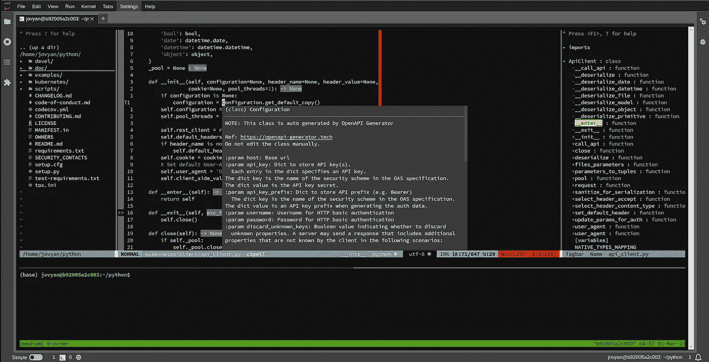
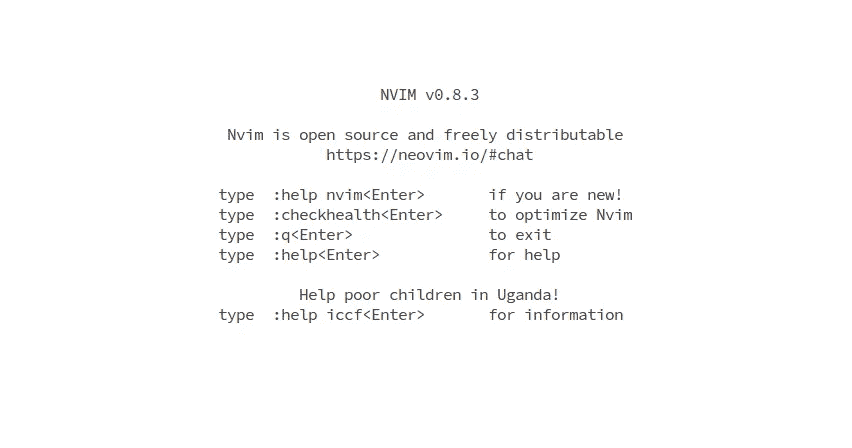
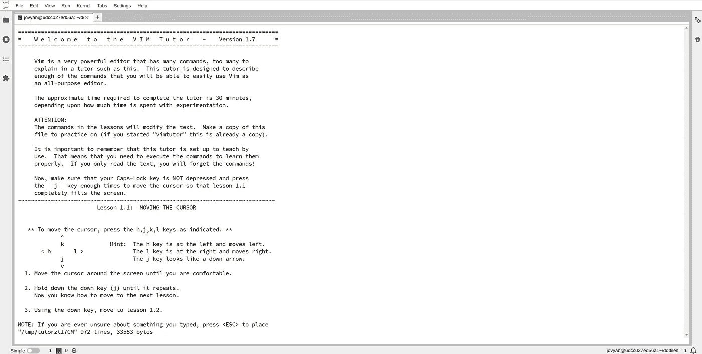

# 释放 JupyterLab 的潜力：发现你从未知道过的强大文本编辑器

> 原文：[`towardsdatascience.com/unlocking-the-potential-of-jupyterlab-discover-the-powerful-text-editor-you-never-knew-you-had-af18bf5bce3f`](https://towardsdatascience.com/unlocking-the-potential-of-jupyterlab-discover-the-powerful-text-editor-you-never-knew-you-had-af18bf5bce3f)

## 在 JupyterLab 中通过一个优秀的文本编辑器释放你的编码效率和生产力

[](https://dpoulopoulos.medium.com/?source=post_page-----af18bf5bce3f--------------------------------)[](https://towardsdatascience.com/?source=post_page-----af18bf5bce3f--------------------------------) [Dimitris Poulopoulos](https://dpoulopoulos.medium.com/?source=post_page-----af18bf5bce3f--------------------------------)

·发布在 [Towards Data Science](https://towardsdatascience.com/?source=post_page-----af18bf5bce3f--------------------------------) ·6 分钟阅读·2023 年 3 月 1 日

--


图片由 [Luca Bravo](https://unsplash.com/@lucabravo?utm_source=unsplash&utm_medium=referral&utm_content=creditCopyText) 提供，发布在 [Unsplash](https://unsplash.com/photos/XJXWbfSo2f0?utm_source=unsplash&utm_medium=referral&utm_content=creditCopyText)

本文是一个系列的第一部分。查看完整系列：第二部分、第三部分、第四部分。

JupyterLab 是一个开源的基于网页的交互式编码环境，许多人认为它并不是一个完整的 IDE。支持这一观点的众多原因之一是 JupyterLab 缺乏一个强大的文本编辑器。

[](/jupyter-is-now-a-full-fledged-ide-annual-review-751675634493?source=post_page-----af18bf5bce3f--------------------------------) ## Jupyter 现在是一个完整的 IDE：年度回顾

### 全面性、让你保持专注的工具和教育是 2022 年 Project Jupyter 的主要主题

towardsdatascience.com

JupyterLab 允许用户创建和分享包含实时代码、方程式、可视化和叙述性文本的文档。它提供了一个灵活而强大的平台，用于科学计算、数据分析和机器学习工作流，同时支持用户在各种环境中运行代码，从本地机器到远程服务器和云服务。

然而，许多数据科学家和工程师仅仅将其用于实验。当需要将他们的工作投入生产时，他们会转向 IDE 来将所有部分整合起来。

现如今最受欢迎的 IDE 是 Microsoft Visual Studio Code。VS Code 等工具提供了一个强大的文本编辑器、一个调试器以及多个插件，使得使用 Git、Docker 或几乎任何编程语言变得非常轻松。但如果我告诉你，你可以在 JupyterLab 中获得类似的体验，你会怎么想？

在这一系列文章中，我们将会在 JupyterLab 中打造一个类似于 VC Code 的体验，并创建一个 Docker 镜像，这样我们就可以在任何地方使用它作为我们的自定义工作区。让我们开始吧！

**这个故事的第二部分已经发布：**

[](/jupyter-already-has-a-perfect-text-editor-this-is-how-you-can-configure-it-4d3eb37878f1?source=post_page-----af18bf5bce3f--------------------------------) ## Jupyter 已经有一个完美的文本编辑器：这就是你可以如何配置它

### 如何在 Jupyter 中获得类似 VS Code 的体验以及一个出色的文本编辑器

[towardsdatascience.com

> [Learning Rate](https://www.dimpo.me/newsletter?utm_source=medium&utm_medium=article&utm_campaign=neovim) 是一本针对对机器学习和 MLOps 领域感兴趣的人的新闻通讯。如果你想了解更多类似的主题，可以[点击这里](https://www.dimpo.me/newsletter?utm_source=medium&utm_medium=article&utm_campaign=neovim)订阅。每个月的最后一个星期日，你将会收到我关于最新 MLOps 新闻和文章的更新和想法！

# 你为什么需要关心？

在我们开始之前，让我们先回答一个问题：你为什么需要关心这个问题？你已经有了 Visual Studio Code；为什么还要在 JupyterLab 中构建类似的体验？此外，VS Code 已经为 Jupyter Notebooks 提供了一个很好的编辑器。事实上，我通常觉得 VS Code 的 Notebooks UI 更好。

好吧，如果你本地编程，从不通过 ssh 连接到远程机器或使用不同的工作站来完成工作，那么你可能不需要这个。

然而，如今大多数人需要连接到远程服务器才能完成任务。例如，我使用 Kubeflow 来设计和运行我的 ML 实验和管道。Kubeflow 中的编码环境通常是一个 Jupyter 服务器。

那么，在这种情况下你会怎么做？拥有一个 VS Code 服务器可能是具有挑战性的。你要么需要[付费订阅](https://github.com/features/codespaces)，要么学会接受[code server](https://github.com/coder/code-server)（尽管是一个很棒的项目）的局限性。有没有替代方案，最好是开源的？

这个故事是为你准备的。在这一系列的最后，我们将在 JupyterLab 中建立一个强大的 Python 编码环境。将其扩展以支持更多编程语言将是微不足道的。

# Jupyter 已经有了一个完美的文本编辑器

可能会让人惊讶的是，JupyterLab 已经有一个很棒的文本编辑器。为什么呢？因为 Jupyter 有一个终端模拟器；因此，我们可以安装 Neovim。然后，我们可以将 Neovim 配置为我们想要的样子和行为。

本系列文章的终极目标是安装 Neovim，并使其像 Python IDE 一样工作。相信我，到最后，你将拥有从 VS Code 迁移到通用文本编辑器所需的核心组件，一个可以带到任何地方的编辑器。

完成的体验大致如下：



图片来自作者

我们看到一个完整的 IDE 体验，包含文件浏览器、代码大纲、集成终端、代码检查和带有代码补全和文档弹出的 IntelliSense！我们甚至有像美丽的状态栏和根据文件内容显示图标等小特性。

在未来的文章中，我们将探索每一个隐藏的宝石，比如多行注释、拼写检查器、窗格导航以及以 VS Code 原生方式配置插件。首先，让我们安装 Neovim 并创建我们的初始配置。

# 在 JupyterLab 中安装 Neovim

在 Jupyter 中创建类似 VS Code 的体验的第一步是运行一个可以配置的 Jupyter 服务器。我们将使用上游的数据科学镜像，从 DockerHub 拉取。因此，准备好后，请运行以下命令：

```py
docker run --name jupyter \
    -p 8888:8888 \
    --user root \
    -e GRANT_SUDO=yes \
    jupyter/datascience-notebook:latest
```

我们需要 `sudo` 权限，因为我们将安装各种 Debian 软件包和插件。我们传递的参数将授予默认用户（`jovyan`）无密码的 `sudo` 权限。有关更多信息，请参见 [文档](https://jupyter-docker-stacks.readthedocs.io/en/latest/using/recipes.html#using-sudo-within-a-container)。

接下来，在 JupyterLab 中启动终端并安装最新版本的 Neovim：

```py
wget https://github.com/neovim/neovim/releases/download/stable/nvim-linux64.deb && sudo dpkg -i nvim-linux64.deb
```

为了验证一切是否如预期那样工作，请运行 `nvim`。在撰写本文时，最新的稳定版本是 `v0.8.3`：



图片来自作者

# 学习 Vim

Neovim 基于 Vim，是一个强大且高度可定制的文本编辑器，主要用于类 Unix 操作系统。它设计为完全通过键盘使用，命令基于一系列按键和助记符缩写的组合。

那么，为什么选择 Neovim 而不是 Vim 呢？Neovim 是 Vim 的一个分支，这意味着它基于与 Vim 相同的核心代码，但具有额外的功能和改进。Neovim 的主要目标是提供更好的扩展性、更现代的开发实践和比 Vim 更可维护的代码库。

Neovim 相对于 Vim 有许多优点，但列举这些优点并不是本文的目标。不过，如果你知道如何在 Vim 中导航，你可以将这些知识转移到 Neovim 中。因此，让我们看看如何学习 Vim！

网上有很多资源；然而，在我看来，最好的方式是 `vimtutor`。首先，安装 Vim：

```py
sudo apt install vim
```

然后，在终端中运行 `vimtutor`：



图片来自作者

`vimtutor` 有七个课程，涵盖了 Vim 的基本概念。完成这个互动教程将为你提供开始使用 Vim 和 Neovim 所需的所有工具。

在这篇文章中，我留给你们一句话：学习你的 Vim 绑定！如果你忘记了一些按键，不用担心；练习会让一切变得更简单。

在接下来的文章中，我们将开始配置 Neovim。我们将从配置编辑器的核心功能和外观开始，然后深入探讨更多专业插件，这些插件将把我们的编辑器转变为功能丰富的 Python IDE。

# 关于作者

我叫 [Dimitris Poulopoulos](https://www.dimpo.me/?utm_source=medium&utm_medium=article&utm_campaign=neovim)，是一名在 [Arrikto](https://www.arrikto.com/) 工作的机器学习工程师。我为欧洲委员会、Eurostat、国际货币基金组织、欧洲中央银行、OECD 和宜家等主要客户设计和实施了 AI 和软件解决方案。

如果你有兴趣阅读更多关于机器学习、深度学习、数据科学和 DataOps 的文章，可以在 [Medium](https://towardsdatascience.com/medium.com/@dpoulopoulos/follow)、[LinkedIn](https://www.linkedin.com/in/dpoulopoulos/) 或 Twitter 上关注 [@james2pl](https://twitter.com/james2pl)。

表达的观点仅代表我个人，不代表我雇主的观点或意见。
