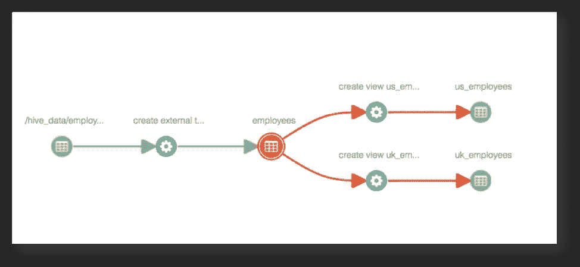
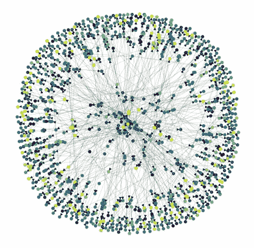
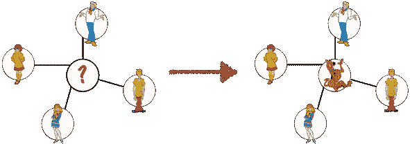
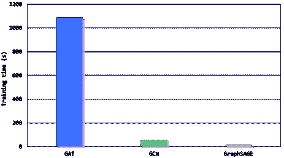
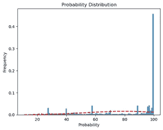
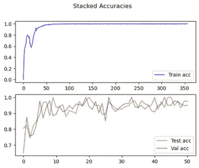
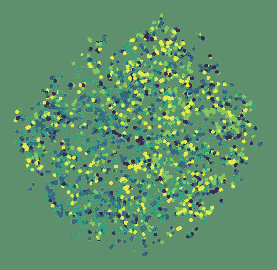
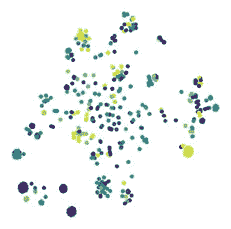

# 解锁大数据的力量：图学习的迷人世界

> 原文：[`towardsdatascience.com/unlocking-the-power-of-big-data-the-fascinating-world-of-graph-learning-c0a2ddf4043c?source=collection_archive---------8-----------------------#2023-11-09`](https://towardsdatascience.com/unlocking-the-power-of-big-data-the-fascinating-world-of-graph-learning-c0a2ddf4043c?source=collection_archive---------8-----------------------#2023-11-09)

## 利用深度学习将未开发的数据转变为长期竞争力的战略资产。

 [Mathieu Laversin](https://medium.com/@mathieulaversin3?source=post_page-----c0a2ddf4043c--------------------------------)

·

[关注](https://medium.com/m/signin?actionUrl=https%3A%2F%2Fmedium.com%2F_%2Fsubscribe%2Fuser%2Fd6ebca0f38b4&operation=register&redirect=https%3A%2F%2Ftowardsdatascience.com%2Funlocking-the-power-of-big-data-the-fascinating-world-of-graph-learning-c0a2ddf4043c&user=Mathieu+Laversin&userId=d6ebca0f38b4&source=post_page-d6ebca0f38b4----c0a2ddf4043c---------------------post_header-----------) 发表在 [Towards Data Science](https://towardsdatascience.com/?source=post_page-----c0a2ddf4043c--------------------------------) ·12 分钟阅读·2023 年 11 月 9 日

--


图片由 [Nathan Anderson](https://unsplash.com/@nathananderson?utm_source=unsplash&utm_medium=referral&utm_content=creditCopyText) 提供，[Unsplash](https://unsplash.com/s/photos/night-sky?utm_source=unsplash&utm_medium=referral&utm_content=creditCopyText) 上的照片

大公司生成和收集大量数据，以一个例子来说，90% 的数据是在最近几年创建的。然而，**73% 的这些数据仍然未被使用 [1]**。然而，正如你可能知道的那样，数据是从事大数据工作的公司的金矿。

深度学习不断发展，今天的挑战是将这些新解决方案调整到特定目标，以突出表现并增强长期竞争力。

我以前的经理很有直觉，认为这两个事件可以结合在一起，共同促进访问、请求，最重要的是避免浪费时间和金钱。

**为什么这些数据被闲置？**

访问这些数据需要很长时间，权利验证，特别是内容检查在授予用户访问权限之前是必需的。


可视化数据未被使用的原因。（由 Bing Image Creator 生成）

**有没有自动记录新数据的解决方案？**

如果你对大型企业不太熟悉，也没关系——我也是。这样环境中的一个有趣概念是使用大数据，特别是**HDFS**（Hadoop 分布式文件系统），它是一个旨在整合公司所有数据的集群。在这庞大的数据池中，你可以找到结构化数据，而在这些结构化数据中，Hive 列被引用。这些列中的一些用于创建附加表，并可能作为各种数据集的来源。公司通过数据血缘保持表与表之间的信息。

这些列还具有各种特征（领域、类型、名称、日期、所有者等）。项目的目标是用业务数据来记录被称为物理数据的数据。

**区分物理数据和业务数据：**

简而言之，物理数据是表格中的列名，而业务数据则是该列的使用方式。

例如：名为 Friends 的表格包含列（角色、薪资、地址）。我们的**物理数据**是角色、薪资和地址。**我们的业务数据**例如，

+   对于“Character” -> 角色的名称

+   对于“Salary” -> 薪资金额

+   对于“Address” -> 人的地址

这些业务数据将帮助访问数据，因为你可以直接获得所需的信息。你会知道这是你项目所需的数据集，**你寻找的信息** **在这个表格中**。所以你只需请求并找到你的幸福，提前去而不浪费时间和金钱。

*“在我的最后一次实习中，我和我的团队* ***实习生****，实现了一个大数据/图学习解决方案来记录这些数据。*

*这个想法是创建一个图来结构化我们的数据，并最终根据特征预测业务数据。换句话说，从存储在公司环境中的数据中，记录每个数据集以关联用途，将来减少搜索成本，并更具数据驱动。*

*我们有 830 个标签需要分类，但行数不多。希望图学习的力量能发挥作用。我让你阅读...“*

**文章目标：** 本文旨在提供对大数据概念、图学习、使用的算法及结果的理解。它还涉及部署考虑事项以及如何成功开发模型。

为了帮助你理解我的过程，本文的提纲包括：

+   **数据采集：为图创建获取必要数据**

+   **基于图的建模与 GSage**

+   **有效的部署策略**

# 数据采集

正如我之前提到的，数据通常存储在 Hive 列中。如果你还不知道，这些数据存储在大型容器中。我们通过称为 ETL 的技术提取、转换和加载这些数据。

我需要什么类型的数据？

+   **物理数据**及其**特征**（领域、名称、数据类型）。

+   **谱系**（物理数据之间的关系，如果它们经历了共同的转换）。

+   将“某些与业务数据相关的物理数据”进行**映射**，然后“让”算法自行执行。

**1.** **特征/特性**在我们存储数据时直接获得；它们在我们存储数据时是必需的。例如（取决于你的情况）：


**主要特征**的示例，（由作者提供）

对于特征，基于经验，我们决定对三列使用特征哈希器。

**特征哈希器：** 机器学习中用于将高维度的分类数据（如文本或分类变量）转换为低维度数值表示的技术，以减少内存和计算需求，同时保留有意义的信息。

如果你有类似的模式，可以选择**独热编码**技术。*如果你想交付你的模型，我建议使用特征哈希器。*

**2.** **谱系**稍微复杂一些，但并非不可理解。谱系就像**物理数据的历史**，我们大致了解已应用的转换以及数据存储在其他地方的位置。

想象一下你脑海中的大数据以及所有这些数据。在一些项目中，我们使用表格中的数据，并通过一个任务（Spark）进行转换。



从 Atlas 网站可视化的 Atlas 谱系，[LINK](https://atlas.apache.org/1.2.0/ClassificationPropagation.html)

我们收集了所有物理数据的信息，以便在我们的图中创建连接，或者至少创建其中一个连接。

**3.** **映射**是为我们的项目增值的基础。在这里，我们将业务数据与物理数据关联起来。这为算法提供了经过验证的信息，使其能够最终对新进来的数据进行分类。这个映射必须由了解公司流程的人完成，并且具备识别复杂模式的技能，而无需询问。

ML 建议，基于我自己的经验：

*引用 Andrew NG 先生的话，在经典机器学习中，有一种叫做算法生命周期的东西。我们常常考虑算法，使其复杂，而不只是使用一个老式的线性回归（我尝试过；它不起作用）。在这个生命周期中，包括所有的预处理、建模和监控阶段……但最重要的是，数据聚焦。*

**这是我们经常犯的错误；** 我们理所当然地开始进行数据分析。我们从数据集中得出结论，而有时却**没有质疑其相关性**。**不要忘记数据聚焦，我的朋友们；它可以提升你的表现，甚至导致项目的改变 :)**

回到我们的文章，获取数据后，我们最终可以**创建我们的图**。



**我们数据集的分布图**的绘图（使用[networkx](https://networkx.org/)制作）。(由作者制作)

该图考虑了一批 2000 行的数据，因此在数据集和表格中有 2000 列。你可以在中心找到业务数据，而偏离中心的是物理数据。

在数学中，我们将图表示为 G，**G(N, V, f)**。N 代表节点，V 代表顶点（边），f 代表特征。假设这三者都是非空集合。

对于节点（我们在映射表中有业务数据 ID）以及物理数据，以便通过谱系追踪它们。

**谈到谱系**，它部分作为边，通过映射和 ID 链接我们已有的链接。我们必须通过使用**Apache Atlas API**的 ETL 过程来提取它。

你可以看到，在奠定基础之后，大数据问题可以变得容易理解，但实施起来却更具挑战性，尤其对于一名年轻的实习生来说……


“计算机上的忍者卡通”（由 Dall.E 3 生成）

# **基于图的建模与 GSage**

## 图学习基础

本节将致力于解释 GSage 以及为何在数学和经验上都选择了它。

在这次实习之前，我不习惯使用图形。这就是为什么我购买了书籍**[2]**，我在描述中包含了它，因为它大大帮助我理解了原理。

[](https://www.amazon.fr/Graph-Machine-Learning-techniques-algorithms/dp/1800204493/ref=asc_df_1800204493/?tag=googshopfr-21&linkCode=df0&hvadid=506880135571&hvpos=&hvnetw=g&hvrand=13866138887051738726&hvpone=&hvptwo=&hvqmt=&hvdev=c&hvdvcmdl=&hvlocint=&hvlocphy=9055317&hvtargid=pla-1503184391952&psc=1&mcid=ad38156d270633babacde02db431d62c&source=post_page-----c0a2ddf4043c--------------------------------) [## 图机器学习：通过应用机器学习技术将图数据提升到一个新的水平……

### 注意 /5。请查阅《图机器学习：通过应用机器学习技术将图数据提升到一个新的水平》……

[www.amazon.fr](https://www.amazon.fr/Graph-Machine-Learning-techniques-algorithms/dp/1800204493/ref=asc_df_1800204493/?tag=googshopfr-21&linkCode=df0&hvadid=506880135571&hvpos=&hvnetw=g&hvrand=13866138887051738726&hvpone=&hvptwo=&hvqmt=&hvdev=c&hvdvcmdl=&hvlocint=&hvlocphy=9055317&hvtargid=pla-1503184391952&psc=1&mcid=ad38156d270633babacde02db431d62c&source=post_page-----c0a2ddf4043c--------------------------------)

原理很简单：当我们谈论图学习时，我们必然会讨论嵌入。**在这个背景下，节点及其邻近关系在数学上被转换为减少原始数据集维度的系数**，使计算更加高效。在降维过程中，解码器的一个关键原则**是保持初始接近的节点之间的邻近关系**。

另一个灵感来源是 [Maxime Labonne](https://medium.com/u/dc89da634938?source=post_page-----c0a2ddf4043c--------------------------------) **[3]**，他对 GraphSages 和图卷积网络的解释展示了极佳的教学法，提供了清晰易懂的例子，使这些概念对希望深入了解的人变得更加易于理解。

# ***GraphSage 的模型***

如果这个术语对你来说不熟悉，请放心，几个月前我也在你的位置。像注意力网络和图卷积网络这样的架构曾让我经历了不少噩梦，更重要的是，它们*让我夜不能寐*。

为了节省你整天的时间，尤其是你的通勤时间，我将为你简化算法。

一旦你有了嵌入，这时候魔法才会发生。但你问一切是如何运作的？



基于《史酷比宇宙》的图解来解释 GSage（由作者制作）。

“**你以交友闻名**”这句话，你必须记住。

因为 GraphSAGE 的一个基本假设是**同一邻域中的节点应该表现出类似的嵌入**。为实现这一点，GraphSAGE 使用**聚合函数**，将邻域作为输入，并结合每个邻居的嵌入及特定权重。这就是为什么神秘公司嵌入会出现在 Scooby 的邻域中的原因。

本质上，它从邻域收集信息，权重可以是学习得出的，也可以是固定的，具体取决于损失函数。

当聚合器权重被学习时，GraphSAGE 的真正实力便会显现。此时，该架构可以利用节点的特征和邻域为未见节点生成嵌入，使其成为图基机器学习中各种应用的强大工具。



架构训练时间的差异，Maxime Labonne 的文章，[链接](https://mlabonne.github.io/blog/posts/2022-04-06-GraphSAGE.html)

如你在此图中所见，当我们在 GraphSage 架构上使用相同的数据集时，训练时间会减少。GAT（图注意网络）和 GCN（图卷积网络）也是非常有趣的图架构。我真的鼓励你关注！

*第一次计算时，我感到震惊，震惊于看到训练 1000 批次在数千行数据上仅需 25 秒。*

我知道你现在对图学习感兴趣，并想了解更多，我的建议是阅读这位作者的内容。提供了很好的示例和建议。

[](/introduction-to-graphsage-in-python-a9e7f9ecf9d7?source=post_page-----c0a2ddf4043c--------------------------------) ## GraphSAGE: 扩展图神经网络

### 使用 PyTorch Geometric 的 GraphSAGE 简介

[ 

作为 Medium 的读者，当我查看一篇新文章时，我会好奇阅读代码，对于你来说，我们可以在 PyTorch Geometric 中实现 GraphSAGE 架构，使用`SAGEConv`层。

让我们创建一个包含两个`SAGEConv`层的网络：

+   第一个使用了*ReLU*作为激活函数和一个**dropout 层**；

+   第二个直接输出**节点嵌入**。

在我们的多类分类任务中，我们选择使用交叉熵损失作为主要损失函数。这一选择是由于其适用于具有多个类别的分类问题。此外，我们还采用了强度为 0.0005 的 L2 正则化。

**这种正则化技术有助于防止过拟合**，通过对大参数值进行惩罚来促进模型的泛化。这是一种确保模型稳定性和预测准确性的全面方法。

```py
import torch
from torch.nn import Linear, Dropout
from torch_geometric.nn import SAGEConv, GATv2Conv, GCNConv
import torch.nn.functional as F

class GraphSAGE(torch.nn.Module):
  """GraphSAGE"""
  def __init__(self, dim_in, dim_h, dim_out):
    super().__init__()
    self.sage1 = SAGEConv(dim_in, dim_h)
    self.sage2 = SAGEConv(dim_h, dim_out)#830 for my case
    self.optimizer = torch.optim.Adam(self.parameters(),
                                      lr=0.01,
                                      weight_decay=5e-4)

  def forward(self, x, edge_index):
    h = self.sage1(x, edge_index).relu()
    h = F.dropout(h, p=0.5, training=self.training)
    h = self.sage2(h, edge_index)
    return F.log_softmax(h, dim=1)

  def fit(self, data, epochs):
    criterion = torch.nn.CrossEntropyLoss()
    optimizer = self.optimizer

    self.train()
    for epoch in range(epochs+1):
      total_loss = 0
      acc = 0
      val_loss = 0
      val_acc = 0

      # Train on batches
      for batch in train_loader:
        optimizer.zero_grad()
        out = self(batch.x, batch.edge_index)
        loss = criterion(out[batch.train_mask], batch.y[batch.train_mask])
        total_loss += loss
        acc += accuracy(out[batch.train_mask].argmax(dim=1), 
                        batch.y[batch.train_mask])
        loss.backward()
        optimizer.step()

        # Validation
        val_loss += criterion(out[batch.val_mask], batch.y[batch.val_mask])
        val_acc += accuracy(out[batch.val_mask].argmax(dim=1), 
                            batch.y[batch.val_mask])

      # Print metrics every 10 epochs
      if(epoch % 10 == 0):
          print(f'Epoch {epoch:>3} | Train Loss: {total_loss/len(train_loader):.3f} '
                f'| Train Acc: {acc/len(train_loader)*100:>6.2f}% | Val Loss: '
                f'{val_loss/len(train_loader):.2f} | Val Acc: '
                f'{val_acc/len(train_loader)*100:.2f}%')

def accuracy(pred_y, y):
    """Calculate accuracy."""
    return ((pred_y == y).sum() / len(y)).item()

@torch.no_grad()
def test(model, data):
    """Evaluate the model on test set and print the accuracy score."""
    model.eval()
    out = model(data.x, data.edge_index)
    acc = accuracy(out.argmax(dim=1)[data.test_mask], data.y[data.test_mask])
    return acc
```

# 模型的部署：

在我们项目的开发和部署过程中，我们利用了三种关键技术，每种技术都有其独特而重要的作用：


来自[Google](https://www.google.com/)的三个标志

**Airflow：** 为了高效管理和调度我们项目复杂的数据工作流，我们使用了 Airflow Orchestrator。Airflow 是一个**广泛采用的任务调度工具**，可以自动化流程，并确保我们的数据管道平稳且按时运行。

**Mirantis：** 我们项目的基础设施是在 Mirantis 云平台上构建和托管的。Mirantis 以提供**强大、可扩展和可靠的云解决方案**而闻名，为我们的**部署**提供了坚实的基础。

**Jenkins：** 为了简化我们的开发和部署流程，我们依赖 Jenkins，一个在持续集成和**持续交付（CI/CD）**领域中值得信赖的名字。Jenkins 自动化了**项目的构建、测试和部署**，确保了我们开发周期中的**效率**和**可靠性**。

此外，我们将我们的机器学习代码存储在公司的 Artifactory 中。 **但什么是 Artifactory？**

**Artifactory:** Artifactory 是一个集中式仓库管理器，用于存储、管理和分发各种工件，如代码、库和依赖项。它作为一个 **安全** 和有组织的存储空间，确保所有团队成员都可以轻松访问所需的资产。这使得 **协作无缝并简化了应用程序和项目的部署**，使其成为高效开发和部署工作流程的宝贵资产。

通过将我们的机器学习代码存储在 Artifactory 中，我们确保了我们的模型和数据 **可以轻松支持通过 Jenkins 部署**。

ET VOILA ! 解决方案已部署。

我谈了很多关于基础设施的内容，但对机器学习和我们取得的结果讲得不多。

# 结果 :

## 预测的可信度 :

对于每个物理数据，我们考虑了 2 个预测，因为模型性能的原因。

这怎么可能？

```py
probabilities = torch.softmax(raw_output, dim = 1)
#torch.topk to get the top 3 probabilites and their indices for each prediction
topk_values, topk_indices = torch.topk(probabilities, k = 2, dim = 1)
```

首先，我使用了一个 softmax 函数来使输出可比，然后使用了一个名为 [torch.topk](https://pytorch.org/docs/stable/generated/torch.topk.html) 的函数。它返回给定 `input` 张量在指定维度上的 `k` 个最大元素。

那么，回到第一次预测，这里是我们训练后的分布。告诉你们，真棒！



**模型输出的概率**的绘图（来自 matplotlib），第一次预测（由作者制作）

## 训练/测试/验证中的准确率和损失。

我不会教你什么是机器学习中的准确率和损失，我假设你们都是专家……（如果不确定，可以询问 ChatGPT，没有羞耻感）。在训练中，通过不同的尺度，你可以看到曲线上的收敛，这很好，说明学习稳定。



**准确率和损失**的绘图（matplotlib）（由作者制作）

## t-SNE :

t-SNE（t-分布随机邻域嵌入）是一种降维技术，用于通过在较低维空间中保留数据点之间的成对相似性来可视化和探索高维数据。

换句话说，想象一下训练前的随机分布 :



数据分布 **训练前，**（由作者制作）

记住我们正在做多分类，因此这是训练后的分布。特征的聚合似乎做得很满意。聚类形成，物理数据似乎已加入组，表明训练进行了良好。



数据分布 **训练后，**（由作者制作）

# 结论 :

我们的目标是基于物理数据预测业务数据（而且我们做到了）。我很高兴地通知你，该算法现在已投入生产，并正在为未来的用户进行接入。

虽然由于专有原因我不能提供完整的解决方案，但我相信你已经掌握了所有必要的细节，或者你完全有能力自行实施。

我最后的一条建议，我发誓，拥有一个出色的团队，不仅是那些工作出色的人，还有那些每天让你开心的人。

如果你有任何问题，请随时联系我。*随时与我联系，我们可以详细讨论。*

**如果我没见到你，下午好，晚上好，晚安！**

你掌握了吗？

正如**钱德勒·宾**可能会说：

> **“说谎总比进行复杂的讨论要好”**

别忘了点赞和分享！

# 参考资料和资源

**[1]** [Inc](https://www.inc.com/jeff-barrett/misusing-data-could-be-costing-your-business-heres-how.html)（2018），来自 Inc 的网络文章

**[2]** [图机器学习：通过应用机器学习技术和算法将图数据提升到一个新水平](https://www.amazon.fr/Graph-Machine-Learning-techniques-algorithms/dp/1800204493/ref=asc_df_1800204493/?tag=googshopfr-21&linkCode=df0&hvadid=506880135571&hvpos=&hvnetw=g&hvrand=7038120787362687179&hvpone=&hvptwo=&hvqmt=&hvdev=c&hvdvcmdl=&hvlocint=&hvlocphy=9055317&hvtargid=pla-1503184391952&psc=1&mcid=ad38156d270633babacde02db431d62c)（2021），Claudio Stamile

**[3]** GraphSAGE，扩展图神经网络，（2021），Maxime Labonne

# 图片来源

+   [Nathan Anderson](https://unsplash.com/@nathananderson?utm_source=unsplash&utm_medium=referral&utm_content=creditCopyText)的照片，来源于[Unsplash](https://unsplash.com/s/photos/night-sky?utm_source=unsplash&utm_medium=referral&utm_content=creditCopyText)

+   GraphSAGE 时间差，来自 Maxime Labonne 的文章，[链接](https://mlabonne.github.io/blog/posts/2022-04-06-GraphSAGE.html)

+   Atlas Lineage 可视化，来自 Atlas 网站，[链接](https://atlas.apache.org/1.2.0/ClassificationPropagation.html)

+   三个标志来自[Google](https://www.google.com/)
