# 解锁线性回归中交互项的力量

> 原文：[`towardsdatascience.com/unlocking-the-power-of-interaction-terms-in-linear-regression-ba30c2cf158f`](https://towardsdatascience.com/unlocking-the-power-of-interaction-terms-in-linear-regression-ba30c2cf158f)


图片由 [Denys Nevozhai](https://unsplash.com/@dnevozhai?utm_source=unsplash&utm_medium=referral&utm_content=creditCopyText) 提供，来自 [Unsplash](https://unsplash.com/photos/7nrsVjvALnA?utm_source=unsplash&utm_medium=referral&utm_content=creditCopyText)

## 了解如何通过包含交互项来使你的线性模型更灵活

[](https://eryk-lewinson.medium.com/?source=post_page-----ba30c2cf158f--------------------------------)[](https://towardsdatascience.com/?source=post_page-----ba30c2cf158f--------------------------------) [Eryk Lewinson](https://eryk-lewinson.medium.com/?source=post_page-----ba30c2cf158f--------------------------------)

·发表于 [Towards Data Science](https://towardsdatascience.com/?source=post_page-----ba30c2cf158f--------------------------------) ·10 分钟阅读·2023 年 5 月 18 日

--

线性回归是一个强大的统计工具，用于建模因变量与一个或多个自变量（特征）之间的关系。在回归分析中，一个重要但常被忽视的概念是*交互项*。简而言之，交互项使我们能够检查目标与自变量之间的关系是否会根据另一个自变量的值而变化。

交互项是回归分析中的一个关键组成部分，了解它们如何工作可以帮助从业者更好地训练模型并解释数据。尽管它们很重要，但交互项可能很难理解。

在这篇文章中，我们将提供一个关于线性回归中交互项的直观解释。

# 回归模型中的交互项是什么？

首先，让我们考虑更简单的情况，即没有交互项的线性模型。这样的模型假设每个特征或预测变量对因变量（目标）的影响与模型中的其他预测变量无关。

以下方程描述了具有两个特征的模型规格：

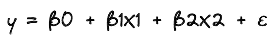

为了使解释更容易理解，我们使用一个例子。假设我们对使用两个特征建模房地产价格（*y*）感兴趣：其大小（*X1*）和一个布尔标志，指示公寓是否位于市中心（*X2*）。*β0* 是截距，*β1* 和 *β2* 是线性模型的系数，*ε* 是误差项（模型未解释的部分）。

收集数据并估计线性回归模型后，我们得到以下系数：

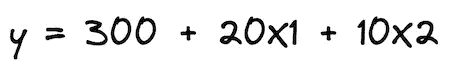

了解估计的系数，并且 *X2* 是一个布尔特征后，我们可以根据 *X2* 的值写出两个可能的情景。

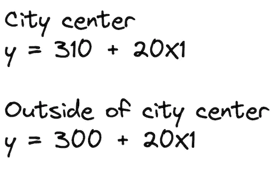

如何解释这些？虽然在房地产的背景下这可能没有太大意义，但我们可以说，市中心一平方米的公寓价格为 310（截距的值），每增加一平方米的空间价格增加 20。另一种情况下，唯一的区别是截距减少了 10 个单位。下图展示了两条最佳拟合线。

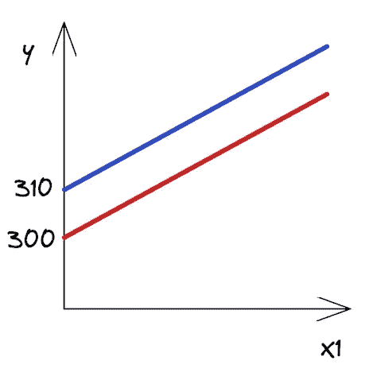

*市中心和市外房地产的回归线*

正如我们所见，这些线是平行的，并且它们具有相同的斜率——*X1* 的系数，在这两种情况下都是相同的。

# 交互项表示共同影响

此时你可能会争辩说，市中心一平方米的公寓比郊区的一平方米公寓更贵。换句话说，这两个特征可能对房地产价格有共同的影响。

因此，我们认为不仅截距在这两种情况之间应该不同，而且线的斜率也应该不同。如何实现这一点？这正是交互项发挥作用的时候。交互项使模型的规格更具灵活性，并允许我们考虑这些模式。

交互项实际上是我们认为对目标有共同影响的两个特征的乘积。以下方程展示了模型的新规格：

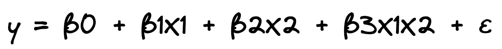

再次假设我们已经估计了我们的模型，并且我们知道了系数。为了简化，我们保留了与之前示例相同的值。请记住，在现实生活中，它们很可能会有所不同。

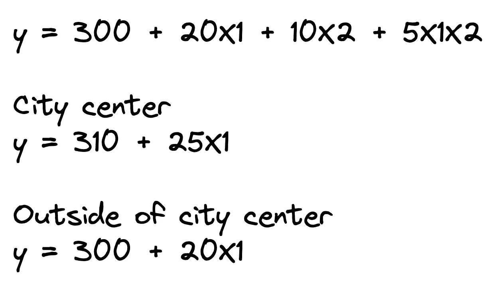

一旦我们写出 *X2*（市中心或非市中心）的两个情景，我们可以立即看到两条线的斜率（*X1* 的系数）不同。正如我们假设的那样，市中心的额外一平方米现在比郊区更贵。

# 解释带有交互项的系数

向模型中添加交互项会改变所有系数的解释。在没有交互项的情况下，我们将系数解释为预测变量对因变量的唯一影响。

在我们的案例中，我们可以说*β1*是公寓面积对其价格的唯一影响。然而，加入交互项后，公寓面积的影响在不同的*X2*值下是不同的。换句话说，公寓面积对其价格的唯一影响不再局限于*β1*。

为了更好地理解每个系数所代表的含义，让我们再看一眼包含交互项的线性模型的原始规范。提醒一下，*X2*是一个布尔特征，表示某个公寓是否在市中心。


现在，我们可以按以下方式解释每个系数：

+   *β0* — 市中心以外公寓的截距（或具有布尔特征*X2*值为 0 的任何组），

+   *β1* — 市中心以外公寓的斜率（价格的影响），

+   *β2* — 两组之间截距的差异，

+   *β3* — 市中心公寓与市中心以外公寓之间斜率的差异。

例如，假设我们正在检验一个假设，即公寓面积对其价格的影响是均等的，无论公寓是否在市中心。然后，我们将估计包含交互项的线性回归，并检查*β3*是否显著不同于 0。

关于交互项的一些附加说明：

+   我们展示了双向交互项，但也可以有更高阶的交互项（例如，涉及 3 个特征）。

+   在我们的示例中，我们展示了数值特征（公寓面积）与布尔特征（公寓是否在市中心）的交互。然而，我们也可以创建两个数值特征的交互项。例如，我们可以创建公寓面积与房间数量的交互项。有关更多细节，请参考*References*部分提到的来源。

+   交互项可能在统计上显著，但主要效应可能不显著。此时，我们应遵循层次原则，即如果我们在模型中包含了交互项，也应包括主要效应，即使它们的影响在统计上不显著。

# Python 实操示例

经过所有的理论介绍后，让我们看看如何在 Python 中向线性回归模型添加交互项。和往常一样，我们从导入所需的库开始。

```py
import numpy as np
import pandas as pd

import statsmodels.api as sm
import statsmodels.formula.api as smf

# plotting
import seaborn as sns 
import matplotlib.pyplot as plt

# settings
plt.style.use("seaborn-v0_8")
sns.set_palette("colorblind")
plt.rcParams["figure.figsize"] = (16, 8)
%config InlineBackend.figure_format = 'retina'
```

在我们的例子中，我们将使用`statsmodels`库来估计线性模型。对于数据集，我们将使用`mtcars`数据集。我非常确定，如果你曾经使用过 R，你对这个数据集已经很熟悉了。首先，我们加载数据集：

```py
mtcars = sm.datasets.get_rdataset("mtcars", "datasets", cache=True)
print(mtcars.__doc__)
```

执行代码片段会打印数据集的详细描述。我们只展示相关部分——总体描述和列定义：

```py
 ====== ===============
   mtcars R Documentation
   ====== ===============

   The data was extracted from the 1974 *Motor Trend* US magazine, and
   comprises fuel consumption and 10 aspects of automobile design and
   performance for 32 automobiles (1973–74 models).

   A data frame with 32 observations on 11 (numeric) variables.

   ===== ==== ========================================
   [, 1] mpg  Miles/(US) gallon
   [, 2] cyl  Number of cylinders
   [, 3] disp Displacement (cu.in.)
   [, 4] hp   Gross horsepower
   [, 5] drat Rear axle ratio
   [, 6] wt   Weight (1000 lbs)
   [, 7] qsec 1/4 mile time
   [, 8] vs   Engine (0 = V-shaped, 1 = straight)
   [, 9] am   Transmission (0 = automatic, 1 = manual)
   [,10] gear Number of forward gears
   [,11] carb Number of carburetors
   ===== ==== ========================================
```

然后，我们从加载的对象中提取实际数据集：

```py
df = mtcars.data
df.head()
```

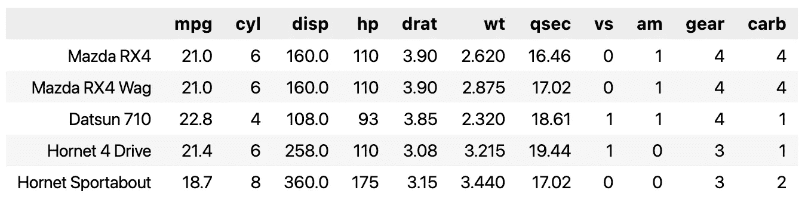

*mtcars 数据集的预览*

以我们的例子为例，假设我们要调查每加仑英里数（`mpg`）与两个特征的关系：重量（`wt`，连续变量）和传输类型（`am`，布尔值）。

首先，我们绘制数据以获取一些初步见解。

```py
sns.lmplot(x="wt", y="mpg", hue="am", data=df, fit_reg=False)
plt.ylabel("Miles per Gallon")
plt.xlabel("Vehicle Weight");
```

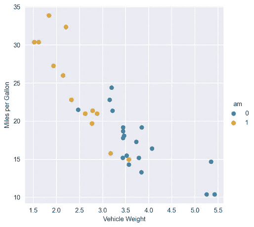

*每加仑英里数与车辆重量的散点图，按传输类型着色*

仅通过目测图表，我们可以看出`am`变量的两个类别的回归线会有很大不同。为了比较，我们首先使用没有交互项的模型。

```py
model_1 = smf.ols(formula="mpg ~ wt + am", data=df).fit()
model_1.summary()
```

以下表格展示了在没有交互项的情况下拟合线性回归的结果。

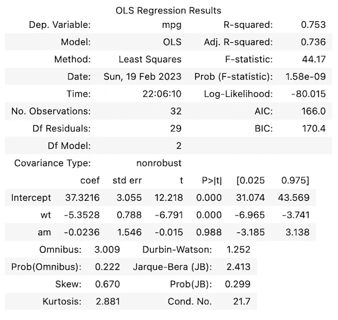

从摘要表中，我们可以看到`am`特征的系数在统计上不显著。利用我们已学到的系数解释方法，我们可以绘制`am`特征两个类别的最佳拟合线。

```py
X = np.linspace(1, 6, num=20)
sns.lmplot(x="wt", y="mpg", hue="am", data=df, fit_reg=False)
plt.title("Best fit lines for from the model without interactions")
plt.ylabel("Miles per Gallon")
plt.xlabel("Vehicle Weight")
plt.plot(X, 37.3216 - 5.3528 * X, "blue")
plt.plot(X, (37.3216 - 0.0236) - 5.3528 * X, "orange");
```

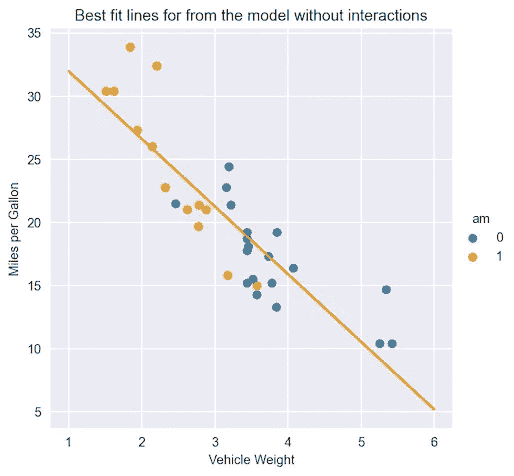

*两种传输类型的最佳拟合线*

由于`am`特征的系数基本为零，这些线几乎重叠。

接下来，我们使用第二个模型，这次包括两个特征之间的交互项。下面展示了如何在`statsmodels`公式中添加交互项作为额外输入。

```py
model_2 = smf.ols(formula="mpg ~ wt + am + wt:am", data=df).fit()
model_2.summary()
```

以下摘要表展示了包含交互项的线性回归拟合结果。

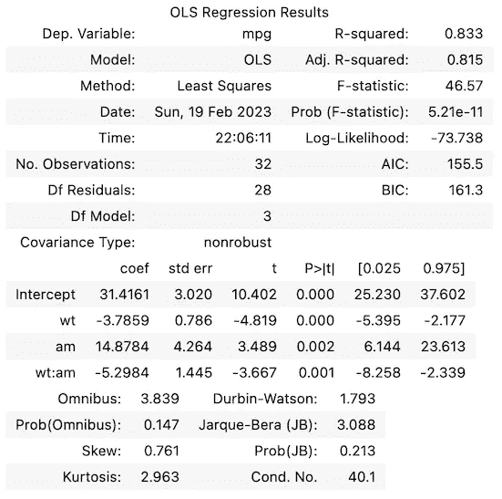

我们可以从摘要表中快速得出两个结论：

+   所有系数，包括交互项，都在统计上显著。

+   通过检查 R2（以及它的调整变体，因为模型中的特征数量不同），我们可以说含有交互项的模型拟合效果更好。

与之前的情况类似，我们绘制最佳拟合线。

```py
X = np.linspace(1, 6, num=20)
sns.lmplot(x="wt", y="mpg", hue="am", data=df, fit_reg=False)
plt.title("Best fit lines for from the model with interactions")
plt.ylabel("Miles per Gallon")
plt.xlabel("Vehicle Weight")
plt.plot(X, 31.4161 - 3.7859 * X, "blue")
plt.plot(X, (31.4161 + 14.8784) + (-3.7859 - 5.2984) * X, "orange");
```

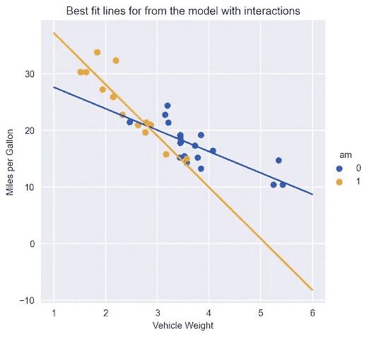

*两种传输类型的最佳拟合线，包括交互项*

我们可以立即看到自动传输和手动传输汽车的拟合线（无论是截距还是斜率）之间的差异。

*附加信息：* 我们还可以使用`scikit-learn`的`PolynomialFeatures`添加交互项。这个变换器不仅提供了添加任意阶交互项的可能性，还创建了多项式特征（例如，现有特征的平方值）。更多信息，请参见[文档](https://scikit-learn.org/stable/modules/generated/sklearn.preprocessing.PolynomialFeatures.html)。

# 总结

在处理线性回归中的交互项时，有几点需要记住：

+   交互项允许我们检查目标与特征之间的关系是否会根据另一个特征的值而变化。

+   我们将交互项添加为原始特征的乘积。通过将这些新变量添加到回归模型中，我们可以测量它们与目标之间交互的影响。正确解释交互项的系数对于理解关系的方向和强度至关重要。

+   使用交互项可以使线性模型的规格更加灵活（不同的线条具有不同的斜率），这可以导致更好的数据拟合和更好的预测性能。

你可以在我的[GitHub 仓库](https://github.com/erykml/medium_articles/blob/master/Statistics/interaction_terms_in_linear_regression.ipynb)中找到本文使用的代码。像往常一样，任何建设性的反馈都是非常欢迎的。你可以通过[Twitter](https://twitter.com/erykml1)或在评论中联系我。

*喜欢这篇文章？成为 Medium 会员，继续通过无障碍阅读来学习。如果你使用* [*这个链接*](https://eryk-lewinson.medium.com/membership) *成为会员，你将以无额外费用支持我。提前感谢，期待与你相见！*

你可能还对以下内容感兴趣：

[](/a-comprehensive-overview-of-regression-evaluation-metrics-6264af0926db?source=post_page-----ba30c2cf158f--------------------------------) ## 回归评估指标的全面概述

### 详细参考常用的回归评估指标及其在各种实际应用中的应用…

[## 线性回归系数的解释 [](/interpreting-the-coefficients-of-linear-regression-cc31d4c6f235?source=post_page-----ba30c2cf158f--------------------------------) ## 线性回归系数的解释

### 了解如何正确解释线性回归的结果——包括变量变换的情况

[## 关于线性回归你可能不知道的一件事 [](/one-thing-you-might-not-have-known-about-linear-regression-634446de7559?source=post_page-----ba30c2cf158f--------------------------------) ## 线性回归系数的解释

### 如何训练一个具有多个输出的单一模型

towardsdatascience.com [](/the-minimalists-guide-to-experiment-tracking-with-dvc-f07e4636bdbb?source=post_page-----ba30c2cf158f--------------------------------) ## 极简主义者的实验跟踪指南

### 入门实验跟踪的最低限度指南

towardsdatascience.com

# 参考文献

+   [`rinterested.github.io/statistics/lm_interactions_output_interpretation.html`](https://rinterested.github.io/statistics/lm_interactions_output_interpretation.html)

+   [`janhove.github.io/analysis/2017/06/26/continuous-interactions`](https://janhove.github.io/analysis/2017/06/26/continuous-interactions)

+   [`ademos.people.uic.edu/Chapter13.html`](https://ademos.people.uic.edu/Chapter13.html)

+   [`joelcarlson.github.io/2016/05/10/Exploring-Interactions/`](https://joelcarlson.github.io/2016/05/10/Exploring-Interactions/)

+   Henderson 和 Velleman (1981)，互动式构建多重回归模型。*生物统计学*，**37**，391–411。

+   `mtcars` 数据集是 R 基础发行版的一部分，并且在 GNU 通用公共许可证 (GPL) 下发布

除非另有说明，否则所有图片均由作者提供。

*最初发布于* [*NVIDIA 开发者博客*](https://developer.nvidia.com/blog/a-comprehensive-guide-to-interaction-terms-in-linear-regression/) *2023 年 4 月 26 日*
