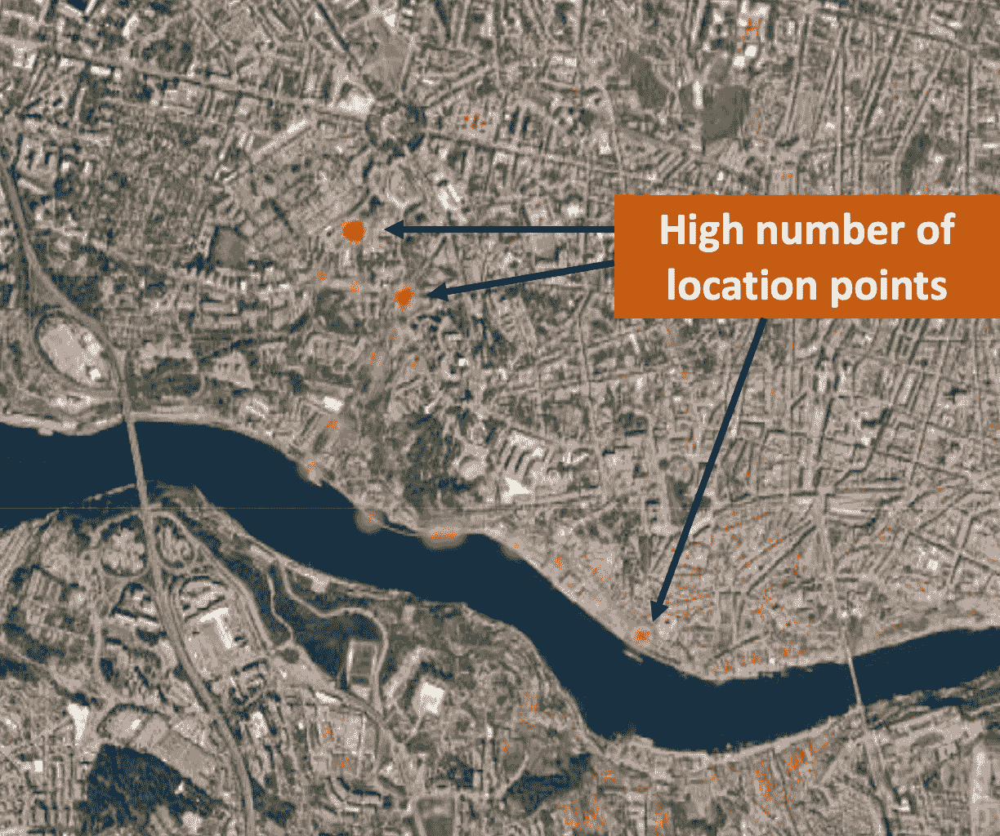

# 解锁路线可视化的力量：3 种基本技巧

> 原文：[`towardsdatascience.com/unlocking-the-power-of-route-visualization-3-essential-techniques-d9a4dbce4fec`](https://towardsdatascience.com/unlocking-the-power-of-route-visualization-3-essential-techniques-d9a4dbce4fec)

## 分析路线的必知技巧

 [Pranay Dave](https://pranay-dave9.medium.com/?source=post_page-----d9a4dbce4fec--------------------------------)

·发布于 [Towards Data Science](https://towardsdatascience.com/?source=post_page-----d9a4dbce4fec--------------------------------) ·4 分钟阅读·2023 年 1 月 29 日

--

图片由 [José Martín Ramírez Carrasco](https://unsplash.com/es/@martinirc?utm_source=unsplash&utm_medium=referral&utm_content=creditCopyText) 提供，来源于 [Unsplash](https://unsplash.com/s/photos/route?utm_source=unsplash&utm_medium=referral&utm_content=creditCopyText)

路线可视化对交通规划、物流和供应链管理至关重要。在 AI 和数据科学领域，它被用于 ETA（预计到达时间）或车队优化等各种应用。

在博客中，我将介绍可视化路线的顶级技巧。为了说明博客内容，我将以波尔图市的出租车数据为例。出租车配有 IoT 设备，每 15 秒发出一次位置。

为了说明目的，我将使用与一次出租车旅行相关的数据。这些数据包含出租车在每个位置的速度和位置。

出租车轨迹数据（图片由作者提供）

现在让我们使用不同的技巧来可视化数据。

# 1. 路线折线图——基本但必备的技巧

路线折线图通常创建一个宽度为两像素的红色线条，显示路径或轨迹。

路线折线图（图片由作者提供）

这是一个简单但非常有效的技巧，用于可视化出租车的行驶路线，从 Palacio de Bolso 到 HF Tuela Porto。你还可以观察到，路线的一半沿着杜罗河，另一半在城市内部。

看到简单的表格数据转变为充满见解的可视化图表总是令人惊叹！

# 2. 路线热力图——炫酷的展示

让我们通过使用热图来使分析更加生动。这里展示的是相同的路线，但用红色和绿色点标记。红色点表示数据中有更多的定位点，相比之下绿色点则较少。

路线热图（图片由作者提供）

上图中带有红色和绿色点的卫星地图，看起来像是一部惊悚片的场景！

我们可以观察到定位点更多的地方。由于物联网传感器每 15 秒发射一次数据，这意味着出租车停了下来或速度较慢。通过进一步的分析，我们可以得出结论，出租车在起点和终点停靠，在转弯处速度较慢。

如你所见，与路线折线图相比，这提供了更多的信息。

# 3\. 路线标记分析——在路线中加入数据分析

现在，让我们通过将路线分析与数据分析结合起来使其更加智能。数据中有一个速度列，急需被分析！让我们为这个列做一些公正的分析。

分析附加数据的有效方法之一是使用标记。下图展示了带有标记的路线，这些标记指示了最大速度点。

带有最大速度标记的路线分析（图片由作者提供）

除了最大速度之外，你可以引入其他任何数据科学技术。其中一个有趣的分析是异常值分析。这里展示的是带有标记的路线，标记指示了高值的异常点。

带有异常速度标记的路线分析（图片由作者提供）

也可以将其与箱线图进行比较。通常，在速度分析中，只有高值的异常值是有用的。

速度箱线图（图片由作者提供）

基于数据科学算法放置标记提升了路线分析。这里你看到的是速度的示例，但你可以在其他各种数据上引入标记，例如加速度或任何其他车辆传感器数据。

# 结论

路线可视化可以通过简单、花哨和智能的技术来完成。掌握所有这些技术对于有效解决交通规划、物流和供应链管理等关键用例非常有用。

# 数据源

用于本文的数据摘自以下数据集：[`archive.ics.uci.edu/ml/datasets/Taxi+Service+Trajectory+-+Prediction+Challenge,+ECML+PKDD+2015`](https://archive.ics.uci.edu/ml/datasets/Taxi+Service+Trajectory+-+Prediction+Challenge,+ECML+PKDD+2015)

可用于商业或非商业用途，引用时请使用以下说明

Moreira-Matias, L., Gama, J., Ferreira, M., Mendes-Moreira, J., Damas, L., “使用流数据预测出租车乘客需求”。发表于：IEEE 智能交通系统学报，第 14 卷，第 3 期，第 1393–1402 页，2013 年 9 月

请**使用我的推荐链接加入 Medium**。

 [## 使用我的推荐链接加入 Medium - Pranay Dave

### 阅读 Pranay Dave 和数以千计的其他作者在 Medium 上的每一个故事。您的会员费直接支持……

[pranay-dave9.medium.com](https://pranay-dave9.medium.com/membership?source=post_page-----d9a4dbce4fec--------------------------------)

请**订阅**以便每当我发布新故事时保持更新

 [## 每当 Pranay Dave 发布新内容时，获取电子邮件。

### 每当 Pranay Dave 发布新内容时，您将收到一封电子邮件。通过注册，您将创建一个 Medium 账户（如果您还没有的话）……

[pranay-dave9.medium.com](https://pranay-dave9.medium.com/subscribe?source=post_page-----d9a4dbce4fec--------------------------------)

# 额外资源

# 网站

您可以访问我的网站，这是一个无代码平台，从应用程序和业务用例的角度学习 AI 和数据科学。[**https://experiencedatascience.com**](https://experiencedatascience.com/)

# YouTube 频道

这是我 YouTube 频道的链接

[`www.youtube.com/c/DataScienceDemonstrated`](https://www.youtube.com/c/DataScienceDemonstrated)
