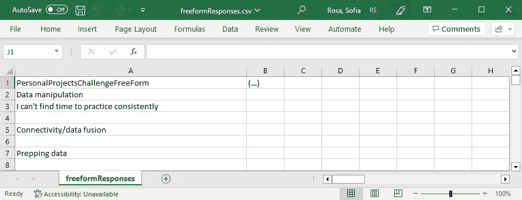
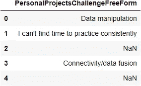
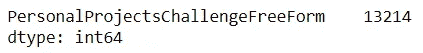
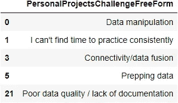
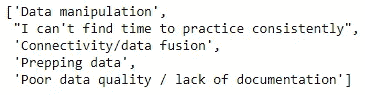
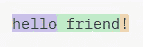
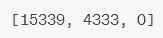
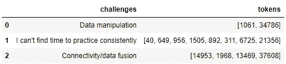
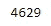
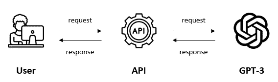

# 利用 LLMs 解锁文本数据的力量

> 原文：[`towardsdatascience.com/unlocking-the-power-of-text-data-with-llms-3ddcd063274a`](https://towardsdatascience.com/unlocking-the-power-of-text-data-with-llms-3ddcd063274a)

## 数据科学实验室

## 学习如何使用 LLMs 处理文本数据：新手逐步指南

[](https://medium.com/@sofia-rosa?source=post_page-----3ddcd063274a--------------------------------)[](https://towardsdatascience.com/?source=post_page-----3ddcd063274a--------------------------------) [Sofia Rosa](https://medium.com/@sofia-rosa?source=post_page-----3ddcd063274a--------------------------------)

·发表于 [Towards Data Science](https://towardsdatascience.com/?source=post_page-----3ddcd063274a--------------------------------) ·11 分钟阅读·2023 年 10 月 23 日

--


作者使用 Midjourney 生成的图像

客户评论、员工调查和社交媒体帖子在**揭示人们对特定产品或服务的态度**方面可能非常有力。然而，大多数数据分析师对这种类型的数据几乎不做任何处理。*你问为什么？* 从文本数据中生成见解**并非易事**，即使是最有经验的数据分析师也可能为此苦恼数天。

这就是大型语言模型（LLMs）派上用场的时候。它们可以帮助执行翻译、总结、情感分析等任务。**但究竟什么是 LLM？** 简而言之，你可以把 LLM 想象成一只*鹦鹉*。就像鹦鹉重复它在家听到的东西一样，LLM 模仿人类语言。一个关键的区别是，LLMs 已经在大量数据上进行过训练——远远超过了鹦鹉在笼子里能学到的东西！这就是 LLMs 能够生成连贯且与上下文相关的文本，而不是像鹦鹉那样偶尔说些无稽之谈的原因。🦜

在这篇文章中，我们将探讨 LLMs 如何工作，以及它们如何使数据分析师**比以往更容易**从文本数据中提取见解。目前有多种 LLMs 通过 API 提供，每种 LLM 具有不同的功能和价格。我们将使用 OpenAI API 中的 GPT-3。在撰写时，OpenAI 根据请求次数和生成的令牌数量收费。此次教程的总费用为$0.2。

现在开始深入探索吧！

# 目录

▹ 第 1 步：下载数据

▹ 第 2 步：读取数据

▹ 第 3 步：数据预处理

▹ 第 3a 步：处理 NaN 值

▹ 第 3b 步：为 GPT-3 转换文本

▹ 第 3c 步：计算令牌

▹ 第 4 步：设置 OpenAI 账户

▹ 第 5 步：使用 GPT-3

▹ 第 6 步：总结结果

# 先决条件

为了跟随本教程，你需要具备以下内容：

+   Python 的基础知识

+   Python 3 环境

+   OpenAI API 密钥（*见第 4 步*）

# 第一步：下载数据

我们将使用的数据集是 [Kaggle](https://www.kaggle.com/datasets/kaggle/kaggle-survey-2017) 在 2017 年进行的一项行业调查，旨在揭示机器学习和数据科学的新趋势。在本教程中，我们将仅使用 **freeformResponses** csv 文件，该文件包含对 Kaggle 问题的开放式回答。



freeformResponses csv 文件的片段

# 第二步：读取数据

接下来，我们将把 csv 文件读取到数据框中，并重点关注“**PersonalProjectsChallengeFreeForm**”列。该列包含人们在使用公共数据集进行个人项目时面临的挑战。作为数据科学和机器学习平台，Kaggle 可以利用这些见解来改进其服务（例如，通过开发相关内容、教程和专门解决这些挑战的资源）。

```py
# load library
import pandas as pd

# read file and create df
df = pd.read_csv('freeformResponses.csv', usecols = ['PersonalProjectsChallengeFreeForm'])

# check output
df.head()
```



输出

# 第三步：数据预处理

数据预处理涉及一系列步骤，以清理和准备数据以进行分析。GPT-3 可以处理相对干净和结构化的文本数据，而无需 extensive 预处理。然而，对于复杂或非标准的数据，可能需要一些额外的预处理，以确保在利用 GPT-3 时获得最佳结果。如果你的文本包含多种语言、拼写错误或领域特定术语，需要特别注意这一点。

## **第 3a 步：处理 NaN 值**

我们将首先处理 NaN（非数字）值。NaN 值表示缺失或未定义的值，具有非常独特的属性，因此在早期使用 `isna()` 函数检测它们是很重要的。一旦识别出这些值，我们可以采取适当的措施有效地处理它们。

```py
# count NaN values
df.isna().sum()
```



输出

有 13,214 个 NaN 值（占所有响应的 80%！），这意味着这些人没有回答问题。最简单的方法是使用 `dropna()` 函数删除所有包含 NaN 值的条目。然而，根据你的具体使用情况，你可能更愿意以其他方式处理 NaN 值，例如通过用特定值替换它们。

```py
# drop NaN values
df = df.dropna()

# check output
df.head()
```



输出

为演示目的，我们将仅使用调查中的前 500 条（非空）响应。

```py
# select first 500 rows
df = df.head(500)
```

## **第 3b 步：为 GPT-3 转换文本**

接下来，我们将把文本数据转换为适合 GPT-3 的格式。我们将从“**PersonalProjectsChallengeFreeForm**”列中提取所有值，并将它们存储在“**challenges**”列表中。这一转换从使用` squeeze()`函数开始，该函数将数据框转换为 pandas 系列。随后，`tolist()`函数将这个系列转换为列表。

```py
# convert df into a series and then into a list
challenges = df.squeeze().tolist()

# check output
challenges[:5]
```



输出

在这个示例中，“**challenges**”是一个列表，其中每个元素代表原始调查的一个回应。我们将把这个文本作为输入提供给 GPT-3。

## 第 3c 步：计算 tokens

我们的文本几乎准备好用于 GPT-3 了。在我们继续之前，了解 GPT-3 如何处理文本是很重要的。最初，它执行**分词**，这涉及将文本拆分成称为*tokens*的更小单元。Tokens 是文本单元，例如句子、单词、数字，甚至标点符号。例如，短语“**hello friend!**”可以拆分为三个 tokens：“**hello**”、“**friend**”和“**!**”。



分词示例

在分词之后，GPT-3 继续进行**编码**，这意味着它将这些 tokens 转换为 token 数字。在我们的示例中，三个 tokens“hello”、“ friend”和“!”可以转换为三个 token 数字：“**15339**”、“**4333**”和“**0**”。



编码示例

通过确定文本中的 tokens 数量，我们将知道文本是否过长而无法被模型处理，以及 OpenAI API 调用的费用（API 调用的费用是根据输入中发送的 tokens 数量以及 GPT 返回的 tokens 数量来计费的）。

为此，我们将安装一个名为`tiktoken`的库，并导入必要的模块`encoding_for_model`。由于不同的 LLM 使用不同的方法对文本进行编码，我们需要指定我们将使用的模型，即“**gpt-3.5-turbo-16k**”。然后，我们将对每个句子进行分词和编码。

```py
# install library
pip install tiktoken

# import library
from tiktoken import encoding_for_model

# define the model for encoding text, in this case, "gpt-3.5-turbo-16k"
enc = encoding_for_model("gpt-3.5-turbo-16k")

# create an empty list to store tokens
tokens = []

# loop through each sentence in the 'challenges' list
for sentence in challenges:
    # encode the sentence using the specified model and append it to the 'tokens' list
    tokens.append(enc.encode(sentence))

# check output
pd.DataFrame(data={'challenges':challenges, 'tokens':tokens}).head(3)
```



输出

最后一步是计算 tokens，这可以通过确定列表“**num_tokens**”的长度来完成。

```py
# create an empty list to store the number of tokens
num_tokens = []

# iterate through the 'tokens' list, which is a list of lists
for item in tokens:
    # nested loop to iterate through sublists within 'tokens'
    for subitem in item:
        # append the subitem (token) to the 'num_tokens' list
        num_tokens.append(subitem)

# check output
len(num_tokens)
```



输出

要根据我们的输入估算总费用，我们可以参考[定价文档](https://openai.com/pricing)。在我们的情况下，4629 个 tokens 将转换为 0.01 美元的费用。

# 第 4 步：设置 OpenAI 账户

我们的文本终于准备好用于 GPT-3 了（我们离好东西越来越近了！）。要使用 GPT-3，我们将使用 OpenAI API。确保你已经设置了 OpenAI 账户以访问 OpenAI API。如果你还没有账户，请按照下面的步骤创建一个。

首先，访问 [OpenAI](http://platform.openai.com) 网站，并点击页面右上角的“**注册**”按钮。填写表单，输入你的电子邮件地址，创建一个密码，并提供其他必要的信息。然后，点击“**创建账户**”按钮。请留意你的收件箱，你会收到一封确认邮件。点击邮件中的链接来验证你的账户。完成这些步骤后，你就可以登录了。

账户创建后，下一步是为其充值。请记住，在使用 API 时，你会为使用量付费。只需前往“**管理账户**”并找到“**账单**”标签。在那里，你可以添加你的支付卡详细信息，并指定你希望在账户中存入的初始金额。

最终的重要步骤是生成你的 API 密钥，它作为对 API 的私密访问密钥。你可以在“**API 密钥**”标签中创建它。请妥善保管此密钥，因为如果丢失无法恢复。不过，如果不幸丢失，你可以选择创建一个新的密钥。

# 第 5 步：使用 GPT-3

现在我们已经通过 OpenAI API 访问了 GPT-3，我们可以发送包含输入和 API 密钥的请求。作为回报，我们将获得包含 GPT-3 输出的响应。



使用 GPT-3 通过 OpenAI API

首先，我们将安装一个名为 `openai` 的库。然后，我们将设置 API 密钥以验证我们的请求。

```py
# install library 
pip install openai

# import library
import openai as ai

# replace 'your_api_key' with your actual API key
ai.api_key = 'your_api_key'
```

我们将文本发送给 GPT-3 并要求其总结主要话题，这些话题随后存储在“**response**”变量中。

💡 **注意**：*这段代码是一个简化的示例，你可以根据具体需求调整用户消息和系统消息，以适应各种任务。*

```py
# get GPT-3 response
response = ai.ChatCompletion.create(
    model = 'gpt-3.5-turbo-16k',
    messages = [
        {"role": "system", "content": "You're a helpful assistant. Your task is to analyze a set of reviews."},
        {"role": "user", "content": f'''
            Below is a set of reviews. Please, identify the main topics mentioned in these comments. 
            Return a list of 5 topics with description. Reviews:
            {challenges}
            '''
        }
    ],
    temperature = 0,
    max_tokens = 6000
)
```

让我们一步步分析代码：

+   `response = ai.ChatCompletion.create(`：这一行发起一个请求到 GPT-3，并将响应赋值给变量“**response**”。

+   `model = 'gpt-3.5-turbo-16k'`：这个参数指定使用哪个 GPT-3 模型。

+   `messages = [ ... ]`：这一部分定义了一系列消息，GPT-3 将为这些消息生成响应。每条消息都有一个角色（例如系统或用户）和内容。系统消息有助于设置 GPT-3 的*行为*。例如，我们可以说：“你是一个有用的助手。你的任务是分析一组评论”。而用户消息则提供*指示*以完成任务。例如，我们可以说：“下面是一组评论。请识别这些评论中提到的主要话题”。

+   `temperature = 0`：这个参数影响响应的随机性。你可以将其视为控制响应的创意性和不可预测性的方式。将其设置为 0 意味着你每次提问都会得到相同的输出，几乎像是坏掉的唱片。另一方面，将其设置为较高的值（例如 0.8）则意味着你将获得新的输出。

+   `max_tokens = 6000`：此参数指定了响应可以包含的最大令牌数。将其设置为 6000 可确保响应不会超过此长度。如果响应超出此限制，它将被截断。

在收到 GPT-3 的响应后，我们将返回内容（不包括任何额外的元信息）。

```py
# show response
response['choices'][0]['message']['content']
```

GPT-3 返回了五个话题：

> **1\. 数据清理和准备**：许多评论提到清理和准备数据进行分析的挑战。这包括处理缺失值、格式问题、非结构化数据和数据整理的需求。
> 
> **2\. 数据质量和文档**：一些评论强调了数据质量差的问题，包括缺乏文档、不正确的文档和不可靠的数据。还提到了数据完整性、准确性和可靠性的问题。
> 
> **3\. 寻找和访问相关数据集**：许多评论者表达了在为他们的项目寻找合适数据集方面的困难。这包括找到符合特定要求的数据集的挑战、可用性不足、公共数据集的规模或相关性有限以及收集个人数据的需求。
> 
> **4\. 连接性和数据融合**：一些评论提到与数据连接性和融合相关的挑战，例如整合来自不同来源的数据、处理不一致的格式和合并数据集。
> 
> **5\. 计算能力和可扩展性**：一些评论提到与计算能力和可扩展性相关的挑战，特别是在处理大型数据集或在单台机器上处理数据时。
> 
> 这些话题反映了个人在处理数据时面临的常见挑战，包括数据质量、数据准备、数据集可用性和技术限制的问题。

💡 **注意**：*虽然 GPT-3 本身很强大，但通过用你的训练数据对模型进行微调，通常可以获得更好的结果。*

# 第 6 步：总结结果

这些话题反映了个人在处理数据时面临的常见挑战，包括数据准备、数据质量、可靠性和可扩展性相关的问题。像 Kaggle 这样的公司可以利用这些见解来开发专门解决这些挑战的教育材料，从而为他们的社区提供宝贵的支持。

# 结论

在这篇文章中，我们探讨了大型语言模型（LLMs）在从文本数据中提取洞察力方面的巨大潜力。我们讨论了 LLMs 是如何工作的，以及它们如何成为处理文本数据的数据分析师的游戏规则改变者。现在你有了将这些概念应用于你自己文本分析任务的知识。

希望你发现这篇文章对你有帮助。如果你有任何问题或想法，我很乐意在评论中阅读它们！
