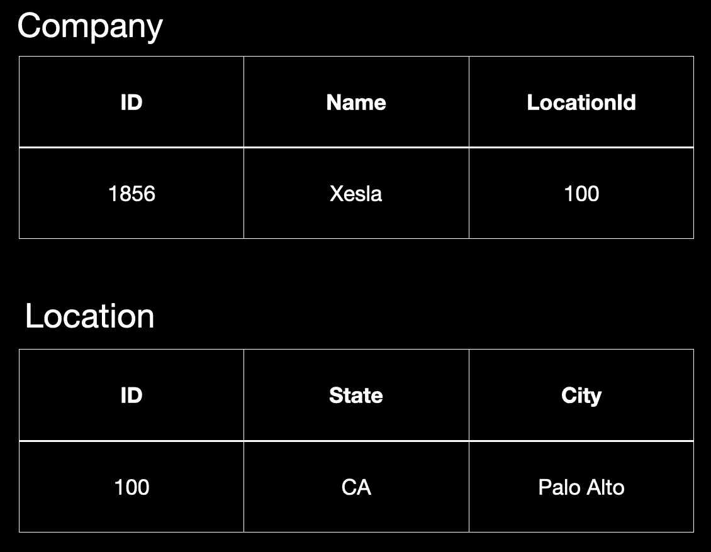
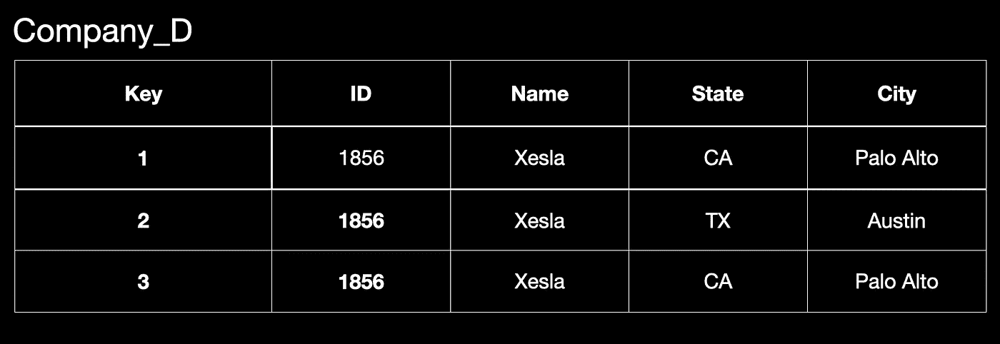
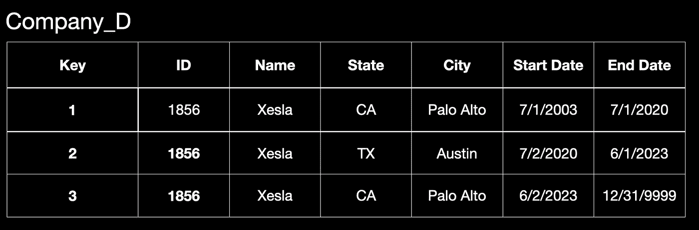
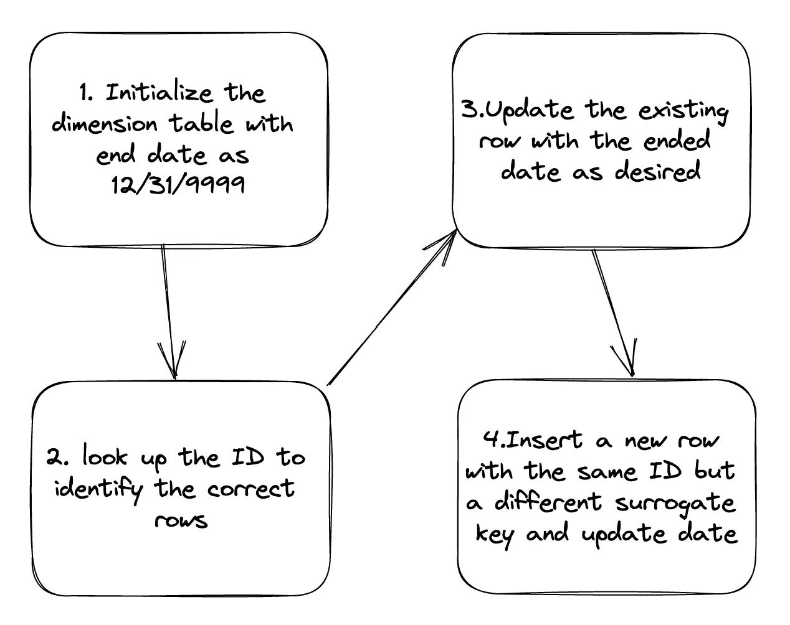
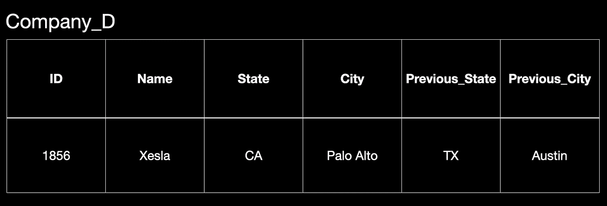
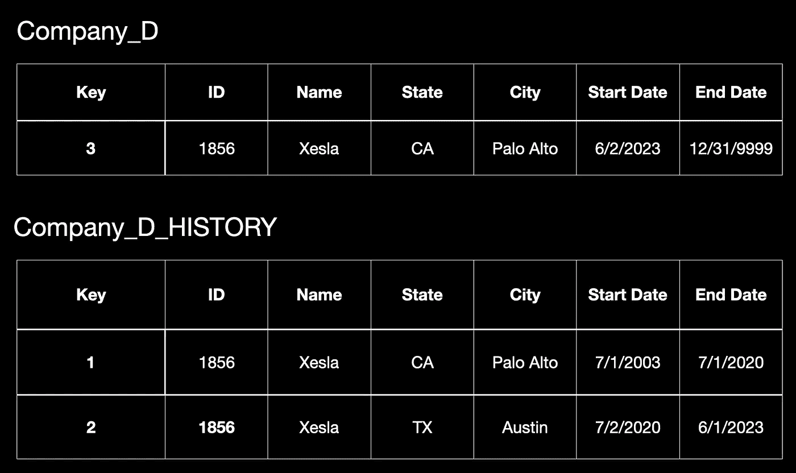
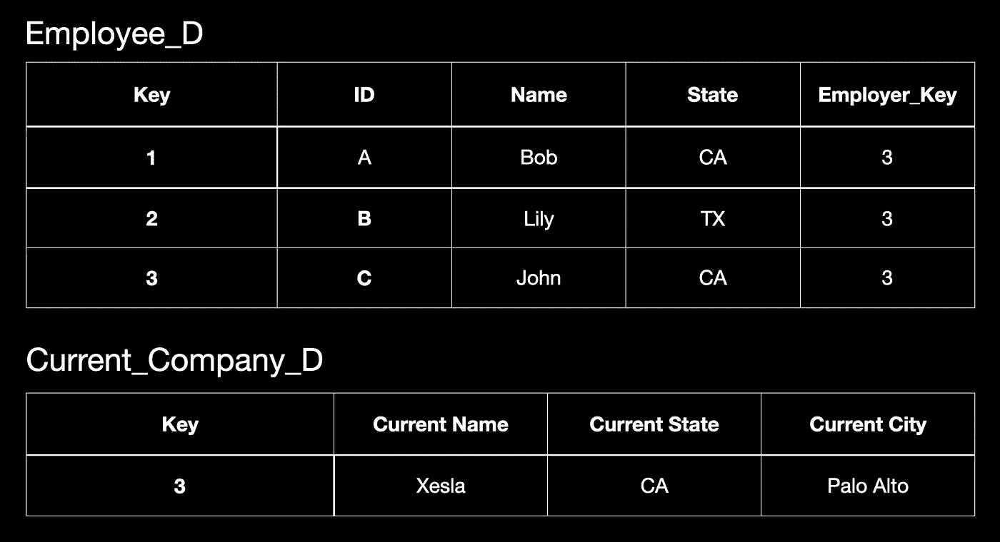
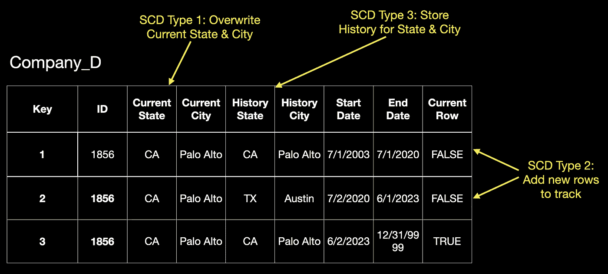
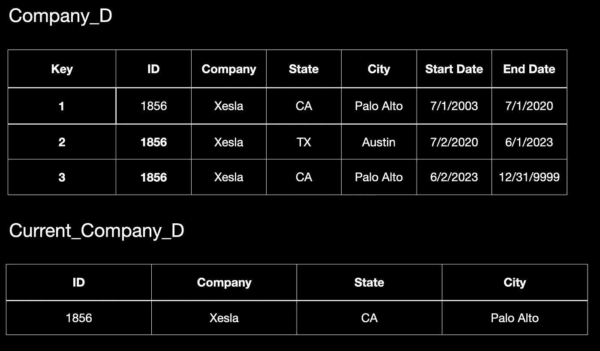

# 解锁慢变维（SCD）的秘密：八种类型的全面视角

> 原文：[`towardsdatascience.com/unlocking-the-secrets-of-slowly-changing-dimension-scd-a-comprehensive-view-of-8-types-a5ea052e4b36`](https://towardsdatascience.com/unlocking-the-secrets-of-slowly-changing-dimension-scd-a-comprehensive-view-of-8-types-a5ea052e4b36)

## 深入指南：何时以及如何使用 8 种类型的 SCD

 [Chengzhi Zhao](https://chengzhizhao.medium.com/?source=post_page-----a5ea052e4b36--------------------------------)

·发布在[Towards Data Science](https://towardsdatascience.com/?source=post_page-----a5ea052e4b36--------------------------------) ·12 分钟阅读·2023 年 7 月 17 日

--

照片由[Donald Tran](https://unsplash.com/@donald_tr4n?utm_source=unsplash&utm_medium=referral&utm_content=creditCopyText)拍摄，发布在[Unsplash](https://unsplash.com/photos/Lvy_S3ELzIs?utm_source=unsplash&utm_medium=referral&utm_content=creditCopyText)

如果你正在设计数据仓库，了解维度建模的方法论至关重要。这个方法论中最重要的概念之一是**慢变维（SCD）**。许多在线资源提供了关于慢变维的概述，但往往缺乏对使用哪种类型 SCD 的深入解释。

本文将讨论八种类型的 SCD，每种类型都有其独特的特点和应用场景。到最后，你将清楚地理解每种类型，并能在创建下一个维度建模中的 SCD 时进行区分。

# 为什么在维度建模中需要 SCD？

通常，OLTP 只存储近期数据。在执行更新语句时，当前数据会被替换，之前的数据将丢失，除非系统专门设计来保留历史数据，否则可能会增加延迟。

另一方面，OLAP 系统通常使用维度建模，它关注趋势并为业务提供洞察，通常更愿意保留历史记录。

**SCD 的主要目标是追踪变化的历史。**

在维度建模中，最常用的模式是星型模式。该模式围绕一个大的事实表展开，该事实表包含了您业务的各种度量字段。围绕事实表的维度表包含了允许对事实表中的数据进行操作和分析的字段。事实表通常有许多行，并且期望快速更新。另一方面，维度的变化很慢或永不变化。

# 替代键的重要性

事实表与维度表之间的连接是每个表中的键。这些通常是替代键，而不是 OLTP 系统中使用的 ID。替代键通常在数据仓库处理数据时生成，并在查找 OLTP ID 后确定。这对于某些类型的 SCD 来说至关重要，以避免在表上丢失主键，我们将在稍后的类型 2 中讨论这些问题。

为什么在维度建模中必须生成“替代”键，而不是重用原始业务 ID？使用替代键的一个好处是能够跟踪历史变化，同时避免键的重复。

让我们以一个名为“公司”的表作为 OLTP 系统中的示例。假设我们只有一家公司叫 Xesla，总部在加州帕洛阿尔托。然后 Xesla 决定迁往加州奥斯丁。然而，由于夏天湿度过高，Xesla 又回到了加州帕洛阿尔托。

如果我们查看 OLTP 端，它通常只保留当前的 location_id，而总部从加州搬迁到奥斯丁再到加州的过程是不可见的。

公司表的 OLTP 模式 | 作者提供的图片

在 OLTP 中直接执行分析查询有一定的劣势。对历史数据的忽视可能对业务不利。我们无法回答诸如“公司利润因总部搬迁而表现如何？”、“由于总部搬迁，员工流动率如何？”等问题。

在这种情况下，跟踪历史数据和替代键有助于保持行的唯一性和表的完整性。

我们引入了一个作为替代键的“键”列，这解决了多个问题。首先，它使我们能够跟踪公司总部的迁移历史。其次，它提供了一个唯一的主键，替代了业务 ID，消除了违反要求每行的主键唯一性的基础数据库规则的情况。

维度的替代键 | 作者提供的图片

我们仍需讨论维度表与事实表之间的关系及其使用。我们将在讨论每种 SCD 时解决这些问题。

# SCD 类型 0 — 不允许更改

## **概述**

SCD 是一种“特殊”类型的 SCD，不跟踪变化。本质上，类型 0 表示维度将保持不变。一旦条目进入 SCD 类型 0，它将不会改变。例如，我们可以有一个不会改变的日期维度。

这里一个令人困惑的点是日期维度将是固定的（SCD 类型 0），但我们对日期的解释可能会有所不同。例如，我们可能有与日历年不同的财政年度。我们可以设计我们的事实表，其中一个键是 calenderKey，另一个键是 fiscalCalenderKey。

## 实施

SCD 类型 0 也可以包括业务 ID，因为变化不会被跟踪，原始条目不能被覆盖。

## 何时考虑使用

对于固定维度，如日期和时间，SCD 类型 0 是最佳选择。这种类型最适合在您确定维度只需要添加新记录而没有未来更新时使用。

# SCD 类型 1 — 更改覆盖

## 概述

SCD 类型 1 类似于许多 OLTP 设计，这些设计用新数据替换原始数据，使得跟踪单行的变化变得不可能。

与 SCD 类型 0 不同，类型 1 中更新维度行是可实现的。然而，类型 1 不保留历史记录。使用数据的用户可以假设维度的当前快照始终是最新的。

## 实施

SCD 类型 1 的实现可以是直接的：查找正确的 ID 并执行更新。

## 何时考虑使用

*“我们是否总是希望保留历史记录？”*

是否需要跟踪历史数据取决于您的业务用例。保留更多的数据点可以提供对数据集的更全面了解。将历史记录纳入您的维度建模设计可能是有利的。然而，不跟踪历史记录可以简化 ETL 管理。

有趣的是，前两种 SCD 类型无法跟踪任何变化。更强大的 SCD 类型从 SCD 类型 2 开始。

# SCD 类型 2 — 使用新行跟踪历史记录

## 概述

SCD 类型 2 是一种强大的 SCD 类型，广泛用于跟踪维度建模中的变化。它具有快速显示变化历史记录的能力，非常实用。

当数据发生变化时，SCD 类型 2 会复制未更改的字段，这可能会重复并增加存储成本。为了更好地适应快速更新的维度，需要改进。

我们已经有了类似于我们在 Xelsa 示例中查看的模式的代理键。现在，我们可以添加有效的开始和结束日期，以指示该行处于活动状态的时间段。

在这种情况下，当前活动行的有效结束日期设置为未来的 12/31/9999，因此它不会（至少在较长时间内）过期。

SCD 类型 2 示例 | 作者提供的图片

## 实施

要执行 SCD 类型 2，我们需要执行两个任务：

+   添加代理键

+   添加一个当前行标识符，例如：开始/结束日期、版本号或当前标志。

在 ETL 方面，相比于 SCD 类型 1，实施过程更为复杂。此过程通常包括以下步骤：

1.  用所有行的结束有效日期设置为 12/31/9999 来初始化维度表

1.  当识别到更新时，查找 ID 以确定正确的行

1.  按需要更新现有行的结束日期。

1.  插入一行新的数据，ID 相同但替代键不同。使用前一行的结束日期 + 1 作为新行的开始日期，并将结束有效日期设置为 12/31/9999。

SCD 类型 2 实施步骤 | 图片由作者提供

## 何时考虑使用

关于 SCD，默认情况下通常选择类型 2 选项，因为它对消费者更简单。然而，如果一个维度频繁发生变化，可能会有更好的选择，因为重复未更改的字段多次可能会很昂贵。例如，我们有一个展平的维度，包含 50 个字段，一次字段更新可能导致其余 49 个字段再次重复。

# SCD 类型 3—使用新字段跟踪历史

图片由 [Super Snapper](https://unsplash.com/ja/@supersnapper27?utm_source=unsplash&utm_medium=referral&utm_content=creditCopyText) 在 [Unsplash](https://unsplash.com/photos/sdTL4qTynfM?utm_source=unsplash&utm_medium=referral&utm_content=creditCopyText) 提供

## 概述

我认为 SCD 类型 3 是一种“队列”选项。与其复制整个行并跟踪表的历史，SCD 类型 3 只跟踪选定字段的变化。由于类型 3 是在列级别进行的，保持有限数量的历史（通常是当前值和前一个值）是其实施方式。

继续以 Xesla 为例，假设我们只对跟踪状态和城市历史感兴趣。我们可以包括前一个状态和城市的列以跟踪历史。这里的历史仅限于最后一个，但我们可以通过额外的列追溯尽可能远的历史。

SCD 类型 3 示例 | 图片由作者提供

## 实施

SCD 类型 3 类似于一个大小有限的队列。在更新过程中，需要执行查找，前一个值将被丢弃，然后当前值将移到前一个值字段。

## 何时考虑使用

如果你希望跟踪一小部分列的历史，SCD 类型 3 是有利的。为了有效掌握业务的性质和变化频率，拥有坚实的知识基础是至关重要的。特别是在将 SCD 类型 3 扩展到新领域时，这一点尤为重要，因为这需要添加额外的列。

# SCD 类型 4—使用单独的表（迷你维度）跟踪历史

## 概述

我们已经覆盖了通过 SCD 类型 2 在同一表中垂直跟踪历史和通过 SCD 类型 3 水平跟踪历史。SCD 类型 4 就像 Z 轴一样，我们在另一个表中跟踪历史。

一个表是当前视图表，另一个表是历史表。这与 [CDC](https://en.wikipedia.org/wiki/Change_data_capture) 的概念类似。当前表显示现在；历史表变更日志可以从头重建一切。

SCD 类型 4 | 作者图片

如果我们将这两个表合并，那就是 SCD 类型 2。那我们为什么要拆分当前视图和历史视图？主要原因是如果维度表更新迅速并最终达到数百万条记录，拆分当前视图可以帮助提高查询性能。保持当前视图相对较小可以提升最终用户的查询性能。

## 实现

关于数据更新，SCD 类型 2 涉及在同一个表中更新信息。然而，对于 SCD 类型 4，你必须使用两个独立的表。SCD 类型 4 的数据更新过程与 SCD 类型 2 遵循相同的模式。

## 使用时机

如果 SCD 类型 2 变得过大并开始影响查询速度，可能值得考虑切换到 SCD 类型 4。此外，如果你注意到维度表更新频繁，SCD 类型 4 可能是一个更好的选择，以准确跟踪完整的历史记录。

> 以下 SCD 类型 5、6、7 都是混合方法

# SCD 类型 5 — 类型 4 小维度 + 类型 1 **附加表**

## 概述

SCD 类型 5 是对 SCD 类型 4 的一种增强，它融合了类型 1 的元素。它允许将一个维度的当前视图嵌入到另一个维度中。

SCD 类型 5 创建了一个雪花模式，并将当前视图保留为附加维度。然而，对于任何 BI 工具或展示层，将这两个维度合并为一个更好，以减少混淆。

例如，我们希望将公司的维度嵌入到员工表中，并链接到 employer_key。Current_Company_D 是当前视图。如在 SCD 类型 4 中讨论的那样，它通过 employer_key 作为外键引用。

如果需要进行更新，它将像 SCD 类型 1 一样工作。这意味着我们必须用新的当前公司 ID 参考覆盖 employer_key。为了避免与 SCD 类型 4 的历史数据混淆，最好将当前表前缀设置为 "Current_"。

SCD 类型 5 | 作者图片

## 实现

在 ETL 层维护 SCD 类型 5 可能是一项复杂的任务。这需要大量的工作来与 SCD 类型 4 和类型 1 结合。此外，确保适当的引用和准确的查找非常重要。

三个表必须一致并在更新时进行实现：主表、当前视图表和历史表。

## 使用时机

与其他 SCD 类型相比，SCD Type 5 通常讨论较少。管理 SCD Type 5 的 ETL 工作量很大。当当前视图的更新速度迅速增加时，单靠引用键变更很难跟踪所有变化，这时可以考虑使用 SCD Type 5。

# SCD Type 6— 混合 SCD 1 + SCD 2 + SCD 3

## 概述

SCD Type 6 是将 SCD 1 + SCD 2 + SCD 3 混合而来的。这一过程初看可能比较冗长，但当你需要澄清未来潜在变化时，它非常适用。拉尔夫·金博尔（Ralph Kimball）说 SCD Type 6 是“一版本覆盖的不可预测变化”。

让我们继续使用示例来说明 SCD Type 6 的工作原理。

SCD Type 6 | 作者提供的图片

要将 SCD Type 6 拆分为各个类型，我们可以通过检查以下内容来实现：

+   SCD Type 1：我们为特定 ID 的所有行覆盖当前状态和当前城市。

+   SCD Type 2：当发生新变化时，我们创建第二行以跟踪演变和历史，并且翻转当前行标志和有效日期。

+   SCD Type 3：我们还添加了历史状态和历史城市字段，以便我们知道过去的值是什么。

## 实施

SCD Type 6 是 SCD Type 1 到 3 的组合。实施细节可以参考上述之前的实施方案。

## 使用时机

SCD Type 6 拥有丰富的上下文，并且可以相对快速地执行查询。由于它是一种混合的 SCD 方法，所有功能都包含在一个视图中，初看时可能会吸引你。

然而，SCD Type 6 增加了维度的行和列，导致增长速度远超用户的预期。在这些情况下，找到灵活性与丰富性之间的平衡至关重要，进行业务访谈和对齐也非常关键。

当你想展示信息的呈现方式并在一个视图中展示各种 SCD 类型时，SCD Type 6 是一个出色的 POC 选择。

# SCD Type 7 — 通过逻辑拆分重新思考 Type 6

## 概述

SCD Type 7 是 SCD Type 6 的一种变体，也称为“Dual Type 1 and Type 2 Dimensions”。在 SCD Type 7 中，我们将一个 SCD Type 6 维度表分成两个不同的表：历史视图和当前视图。我们在事实表中使用双重外键来引用这些表。

SCD Type 7 | 作者提供的图片

使用 SCD Type 7 的一个优点是它允许我们为历史和当前表保持独立的键，保留各自的历史。这消除了将当前公司表绑定到与历史表相同的代理键的需要。

## 实施

基于当前视图，SCD Type 7 需要较少的 ETL 努力，因为它是从历史表中衍生出来的视图。一旦你有了 SCD Type 2 表，剩下的任务就是创建当前视图表并将键连接到事实表。

## 使用时机

使用 SCD 类型 7，用户可以快速访问当前视图和历史数据，而无需花费时间理解维度表的结构。与需要选择生效日期或当前行标志来查看现有数据的 SCD 类型 2 不同，SCD 类型 7 通过在事实表中推导出另一个关键字段来简化了这一过程。这为用户节省了时间和精力。

# 最终思考

理解慢变维（SCD）在数据仓库的维度建模中至关重要。虽然 SCD 类型 2 或类型 3 常用于跟踪历史，但其他类型的 SCD 也可以根据用户需求解决特定的问题。

我希望我对维度建模中的慢变维（SCD）的深入探讨能够对你在设计和构建数据仓库时有所帮助。
