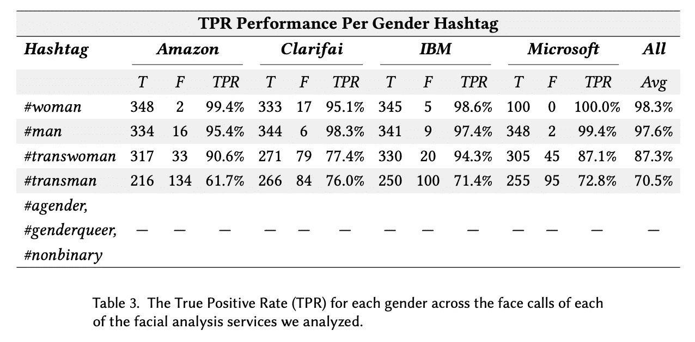
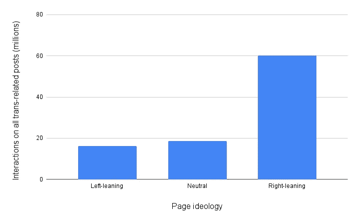

# 揭示 AI 对跨性别社区的有害影响

> 原文：[`towardsdatascience.com/unmasking-ais-detrimental-effects-on-the-trans-community-d8f870949d79`](https://towardsdatascience.com/unmasking-ais-detrimental-effects-on-the-trans-community-d8f870949d79)

## 性别识别软件的危险、不足的医学模型以及跨性别恐惧内容的放大

 [Conor O'Sullivan](https://conorosullyds.medium.com/?source=post_page-----d8f870949d79--------------------------------)

·发布于[Towards Data Science](https://towardsdatascience.com/?source=post_page-----d8f870949d79--------------------------------) ·阅读时间 8 分钟·2023 年 6 月 20 日

--

图片由[Delia Giandeini](https://unsplash.com/@dels?utm_source=medium&utm_medium=referral)在[Unsplash](https://unsplash.com/?utm_source=medium&utm_medium=referral)提供

对 AI 风险的讨论常常集中在人工通用智能（AGI）和世界末日情景的假设危险上。机器人不会统治世界。然而，目前的 AI 确实带来了切实的风险，特别是对已经受到此技术影响的跨性别和性别非顺应社区。

我们将重点阐述对该社区的危险：

+   **自动性别识别**

+   **医学模型的局限性**

+   社交媒体上**跨性别恐惧内容的放大**

虽然跨性别社区感受到直接后果，但这些危险影响到我们所有人。它们传播仇恨，限制了多样性的丰富性，制约了我们全面表达自我的集体能力。我们必须理解作为技术专业人士的角色如何支持跨性别者，并创造一个更强大的社会。

> 我们已进入可以大规模部署 AI 的阶段，仅因为我们拥有大量数据和计算能力。令人担忧的是，AI 未能应对伦理挑战。
> 
> — [Alex Hanna](https://urelles.com/en/alex-hanna-diversity-the-key-towards-ethical-design/)

# 面部滤镜

我们将通过一个表面上看似不严重的例子来逐渐了解这些危险。如果你在社交媒体上，你知道什么是面部滤镜。它们使用机器学习来扭曲你的脸，使你看起来年老，甚至把你的狗变成迪士尼角色。大多数人会认为这些只是无害的娱乐。谈到性别时，情况可能会更复杂。不过，负面后果不应被夸大。

我只是一个盟友，不能代表跨性别者发言。即使在跨性别社区内部，性别转换滤镜的后果[也是有争议的。](https://time.com/5590491/snapchat-filter-gender-swap-trans-community/)它们可以让你[探索你的性别认同和表达](https://time.com/5590491/snapchat-filter-gender-swap-trans-community/)。然而，它们也可能[强化性别刻板印象](https://www.cosmopolitan.com/uk/reports/a27506073/snapchat-gender-swap-filter/)和[排斥非二元性别者](https://thenextweb.com/news/why-gender-swap-photo-filters-are-still-problematic)。一些人甚至利用这些滤镜来[嘲弄过渡过程](https://thenextweb.com/news/why-gender-swap-photo-filters-are-still-problematic)。

> *探索性别和与分配给你的性别不同的性别是好事，我鼓励这样做。你可能会发现自己意外的新东西，可能会对跨性别者更加友善。*
> 
> *—* [*Charlie Knight*](https://twitter.com/CKnightWrites)

在讨论这类技术时，应区分允许你*选择*性别的应用程序和那些试图*预测*性别的应用程序。例如，查看 Pixar 滤镜合集中的第一个视频。算法在用户没有传统男性或女性特征时会遇到困难。

这揭示了这些应用程序的问题——其底层技术基于一个假设：你可以预测某人的性别认同。这是一种伪科学。将这个假设应用到其他场景可能会有重大后果。

# 自动性别识别（AGR）

AGR 或性别识别软件是机器学习的一个分支，试图预测一个人的性别。这是通过分析面部特征、身体形状、衣物、声音模式或行为特征来实现的。然而，性别是复杂的，这些方面无法完全捕捉。尤其是对跨性别者来说更是如此。

对 4 个 AGR 系统的研究，如**图 1**所示，平均数据显示它们误判跨性别女性的比例为 12.7%，跨性别男性为 29.5%。相比之下，生理女性和男性的误判率为 1.7%和 2.4%[1]。这些系统还完全忽视了其他性别群体。

图 1：AGR 系统的准确性（来源：[M. K. Scheuerman 等](https://docs.wixstatic.com/ugd/eb2cd9_963fbde2284f4a72b33ea2ad295fa6d3.pdf)）

错误地确定跨性别者的性别是不尊重的。这也可能对[心理健康产生严重影响](https://www.health.harvard.edu/blog/misgendering-what-it-is-and-why-it-matters-202107232553)。持续被称为你不认同的性别可能是既令人疲惫又令人气馁的。现在想象一个世界，这一切被自动化并融入我们的日常系统中。

**你不必想得太多。** 这些系统已经被部署了：

+   [一家公司自动化了广告牌](https://theoutline.com/post/1528/this-pizza-billboard-used-facial-recognition-tech-to-show-women-ads-for-salad)以向男性推广披萨，向女性推广沙拉。

+   [柏林的公共交通运营商](https://www.theguardian.com/cities/2019/mar/14/mind-the-gender-pay-gap-berlin-women-to-get-public-transport-discount)向女性旅客提供了 21%的折扣。

+   [Giggle，“仅限女性”的社交网络应用程序](https://www.theguardian.com/media/2022/dec/31/transgender-woman-sues-female-only-app-giggle-for-girls-for-alleged-discrimination)拒绝接受跨性别女性。

+   [变性 Uber 司机](https://www.cnbc.com/2018/08/08/transgender-uber-driver-suspended-tech-oversight-facial-recognition.html)的账户被面部识别安全系统暂停了。

这些系统造成的[伤害](https://www.vox.com/future-perfect/2019/4/19/18412674/ai-bias-facial-recognition-black-gay-transgender)是众所周知的，以至于欧盟已被[敦促禁止它们](https://www.reuters.com/article/eu-tech-lgbt-idUSL8N2M86XH)。

# 依赖于性别的医疗保健模型。

AGR 涉及机器学习，其中性别是*目标变量*。当我们将性别作为*模型特征*时也会出现问题。更具体地说，当我们不区分性别（出生时分配的性别）和性别（社会构建的角色）时。这一问题在医疗模型中普遍存在。

在医疗保健中，性别和性别认同常常被混淆。以至于提出了性别–性别认同医学这一术语[2]。事实上，关于跨性别和其他性别群体的数据收集非常有限。结果是，使用单一二元特征——男性/女性来训练模型，以出生时分配的性别作为性别和性别认同的代理[3]。

> 性别和性别认同是二元的、静态的且一致的错误假设在医疗系统中深深根植。
> 
> — [Kendra Albert, Maggie Delano](https://www.sciencedirect.com/science/article/pii/S2666389922001313)

问题在于，许多诊断和治疗中，性别与性别认同之间的*互动*非常重要[4]。这对于 HIV 预防、生殖健康、荷尔蒙替代疗法和心理健康都适用。将性别与性别认同合并为一个变量，我们在医疗系统中忽视了跨性别者。结果是相比于顺性别者，跨性别者的护理水平较差。

# 在社交媒体上放大跨性别恐惧症内容。

到目前为止，我们关注的是更直接的影响。通过巩固性别期望和模型表现不佳，AI 可能导致跨性别者体验到负面影响。AI 也可能有间接影响，即影响他人对跨性别者的看法。

社交媒体推荐算法的唯一工作就是[保持你在平台上](https://www.pbs.org/wgbh/nova/article/radical-ideas-social-media-algorithms/)。不幸的是，对你不属于的群体的愤怒，特别是，对激发参与的愤怒，[5]非常有效。还有担忧认为这些算法可能会强制执行已有的信念[6]。也就是只推荐与你过去互动过的内容类似的内容。

性别在现代社会规范和期望中占据核心地位。跨性别者的存在可能挑战这些规范。对于一些人来说，这种挑战带来了恐惧、愤怒以及不愿接受科学事实。这些都是容易导致增加参与度并创造反跨性别回音室的条件。

我们在[Facebook](https://www.nbcnews.com/feature/nbc-out/transgender-facebook-content-dominated-right-wing-sources-study-finds-n1234252)上看到了这一点。用户在这里对影响跨性别者的问题有着偏颇和不准确的理解。如**图 2**所示，右倾页面上的跨性别问题帖子获得的互动几乎是其他页面的两倍。这些互动大多数出现在反跨性别网站发布的帖子上。

图 2：2020 年 10 月至 2021 年 9 月，各页面意识形态下的所有跨性别相关帖子在 Facebook 上的互动情况（图片来源：作者）（来源：[媒体关注](https://www.mediamatters.org/facebook/right-leaning-facebook-pages-earned-nearly-two-thirds-interactions-posts-about-trans)）

Facebook 并不是唯一存在问题的平台。在与反跨性别内容互动后，[TikTok](https://www.mediamatters.org/tiktok/tiktoks-algorithm-leads-users-transphobic-videos-far-right-rabbit-holes)会把你带入极端主义、仇恨和暴力的兔子洞。我在 YouTube 短视频中被推荐反跨性别内容的经历促使我写下这篇文章，这也是[其他人](https://mashable.com/article/youtube-shorts-transphobic)的共同经历。

这些平台上的内容试图推动错误的说法，即跨性别是一种意识形态或心理疾病。事实并非如此。它们还试图将辩论从基本人权问题转移到体育、卫生间和代词上。最隐蔽的做法是将追求平等重新框定为对儿童的攻击。

跨性别社区对儿童没有任何风险。然而，这些内容对儿童却构成了重大风险。在 2023 年，[79 项反跨性别法案](https://translegislation.com/)在美国通过。社交媒体被认为对这些政策变化有所贡献。反跨性别内容也导致了负面的社会变化。

82%的变性人曾考虑过自杀，40%的人尝试过自杀。导致这一数据的最重要因素是简短而普遍的日常侮辱或轻视[7]。这些行为被反变性内容正常化和推广。

> 人际微侵略对终生自杀尝试产生了独特且统计学上显著的影响。
> 
> — [Ashley Austin 等](https://pubmed.ncbi.nlm.nih.gov/32345113/)

基于这些后果，社交媒体平台在道义上有责任遏制这些内容。至少，应该将其标记为**虚假和不科学**。我们都应该拒绝变性恐惧。作为科技工作者，我们也应该利用我们独特的影响力。我们有能力反击这些趋势，并塑造那些伤害变性人的系统。

我们可以从了解 [变性意味着什么](https://www.youtube.com/watch?v=sA2w-wO4Mvc&ab_channel=TLDRNews) 开始。我们可以推动包容性训练数据和更多样化的团队。我们还应该倡导旨在增加透明度、可解释性和人工监督的 AI 系统监管。在这样做时，我们不应被假设性的灾难情景分散注意力，而应关注 AI 的直接风险。

本文中的所有中等合作资金将**捐赠给** [**TGEU**](https://tgeu.org/donate-to-tgeu/)。如果你想了解变性意味着什么或如何成为更好的盟友，请查看下面的视频。**快乐的骄傲月 :)**

[变性意味着什么？](https://www.youtube.com/watch?v=sA2w-wO4Mvc&ab_channel=TLDRNews)

变性的神经科学

[Trans 101 — 成为变性盟友](https://www.youtube.com/watch?v=9av5WbSSlyM&ab_channel=Minus18)

你可以在 [Mastodon](https://sigmoid.social/@conorosully) | [Twitter](https://twitter.com/conorosullyDS) | [YouTube](https://www.youtube.com/channel/UChsoWqJbEjBwrn00Zvghi4w) | [Newsletter](https://mailchi.mp/aa82a5ce1dc0/signup) 上找到我——免费注册以获得 [Python SHAP 课程](https://adataodyssey.com/courses/shap-with-python/)。

 [## 通过我的推荐链接加入 Medium — Conor O’Sullivan

### 作为 Medium 会员，你的会员费的一部分会用于支持你阅读的作者，并且你可以完全访问每个故事……

conorosullyds.medium.com](https://conorosullyds.medium.com/membership?source=post_page-----d8f870949d79--------------------------------)

# 参考文献

[1] Scheuerman, M.K., Paul, J.M. 和 Brubaker, J.R., 2019。计算机如何看待性别：**对商业面部分析服务中性别分类的评估**。*ACM 人机交互学报*, *3*(CSCW), 第 1-33 页 [`docs.wixstatic.com/ugd/eb2cd9_963fbde2284f4a72b33ea2ad295fa6d3.pdf`](https://docs.wixstatic.com/ugd/eb2cd9_963fbde2284f4a72b33ea2ad295fa6d3.pdf)

[2] Campesi, I., Montella, A., Seghieri, G. 和 Franconi, F., 2021\. **个人护理需要性别和性别方法**。*Journal of Clinical Medicine*, *10*(20), 第 4770 页\. [`www.ncbi.nlm.nih.gov/pmc/articles/PMC8541070/`](https://www.ncbi.nlm.nih.gov/pmc/articles/PMC8541070/)

[3] Chen, I.Y., Pierson, E., Rose, S., Joshi, S., Ferryman, K. 和 Ghassemi, M., 2021\. **医疗中的伦理机器学习**。*年度生物医学数据科学回顾*, *4*, 第 123–144 页\. [`www.ncbi.nlm.nih.gov/pmc/articles/PMC8362902/`](https://www.ncbi.nlm.nih.gov/pmc/articles/PMC8362902/)

[4] Albert, K. 和 Delano, M., 2022\. **性别困扰：使用电子健康记录的机器学习中的性别/性别滑移、性别混淆和性别痴迷**。*Patterns*, *3*(8), 第 100534 页\. [`www.sciencedirect.com/science/article/pii/S2666389922001313`](https://www.sciencedirect.com/science/article/pii/S2666389922001313)

[5] Rathje, S., Van Bavel, J.J. 和 Van Der Linden, S., 2021\. **群体外敌意驱动社交媒体参与**。*国家科学院学报*, *118*(26), 第 e2024292118 页\. [`www.pnas.org/doi/abs/10.1073/pnas.2024292118`](https://www.pnas.org/doi/abs/10.1073/pnas.2024292118)

[6] Jiang, R., Chiappa, S., Lattimore, T., György, A. 和 Kohli, P., 2019 年 1 月\. **推荐系统中的退化反馈循环**。在 *2019 AAAI/ACM 人工智能、伦理与社会会议论文集* (第 383–390 页)。 [`arxiv.org/pdf/1902.10730.pdf`](https://arxiv.org/pdf/1902.10730.pdf)

[7] Austin, A., Craig, S.L., D’Souza, S. 和 McInroy, L.B., 2022\. **跨性别青少年的自杀倾向：阐明人际风险因素的作用**。*人际暴力杂志*, *37*(5–6), 第 NP2696-NP2718 页\. [`pubmed.ncbi.nlm.nih.gov/32345113/`](https://pubmed.ncbi.nlm.nih.gov/32345113/)
