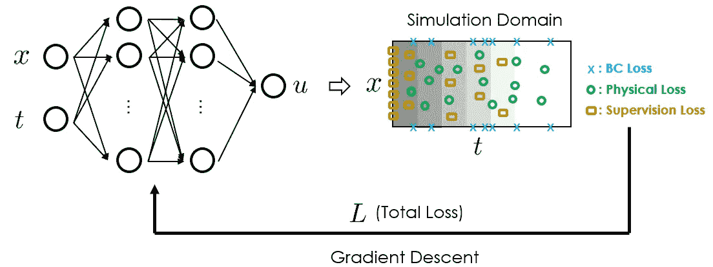
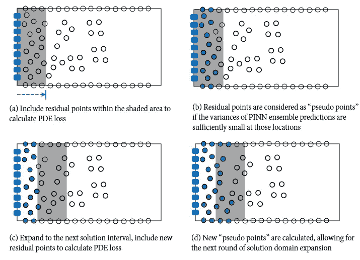
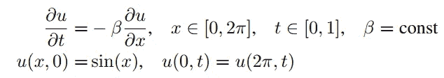
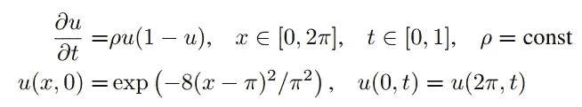
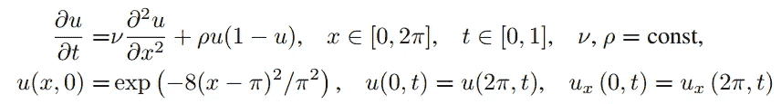
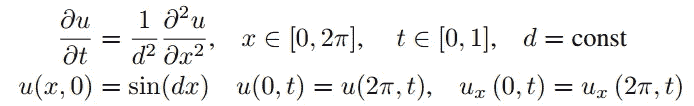
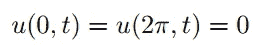
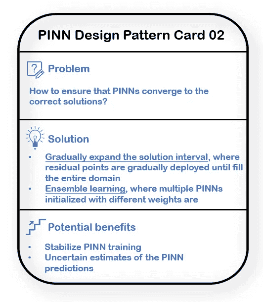

# 解开物理信息神经网络的设计模式：第二部分

> 原文：[`towardsdatascience.com/unraveling-the-design-pattern-of-physics-informed-neural-networks-part-02-2156516f2791`](https://towardsdatascience.com/unraveling-the-design-pattern-of-physics-informed-neural-networks-part-02-2156516f2791)

## 通过集成学习和动态解空间扩展来增强 PINN 训练稳定性

 [Shuai Guo](https://shuaiguo.medium.com/?source=post_page-----2156516f2791--------------------------------)

·发表于 [Towards Data Science](https://towardsdatascience.com/?source=post_page-----2156516f2791--------------------------------) ·7 分钟阅读·2023 年 5 月 19 日

--

图片由 [Clay Banks](https://unsplash.com/de/@claybanks?utm_source=medium&utm_medium=referral) 提供，[Unsplash](https://unsplash.com/?utm_source=medium&utm_medium=referral)

欢迎来到本系列关于物理信息神经网络（PINN）设计模式的第二篇博客🙌 在这里，我们将探讨**集成学习**和**动态解空间扩展**技术，以增强 PINN 训练的稳定性和准确性。

展望未来，我们将从提出的策略试图解决的具体问题开始，然后详细介绍该策略、其实施方式以及为什么可能有效。之后，我们将看看哪些物理问题被用作基准，以及所提出方法的优缺点。最后，我们讨论替代方案和该方法的未来机会。

> 随着本系列的不断扩展，PINN 设计模式的集合变得更加丰富*🙌* 这里有一个预告，展示你将看到的内容：
> 
> [PINN 设计模式 01：优化残差点分布](https://medium.com/towards-data-science/unraveling-the-design-pattern-of-physics-informed-neural-networks-series-01-8190df459527)
> 
> [PINN 设计模式 03：用梯度提升训练 PINN](https://medium.com/towards-data-science/unraveling-the-design-pattern-of-physics-informed-neural-networks-part-03-fe365ef480d9)
> 
> [PINN 设计模式 04：梯度增强 PINN 学习](https://medium.com/towards-data-science/unraveling-the-design-pattern-of-physics-informed-neural-networks-part-04-c778f4829dde)
> 
> PINN 设计模式 05：自动超参数调整
> 
> [PINN 设计模式 06：因果 PINN 训练](https://medium.com/towards-data-science/unraveling-the-design-pattern-of-physics-informed-neural-networks-part-06-bcb3557199e2)
> 
> PINN 设计模式 07：使用 PINN 进行主动学习

让我们开始吧！

# 1\. 论文概览：

+   **标题**：通过模型集成改进物理信息神经网络的训练

+   **作者**：K. Haitsiukevich, A. Ilin

+   **机构**：阿尔托大学

+   **链接**：[arXiv](https://arxiv.org/abs/2204.05108)

# 2\. 设计模式

## 2.1 问题

物理信息神经网络（PINNs）提供了一种解决偏微分方程（PDEs）的有力途径，因其固有的灵活性、优雅性和对观测数据的无缝集成。尽管有这些优势，实际训练 PINNs 往往面临重大挑战：网络由于其复杂性和对超参数的敏感性，倾向于收敛到**不正确的解决方案**。

这个问题对 PINNs 应用的现状有着重要影响，因为它限制了它们能够产生的解决方案的准确性和可靠性。

现在的问题是：我们如何改进训练过程，以确保 PINNs 收敛到正确的解决方案？

PINN 工作流程。在实践中，PINNs 在训练过程中可能会收敛到错误的解决方案。一种有前景的解决方法是**逐步扩展解区间**，以解决这个问题。（图像由本博客作者提供）

## 2.2 解决方案

关键思想是**逐步扩展解区间**和利用**集成学习**。

残余点逐渐被纳入，以模拟解域扩展的行为。（图像由本博客作者提供）

在开始时**（a）**，仅部署接近已知初始条件下采样点（实心蓝色矩形）的残余点（预先采样以填充整个解域）用于 PDE 损失计算。这启动了 PINN 训练，其中多个初始化权重不同的 PINN 模型进行训练，从而形成 PINN 的集成。在训练若干次迭代后**（b）**，如果在这些位置的 PINN 集成预测的方差足够小，则将一些先前部署的残余点视为“伪点”。随后，解域可以扩展**（c）**，如果新的残余点足够接近“伪点”，则将部署新的残余点。迭代继续进行**（d）**，直到所有残余点都用于损失计算。

上述演练假设只知道初始条件。在其他情况下，如果观察数据在模拟域内可用，则解决区间也可以从那里扩展。

根据作者的实现，该策略引入了几个新的超参数，这些超参数决定了*距离阈值*以部署新的残差点，*距离阈值*以将部署的残差点转变为“伪点”，以及*方差阈值*以决定 PINN 集成是否一致。有关更多详细信息，请参阅原始论文。

## 2.3 为什么这个解决方案可能有效

解决方案区间的逐步扩展模拟了经典数值解算器的行为，这些解算器将解决方案从初始条件和边界条件“传播”到整个领域。因此，物理因果关系得到了尊重，这可能有助于更稳定的 PINN 训练。

通过利用 PINN 的集合，提出的算法将有更高的机会摆脱传统的单一 PINN 训练方法常见的错误解。这解释了为什么提出的算法能够达到更高的准确性和可靠性。

## 2.4 基准测试

论文对提出的策略在五个不同问题上的性能进行了广泛的基准测试，每个问题代表了一个独特的物理现象：

+   对流方程：这个方程模拟了输送现象，这在流体动力学、热传递和质量传递等领域中都是基础的。在这些场景中，理解能量、质量或动量等量的移动，主要由于差异性力量或梯度，是至关重要的。

+   反应系统：这一问题类别模拟了化学反应。从基础化学课程到复杂的生物工程过程，理解反应动力学和化学平衡可能是实验成功或工业过程成功与灾难性失败之间的区别。

+   反应扩散方程：这个方程模拟了反应与物质扩散的结合。这种问题在生物学等领域至关重要，它们描述了发育生物学中的模式形成过程，或在化学中模拟了不同物质在介质中的扩散和相互作用。

+   扩散方程（具有周期边界条件）：这种方程对于理解热传导、流体流动和布朗运动等现象至关重要。周期边界条件意味着系统行为在时间或空间上重复，这是处理周期性或重复系统问题时常见的假设。

+   扩散方程（与上面展示的方程相同，但具有 Dirichlet 型边界条件）：Dirichlet 型边界条件规定了解决方案在领域边界上必须取的值。

基准测试结果显示：

+   所提出的算法提供了稳定的训练，并对所有考虑的问题表现出竞争力；

+   所提出的算法通常稳定，对超参数选择的敏感性较小。

此外，论文建议以下做法可以帮助提高 PINN 的准确性：

+   将输入（包括空间输入 *x* 和时间输入 *t*）归一化到[-1, 1]；

+   在通常的 Adam 优化后，使用 L-BFGS 对 PINN 训练进行微调。

## 2.5 优势与劣势

👍**优势**

+   能够稳定 PINN 的训练并取得竞争力的性能。

+   不需要预定义的间隔扩展计划（与“替代方案”部分中解释的时间自适应策略相对）。

+   时间和空间处理得同样。

+   足够灵活，允许在任意位置轻松融入测量值。

+   由于集成方法，预测的置信区间会自动获得。

👎**劣势**

+   相比于传统 PINN，计算开销较大（所有集成方法都存在这种情况）。

+   引入了额外的超参数（尽管所提出的解决方案对超参数值不敏感）。

## 2.6 替代方案

其他解决类似问题的方法是时间自适应技术系列，这些技术对当前的方法有很大影响。时间自适应技术将时间区间 [*T*₁, *T*₂] 划分为多个子区间，并通过单独的 PINN 依次在每个子区间上求解方程。一个子区间的解然后作为后续子区间的初始条件。

当前的算法继承了时间自适应技术的优点，即能够实现更准确和稳定的时间解传播。此外，它还消除了对预定义间隔扩展计划的要求。因此，当前的方法更灵活，可以在任意位置融入已知的测量值。

# 3 未来的潜在改进

有几种可能性可以进一步改进所提出的策略：

+   创建模型集成的高效方法（例如，dropout）。

+   将当前算法与其他 PINN 最佳实践结合（例如，在[第一篇博客](https://medium.com/towards-data-science/unraveling-the-design-pattern-of-physics-informed-neural-networks-series-01-8190df459527)中讨论的智能采样残差点）。

# 4 收获

在这篇博客中，我们探讨了通过集成学习和动态解区间扩展来增强 PINN 训练的稳定性。这个话题非常相关，因为它直接影响 PINNs 的准确性。

以下是从论文中提出的设计模式中获得的收获：

+   [问题]：如何确保 PINNs 收敛到正确的解？

+   [解决方案]：**1\. 逐步扩展解区间**，在整个领域内逐渐部署残差点。**2.** **集成学习**，其中多个 PINN 使用不同的权重初始化。

+   [潜在好处]：1. 稳定 PINN 训练。2. PINN 预测的不确定性估计

如果你更喜欢视觉呈现，这里是我准备的 PINN 设计卡：

论文中提出的 PINN 设计模式。（图片由本博客作者提供）

我希望你觉得这个博客有用😃如果你想了解更多关于 PINN 设计模式的内容，可以随时查看这一系列中的其他文章：

+   [PINN 设计模式 01：优化残差点分布](https://medium.com/towards-data-science/unraveling-the-design-pattern-of-physics-informed-neural-networks-series-01-8190df459527)

+   PINN 设计模式 03：使用梯度提升的 PINN 训练

+   [PINN 设计模式 04：梯度增强 PINN 学习](https://medium.com/towards-data-science/unraveling-the-design-pattern-of-physics-informed-neural-networks-part-04-c778f4829dde)

+   [PINN 设计模式 05：PINN 的超参数调优](https://medium.com/towards-data-science/unraveling-the-design-pattern-of-physics-informed-neural-networks-part-05-67a35a984b23)

+   [PINN 设计模式 06：因果 PINN 训练](https://medium.com/towards-data-science/unraveling-the-design-pattern-of-physics-informed-neural-networks-part-06-bcb3557199e2)

+   PINN 设计模式 07：与 PINN 的主动学习

期待在即将到来的博客中与您分享更多见解！

# 参考文献

[1] Haitsiukevich 等，使用模型集成改进物理信息神经网络的训练，[arXiv](https://arxiv.org/abs/2204.05108)，2022 年。
