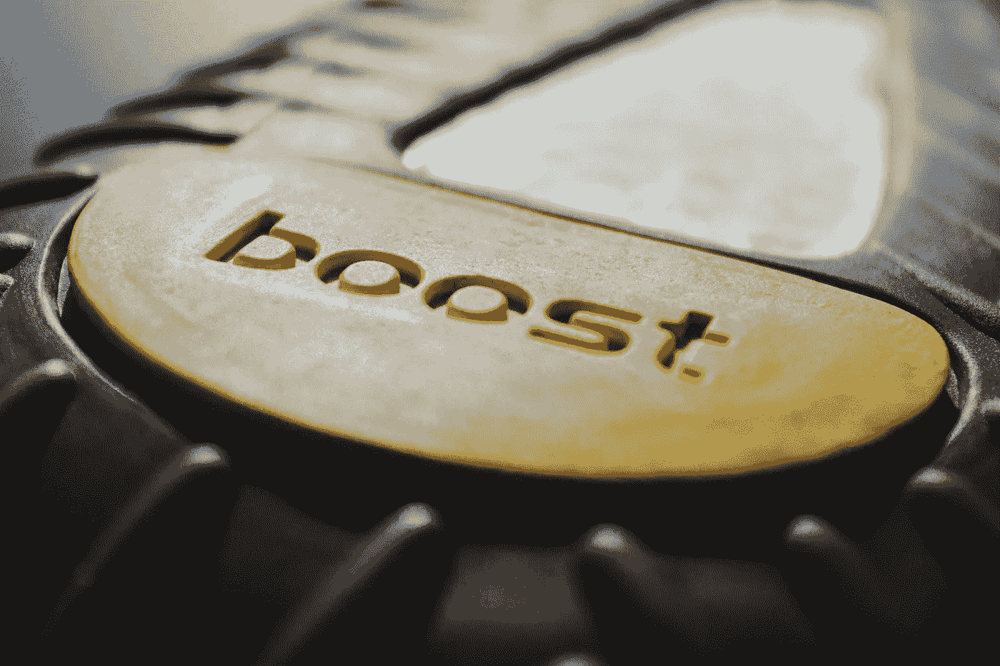
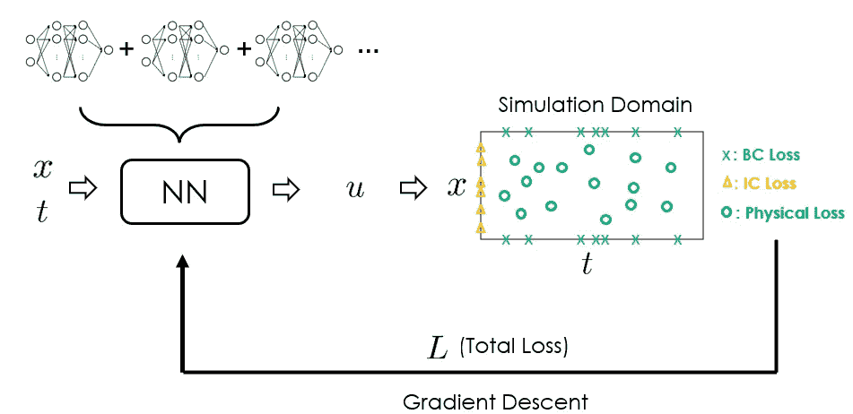
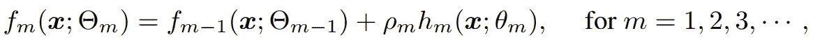
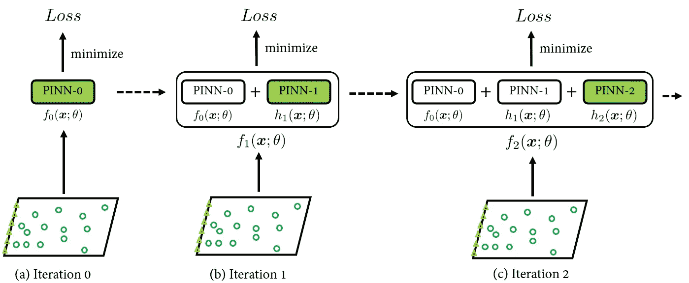
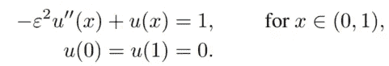
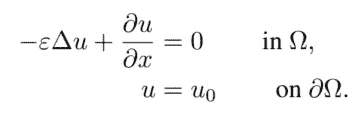
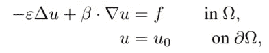
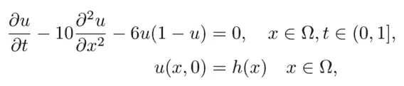
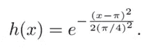
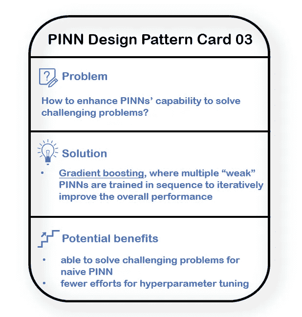

# 揭示物理信息神经网络的设计模式：第三部分

> 原文：[`towardsdatascience.com/unraveling-the-design-pattern-of-physics-informed-neural-networks-part-03-fe365ef480d9`](https://towardsdatascience.com/unraveling-the-design-pattern-of-physics-informed-neural-networks-part-03-fe365ef480d9)

## 通过梯度提升训练超充 PINN 的性能

 [Shuai Guo](https://shuaiguo.medium.com/?source=post_page-----fe365ef480d9--------------------------------)

·发布于 [Towards Data Science](https://towardsdatascience.com/?source=post_page-----fe365ef480d9--------------------------------) ·阅读时间 7 分钟·2023 年 5 月 25 日

--

照片由 [Haithem Ferdi](https://unsplash.com/@haithemfrd_off?utm_source=medium&utm_medium=referral) 提供，来源于 [Unsplash](https://unsplash.com/?utm_source=medium&utm_medium=referral)

欢迎来到本系列的第三篇博客，在这里我们继续探索物理信息神经网络（PINN）的设计模式，进行令人兴奋的旅程。

在这篇博客中，我们将探讨使用梯度提升训练 PINNs，这是一种神经网络与梯度提升算法的激动人心的融合 🚀。

如往常一样，我将按照以下方式结构化这篇博客：

+   **问题**，提出的策略试图解决的具体问题；

+   **解决方案**，提出的策略的关键组件，它是如何实施的，以及它可能有效的原因；

+   **基准**，评估了哪些物理问题，以及相关的性能；

+   **优点与缺点**，提出的策略在什么条件下可能有效，同时也突出其潜在的局限性；

+   **替代方案**，为解决类似问题提出的其他方法，从而提供更广泛的潜在解决方案视角。

> 随着本系列的不断扩展，PINN 设计模式的集合变得更加丰富*🙌* 这里是对你即将迎接内容的预览：
> 
> [PINN 设计模式 01: 优化残差点分布](https://medium.com/towards-data-science/unraveling-the-design-pattern-of-physics-informed-neural-networks-series-01-8190df459527)
> 
> PINN 设计模式 02: 动态解决方案区间扩展
> 
> [PINN 设计模式 04：梯度增强的 PINN 学习](https://medium.com/towards-data-science/unraveling-the-design-pattern-of-physics-informed-neural-networks-part-04-c778f4829dde)
> 
> PINN 设计模式 05：自动化超参数调整
> 
> [PINN 设计模式 06：因果 PINN 训练](https://medium.com/towards-data-science/unraveling-the-design-pattern-of-physics-informed-neural-networks-part-06-bcb3557199e2)
> 
> PINN 设计模式 07：与 PINN 的主动学习

让我们深入了解一下！

# 1\. 快速了解论文：

+   **标题**：用于物理信息神经网络的集成学习：一种梯度提升方法

+   **作者**：Z. Fang, S. Wang, P. Perdikaris

+   **机构**：宾夕法尼亚大学

+   链接：[arXiv](https://arxiv.org/abs/2302.13143)

# 2\. 设计模式

## 2.1 问题

原始 PINNs 已知在模拟对输入的**小变化**非常敏感并需要高度准确性以准确捕捉其动态的物理过程时存在困难。这些物理系统的例子包括多尺度问题和奇异摄动问题，这些问题与流体动力学和气候建模等领域密切相关。

PINN 工作流程。原始 PINNs 在解决复杂 PDE 时通常面临挑战。解决此问题的一种有前景的方法是通过**提升**算法训练 PINNs。（图像由本博客作者提供）

## 2.2 解决方案

结果显示，其他机器学习算法也会遇到相同的问题，解决此问题的一种有前景的方法是采用“梯度提升”方法。因此，自然产生了一个问题：我们能否模拟梯度提升算法来训练 PINNs？论文对此给出了肯定的答案。

提升是一种通用的机器学习算法，可以简洁地表达为以下迭代形式：

在每一次提升轮次中，都会导出一个增量模型 *hₘ*(•) 并在上一次迭代的预测器 f*ₘ_*₁(•) 上添加（以学习率 *ρₘ* 进行折扣），以便提高 f*ₘ*(•) 的准确性。

现在，如果我们将 f*ₘ_*₁(•)、f*ₘ*(•) 和 *hₘ*(•) 替换为物理信息神经网络，我们可以实现通过提升算法训练 PINNs。下面是展示训练过程的示意图：

PINN 模型按顺序训练以迭代地最小化损失。只有标记为绿色的块是可训练的。损失是通常的 PINN 损失，即 PDE 损失、边界条件损失等。（图像由本博客作者提供）

在论文的实现中，加性 PINN 模型*hₘ*(•)的结构和超参数是**预先确定的**。这与原始的梯度提升算法不同，后者会利用梯度下降找到最佳的*hₘ*(•)形式。然而，作者声称使用预选的*hₘ*(•)仍然可以模拟提升算法的行为，但计算复杂性显著降低。

根据论文中进行的数值实验，通常 3~5 个 PINNs 足以提供令人满意的结果。对于设置学习率*ρₘ*，建议的做法是将初始*ρ*设置为 1，并且随着*m*的增加，*ρ*值按指数衰减。

## 2.3 解决方案为何可能有效

由于所提解决方案模拟了传统的“梯度提升”机制，因此自动继承了该方法提供的所有优点：通过顺序添加弱模型，每个新模型能够纠正前一模型所犯的错误，从而迭代地提高整体性能。这使得该方法在处理多尺度或奇异摄动问题等具有挑战性的问题时尤其有效。

同时，对于提升算法，即使每个提升阶段的组件模型相对“弱”，也仍然可以实现“强”的模型。这一特性使得整体 PINN 模型对超参数设置的敏感性降低。

## 2.4 基准测试

论文在四个不同的数学问题上对所提策略的性能进行了基准测试，每个问题都代表一个独特的数学挑战：

+   1D 奇异摄动问题：奇异摄动问题是一类特殊情况，其中方程中的某些项变得极小或极大，导致不同的行为模式，难以建模。这些问题通常出现在科学和工程的许多领域，如流体动力学、电路和控制系统。

ε = 1e-4。

+   2D 对流主导的扩散方程：这个方程模拟了对流效应（由于整体运动而产生的传输）远强于扩散效应（由于浓度梯度产生的传输）的物理现象。这些类型的问题出现在气象学（如风传播污染物）和海洋学（如洋流输送热量）等各种领域。

ε = 1e-3, Ω = (0, 1)²。

+   2D 对流主导的扩散问题（特征为弯曲流线和内部边界层）：这是前述问题的一个更复杂的变体，其中流动模式弯曲，并且在问题领域内存在显著的边界层。这些复杂性需要更复杂的数值方法，使得问题更具现实世界挑战的代表性。

ε = 1e-4, Ω = (0, 1)², β = eˣ(sin(y), cos(y))。

+   2D 非线性反应-扩散方程（时间依赖）：这个方程模拟了物质扩散与反应的结合，但它也具有非线性，并且随时间变化。这类问题在生物学和化学等领域很常见，在这些领域中，物质在介质中相互作用并扩散，且反应速率可能随时间变化。

Ω = (0, 2π)，周期边界条件。

基准研究结果显示：

+   与传统的 PINNs 相比，所提出的算法在所有测试案例中显示了显著的准确性提升；

+   所提出的算法显示出鲁棒性，对超参数选择不太敏感。

## 2.5 优缺点

👍**优点**

+   相比于单一的 PINN，准确性显著提升。

+   对网络结构和排列的选择具有较强的鲁棒性。

+   调整超参数所需的努力较少。

+   灵活且可以轻松与其他 PINNs 技术集成。

👎**缺点**

+   不适用于解决具有导数爆炸的守恒定律（例如，无粘性 Burgers 方程、Sod 冲击管问题等），这是由于这些方程解对 PDE 损失的敏感性不足。

+   在可扩展性方面存在限制，因为它可能需要更多的计算资源和时间来顺序训练多个神经网络。

## 2.6 替代方案

由于这是第一篇将提升算法引入 PINN 领域的论文，目前尚无类似的工作。

尽管如此，在增强 PINN 建模具有挑战性的物理过程的能力方面，论文特别提到了 [Krishnapriyan et al.](https://arxiv.org/abs/2109.01050) 的工作。该策略是将时间域划分为子区间，PINNs 被逐步构建以模拟每个子区间（类似于 [之前博客](https://medium.com/towards-data-science/unraveling-the-design-pattern-of-physics-informed-neural-networks-part-02-2156516f2791) 中涵盖的想法）。

目前的论文在最后的基准案例研究（上述 2.4 节）中将 Krishnapriyan 的方法与新提出的方法进行了比较。结果表明，所提出的提升方法能够将误差降低 4 倍。

# 3 未来潜在改进

对所提出的策略的进一步改进包括研究神经网络的最佳顺序组合，与其他类型的神经网络架构混合并匹配梯度提升训练迭代，以及将 PINN 训练的其他最佳实践（例如，残差点生成）集成到梯度提升训练框架中。

# 4 主要收获

在这篇博客中，我们探讨了一种基于提升的集成学习的新型 PINN 训练范式。这个话题非常相关，因为它增强了 PINNs 处理像多尺度和奇异摄动问题这样具有挑战性问题的能力。

和往常一样，这里是本论文提出的设计模式的要点：

+   [问题]：如何提升 PINN 解决复杂问题的能力？

+   [解决方案]：**梯度提升**，其中多个“弱”PINN 按顺序训练，以迭代地提高整体性能。

+   [潜在的好处]：1\. 能够解决简单 PINN 的复杂问题。2\. 超参数调整的工作量减少

这是另一个 PINN 设计卡片：

论文中提出的 PINN 设计模式。（图像由本博客作者提供）

希望您觉得这篇博客有用😃如果您想了解更多关于 PINN 设计模式的内容，请随时查看本系列的其他帖子：

+   [PINN 设计模式 01：优化残差点分布](https://medium.com/towards-data-science/unraveling-the-design-pattern-of-physics-informed-neural-networks-series-01-8190df459527)

+   [PINN 设计模式 02：动态解决方案区间扩展](https://medium.com/towards-data-science/unraveling-the-design-pattern-of-physics-informed-neural-networks-part-02-2156516f2791)

+   [PINN 设计模式 04：梯度增强的 PINN 学习](https://medium.com/towards-data-science/unraveling-the-design-pattern-of-physics-informed-neural-networks-part-04-c778f4829dde)

+   [PINN 设计模式 05：PINN 的超参数调整](https://medium.com/towards-data-science/unraveling-the-design-pattern-of-physics-informed-neural-networks-part-05-67a35a984b23)

+   [PINN 设计模式 06：因果 PINN 训练](https://medium.com/towards-data-science/unraveling-the-design-pattern-of-physics-informed-neural-networks-part-06-bcb3557199e2)

+   PINN 设计模式 07：利用 PINN 进行主动学习

期待在即将到来的博客中与您分享更多见解！

# 参考文献

[1] Fang 等，物理信息神经网络的集成学习：一种梯度提升方法，[arXiv](https://arxiv.org/abs/2302.13143)，2023。

[2] Krishnapriyan 等，物理信息神经网络中可能的失效模式的特征，[arXiv](https://arxiv.org/abs/2109.01050)，2021。
