# 揭示物理信息神经网络的设计模式：第四部分

> 原文：[`towardsdatascience.com/unraveling-the-design-pattern-of-physics-informed-neural-networks-part-04-c778f4829dde`](https://towardsdatascience.com/unraveling-the-design-pattern-of-physics-informed-neural-networks-part-04-c778f4829dde)

## 利用梯度增强学习提高 PINN 训练效率

 [Shuai Guo](https://shuaiguo.medium.com/?source=post_page-----c778f4829dde--------------------------------)

·发表于 [Towards Data Science](https://towardsdatascience.com/?source=post_page-----c778f4829dde--------------------------------) ·7 min read·2023 年 5 月 29 日

--

图片由 [Hassaan Qaiser](https://unsplash.com/es/@hassaanhre?utm_source=medium&utm_medium=referral) 提供，来源于 [Unsplash](https://unsplash.com/?utm_source=medium&utm_medium=referral)

欢迎来到本系列的第 4 篇博客，我们将继续激动人心的旅程，探索物理信息神经网络（PINN）的设计模式🙌

在这篇博客中，我们将探讨一篇提出了新的 PINN 变体的研究论文，这种变体被称为 *梯度增强* PINN。更具体地，我们将研究 **问题**、**解决方案**、**基准**以及 **优缺点**，以提炼论文提出的设计模式。

> 随着本系列的不断扩展，PINN 设计模式的集合变得更加丰富*🙌* 这里是未来内容的一些预览：
> 
> [PINN 设计模式 01: 优化残差点分布](https://medium.com/towards-data-science/unraveling-the-design-pattern-of-physics-informed-neural-networks-series-01-8190df459527)
> 
> PINN 设计模式 02: 动态解决方案区间扩展
> 
> [PINN 设计模式 03: 使用梯度提升训练 PINN](https://medium.com/towards-data-science/unraveling-the-design-pattern-of-physics-informed-neural-networks-part-03-fe365ef480d9)
> 
> PINN 设计模式 05: 自动超参数调优
> 
> [PINN 设计模式 06: 因果 PINN 训练](https://medium.com/towards-data-science/unraveling-the-design-pattern-of-physics-informed-neural-networks-part-06-bcb3557199e2)
> 
> PINN 设计模式 07：利用 PINN 进行主动学习

让我们开始吧！

# 1\. 论文概览 🔍

+   **标题**：用于前向和逆向 PDE 问题的梯度增强物理信息神经网络

+   **作者**：J. Yu，L. Lu，X. Meng，G. E. Karniadakis

+   **机构**：圣马克学校（德克萨斯州）、宾夕法尼亚大学、布朗大学

+   **链接**：[arXiv](https://arxiv.org/abs/2111.02801)

# 2\. 设计模式 🎨

## 2.1 问题 🎯

在实际应用中，通常观察到即使有许多训练点，传统 PINN 的准确性仍然有限，特别是在处理具有刚性解的挑战性 PDE 时。这一限制影响了 PINN 在解决各种前向和逆向 PDE 问题中的有效性，限制了其在高精度解决这些问题的能力。

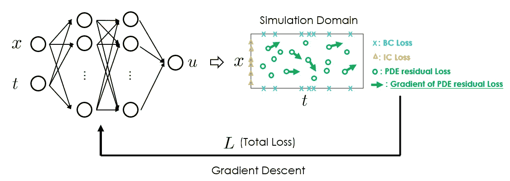

PINN 工作流程。传统的 PINN 即使在有许多残差点的情况下通常也有限制精度。提升 PINN 准确性的一个有前途的方法是通过**梯度增强学习**算法来训练 PINN。（图片由本博客作者提供）

## 2.2 解决方案 💡

提升 PINN 准确性的一个有前途的方法是采用**梯度增强学习**方法来训练 PINN。

梯度增强学习在传统机器学习中已被证明是有用的[2]。如下面的插图所示，除了通常的输入-输出对（*x*，*y*），梯度增强学习还将已知的函数梯度值*dy/dx*作为额外的监督信号纳入。这种学习方法如果梯度信息可以低成本获得（例如，解析上可用、易于测量等），则可以有效。

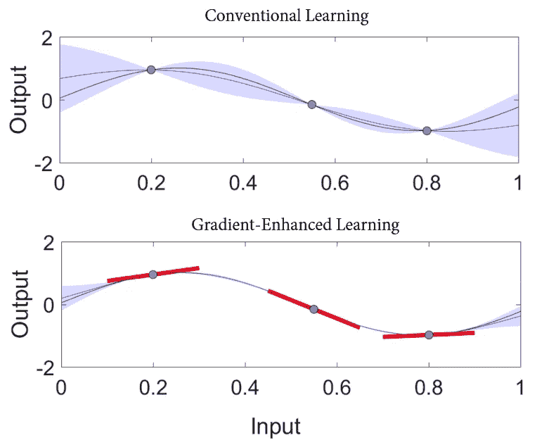

常规学习（上图）只要求模型预测在 x 处与真实函数值 f(x)匹配；梯度增强学习（下图）额外要求模型预测在 x 处的导数与已知的梯度值 df(x)/dx 匹配。（图片改编自[维基百科](https://en.wikipedia.org/wiki/Gradient-enhanced_kriging)）

同样的理念也可以应用于 PINN 训练，如论文中所示。

以简单的二维拉普拉斯方程（∂²u/∂x² + ∂²u/∂y² = 0）为例，当使用 PINN 求解该方程时，我们会强制要求 PDE 残差*f*为零，其中*f* = ∂²u/∂x² + ∂²u/∂y²。*f* 本质上衡量预测是否符合控制方程，并构成训练 PINN 的整体损失函数中的 PDE 损失项。

在梯度增强 PINN（gPINN）中，我们还可以强制要求 PDE 残差的导数为零：

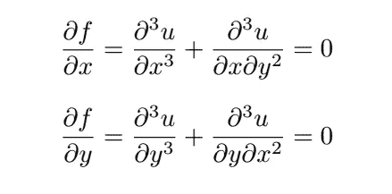

这样做的理由很简单：因为 *f* 在整个模拟域中为零，我们知道 *f* 的梯度也为零。因此，除了通常的 PDE 损失 *f* = 0 外，我们还会有两个额外的损失项。

## 2.3 为什么解决方案可能有效 🛠️

使 gPINN 有效的关键在于梯度提供了关于函数行为的额外信息。因此，它可以更有效地指导学习过程。这个特性在传统机器学习领域中已知，但当前论文显示相同的好处也可以用于 PINN 训练。

## 2.4 基准 ⏱️

论文考虑了总共 6 个不同的基准问题，包括 2 个前向问题，2 个反向问题，以及 2 个由标准 gPINN 和 gPINN+RAR 解决的带有刚性解的 PDE（[*基于残差的自适应细化*](https://arxiv.org/abs/1907.04502)用于采样残差点）：

+   1D 泊松方程（前向问题，用标准 gPINN 解决）：泊松方程是数学物理中一个基本的偏微分方程，描述了系统中物质的分布。

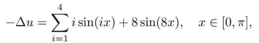

Dirichlet 边界条件：u(x=0) = 0，u(x=π) = π

+   扩散-反应方程（前向问题，用标准 gPINN 解决）：该方程模型了物质的反应与扩散。这里的前向问题涉及在给定初始条件和反应速率的情况下预测物质的浓度。

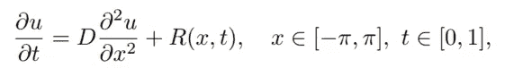

D=1（扩散系数）

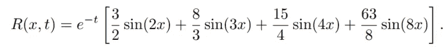

R 是化学反应

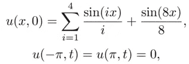

初始和边界条件

+   Brinkman-Forchheimer 方程（反向问题，用标准 gPINN 解决，识别有效粘度 **νₑ** 和渗透率 **K**）：该方程描述了在多孔介质中的流动，这在石油开采和地下水流动等领域很普遍。

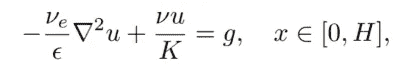

边界条件：u(0) = u(1) = 0，H=1，ν=1e-3，ε=0.4，g=1

+   1D 扩散-反应系统（反向问题，用标准 gPINN 解决，识别空间依赖的反应速率 *k*(*x*)）：类似于第二个问题，这也是一个扩散-反应方程。

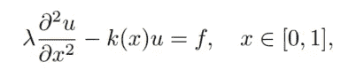

扩散系数 λ = 0.01，f = sin(2πx)。除了用于预测 u 的网络外，还使用了一个单独的神经网络来近似 k。

+   1D Burgers 方程（前向问题，用 gPINN+RAR 解决）：这是流体动力学中的一个基本方程，结合了非线性对流和扩散。

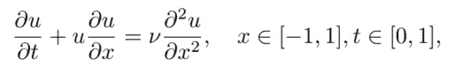

初始条件：u(x, 0) = -sin(πx)，边界条件：u(-1, t) = u(1, t) = 0，ν=0.01/π

+   Allen-Cahn 方程（前向问题，用 gPINN+RAR 解决）：该方程模型了相分离过程，这在材料科学中至关重要。

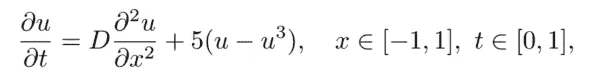

初始条件：u(x, 0) = x² cos(πx)，边界条件：u(-1, t) = u(1, t) = -1，D = 0.001

基准研究表明：

+   提出的梯度增强 PINN 学习（gPINN）在残差点更少的情况下实现了更高的准确性；

+   gPINN 结合先进的残差点采样方案（例如，RAR）在挑战性 PDE 问题中表现最佳。

## 2.5 优点与缺点 ⚡

**优点** 💪

+   不仅函数预测的准确性提高，函数导数预测的准确性也得到了改善。

+   收敛速度更快。

+   在训练点更少的情况下比传统 PINN 表现更好。

+   适用于前向问题和反向问题。

+   可以轻松与先进的残差点采样方案（[参见上一篇博客](https://medium.com/towards-data-science/unraveling-the-design-pattern-of-physics-informed-neural-networks-series-01-8190df459527)）结合，以进一步提高性能，特别是在具有陡峭梯度的 PDE 解中。

**缺点** 📉

+   引入了新的加权参数来平衡整体 PINN 损失函数中的梯度损失项。

+   模型训练的复杂性增加，可能导致计算成本增加。

## 2.6 替代方案 🔀

由于这是第一篇将梯度增强学习范式引入 PINN 领域的论文，目前还没有其他类似的方法。论文中所有的比较都在普通 PINN、gPINN 及 gPINN+RAR 采样方案之间进行。

# 3 潜在的未来改进 🌟

还有几种可能性可以进一步改善提出的策略：

+   自动调整梯度损失项的权重。

+   改进残差点的选择以评估额外的梯度损失。当前论文使用相同的残差点来评估 PDE 残差和 PDE 残差的梯度。然而，如果两组残差点不相同，可能会获得更好的性能。

+   需要更高效的自动微分策略来计算高阶导数。

# 4 个要点 📝

在这篇博客中，我们探讨了通过梯度增强学习来提高 PINN 的准确性和训练效率。以下是论文中提出的设计模式的亮点：

+   [问题]：如何提高 PINNs 的准确性和训练效率？

+   [解决方案]：**梯度增强学习**，在 PINN 损失函数中不仅强制 PDE 残差为零，还强制其梯度为零。

+   [潜在好处]：1. 比简单 PINN 表现更佳，残差点更少。2. 不仅函数预测的准确性提高，函数导数预测的准确性也得到了改善。

像往常一样，我准备了一张 PINN 设计卡来总结要点：

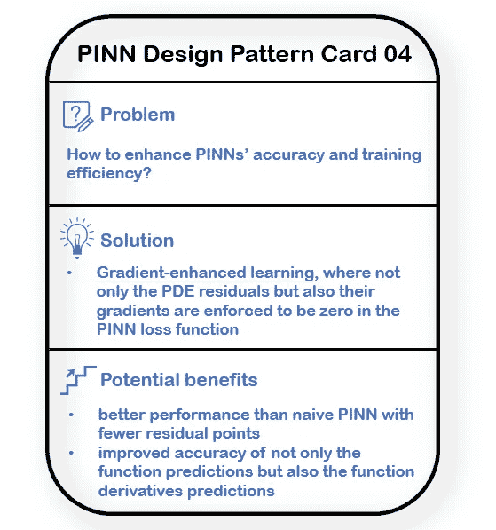

论文中提出的 PINN 设计模式。（图像由本博客作者提供）

希望您觉得这篇博客有用！要了解更多关于 PINN 设计模式的内容，请随时查看本系列的其他文章：

+   [PINN 设计模式 01：优化残差点分布](https://medium.com/towards-data-science/unraveling-the-design-pattern-of-physics-informed-neural-networks-series-01-8190df459527)

+   PINN 设计模式 02：动态解决方案区间扩展

+   PINN 设计模式 03：带有梯度提升的 PINN 训练

+   [PINN 设计模式 05：PINN 的超参数调整](https://medium.com/towards-data-science/unraveling-the-design-pattern-of-physics-informed-neural-networks-part-05-67a35a984b23)

+   [PINN 设计模式 06：因果 PINN 训练](https://medium.com/towards-data-science/unraveling-the-design-pattern-of-physics-informed-neural-networks-part-06-bcb3557199e2)

+   PINN 设计模式 07：使用 PINN 进行主动学习

期待在接下来的博客中与您分享更多见解！

# 参考 📑

[1] Yu 等，基于梯度增强的物理信息神经网络用于正向和反向 PDE 问题，[arXiv](https://arxiv.org/abs/2111.02801)，2021 年。

[2] Laurent 等，梯度增强元模型的概述及应用，[Arch Computat Methods Eng](https://link.springer.com/article/10.1007/s11831-017-9226-3#article-info)，2019 年。
