# 揭示物理信息神经网络的设计模式: 第五部分

> 原文：[`towardsdatascience.com/unraveling-the-design-pattern-of-physics-informed-neural-networks-part-05-67a35a984b23`](https://towardsdatascience.com/unraveling-the-design-pattern-of-physics-informed-neural-networks-part-05-67a35a984b23)

## 利用自动化超参数优化提升 PINN 效果

 [Shuai Guo](https://shuaiguo.medium.com/?source=post_page-----67a35a984b23--------------------------------)

·发布于 [Towards Data Science](https://towardsdatascience.com/?source=post_page-----67a35a984b23--------------------------------) ·阅读时间 9 分钟·2023 年 6 月 4 日

--

图片来源：[Drew Patrick Miller](https://unsplash.com/@drewpatrickmiller?utm_source=medium&utm_medium=referral) 在 [Unsplash](https://unsplash.com/?utm_source=medium&utm_medium=referral)

欢迎来到本系列的第 5 篇博客，我们继续探索物理信息神经网络（PINN）的***设计模式***之旅🙌

你是否曾经想过，物理信息神经网络的最佳架构是否可以自动搜索？事实证明，有一种方法可以做到这一点，如我们今天要讨论的论文所示。

和往常一样，我们将从讨论当前问题开始，然后介绍提出的解决方案、基准测试过程以及所提技术的优缺点。博客最后将探讨一些潜在的未来机会。

> 如果你对本系列中涵盖的其他 PINN 设计模式感兴趣，可以在这里跟进：
> 
> [PINN 设计模式 01: 优化残差点分布](https://medium.com/towards-data-science/unraveling-the-design-pattern-of-physics-informed-neural-networks-series-01-8190df459527)
> 
> PINN 设计模式 02: 动态解区间扩展
> 
> [PINN 设计模式 03: 用梯度提升训练 PINN](https://medium.com/towards-data-science/unraveling-the-design-pattern-of-physics-informed-neural-networks-part-03-fe365ef480d9)
> 
> [PINN 设计模式 04: 梯度增强 PINN 学习](https://medium.com/towards-data-science/unraveling-the-design-pattern-of-physics-informed-neural-networks-part-04-c778f4829dde)
> 
> [PINN 设计模式 06：因果 PINN 训练](https://medium.com/towards-data-science/unraveling-the-design-pattern-of-physics-informed-neural-networks-part-06-bcb3557199e2)
> 
> PINN 设计模式 07：使用 PINN 进行主动学习

让我们深入探讨！

# 1\. 论文概览 🔍

+   **标题**：Auto-PINN：理解和优化物理信息神经网络架构

+   **作者**：Y. C. Wang, X. T. Han, C. Y. Chang, D. C. Zha, U. Braga-Neto, X. Hu

+   **机构**：德克萨斯农工大学，莱斯大学

+   链接：[arXiv](https://arxiv.org/abs/2205.13748)

# 2\. 设计模式 🎨

## 2.1 问题 🎯

在物理信息神经网络（PINNs）的应用中，神经网络超参数，如网络深度、宽度、激活函数的选择等，都会对 PINN 的效率和准确性产生显著影响，这并不令人意外。

自然，人们会求助于**AutoML**（更具体地说，神经架构搜索）来自动识别最佳网络超参数。但在此之前，有两个问题需要解决：

1.  如何有效地在广阔的搜索空间中导航？

1.  如何定义合适的搜索目标？

后者的原因在于 PINN 通常被视为一个“无监督”问题：由于训练是通过最小化 ODE/PDE 残差来指导的，因此不需要标记数据。

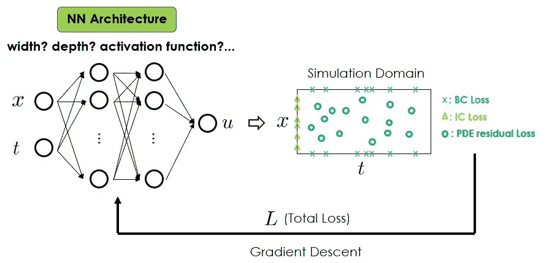

PINN 工作流。PINN 的性能对网络结构非常敏感。解决这一问题的一个有前途的方法是利用 AutoML 进行自动超参数调优。（图片由本博客作者提供）

为了更好地理解这两个问题，作者进行了大量实验，以调查 PINN 性能对网络结构的敏感性。现在，让我们看看他们发现了什么。

## 2.2 解决方案 💡

论文提出的第一个观点是**训练损失可以作为搜索目标的替代指标**，因为它与 PINN 的最终预测准确性高度相关。这解决了为超参数搜索定义合适优化目标的问题。

第二个观点是**无需同时优化所有网络超参数**。相反，我们可以采用**逐步解耦策略**，例如，首先搜索最佳激活函数，然后固定激活函数的选择，寻找最佳网络宽度，再固定之前的决定并优化网络深度，依此类推。在他们的实验中，作者证明了这一策略非常有效。

有了这两个观点，我们来详细看看如何执行搜索。

首先，考虑哪些网络超参数？在论文中，推荐的搜索空间是：

+   **宽度**：每个隐藏层中的神经元数量。考虑的范围是[8, 512]，步长为 4 或 8。

+   **深度**：隐藏层的数量。考虑的范围是[3, 10]，步长为 1。

+   **激活函数**：Tanh、Sigmoid、ReLU，以及[Swish](https://paperswithcode.com/method/swish)。

+   **变化点**：使用 Adam 的周期占总训练周期的比例。考虑的值为[0.1, 0.2, 0.3, 0.4, 0.5]。在 PINN 中，通常的做法是首先使用 Adam 训练若干周期，然后切换到 L-BFGS 继续训练若干周期。此变化点超参数决定了切换的时机。

+   **学习率**：固定值为 1e-5，因为它对最终的架构搜索结果影响较小。

+   **训练周期**：固定值为 10000，因为它对最终的架构搜索结果影响较小。

其次，让我们详细审查提出的过程：

+   第一个搜索目标是*激活函数*。为此，我们采样宽度和深度参数空间，并计算不同激活函数下所有宽度-深度样本的损失。这些结果可以为我们提供哪个激活函数是主导的线索。一旦决定，我们将在后续步骤中固定激活函数。

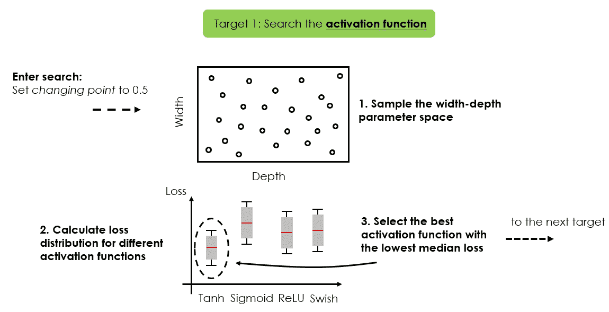

第一步是识别主导的激活函数。（图片由博客作者提供）

+   第二个搜索目标是*宽度*。更具体地说，我们寻找几个 PINN 表现良好的宽度区间。

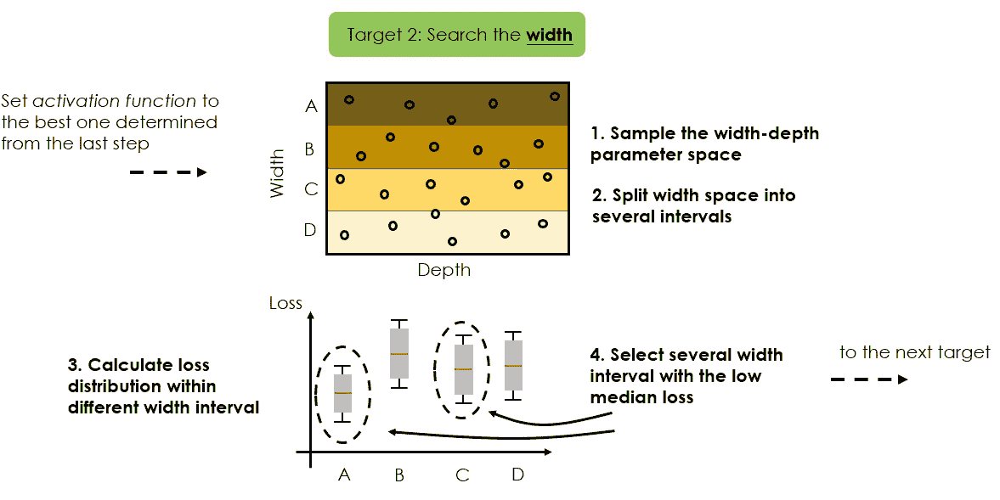

第二步是识别网络宽度的有前景区间。（图片由博客作者提供）

+   第三个搜索目标是*深度*。在这里，我们只考虑在上一步确定的最佳表现区间内变化的宽度，并希望找到 PINN 表现良好的最佳 K 个宽度-深度组合。

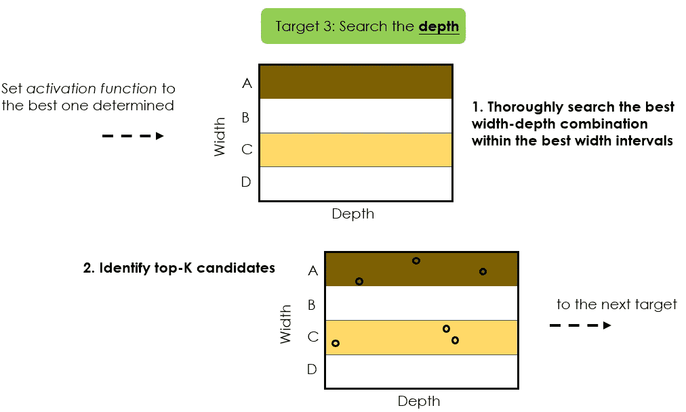

第三步是识别表现最好的宽度-深度组合的前 K 名。（图片由博客作者提供）

+   最终搜索目标是*变化点*。我们仅需为上一步识别的前 K 个配置中的每一个寻找最佳变化点。

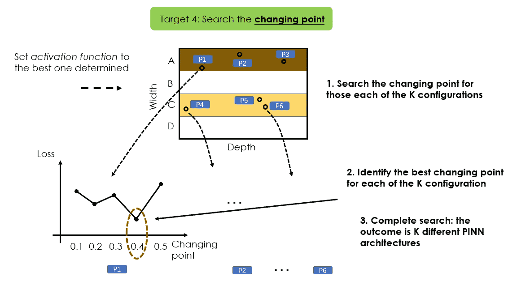

最后一步是识别最佳变化点。（图片由博客作者提供）

这一搜索过程的结果是**K 种不同的 PINN 结构**。我们可以从这些 K 个候选中选择表现最好的一个，或简单地使用所有这些模型形成一个 K-ensemble PINN 模型。

注意，上述过程需要指定若干调优参数（如宽度区间的数量、K 的数量等），这将取决于可用的调优预算。

至于具体优化算法的使用，可以利用现成的 AutoML 库来完成任务。例如，论文中的作者使用了[Tune package](https://docs.ray.io/en/latest/tune/index.html)来执行超参数调优。

## 2.3 为什么解决方案可能有效 🛠️

通过解耦不同超参数的搜索，搜索空间的规模可以大大缩小。这不仅大大降低了搜索复杂性，还显著提高了为研究中的物理问题找到（近）最优网络架构的可能性。

此外，使用训练损失作为搜索目标既简单易行又令人期望。由于训练损失（主要由 PDE 残差损失构成）与推理过程中的 PINN 准确性高度相关（根据论文中进行的实验），识别出能提供最小训练损失的架构也可能会导致一个高预测准确度的模型。

## 2.4 基准测试 ⏱️

论文考虑了总共 7 个不同的基准问题。所有问题都是正向问题，PINN 用于求解 PDE。

+   具有 Dirichlet 边界条件的热方程。这类方程描述了给定区域内的热量或温度分布。

    时间。

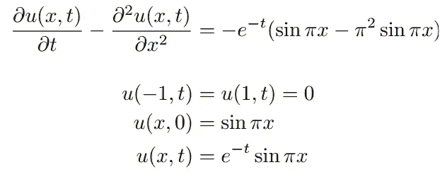

+   具有 Neumann 边界条件的热方程。

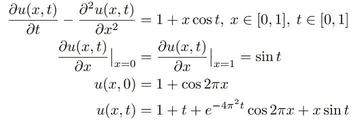

+   波动方程，描述了空间中振动的传播，如机械波和电磁波。这里考虑了 Dirichlet 和 Neumann 条件。

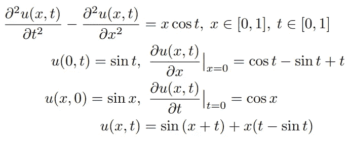

+   Burgers 方程，已被用来模拟冲击流、燃烧室中的波动传播、交通流动等。

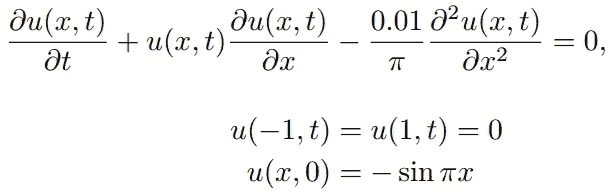

+   对流方程，描述了标量场在已知速度矢量场的作用下的运动。

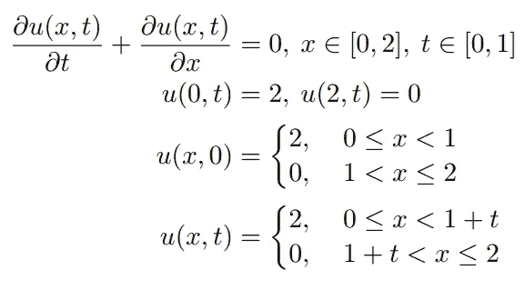

+   对流方程，具有不同的边界条件。

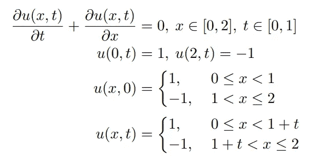

+   反应方程，描述化学反应。

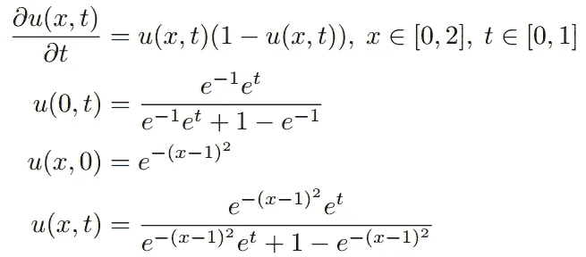

基准研究结果显示：

+   提出的 Auto-PINN 在各种 PDE 问题中表现稳定。

+   在大多数情况下，Auto-PINN 能够识别出具有最小误差值的神经网络架构。

+   使用 Auto-PINN 方法的搜索尝试次数较少。

## 2.5 优势和劣势 ⚡

**优势** 💪

+   显著降低了进行 PINN 应用的神经架构搜索的计算成本。

+   提高了识别适用于不同 PDE 问题的（近）最优神经网络架构的可能性。

**劣势** 📉

+   使用训练损失值作为搜索目标的有效性可能依赖于特定的 PDE 问题特征，因为基准测试仅针对特定的一组 PDE 进行。

+   数据采样策略影响 Auto-PINN 的性能。尽管论文讨论了不同数据采样策略的影响，但并未提供如何选择适合特定 PDE 问题的最佳策略的明确指南。这可能为使用 Auto-PINN 增添了另一层复杂性。

## 2.6 替代方案 🔀

传统的现成 AutoML 算法也可以用于解决物理信息神经网络（PINNs）的超参数优化问题。这些算法包括 *随机搜索*、*遗传算法*、*贝叶斯优化* 等。

与那些替代算法相比，新提出的 Auto-PINN 专门为 PINN 设计。这使得它成为优化 PINN 超参数的独特且有效的解决方案。

# 3 个潜在的未来改进 🌟

还有几个可能的方式来进一步改进所提议的策略：

+   结合更复杂的数据采样策略，例如自适应和基于残差的采样方法，以提高搜索精度和模型性能。

> 要了解更多关于如何优化残差点分布的信息，请查看 [这篇博客](https://medium.com/towards-data-science/unraveling-the-design-pattern-of-physics-informed-neural-networks-series-01-8190df459527) 这是 PINN 设计模式系列中的一篇文章。

+   对搜索目标进行更多的基准测试，以评估训练损失值是否确实是各种类型 PDE 的良好代理。

+   纳入其他类型的神经网络。目前版本的 Auto-PINN 仅为多层感知机（MLP）架构设计。未来的工作可以探索卷积神经网络（CNNs）或递归神经网络（RNNs），这些可能增强 PINNs 解决更复杂 PDE 问题的能力。

+   Auto-PINN 中的迁移学习。例如，在某些类型的 PDE 问题上表现良好的架构可以作为类似类型 PDE 问题搜索过程的起点。这可能加快搜索过程并提高模型的性能。

# 4 个收获 📝

在这篇博客中，我们讨论了如何使用 Auto-PINN 方法有效调优 PINN 模型超参数。以下是论文中提出的设计模式的亮点：

+   [问题]: 如何自动调优 PINNs 的模型超参数？

+   [解决方案]: **定制化神经架构搜索**，在该方法中，训练损失被用作搜索目标，并采用逐步解耦策略来有效缩小搜索空间。

+   [潜在好处]: 1\. 更高效的搜索，显著降低计算成本。2\. 提高识别不同类型 PDE 问题的（近似）最优神经网络超参数的可能性。

一如既往，我准备了一张 PINN 设计卡来总结收获：

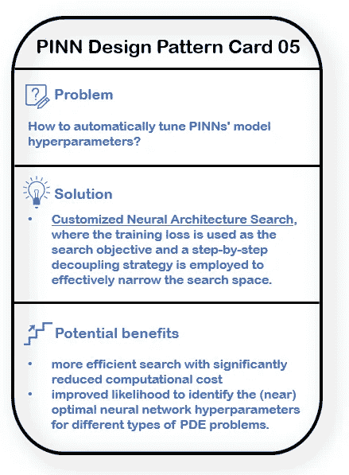

论文中提出的 PINN 设计模式。（图像由该博客作者提供）

希望您觉得这篇博客对您有用！要了解更多关于 PINN 设计模式的内容，请随时查看本系列的其他文章：

+   [PINN 设计模式 01：优化残差点分布](https://medium.com/towards-data-science/unraveling-the-design-pattern-of-physics-informed-neural-networks-series-01-8190df459527)

+   PINN 设计模式 02：动态解空间区间扩展

+   PINN 设计模式 03：使用梯度提升的 PINN 训练

+   [PINN 设计模式 04：梯度增强的 PINN 学习](https://medium.com/towards-data-science/unraveling-the-design-pattern-of-physics-informed-neural-networks-part-04-c778f4829dde)

+   [PINN 设计模式 06：因果 PINN 训练](https://medium.com/towards-data-science/unraveling-the-design-pattern-of-physics-informed-neural-networks-part-06-bcb3557199e2)

+   PINN 设计模式 07：使用 PINN 的主动学习

期待在即将发布的博客中与您分享更多见解！

# 参考 📑

[1] Wang et al., Auto-PINN: 理解和优化物理信息神经网络架构, [arXiv](https://arxiv.org/abs/2205.13748), 2022.
