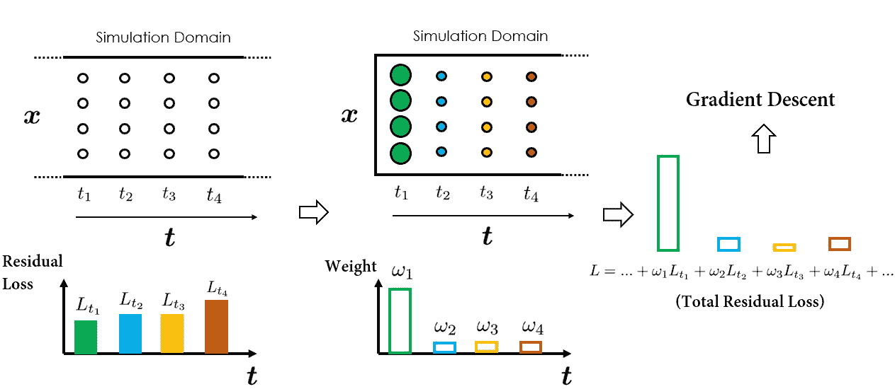
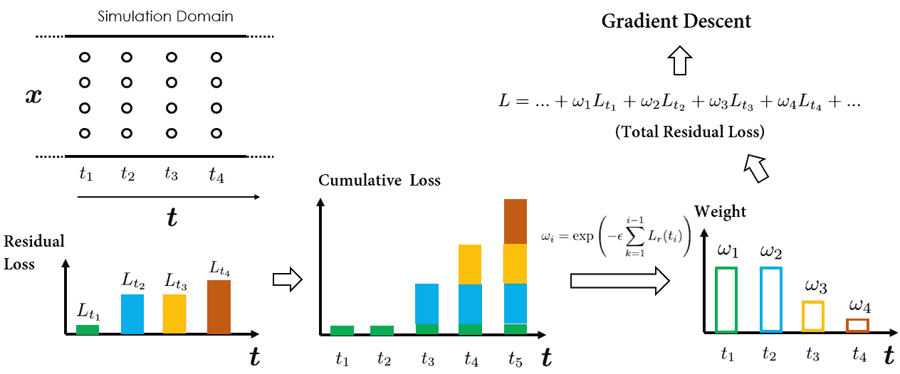

# 揭开物理信息神经网络设计模式的面纱：第六部分

> 原文：[`towardsdatascience.com/unraveling-the-design-pattern-of-physics-informed-neural-networks-part-06-bcb3557199e2`](https://towardsdatascience.com/unraveling-the-design-pattern-of-physics-informed-neural-networks-part-06-bcb3557199e2)

## 将因果关系引入 PINN 训练

 [Shuai Guo](https://shuaiguo.medium.com/?source=post_page-----bcb3557199e2--------------------------------)

·发布于[Towards Data Science](https://towardsdatascience.com/?source=post_page-----bcb3557199e2--------------------------------) ·阅读时间 9 分钟·2023 年 6 月 13 日

--

照片由[Delano Ramdas](https://unsplash.com/@delanodzr?utm_source=medium&utm_medium=referral)提供，来源于[Unsplash](https://unsplash.com/?utm_source=medium&utm_medium=referral)

欢迎来到本系列的第六篇博客，我们将继续探索物理信息神经网络（PINN）的***设计模式***🙌

在这一集里，我们将讨论将**因果关系**引入物理信息神经网络训练的内容。正如我们今天将要查看的论文所建议的：尊重因果关系就是你所需的一切！

一如既往，让我们首先讨论当前的问题，然后转到建议的解决方案、评估程序以及所提方法的优缺点。最后，我们将通过探索潜在的机会来结束博客。

> 随着这一系列的不断扩展，PINN 设计模式的集合变得更加丰富*🙌* 这里是一些即将到来的内容的预览：
> 
> PINN 设计模式 01：优化残差点分布
> 
> PINN 设计模式 02：动态解区间扩展
> 
> [PINN 设计模式 03：使用梯度提升训练 PINN](https://medium.com/towards-data-science/unraveling-the-design-pattern-of-physics-informed-neural-networks-part-03-fe365ef480d9)
> 
> [PINN 设计模式 04：梯度增强的 PINN 学习](https://medium.com/towards-data-science/unraveling-the-design-pattern-of-physics-informed-neural-networks-part-04-c778f4829dde)
> 
> PINN 设计模式 05：自动化超参数调整
> 
> PINN 设计模式 07：使用 PINN 的主动学习

让我们深入探讨！

# 1\. 论文概述 🔍

+   **标题**：尊重因果性是训练物理信息神经网络所需的一切

+   **作者**：S. Wang, S. Sankaran, P. Perdikaris

+   **机构**：宾夕法尼亚大学

+   **链接**：[arXiv](https://arxiv.org/abs/2203.07404), [GitHub](https://github.com/PredictiveIntelligenceLab/CausalPINNs)

# 2\. 设计模式 🎨

## 2.1 问题 🎯

物理信息神经网络（PINNs）在结合观察数据和物理法则方面是一个重大进展。然而，在实践中，它们常常无法处理高度非线性、多尺度动态或混沌问题，并趋向于收敛到错误的解。

为什么会这样呢？

好吧，根本问题在于当前论文揭示的 PINN 公式中的**因果性违背**。

物理意义上的因果性意味着未来时刻的状态依赖于当前或过去时刻的状态。然而，在 PINN 训练中，这一原则可能不成立；这些网络可能隐含偏向于首先在未来状态下近似 PDE 解，然后才解决初始条件，实质上是“跳过”时间，从而违反因果性。

相比之下，传统的数值方法通过时间推进策略固有地保持因果性。例如，在时间上离散化 PDE 时，这些方法确保在近似时间 *t* + ∆*t* 时的解之前解决时间 *t* 时的解。因此，每个未来状态是依赖于已解决的过去状态，从而保持因果性原则。

对这个问题的理解引出了一个有趣的问题：我们如何纠正 PINN 中的因果性违背，使其符合基本物理法则？

PINN 工作流程。简单的 PINN 没有“因果性”嵌入其中。一种简单而有效的策略是动态加权不同时间实例的 PDE 残差损失。（图像由本博客作者提供）

## 2.2 解决方案 💡

这里的关键思想是**重新制定 PINN 损失函数**。

具体来说，我们可以引入动态加权方案，以考虑在不同时间位置评估的 PDE 残差损失的不同贡献。让我们通过插图来详细分析。

为了简化起见，我们假设在空间-时间域中的配点是均匀采样的，如下图所示：

总 PDE 残差损失是计算在所有配点上的，其梯度值用于驱动网络参数优化。（图像由本博客作者提供）

为了进行一步梯度下降，我们必须首先计算所有配点的累计 PDE 残差损失。具体做法是首先计算与在各个时间点采样的配点相关的损失，然后进行“简单的求和”以获得总损失。接下来的梯度下降步骤可以基于计算得到的总损失来优化 PINN 权重。

> 当然，配点的求和顺序不会影响总损失的计算；所有方法都会得到相同的结果。然而，按时间顺序分组损失计算的决定是有目的的，旨在强调‘时间性’的元素。这个概念对于理解提出的因果训练策略至关重要。

在这个过程中，评估在不同时间位置的 PDE 残差损失被视为同等重要。这意味着所有时间残差损失同时被最小化。

然而，这种方法存在风险，可能会导致 PINN 违反时间因果关系，因为它没有对在连续时间间隔最小化时间残差损失进行时间上的规范化。

那么，我们如何引导 PINN 在训练过程中遵循时间优先原则呢？

秘诀在于**有选择地加权各个时间残差损失**。例如，假设在当前迭代中，我们希望 PINN 专注于在时间点*t*₁处逼近解。那么，我们可以简单地在 Lᵣ(*t*₁)上加上更高的权重，这就是在*t*₁处的时间残差损失。这样，Lᵣ(*t*₁)将成为最终总损失中的主导成分，结果是优化算法将优先最小化 Lᵣ(*t*₁)，这与我们首先在时间点*t*₁逼近解的目标一致。

通过在不同时间点分配时间残差损失的权重，我们可以引导优化器专注于在我们期望的时间点最小化损失。（图片由本博客作者提供）

在随后的迭代中，我们将注意力转向时间点*t*₂处的解。通过增加 Lᵣ(*t*₂)的权重，它现在成为总损失计算中的主要因素。因此，优化算法被引导去最小化 Lᵣ(*t*₂)，从而提高了在*t*₂处解的预测准确性。

（图片由本博客作者提供）

从我们之前的演示可以看出，通过改变在不同时间点分配的时间残差损失权重，我们可以引导 PINN 在我们选择的时间点逼近解。

那么，这如何帮助将因果结构纳入 PINN 训练中呢？事实证明，我们可以设计一种因果训练算法（如论文中提出的），使得**时间*t*的时间残差损失的权重 Lᵣ(*t*)，只有在*t*之前的损失（Lᵣ(*t-1*), Lᵣ(*t-2*), 等）足够小时才显著**。这有效地意味着神经网络仅在对先前步骤的近似准确度令人满意时才开始最小化 Lᵣ(t)。

为了确定权重，论文提出了一个简单的公式：权重ωᵢ设置为与所有之前时间实例的累计时间残差损失的大小成反向指数比例。这确保了当所有之前时间实例的累计损失较小时，权重ωᵢ才会活跃（即，具有足够大的值），即 PINN 已经能够准确地近似之前时间步的解。这就是*时间因果关系*在 PINN 训练中体现的方式。

（图片来自博客作者）

解释了所有组件后，我们可以将完整的因果训练算法拼凑如下：

论文中提出的因果训练算法的示意图。（图片来自博客作者）

在结束本节之前，有两个值得提及的备注：

1.  论文建议使用ωᵢ的大小作为 PINN 训练的停止标准。具体来说，当所有ωᵢ的值都大于预定义的阈值δ时，训练可以认为完成。推荐的δ值为 0.99。

1.  选择合适的ε值很重要。虽然可以通过传统的超参数调整来调整此值，但论文推荐了一种退火策略来调整ε。详细信息请参见[原始论文](https://arxiv.org/abs/2203.07404)（第三部分）。

## 2.3 为什么这个解决方案可能有效 🛠️

通过动态加权在不同时间实例评估的时间残差损失，提出的算法能够引导 PINN 训练首先在较早的时间近似 PDE 解，然后再尝试解决较晚时间的解。

这个属性有助于将时间因果关系明确地融入 PINN 训练中，并构成潜在更准确的物理系统模拟的关键因素。

## 2.4 基准 ⏱️

论文考虑了总共 3 个不同的基准方程。所有问题都是前向问题，其中 PINN 用于求解 PDE。

+   洛伦兹系统：这些方程出现在行星大气对流和不稳定性的研究中。洛伦兹系统对其初始条件具有强烈的敏感性，且对普通 PINN 来说是具有挑战性的。

+   Kuramoto–Sivashinsky 方程：该方程描述了各种波动模式的动态，如火焰、化学反应和表面波。它被认为表现出丰富的时空混沌行为。

+   Navier-Stokes 方程：这组偏微分方程描述了流体物质的运动，并构成了流体力学的基本方程。当前论文考虑了一个经典的二维衰减湍流示例，位于一个具有周期性边界条件的方形区域内。

基准研究表明：

+   与原始 PINN 训练方案相比，提出的因果训练算法能够实现 10 到 100 倍的准确性改进。

+   演示了配备因果训练算法的 PINNs 能够成功模拟高度非线性、多尺度和混沌系统。

## 2.5 优势与劣势 ⚡

**优势** 💪

+   尊重因果性原则，使 PINN 训练更加透明。

+   引入了显著的准确性改进，使其能够解决那些对 PINNs 仍然难以处理的问题。

+   提供了一个实用的定量标准，用于评估 PINNs 的训练收敛性。

+   与原始 PINN 训练策略相比，计算成本几乎可以忽略不计。唯一的额外成本是计算ωᵢ，这与自动微分操作相比几乎可以忽略。

**劣势** 📉

+   引入了新的超参数ε，该参数控制时间残差损失权重的调度。尽管作者提出了一种退火策略作为替代方案，以避免繁琐的超参数调优。

+   使 PINN 训练工作流程复杂化。应特别关注时间权重ωᵢ，因为它们现在是网络可训练参数（如层权重和偏差）的函数，计算ωᵢ的梯度不应反向传播。

## 2.6 替代方案 🔀

有几种替代方法试图解决与当前“因果训练算法”相同的问题：

+   自适应时间采样策略 ([Wight et al.](https://arxiv.org/abs/2007.04542))：该策略不是对不同时间点的配点进行加权，而是修改配点的采样密度。这种方法类似于将优化器的关注点转移到不同时间点的时间损失最小化上。

+   “时间推进”/“课程训练”策略（例如，[Krishnapriyan et al.](https://arxiv.org/abs/2109.01050)）：通过在不同的时间窗口内顺序学习解决方案来尊重时间因果性。

然而，与那些替代方法相比，“因果训练算法”将时间因果性置于核心，更适应各种问题，且计算成本低。

# 3 潜在的未来改进 🌟

有几种可能性可以进一步改进提出的策略：

+   结合更复杂的数据采样策略，如自适应和基于残差的采样方法，以进一步提高训练效率和准确性。

> 欲了解如何优化残差点分布，请查看[此博客](https://medium.com/towards-data-science/unraveling-the-design-pattern-of-physics-informed-neural-networks-series-01-8190df459527)中的 PINN 设计模式系列。

+   扩展到逆问题设置。当信息点源（即观测数据）可用时，如何确保因果关系将需要对目前提出的训练策略进行扩展。

# 4 个要点📝

在这篇博客中，我们探讨了如何通过重新制定训练目标将因果关系引入 PINN 训练。以下是论文中提出的设计模式的亮点：

+   [问题]：如何让 PINN 遵守支撑物理系统的因果关系原则？

+   [解决方案]：**重新制定 PINN 训练目标**，引入动态加权方案，以逐步将训练重点从早期时间步骤转移到后期时间步骤。

+   [潜在收益]：1\. 显著提高 PINN 的准确性。2\. 扩展 PINN 对复杂问题的适用性。

这是 PINN 设计卡，总结了主要收获：

论文中提出的 PINN 设计模式。（图片由此博客作者提供）

希望你觉得这篇博客有用！要了解更多关于 PINN 设计模式的信息，请随时查看此系列中的其他帖子：

+   [PINN 设计模式 01：优化残差点分布](https://medium.com/towards-data-science/unraveling-the-design-pattern-of-physics-informed-neural-networks-series-01-8190df459527)

+   PINN 设计模式 02：动态解决方案区间扩展

+   PINN 设计模式 03：带有梯度提升的 PINN 训练

+   [PINN 设计模式 04：增强梯度的 PINN 学习](https://medium.com/towards-data-science/unraveling-the-design-pattern-of-physics-informed-neural-networks-part-04-c778f4829dde)

+   [PINN 设计模式 05：PINN 的超参数调优](https://medium.com/towards-data-science/unraveling-the-design-pattern-of-physics-informed-neural-networks-part-05-67a35a984b23)

+   PINN 设计模式 07：与 PINN 的主动学习

期待在即将到来的博客中与您分享更多见解！

# 参考📑

[Wang 等人，尊重因果关系是训练物理信息神经网络所需的一切](https://arxiv.org/abs/2203.07404)，[arXiv](https://arxiv.org/abs/2203.07404)，2022 年。
