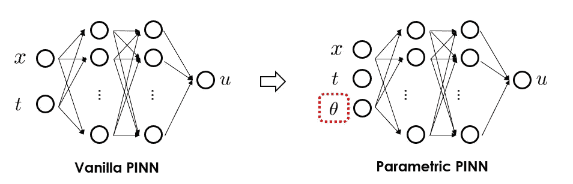
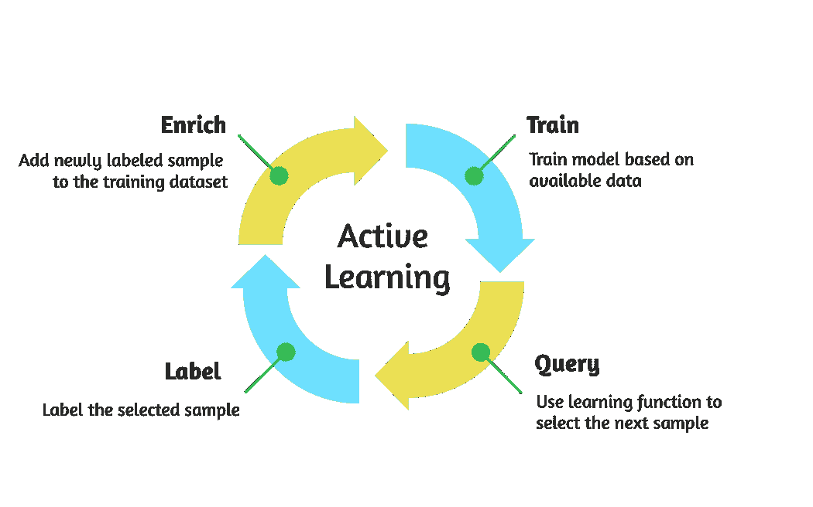
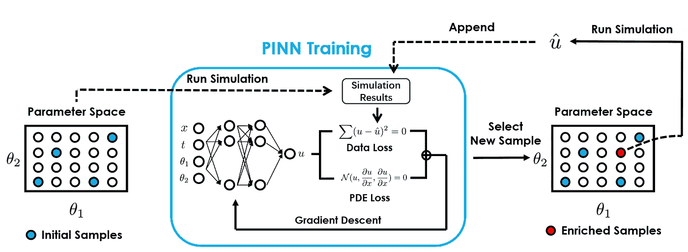
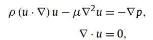
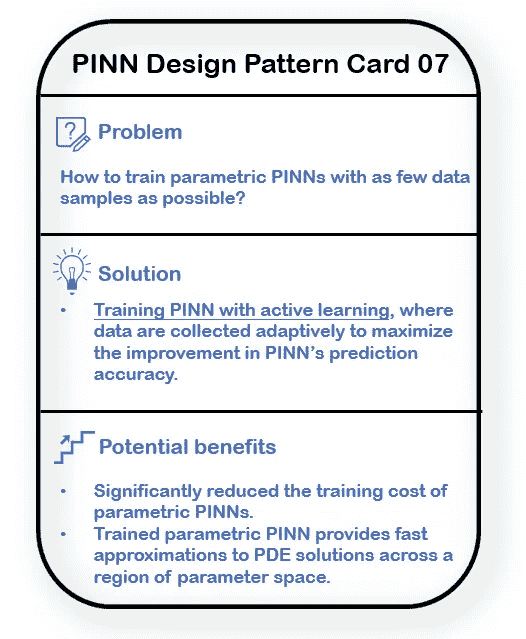

# 揭示物理信息神经网络的设计模式：第七部分

> 原文：[`towardsdatascience.com/unraveling-the-design-pattern-of-physics-informed-neural-networks-part-07-4ecb543b616a`](https://towardsdatascience.com/unraveling-the-design-pattern-of-physics-informed-neural-networks-part-07-4ecb543b616a)

## 高效训练参数化 PINN 的主动学习

 [Shuai Guo](https://shuaiguo.medium.com/?source=post_page-----4ecb543b616a--------------------------------)

·发表于 [Towards Data Science](https://towardsdatascience.com/?source=post_page-----4ecb543b616a--------------------------------) ·阅读时长 8 分钟·2023 年 7 月 25 日

--

图片来源于 [Scott Graham](https://unsplash.com/@homajob?utm_source=medium&utm_medium=referral) 在 [Unsplash](https://unsplash.com/?utm_source=medium&utm_medium=referral)

欢迎来到本系列的第 7 篇博客，我们将继续激动人心的探索***物理信息神经网络（PINN）设计模式***的旅程🙌

在这篇博客中，我们将详细探讨一篇将**主动学习**引入 PINN 的论文。和以往一样，我们将从设计模式的角度分析这篇论文：首先，我们会介绍目标问题，然后引入提出的方法。接下来，我们将讨论评估过程以及该方法的优缺点。最后，我们将通过探索未来的机会来总结博客内容。

> 随着系列的不断扩展，PINN 设计模式的集合也变得更加丰富！以下是一些即将呈现的内容预览：
> 
> PINN 设计模式 01: 优化残差点分布
> 
> PINN 设计模式 02: 动态解决方案区间扩展
> 
> [PINN 设计模式 03: 使用梯度提升训练 PINN](https://medium.com/towards-data-science/unraveling-the-design-pattern-of-physics-informed-neural-networks-part-03-fe365ef480d9)
> 
> [PINN 设计模式 04: 梯度增强 PINN 学习](https://medium.com/towards-data-science/unraveling-the-design-pattern-of-physics-informed-neural-networks-part-04-c778f4829dde)
> 
> PINN 设计模式 05: 自动超参数调优
> 
> [PINN 设计模式 06：因果 PINN 训练](https://medium.com/towards-data-science/unraveling-the-design-pattern-of-physics-informed-neural-networks-part-06-bcb3557199e2)

让我们深入了解吧！

# 1\. 论文概述 🔍

+   **标题**：主动训练物理信息神经网络以聚合和插值 Navier-Stokes 方程的参数化解

+   **作者**：C. A., Arthurs, A. P. King

+   **机构**：伦敦国王学院

+   **链接**：[计算物理学期刊](https://www.sciencedirect.com/science/article/pii/S002199912100259X)

# 2\. 设计模式 🎨

## 2.1 问题 🎯

PINN 的主要用途之一是***替代***高保真度、耗时的数值模拟（例如，结构动力学的 FEM 模拟）。得益于已知控制微分方程强有力的正则化（表现为额外的损失项），PINN 的训练通常只需从少量模拟运行中收集的最少数据。

然而，这种理想的情况仅限于研究的问题不涉及变量参数的情况。在实际应用中，我们经常需要推断不同领域几何形状、模型参数（例如，材料属性）以及初始和/或边界条件的解。我们肯定不希望为每种不同的情况重新训练一个新的 PINN，因为这会非常低效且计算成本高。

解决这个挑战的一种策略是将普通 PINN 升级为**参数化 PINN**：本质上，变量参数被视为 PINN 的额外输入，如下图所示。一旦训练完成，我们可以使用参数化 PINN 在任何给定条件下进行即时预测。

图 1\. 与仅接受空间/时间坐标的普通 PINN 相比，参数化 PINN 还将变量参数作为输入。（图片由本博客作者提供）

如预期的那样，更多的输入要求更多的训练数据。由于生成新训练数据意味着运行耗时的模拟，因此一个关键问题出现了：如何在达到期望的预测准确度的同时，最小化模拟运行次数（从而提高数据效率）以进行 PINN 训练？

## 2.2 解决方案 💡

回答这个问题的关键在于战略性地选择参数空间（即**θ**空间）中的点来运行模拟，而论文提出的解决方案是**主动学习**。

图 2\. 主动学习工作流程。对于 PINN 训练，“标签”步骤对应于在参数空间中选择的样本位置运行数值模拟。（图片由本博客作者提供）

针对解决参数化 PDE 的应用，所提出的工作流程可以在下图中说明：

图 3\. 论文中提出的主动学习流程示意图。在这里，*θ*₁和*θ*₂表示变量参数（在实际应用中，可能有更多这样的变量参数），而 u 表示我们尝试模拟的物理量（例如，在流体仿真中，u 可以是速度、压力等）（图片由本博客作者提供）

提出的主动学习流程从随机采样参数空间开始（在图示中，*θ*₁和*θ*₂是变量参数），并进行数值仿真以收集训练数据（即在不同空间/时间位置的*u*，即所建模的物理量）。

然后，我们继续进行常规的 PINN 训练，其中神经网络的预测不仅需要与收集的模拟结果*u*匹配，还需要满足主导的微分方程。

一旦训练收敛，我们将获得一个能够在仿真空间/时间域内准确预测*u*的 PINN 模型，前提是*θ*₁-*θ*₂值包含在训练数据集中。然而，到目前为止，对于未见过的*θ*₁-*θ*₂值组合，没有保证 PINN 也能提供准确的预测。

这就是为什么我们启动主动学习过程的原因。我们的目标是选择下一个*θ*₁-*θ*₂样本来进行仿真。**理想情况下，我们希望这个新的*θ*₁-*θ*₂样本能够提供最多的信息，一旦将其相关的模拟结果附加到训练数据中，它可以带来 PINN 准确性的最大提升。**

那么我们应该如何选择新的*θ*₁-*θ*₂样本呢？论文提出了一个简单的标准：首先，使用当前训练好的 PINN 预测参数空间中所有候选*θ*₁-*θ*₂样本的*u*（这些候选样本可以预先大量生成以均匀填充空间），然后计算不同候选*θ*₁-*θ*₂样本的相应 PDE 残差。最后，**选择具有最高 PDE 残差的下一个*θ*₁-*θ*₂样本。**

换句话说，论文建议使用*PDE 残差*作为 PINN 预测准确性的指标。由于当前训练的 PINN 在选定的*θ*₁-*θ*₂位置最难准确预测满足已知微分方程的*u*，因此在选定的*θ*₁-*θ*₂位置运行耗时的仿真，并将模拟结果附加到原始训练数据中是有意义的。一旦训练数据得到丰富，我们就开始另一轮 PINN 训练，从而完成一次主动学习的迭代。整个过程在计算的最大 PDE 残差降到预定义的阈值以下时终止。

## 2.3 为什么解决方案可能有效 🛠️

主动学习是一种成熟的技术，用于减少模型训练成本。它之所以有效，是因为它能够识别当前 PINN 预测不够满意的参数空间区域，然后相应地选择下一步要模拟的点，以最大化模型的改进。通过这种方式，主动学习可以显著提高数据效率，同时确保达到所需的预测准确性。

## 2.4 基准测试 ⏱️

与其他 PINN 论文不同，当前论文专注于解决连续 2D 管道域中的参数稳态不可压 Navier-Stokes 方程：

考虑了两个变量参数，包括流动边界条件，即流入速率，以及域形状参数。

论文展示了，通过提出的主动学习策略训练的 PINN 可以准确高效地预测给定流入速率和域形状值的流场，且这些值都在考虑的变动范围内。

该论文还展示了，使用提出的主动学习策略相比于在所考虑的参数空间内进行随机或均匀数据选择，需要的模拟次数要少得多，同时在流场预测中的误差也要小得多。

最后，论文展示了训练后的参数化 PINN 的一个实际应用：参数扫描。更具体地说，训练后的 PINN 可以用于搜索参数空间，并识别当流场满足给定条件时两个参数的值。

## 2.5 优势与劣势 ⚡

**优点** 💪

+   大幅减少训练具有所需预测准确性的*参数*PINN 模型所需的模拟数据。

+   训练后的 PINN 模型能够在参数空间的区域内提供极快的 PDE 解决方案近似值。

+   训练后的 PINN 具有高度灵活性，因为它可以在不需要全面重新训练的情况下适应不同的参数空间。这是可能的，因为主动学习允许模型随着新的模拟回合在扩展参数空间中被轻松更新。

+   不需要存储大量模拟结果，因为训练后的参数化 PINN 可以按需生成流场结果。由于典型的神经网络只消耗少量存储空间，因此潜在的数据压缩是显著的。

**劣势** 📉

+   提出的主动训练流程的有效性可能取决于初始数据。如果初始数据集不能充分代表系统的基本行为，模型可能难以识别潜在的改进区域，从而导致后续模拟的选择不理想。

+   此外，所提的方法使用 PDE 残差作为模型预测精度的指示。然而，对于模型预测精度与 PDE 残差不相关的情况，所提方法的有效性可能会被打折扣。

+   目前，本文仅考虑了两个变量参数。然而，随着问题维度的增加，主动学习可能变得计算昂贵。因此，所提方法的可扩展性仍需进一步研究。

## 2.6 替代方案 🔀

替代使用主动学习方案，样本（用于运行模拟以生成训练数据）也可以通过采用准随机采样方法生成。流行的准随机采样方法包括拉丁超立方体采样（LHS）、Sobol 序列和 Halton 序列。与简单随机采样方案相比，准随机采样方法具有更好的*空间填充*特性，这意味着需要更少的样本来均匀覆盖所研究的参数空间。

然而，与论文中提出的主动学习方法相比，准随机采样方案需要用户预先指定样本数量，因此在新模拟数据可用时，在丰富训练数据集方面的灵活性较差。然而，主动学习会引入额外的计算成本，因为需要估计模型的性能并确定最具信息量的点以进行下一次模拟运行。

# 3 个潜在的未来改进 🌟

有几个可能的方向可以进一步改进所提的策略：

+   利用更复杂的主动学习算法来自动选择训练数据点。这可能进一步提高预测的准确性，并减少训练所需的时间。

+   开发策略以允许在每次主动学习迭代中采样多个数据点。由于相应的模拟可以并行运行，因此整体训练效率可以大大提高。

+   将其他经过验证的最佳实践（如协同点采样、因果训练、集成学习等）与所提的主动学习方案整合，以进一步提升模型性能。

# 4 个要点 📝

在这篇博客中，我们探讨了如何使用主动学习进行数据高效的参数化 PINN 训练。以下是论文中提出的设计模式的亮点：

+   [问题]：如何用尽可能少的数据样本训练参数化 PINN。

+   [解决方案]：**使用主动学习训练 PINN**，在这种方法中，数据会被自适应地收集，以最大化 PINN 预测精度的提升。

+   [潜在好处]：1. 显著降低了参数化 PINN 的训练成本。2. 训练后的参数化 PINN 在参数空间的区域内提供了对 PDE 解的快速近似。

以下是总结要点的 PINN 设计卡：

论文中提出的 PINN 设计模式。（图片由本博客作者提供）

# 参考文献 📑

[1] Arthurs 等人，《物理信息神经网络的主动训练以聚合和插值 Navier-Stokes 方程的参数解》，[计算物理学期刊](https://www.sciencedirect.com/science/article/pii/S002199912100259X)，2021 年。
