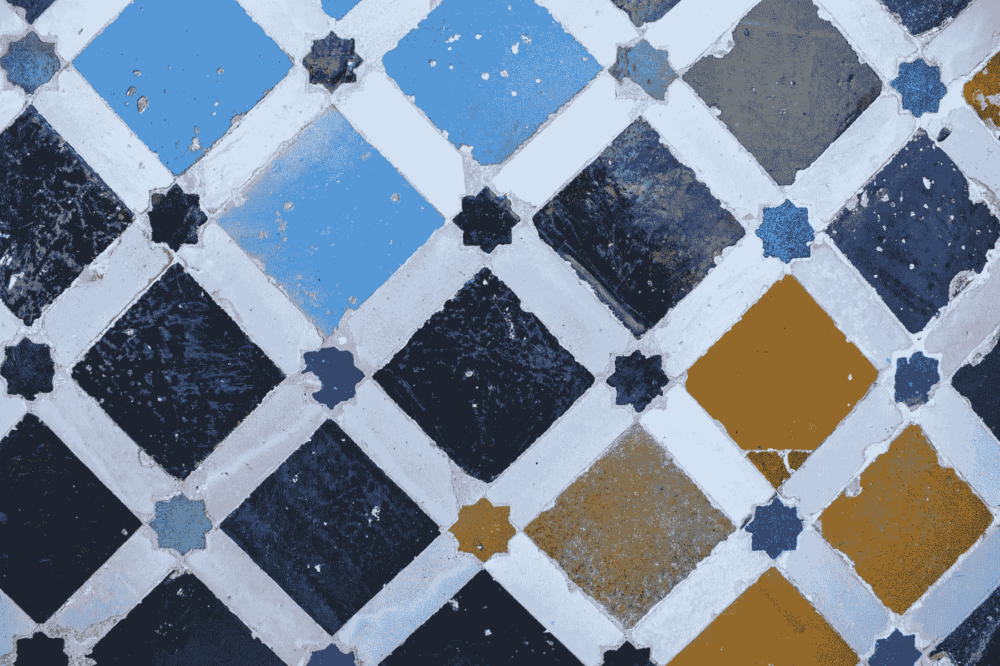

# 揭示物理信息神经网络的设计模式：第 01 系列

> 原文：[`towardsdatascience.com/unraveling-the-design-pattern-of-physics-informed-neural-networks-series-01-8190df459527?source=collection_archive---------5-----------------------#2023-05-15`](https://towardsdatascience.com/unraveling-the-design-pattern-of-physics-informed-neural-networks-series-01-8190df459527?source=collection_archive---------5-----------------------#2023-05-15)

## 优化残差点分布以提升 PINN 训练效率和准确性

 [Shuai Guo](https://shuaiguo.medium.com/?source=post_page-----8190df459527--------------------------------)

·

[关注](https://medium.com/m/signin?actionUrl=https%3A%2F%2Fmedium.com%2F_%2Fsubscribe%2Fuser%2F7b08bf52bf9c&operation=register&redirect=https%3A%2F%2Ftowardsdatascience.com%2Funraveling-the-design-pattern-of-physics-informed-neural-networks-series-01-8190df459527&user=Shuai+Guo&userId=7b08bf52bf9c&source=post_page-7b08bf52bf9c----8190df459527---------------------post_header-----------) 发布于 [Towards Data Science](https://towardsdatascience.com/?source=post_page-----8190df459527--------------------------------) · 9 分钟阅读 · 2023 年 5 月 15 日 

--

图片由 [Sebastian Yepes](https://unsplash.com/de/@sebasluna?utm_source=medium&utm_medium=referral) 提供，发布在 [Unsplash](https://unsplash.com/?utm_source=medium&utm_medium=referral)

近年来，物理信息神经网络（PINNs）作为一种结合了神经网络的强大功能与基本物理定律的洞察力的显著方法出现。随着我深入这个领域，我经常感到被大量的研究论文和它们提出的各种技术所淹没。在这些信息的海洋中导航变成了一项具有挑战性的任务，尤其是当我想找到最有效的解决方案来应对我的具体问题时。

我的个人经历和经验激发了我开始这个博客系列的想法：我的想法是，在每篇博客文章中，我将重点关注一篇或几篇研究论文，并将它们的贡献提炼成易于理解的见解。我的希望是这个博客系列能够作为一个结构化的地图，为 PINN 从业者提供帮助，以识别最适合具体挑战的技术，跟上最新的进展，并更自信地导航 PINNs 的世界。

那么，这个提炼过程应该是什么样的呢？个人来说，我发现*设计模式*的概念是一个非常不错的框架：
