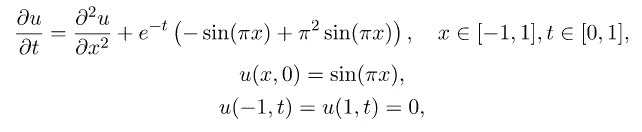

# 解密物理信息神经网络的设计模式：第 01 期

> 原文：[`towardsdatascience.com/unraveling-the-design-pattern-of-physics-informed-neural-networks-series-01-8190df459527`](https://towardsdatascience.com/unraveling-the-design-pattern-of-physics-informed-neural-networks-series-01-8190df459527)

## 优化残差点分布以提升 PINN 训练效率和准确性

 [Shuai Guo](https://shuaiguo.medium.com/?source=post_page-----8190df459527--------------------------------)

·发表于 [Towards Data Science](https://towardsdatascience.com/?source=post_page-----8190df459527--------------------------------) ·阅读时间 9 分钟·2023 年 5 月 15 日

--

由[Sebastian Yepes](https://unsplash.com/de/@sebasluna?utm_source=medium&utm_medium=referral)拍摄，[Unsplash](https://unsplash.com/?utm_source=medium&utm_medium=referral)

近年来，物理信息神经网络（PINNs）作为一种卓越的方法出现，将神经网络的强大功能与基本物理定律的洞察力结合在一起。当我深入这个领域时，我经常感到被大量的研究论文和它们提出的各种技术所压倒。在这片信息的海洋中导航成为了一项挑战，特别是当我想找到最有效的解决方案来应对特定问题时。

我的个人经历激发了我开始这个博客系列的想法：我的想法是，在每篇博客文章中，我将集中于一篇或几篇研究论文，并将其贡献提炼成易于理解的见解。我希望这个博客系列能够作为一个结构化的地图，供 PINN 从业者依赖，以识别最适合当前挑战的技术，保持对最新进展的了解，并更自信地探索 PINNs 的世界。

那么，这个提炼过程应该是什么样的呢？就个人而言，我发现*设计模式*的概念是一个非常好的框架：

> 设计模式指的是经过测试并证明有效的**可重用解决方案**，用于**常见问题**。设计模式提供了解决这些问题的模板，可以根据需要适应不同的情况。它们作为最佳实践，捕捉了该领域专家的集体知识和经验。

因此，本博客系列将超越传统的论文评论。它将作为一个有组织的目录，涵盖：

+   **问题**，提出的策略试图解决的具体问题；

+   **解决方案**，提出策略的关键组成部分，如何实施以及为什么可能有效；

+   **基准**，评估了哪些物理问题，以及相关的性能；

+   **优缺点**，在何种条件下提出的策略可以有效，同时也突出其潜在的局限性；

+   **替代方案**，为解决类似问题而提出的其他方法，从而提供对潜在解决方案的更广泛视角。

我希望这种方法能引起你的共鸣，因为它真正反映了我对组织知识和使其易于获取的热情。事不宜迟，让我们通过探索第一篇 PINN 论文一起踏上这段激动人心的旅程，专注于为 PINN 训练创建更好的残差点。

> 随着这一系列的不断扩展，PINN 设计模式的集合变得更加丰富*🙌* 这里是对未来内容的简要预览：
> 
> PINN 设计模式 02：动态解空间扩展
> 
> [PINN 设计模式 03：使用梯度提升训练 PINN](https://medium.com/towards-data-science/unraveling-the-design-pattern-of-physics-informed-neural-networks-part-03-fe365ef480d9)
> 
> [PINN 设计模式 04：梯度增强的 PINN 学习](https://medium.com/towards-data-science/unraveling-the-design-pattern-of-physics-informed-neural-networks-part-04-c778f4829dde)
> 
> PINN 设计模式 05：自动化超参数调优
> 
> [PINN 设计模式 06：因果 PINN 训练](https://medium.com/towards-data-science/unraveling-the-design-pattern-of-physics-informed-neural-networks-part-06-bcb3557199e2)
> 
> PINN 设计模式 07：与 PINN 的主动学习

# **1. 论文概览：**

+   **标题**：关于物理信息神经网络的非自适应和基于残差的自适应采样的综合研究

+   **作者**：C. Wu, M. Zhu, Q. Tan, Y. Kartha, L. Lu

+   **机构**：宾夕法尼亚大学、南加州大学、乔治亚理工学院

+   **链接**：[arXiv](https://arxiv.org/abs/2207.10289)

# 2. 设计模式

## 2.1 问题

物理信息神经网络（PINNs）通过显式地集成已知的物理过程的常微分方程或偏微分方程（ODEs/PDEs）提供了相对于传统神经网络的独特优势。PINNs 中这些控制方程的强制执行依赖于称为残差点的一组点。这些点在仿真领域内被战略性地选择，并将相应的网络输出代入控制方程以评估残差。残差指示了网络输出与基础物理过程的一致程度，因此作为一个关键的物理损失项来指导神经网络的训练过程。

显然，这些残差点的分布在影响 PINNs 训练过程的准确性和效率方面发挥着关键作用。然而，当前的方法通常涉及简单的均匀采样，这留有相当大的改进空间。

PINN 的示意图。虚线圈起来的部分，即残差点的分布，是本文主要解决的问题。（图像由本博客作者提供）

因此，一个紧迫的问题是：我们如何优化残差点的分布，以提高 PINNs 的准确性和训练效率？

## 2.2 解决方案

分配残差点的有前途的方法是采用**自适应策略**和**精细化策略**：

1.  自适应策略意味着在每经过一定数量的训练迭代后，可以生成一批新的残差点来替换先前的残差点；

1.  精细化策略意味着可以向现有残差点中添加额外的残差点，从而“精细化”残差点。

基于这两种基础策略，本文提出了两种新颖的采样方法：*基于残差的自适应分布*（RAD）和*基于残差的自适应分布精细化*（RAR-D）：

1. RAD: **R**esidual-based **A**daptive **D**istribution

关键思想是基于自定义的概率密度函数在空间域***x***上绘制新的残差样本。概率密度函数 *P*(***x***) 的设计使其与***x***处的 PDE 残差 ε(***x***) 成正比：

用于生成残差点的自定义概率密度函数。（来源于原始论文）

在这里，*k* 和 *c* 是两个超参数，分母中的期望项可以通过例如蒙特卡罗积分来近似。

RAD 方法总共有三个超参数：*k*、*c* 和重新采样的周期 *N*。尽管最佳的超参数值依赖于问题，但建议的默认值为 1、1 和 2000。

2. RAR-D: **R**esidual-based **A**daptive **R**efinement with **D**istribution

从本质上讲，RAR-D 在提出的 RAD 方法基础上增加了精炼元素：经过一定的训练迭代后，RAR-D 不会完全用新的残差点替换旧的残差点，而是保留旧的残差点，并根据上述自定义概率密度函数绘制新的残差点。

对于 RAR-D，建议的默认值为 *k* 和 *c* 分别为 2 和 0。

## 2.3 为什么解决方案可能有效

关键在于设计的采样概率密度函数：该密度函数倾向于在 PDE 残差较大的区域放置更多的点，而在残差较小的区域放置较少的点。这种点的战略分布使得在残差较高的区域能够进行更详细的 PDE 分析，可能导致 PINN 预测精度的提高。此外，优化的分布还允许更高效地利用计算资源，从而减少了准确解决控制 PDE 所需的总点数。

## 2.4 基准测试

论文对两种提出的方法与其他八种采样策略进行了基准测试。他们在处理各种物理方程中的前向和逆向问题时对这些方法进行了评估：

+   一维扩散方程：这种方程描述了热传导、分子扩散以及其他类似的物理过程。该方程描述了物质密度如何随着时间的推移而扩散或扩展。

+   Burgers’ 方程：该方程将非线性对流与扩散/粘度相结合。它被应用于包括流体力学、交通流、气体动力学等各种应用数学领域，有时还用于模拟冲击波。

+   Allen-Cahn 方程：该方程广泛用于描述相分离过程，这是材料科学中的一个关键现象。它模拟了一个二元（两相）系统向最小能量配置的演变。

+   波动方程：该方程是描述波动的二阶线性偏微分方程——如声波、光波或水波——在介质中传播的方程。它在声学和电磁学领域中具有基础性作用。

+   扩散-反应方程（逆问题，标定反应速率 *k*(*x*)）：该方程是扩散方程和反应系统的结合。

+   Korteweg-de Vries 方程（逆问题，标定 λ₁ 和 λ₂）：该方程描述了某些类型的波动传播，如浅水波。

比较研究表明：

1.  RAD 策略始终表现最佳，使其成为一个强有力的默认策略。

1.  如果计算成本是一个问题，RAR-D 可以作为一种强有力的替代方案，因为它提供了足够的准确性，并且计算需求低于 RAD。

1.  RAD 和 RAR-D 在处理复杂 PDE 时表现特别有效。

1.  当模拟的 PDE 具有光滑解时，RAD 和 RAR-D 的优势会减少。

## 2.5 优势与劣势

👍**优点**

+   动态改善基于 PDE 残差的残差点分布。

+   提高了 PINN 的准确性。

+   在较少的残差点下实现了与现有方法相当的准确性。

👎**缺点**

+   可能比其他非自适应均匀采样方法计算成本更高。然而，这是为了更高的准确性所付出的代价。

+   对于具有光滑解的 PDE，例如扩散方程、扩散反应方程等，一些简单的均匀采样方法可能会产生足够低的误差，使得提出的解决方案在这些情况下可能不太适用。

+   引入了两个新的超参数 *k* 和 *c*，需要调整，因为它们的最佳值依赖于问题。

## 2.6 替代方案

当前论文之前已经提出了其他方法：

论文中研究了总共 10 种采样方法。两种新提出的方法用红色突出显示。（图片由这篇博客作者提供）

在这些方法中，有两种方法对当前论文提出的方法影响深远：

1.  基于残差的自适应细化 ([Lu et al.](https://arxiv.org/abs/1907.04502))，这是提出的 RAR-D 的一个特殊情况，其中 *k* 的值很大。

1.  重要性采样 ([Nabian et al.](https://arxiv.org/abs/2104.12325))，这是通过设置 *k*=1 和 *c*=0 得到的 RAD 特殊情况。

# 3 潜在的未来改进

未来的改进可以在以下几个方向进行：

+   进一步优化残差点生成的概率密度函数，可能使用 *元学习* 技术。

+   利用更复杂的 *主动学习* 或 *强化学习* 技术来优化采样策略。

# 4 收获

在这篇博客中，我们探讨了优化 PINNs 中残差点分布的有前景的解决方案。这个主题高度相关，因为它直接影响 PINNs 的准确性和效率。论文中提出的设计模式的要点总结如下：

+   [问题]：如何分配残差点以评估物理损失？

+   [解决方案]：**1**. **自适应采样**，即在高 PDE 残差区域采样更多。2. **细化采样**，即在现有点上添加新的残差点。

+   [潜在好处]：1. 提高准确性。2. 需要较少的残差点。

这是我准备的 PINN 设计模式卡片：

本文提出的 PINN 设计模式。（图片来自本博客作者）

希望你觉得这个博客有用😃 如果你想了解更多关于 PINN 设计模式的内容，请随时查看系列中的其他文章。

+   [PINN 设计模式 02：动态解决方案区间扩展](https://medium.com/towards-data-science/unraveling-the-design-pattern-of-physics-informed-neural-networks-part-02-2156516f2791)

+   PINN 设计模式 03：带有梯度提升的 PINN 训练

+   [PINN 设计模式 04：梯度增强的 PINN 学习](https://medium.com/towards-data-science/unraveling-the-design-pattern-of-physics-informed-neural-networks-part-04-c778f4829dde)

+   [PINN 设计模式 05：PINN 的超参数调整](https://medium.com/towards-data-science/unraveling-the-design-pattern-of-physics-informed-neural-networks-part-05-67a35a984b23)

+   [PINN 设计模式 06：因果 PINN 训练](https://medium.com/towards-data-science/unraveling-the-design-pattern-of-physics-informed-neural-networks-part-06-bcb3557199e2)

+   PINN 设计模式 07：与 PINN 的主动学习

# 参考文献

[1] Wu 等人，关于物理信息神经网络的非自适应和基于残差的自适应采样的综合研究，[arXiv](https://arxiv.org/abs/2207.10289)，2022 年。
