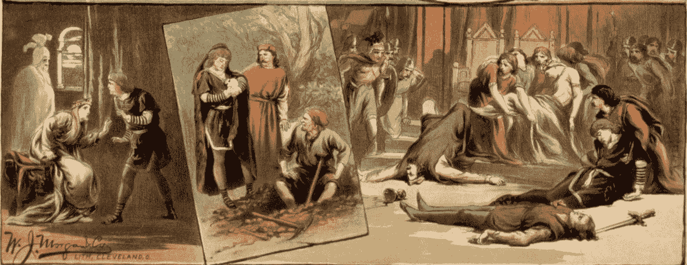

# 揭开大数法则的面纱

> 原文：[`towardsdatascience.com/unraveling-the-law-of-large-numbers-e36a3219acb2?source=collection_archive---------3-----------------------#2023-07-12`](https://towardsdatascience.com/unraveling-the-law-of-large-numbers-e36a3219acb2?source=collection_archive---------3-----------------------#2023-07-12)

[Pixabay](https://pixabay.com/photos/william-shakespeare-hamlet-poster-67768/)

## 大数法则的有趣之处在于它既表述了什么，也隐含了什么。

 [Sachin Date](https://timeseriesreasoning.medium.com/?source=post_page-----e36a3219acb2--------------------------------)

·

[查看](https://medium.com/m/signin?actionUrl=https%3A%2F%2Fmedium.com%2F_%2Fsubscribe%2Fuser%2Fb75b5b1730f3&operation=register&redirect=https%3A%2F%2Ftowardsdatascience.com%2Funraveling-the-law-of-large-numbers-e36a3219acb2&user=Sachin+Date&userId=b75b5b1730f3&source=post_page-b75b5b1730f3----e36a3219acb2---------------------post_header-----------) 发表在 [数据科学之道](https://towardsdatascience.com/?source=post_page-----e36a3219acb2--------------------------------) ·15 分钟阅读·2023 年 7 月 12 日

--

1966 年 8 月 24 日，一位名叫[汤姆·斯托帕德](https://en.wikipedia.org/wiki/Tom_Stoppard)的才华横溢的剧作家在苏格兰爱丁堡上演了一部戏剧。该剧有一个奇特的标题，《[罗森克兰茨与吉尔登斯顿死了](http://www.sondheimguide.com/Stoppard/rosencrantz.html)》。剧中的主要角色罗森克兰茨和吉尔登斯顿是哈姆雷特（莎士比亚笔下的角色）的童年好友。戏剧开场时，吉尔登斯顿不断抛掷硬币，而硬币总是出现正面。每次结果都让吉尔登斯顿的钱袋变轻，而罗森克兰茨的钱袋变重。随着正面不断出现，吉尔登斯顿开始感到担忧。他担心自己是否在秘密地希望每枚硬币都出现正面，作为对某个早已忘却的罪行的自我惩罚。或者时间在第一次抛掷后停止了，他和罗森克兰茨正在经历一遍又一遍的相同结果。

斯托帕德出色地展示了概率法则如何被编织进我们的世界观、我们的期待感以及人类思维的基本结构中。当第 92 次抛掷仍然出现正面时，吉尔登斯顿问道，他和罗森克兰茨是否处于一个超自然现实的控制之下，在这个现实中，概率法则不再起作用。

吉尔登斯顿的恐惧当然是毫无根据的。确实，得到 92 次…
