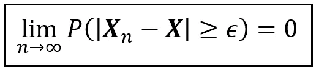

# 揭开大数法则的面纱

> 原文：[`towardsdatascience.com/unraveling-the-law-of-large-numbers-e36a3219acb2`](https://towardsdatascience.com/unraveling-the-law-of-large-numbers-e36a3219acb2)

[Pixabay](https://pixabay.com/photos/william-shakespeare-hamlet-poster-67768/)

## 大数法则的有趣之处在于它不仅仅是它所说明的内容，还有它所未说明的内容。

 [Sachin Date](https://timeseriesreasoning.medium.com/?source=post_page-----e36a3219acb2--------------------------------)

·发表于[Towards Data Science](https://towardsdatascience.com/?source=post_page-----e36a3219acb2--------------------------------) ·阅读时间 15 分钟·2023 年 7 月 12 日

--

1966 年 8 月 24 日，一位才华横溢的剧作家[汤姆·斯托帕德](https://en.wikipedia.org/wiki/Tom_Stoppard)在苏格兰爱丁堡上演了一部戏剧。这部戏剧有一个奇特的标题，“[罗生门与吉尔登斯特恩死了](http://www.sondheimguide.com/Stoppard/rosencrantz.html)”。其主要角色，罗生斯坦和吉尔登斯特恩，是哈姆雷特（莎士比亚名著中的角色）的童年朋友。戏剧开场时，吉尔登斯特恩反复掷硬币，每次都是正面。每次结果使吉尔登斯特恩的钱包变轻，而罗生斯坦的钱包变重。随着正面的鼓点不断重复，吉尔登斯特恩感到担忧。他担心自己是否在暗中希望每次硬币都是正面，以此作为对某个早已遗忘的罪行的自我惩罚。或者时间是否在第一次掷硬币后停滞不前，他和罗生斯坦在经历着相同的结果。

斯托帕德出色地展示了概率法则如何融入我们的世界观、期望感和人类思维的基本结构中。当第 92 次掷硬币仍然是正面时，吉尔登斯特恩问道，他和罗生斯坦是否处于一个不自然的现实中，在那里概率法则不再适用。

吉尔登斯特恩的担忧当然是没有根据的。确实，连续 92 次都是正面的可能性小得不可思议。实际上，这个概率是一个小数点后跟 28 个零再跟 2。吉尔登斯特恩更有可能被一颗[陨石](https://en.wikipedia.org/wiki/Martian_meteorite)砸中。

Guildenstern 只需在第二天再抛一次 92 次硬币，这个结果几乎肯定会与之前大相径庭。如果他每天都进行这个例程，他会发现大多数天里正面数量会与反面数量大致相等。

在连续出现 92 个正面的情况下，Guildenstern 得到了一个极度偏倚的样本。而他所目睹的是我们宇宙中的两种迷人行为——**概率收敛** 和 **大数法则**。

# 用简单的英语解释大数法则

大数法则，简称 LLN，有两个版本：弱版本和强版本。弱大数法则更直观、更易于理解，但也容易被误解。本文将讨论弱版本的内容，而强版本将在之后的文章中讨论。

弱大数法则关注的是样本均值与总体均值之间的关系。我将用简单的文字解释它的含义：

假设你从总体中随机抽取一个特定大小的样本，比如 100 个样本。记住**样本大小**这个术语。**样本的大小**是这个法则中的指挥者，是大拿。现在计算这个样本的均值并将其放置一旁。接下来，多次重复这一过程。你会得到一组不完美的**样本均值**。样本均值之所以不完美，是因为样本均值和真实总体均值之间总会存在误差。假设你能容忍一定的误差。如果你从这些均值中随机选择一个样本均值，有可能样本均值与总体均值之间的绝对差异会超过你的误差容忍度。

弱大数法则指出，样本均值与总体均值之间的误差落在你选择的容忍水平内的概率，随着样本量的增长，会趋近于完美的 1.0，也就是确定性，这种趋势在样本量无限增长或等于总体量时尤为明显。

无论你如何缩小容忍度水平，当你抽取越来越大规模的样本时，随机选择的样本均值超出这个容忍度的可能性将越来越小。

# 一个弱大数法则如何运作的现实世界示例

要了解弱大数法则的工作原理，我们将通过一个例子来演示。为此，请允许我带你到寒冷而阴郁的东北大西洋。

爱尔兰政府每天都会发布一个[水温数据集](https://data.gov.ie/dataset/north-east-atlantic-real-time-sea-surface-temperature?package_type=dataset)，该数据集记录了从东北大西洋表面测得的水温。这份数据集包含了按纬度和经度索引的数十万条表面水温测量数据。例如，2023 年 6 月 21 日的数据如下：

[东北大西洋海面温度数据集](https://data.gov.ie/dataset/north-east-atlantic-real-time-sea-surface-temperature?package_type=dataset) ([CC BY 4.0](https://creativecommons.org/licenses/by/4.0/))

很难想象八十万温度值的样子。所以让我们创建一个散点图来可视化这些数据。我在下面展示了这个图。图中空白的区域代表爱尔兰和英国。

东北大西洋海面温度的彩色散点图（图片来源：作者）（数据来源：[数据集](https://data.gov.ie/dataset/north-east-atlantic-real-time-sea-surface-temperature?package_type=dataset)）

作为实践者，你永远无法接触到‘总体’。所以如果我将这组 80 万温度测量值称为‘总体’，你完全可以严厉批评我。但请稍等片刻。你很快会明白为什么将这些数据视为‘总体’对我们有帮助。

假设这些数据是……呃……总体。这个总体中 810219 个位置的平均海面温度是 17.25840 摄氏度。我们将这个值标记为总体均值μ。记住这个值，你将需要经常参考它。

现在假设你无法接触到这个 810219 个值的总体。相反，你只能接触到一个从该总体中抽取的 20 个随机位置的小样本。这是一个这样的随机样本：

大小为 20 的随机样本（图片来源：作者）

样本的平均温度是 16.9452414 摄氏度。这是我们的样本均值**X**_bar，其计算方式如下：

**X**_bar = (**X**1 + **X**2 + **X**3 + … + **X**20) / 20

你可以同样轻松地从同一总体中绘制第二个、第三个，甚至任意多个这样大小为 20 的随机样本。这里有一些随机样本供参考：

从总体中抽取的每个大小为 20 的随机样本（图片来源：作者）

## 关于随机样本究竟是什么的简要说明

在继续之前，我们先稍作绕道，了解一下随机样本究竟是什么。为了获得这个视角，我们将看一下赌场老虎机：

[Pixabay](https://pixabay.com/vectors/casino-gambling-game-slot-machine-161438/)

上面展示的老虎机包含三个槽位。每次你拉下机器的把手时，机器会从内部维护的图片总体中随机选择一张图片填充每个槽位，例如一系列水果图片。现在想象一个有 20 个槽位的老虎机，命名为**X**1 到**X**20。假设该机器被设计为从 810219 个温度测量值的总体中选择值。当你拉下把手时，20 个槽位中的每一个——**X**1 到**X**20——都会填充一个从 810219 个值的总体中随机选择的值。因此，**X1 到 X20 是可以容纳总体中任何值的随机变量。它们一起形成了一个随机样本**。**换句话说，随机样本的每一个元素本身都是一个随机变量。**

在老虎机的例子中，**X1**到**X20**具有一些有趣的性质**：**

+   **X**1 获得的值与**X**2 到**X**20 获得的值是独立的。同样适用于**X**2、**X**3，……，**X**20。因此，**X1 到 X20**是**独立的随机变量**。

+   由于**X1**、**X2**，……，**X20**可以容纳总体中的任何值，因此它们每一个的均值都是总体均值μ。使用期望值的符号 E()，我们可以将这个结果写为：

    E(**X1**) = E(**X2**) = … = E(**X20**) = μ。

+   **X1**到**X20**具有相同的概率分布。

因此，**X1**、**X2**，……，**X20**是**独立同分布（i.i.d.）随机变量**。这些变量的均值是总体均值μ。对于任何特定的观测样本，**X1**、**X2**，……，**X20**的观测值均值即为样本均值**X**_bar。

## …然后我们回到展示弱大数法则如何工作的部分

让我们计算这个 20 个元素样本的均值（记作**X**_bar），然后将其放置一旁。如果你再次拉下机器的把手，又会弹出另一个 20 元素的随机样本。继续计算它的均值并将其放置一旁。如果你重复这一过程一千次，你将计算出一千个样本均值。

这里是以这种方式计算出的 1000 个样本均值的表格。我们将其标记为**X**_bar_1 到**X**_bar_1000：

一个包含 1000 个样本均值的表格。每个均值是从一个 20 个样本的随机样本中计算得出的

现在仔细考虑以下陈述：

由于样本均值是从**随机**样本中计算得出的，**样本均值本身也是一个随机变量**。

此时，如果你智慧地点头并抚摸下巴，那确实是非常正确的。认识到*样本均值是一个随机变量*是统计学中最深刻的领悟之一。

请注意，上表中的每个样本均值与总体均值μ之间都有一定的距离。让我们绘制这些样本均值的直方图，以查看它们如何围绕μ分布：

样本均值的直方图（图片由作者提供）

大多数样本均值似乎接近于 17.25840 摄氏度的总体均值。而且有些均值与μ有相当大的距离。假设你对这个距离的容忍度是 0.25 摄氏度。如果你将手伸进这 1000 个样本均值的桶里，抓取任何一个在你手掌范围内的均值，并将其取出，那么你取出的均值超出这个容忍阈值的概率是多少？要估计这个概率，你必须计算那些在两个方向上与μ相距至少 0.25 度的样本均值的数量，并将这个数量除以 1000。在上表中，有 422 个这样的样本均值。因此，随机抽取一个这样的均值的概率是：

P(|**X**_bar — μ | ≥ 0.25) = 422/1000 = 0.422

让我们暂时搁置这个概率。

现在重复上述所有步骤，但这次使用样本大小为 100 而不是 20。所以你将做的是：从中抽取 1000 个大小为 100 的随机样本，计算每个样本的均值，存储所有这些均值，计算那些与μ相距至少 0.25 摄氏度的均值，并将此计数除以 1000。如果这听起来像是赫拉克勒斯的劳作，你没有听错。所以花点时间喘口气。当你都赶上来后，看看你为自己的劳作所获得的奖励。

下表包含了 1000 个随机样本的均值，每个样本的大小为 100：

1000 个样本均值的表格。每个均值是从一个大小为 100 的随机样本中计算得出的

在这 1000 个均值中，有 56 个均值与μ的偏差至少为 0.25 摄氏度。因此，你遇到这样的均值的概率仅为 56/1000 = 0.056。这个概率明显小于我们之前计算的当样本大小为 20 时的 0.422。

如果你用不同的样本大小逐步增加来重复这个实验，你将得到一个满是概率的表格。我已经为你做了这个练习，通过将样本大小从 10 逐步增加到 490。结果如下：

概率表。展示了当样本大小从 10 增加到 490 时的 P(|**X**_bar — μ | ≥ 0.25)（图片由作者提供）

此表中的每一行对应我从 810219 个温度测量值的总体中随机抽取的 1000 个不同样本。**sample_size**列提到每个这 1000 个样本的大小。一旦抽取，我计算了每个样本的均值，并统计了那些在两个方向上与μ相距至少 0.25 摄氏度的均值。**num_exceeds_tolerance**列提到这个计数。**probability**列是**num_exceeds_tolerance / sample_size**的比率。

注意到样本量增加时，这个计数迅速减小。相应的概率 P(|**X**_bar — μ | ≥ 0.25) 也是如此。样本量达到 320 时，概率已降至零。偶尔会小幅上升至 0.001，但那是因为我绘制了有限数量的样本。如果每次我绘制 10000 个样本而不是 1000 个，不仅偶尔的小幅上升会平滑掉，概率的衰减也会变得更平滑。

下图展示了 P(|**X**_bar — μ | ≥ 0.25) 随样本量的变化。它清晰地反映了随着样本量的增加，概率急剧下降至零。

P(|**X**_bar — μ | ≥ 0.25) 随样本量的变化（图像由作者提供）

如果将 0.25 摄氏度的容差换成不同的容差值——无论是更低还是更高的值——结果会如何？概率是否会无论你选择的容差水平如何而衰减？以下一系列图示说明了这个问题的答案。

概率 P(|**X**_bar — μ | ≥ ε) 会随着样本量的增加而衰减（至零）。这适用于所有 ε 的值（图像由作者提供）

无论你选择多么小的容差（ε），概率 P(|**X**_bar — μ | ≥ ε) 总是会随着样本量的增加而收敛至零。这就是弱大数法则的实际应用。

# 弱大数法则，正式陈述

弱大数法则的行为可以正式陈述如下：

假设 **X**1, **X**2, …, **X**n 是 i.i.d. 随机变量，组成了一个大小为 n 的随机样本。假设 **X**_bar_n 是该样本的均值。还假设 E(**X**1) = E(**X**2) = … = E(**X**n) = μ。则对于任何非负实数 ε，**X**_bar_n 距离 μ 至少 ε 的概率随着样本量的增加趋向于零。以下精美方程捕捉了这种行为：

弱大数法则（图像由作者提供）

在这一法则的三百年历史中，数学家们逐渐放宽了 **X**1 到 **X**n 必须是独立同分布的要求，同时仍保留了该法则的精神。

## “概率收敛”原则、“plim”符号以及用极少的话说出重要事情的艺术

使用概率作为运输手段逐渐收敛到某个值的特定方式称为 **概率收敛**。一般来说，**概率收敛** 原则可以陈述如下：

概率收敛（图像由作者提供）

在上述方程中，**X**_n 和 **X** 是随机变量。ε 是一个非负实数。上述方程表示，当 n 趋向于无穷大时，**X**_n 在概率上收敛于 **X**。注意，如果你将 **X** 替换为 μ，你会得到 WLLN 的方程。

在广袤的统计领域，你会不断遇到一个默默无闻的符号，叫做**plim**。它的发音是‘p lim’，或‘plim’（像‘plum’这个词，但‘i’发音），或**概率极限**。plim 是指一个度量如均值**以概率收敛**到一个特定值**的简短说法**。使用 plim，弱大数法则可以简洁地表述如下：

使用极少的墨水表达的弱大数法则（图片作者提供）

或者简单地表示为：

（图片作者提供）

符号的简洁性一点也不令人惊讶。数学家对简洁如蜜蜂对花蜜一样热衷。当涉及到传达深刻真理时，数学可能是最省墨水的领域。在这个追求效率的领域中，plim 占据了重要位置。你将很难找到像 plim 这样用更少的墨水或电子表达出的深刻概念。

但不要再挣扎了。如果 plim 的简洁美让你渴望更多，这里还有另一种，可能更高效的符号，它传达与 plim 相同的含义：

使用更少的墨水表达的弱自然数法则（图片作者提供）

# 揭穿一些关于弱大数法则的误解

在这篇文章的开头，我提到弱大数法则的显著性在于它所没有说的东西，甚至胜过它所说的。让我解释一下我的意思。弱大数法则常常被误解为样本量增加时，样本均值接近于总体均值或该思想的各种泛化。如我们所见，这种关于弱大数法则的观点与现实毫无关联。

实际上，让我们揭穿几个关于弱大数法则的误解。

**神话 #1: 随着样本量的增加，样本均值趋向于总体均值**。

这很可能是对弱大数法则的最常见误解。弱大数法则确实没有做出这样的断言。为了理解原因，请考虑以下情况：你成功地获得了一个非常大的样本。虽然你欣喜地欣赏着自己的成就，但你也应该问自己以下问题：仅仅因为你的样本很大，它就必须也平衡吗？是什么阻止自然用一个含有大量偏差的巨型样本来给你带来打击？答案是绝对没有。实际上，Guildenstern 的 92 个正面序列不就是这样吗？他的样本毕竟是完全随机的。如果大样本恰好有很大的偏差——虽然不太可能，但也不是不可能——那么尽管样本量很大，大偏差会把样本均值推到远离真实总体值的地方。相反，小样本可能会被证明是非常平衡的——再次强调，这虽然不太可能，但也不是不可能。关键是，随着样本量的增加，样本均值并不保证会忠实地向总体均值靠拢。自然并没有提供这样的绝对保证。自然提供的保证是，随着样本量的增加，样本均值落在总体均值的任何选定误差阈值内的*概率*会逐渐增加，换句话说，即 WLLN。

**神话 #2：随着样本量的增加，样本的几乎所有特征——中位数、方差、标准差——都会收敛到相同的总体值。**

这句话将两个神话打包成一个易于携带的包裹。首先，弱大数法则（LLN）假设的是概率上的收敛，而不是值上的收敛。其次，弱大数法则适用于样本均值的概率收敛，而不是任何其他统计量。弱大数法则不涉及中位数、方差或标准差等其他测量的收敛。

# 如何知道弱大数法则是否实际有效？

陈述弱大数法则（WLLN）以及用实际数据演示它的工作原理是一回事，但如何确保它始终有效呢？是否存在某些情况，会让它成为破坏者——样本均值无法以概率收敛到总体值的情况？要了解这些，我们必须证明 WLLN，并在此过程中精确定义它适用的条件。

恰巧的是，弱大数法则（WLLN）有一个美味的证明，其中一个关键要素是令人垂涎的**切比雪夫不等式**。如果这激起了你的兴趣，**请关注我下一篇关于弱大数法则证明的文章**。

# 再谈 Guildenstern

如果不安抚我们的朋友 Guildenstern 的担忧就离开是无礼的。让我们深入理解他所经历的结果是多么不可能。我们将使用伪随机生成器模拟 92 次不偏不倚的抛硬币。正面将被编码为 1，反面编码为 0。我们将记录 92 次结果的均值。均值是硬币正面朝上的次数的分数。例如，如果硬币正面朝上 40 次，反面朝上 52 次，均值为 40/92=0.43478。我们将重复进行 92 次抛硬币的动作一万次，得到一万次均值，并绘制其频率分布图。此分布的 X 轴代表均值，Y 轴表示观察到该值的次数。完成此练习后，我们得到以下类型的直方图：

10000 个样本的样本均值直方图（作者提供的图像）

我们看到大多数样本均值集中在 0.5 的总体均值附近。这是你最有可能观察到的结果。Guildenstern 的结果——连续 92 次正面——对应的均值是 92/92=1.0。这是一个极不可能的结果。在图中，你可以看到它在 10000 次实验中的出现频率基本为零。但与 Guildenstern 的担忧相反，这个结果并没有什么不自然的，概率法则依然以其惯有的果断性运作。Guildenstern 得到的完美 1.0 结果仅仅是在图的右尾的遥远区域潜伏，耐心等待一些不幸的抛硬币者，其唯一的错误就是不幸到令人难以想象。

# 参考文献和版权

## 数据集

从 [DATA.GOV.IE](https://data.gov.ie) 下载的 [北东大西洋实时海面温度数据集](https://data.gov.ie/dataset/north-east-atlantic-real-time-sea-surface-temperature?package_type=dataset)，版权归 [CC BY 4.0](https://creativecommons.org/licenses/by/4.0/) 所有。

## 图像

本文中的所有图像版权归 [Sachin Date](https://www.linkedin.com/in/sachindate/) 所有，使用 [CC-BY-NC-SA](https://creativecommons.org/licenses/by-nc-sa/4.0/)，除非图像下方提到不同的来源和版权。

*感谢阅读！如果你喜欢这篇文章，请* [***关注我***](https://timeseriesreasoning.medium.com/) *以获取回归和时间序列分析的技巧、教程和编程建议。*
