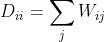

# 揭示复杂性：一种使用噪声注入的流形学习的新方法

> 原文：[`towardsdatascience.com/unravelling-complexity-a-novel-approach-to-manifold-learning-using-oise-injection-41251565fded?source=collection_archive---------5-----------------------#2023-11-17`](https://towardsdatascience.com/unravelling-complexity-a-novel-approach-to-manifold-learning-using-oise-injection-41251565fded?source=collection_archive---------5-----------------------#2023-11-17)

[](https://medium.com/@jceweaver?source=post_page-----41251565fded--------------------------------)](https://medium.com/@jceweaver?source=post_page-----41251565fded--------------------------------)[](https://towardsdatascience.com/?source=post_page-----41251565fded--------------------------------)](https://towardsdatascience.com/?source=post_page-----41251565fded--------------------------------) [Jimmy Weaver](https://medium.com/@jceweaver?source=post_page-----41251565fded--------------------------------)

·

[关注](https://medium.com/m/signin?actionUrl=https%3A%2F%2Fmedium.com%2F_%2Fsubscribe%2Fuser%2F73e4cc6810b7&operation=register&redirect=https%3A%2F%2Ftowardsdatascience.com%2Funravelling-complexity-a-novel-approach-to-manifold-learning-using-oise-injection-41251565fded&user=Jimmy+Weaver&userId=73e4cc6810b7&source=post_page-73e4cc6810b7----41251565fded---------------------post_header-----------) 发表在 [Towards Data Science](https://towardsdatascience.com/?source=post_page-----41251565fded--------------------------------) ·14 分钟阅读·Nov 17, 2023[](https://medium.com/m/signin?actionUrl=https%3A%2F%2Fmedium.com%2F_%2Fvote%2Ftowards-data-science%2F41251565fded&operation=register&redirect=https%3A%2F%2Ftowardsdatascience.com%2Funravelling-complexity-a-novel-approach-to-manifold-learning-using-oise-injection-41251565fded&user=Jimmy+Weaver&userId=73e4cc6810b7&source=-----41251565fded---------------------clap_footer-----------)

--

[](https://medium.com/m/signin?actionUrl=https%3A%2F%2Fmedium.com%2F_%2Fbookmark%2Fp%2F41251565fded&operation=register&redirect=https%3A%2F%2Ftowardsdatascience.com%2Funravelling-complexity-a-novel-approach-to-manifold-learning-using-oise-injection-41251565fded&source=-----41251565fded---------------------bookmark_footer-----------)

在数据科学领域，高维数据既是挑战也是机遇。虽然它提供了大量的关系和模式，可以被塑造和转换，但如果不经过谨慎的清理和选择，它可能会变得令人不知所措，难以从中分析和得出结论：“维度的诅咒”。虽然直觉上你可能倾向于使用主成分分析将数据嵌入到一个较小的子空间，但这可能使你的数据问题变得更加复杂，非线性嵌入技术可能是更合适的选择。然而，在选择正确的非线性技术时需要注意，因为一次错误的转向可能导致过拟合或简单地不适合使用的嵌入。在本文中，我将借此机会讨论一种新颖的方法，来理解高维数据中的流形，使我们作为数据科学家能够基于我们复杂数据的潜在结构做出知情的定量决策。

我将首先介绍流形学习是什么，并概述四种流行的线性和非线性嵌入技术的高层但信息丰富的摘要。通过这些，我们将更深入地了解每种情况下所做的假设以及这些假设对有效嵌入的影响。我还将介绍一些 Python 示例，演示如何应用我的噪声注入分析方法来评估流形及其可能推断的类型。在本文结尾，您将彻底理解不同的流形学习技术，以及您可以采取的步骤来真正理解数据内部结构。


# 流形学习

在深入研究这些流形学习技术之前，重要的是准确理解什么是流形？在我们的背景下，流形是对我们高维空间结构的近似表示，该空间可能与附近数据点具有局部和/或全局关系。然而，有一个重要的警告，即我们事先并不知道我们 N 维空间内的真实结构，通常在嵌入数据时被迫对数据点之间的关系进行隐式假设。不同于数学中的流形学习（黎曼几何），在那里可以找到从一个空间到另一个空间的显式映射。

机器学习模型的成功，无论是在性能还是数据驱动洞察方面，都基本上取决于我们传递给它的数据。虽然传递更多信息可以使这些算法找到更复杂的关系和模式，但也会导致一系列问题，这些问题通常在“维度诅咒”一词下被泛化。

+   **过拟合模型**：随着数据维度的增加，后续的机器学习模型可能无法将数据中的真实关系泛化，结果是对噪声和异常值过拟合。

+   **数据点之间的关系扩展**：在大型复杂特征空间中，某些区域变得非常稀疏，很难建模，或者变得非常集中，关键信息被掩盖。

+   **增加计算复杂性**：大多数机器学习算法在特征数量增加时无法良好扩展，导致训练模型时增加计算时间或内存需求。

要克服这一问题，我们必须要么减少我们考虑的特征数量，要么将数据映射到一个低维空间，同时尽可能地保留关键信息。在下一节中，我们总结并探讨不同的技术（线性和非线性）。

# 主成分分析

主成分分析（PCA）可以说是将数据集嵌入或降低维度的最臭名昭著的方法，其解释性来源于其统计方法。在线上可以找到很多更深入探讨该算法的文章，但为了本文的目的，我以下列出了主要步骤。

PCA 的关键点在于，它通过假设一个线性流形并将数据映射到 N 个正交主成分上（这些主成分是原始特征的线性组合），试图保留所有数据点之间的关系。为此，首先对数据进行标准化，围绕均值中心化并相应缩放，以使所有变量的方差保持一致：


其中*Xⱼ*是所有特征*j*的原始特征空间*X*，*μ*和*σ*分别是*Xⱼ*的均值和标准差。算法然后计算标准化数据的协方差矩阵*S*。


表达每个变量与其他每个变量的相关性。PCA 然后执行协方差矩阵的特征值分解来确定特征值*λᵢ*和特征向量*vᵢ*。


由这些特征向量定义了一个矩阵*W*，按照特征值递减的顺序排列。转换数据的最终投影*Y*，就是*Z*和*W*的乘积。

总之，PCA 提供了一种发现数据内部结构的方法，以最大程度地保留和解释方差（即在最低维度上最大化信息）。每个特征值与方差的部分成比例，因此我们的矩阵*W*确保第一个投影的主成分包含最大的方差，每个后续的正交成分则包含稍少的一部分。

# 本地线性嵌入

在深入研究更高级的非线性方法之前，让我们从可能最简单易懂的方法开始，即局部线性嵌入（LLE）。本质上，LLE 假设给定的数据点及其邻居可以近似地表示并映射到流形上的线性切平面，使它们彼此之间成为线性组合。用于映射邻域集群到平面的权重被调整以最小化转换误差（见下文），并且此过程对每个数据点重复进行。因此，尽管数据点邻域内存在局部线性关系，但全局上会捕捉到非线性。

作为一名数据科学家，您需要定义最近邻数*k*，这需要仔细调整。有了这个值，第一个要解决的优化问题是将权重数组*Wᵢⱼ*定义为将每个数据点*Xᵢ*映射到切平面上的线性组合其邻居：


对于每个*i*，受以下约束：


确保保留局部几何，权重总和为 1。从而我们的嵌入*Yᵢ*就简单地是这些权重与原始空间*Xᵢ*的乘积，同时确保最小化以下嵌入成本函数


以上确保了较低维度表示在原始空间中最好地保留了局部权重。虽然这是捕捉非线性关系的一种优雅解决方案，但如果我们的*k*值未经适当调整或者我们的 N 维空间中存在稀疏部分，则可能会导致嵌入损坏。接下来，我们将探索其他使用局部和全局关系结合形成最终嵌入的非线性嵌入技术，在大多数情况下使它们更加稳健。

# 谱嵌入

谱嵌入(SE)，也称为拉普拉斯特征映射嵌入，形成一个相似性图，将所有数据点连接在一起，然后根据点之间的谱相似性进行加权。通过这样做，SE 不仅保留了局部关系（如 LLE 所做的那样），而且连接的图确保全局关系也被考虑进去。依赖于图拉普拉斯中观察到的谱特性，使得这种算法能够发现其他技术可能无法识别的复杂非线性结构。

此算法的第一步是构建图：


其中*Wᵢⱼ*是节点*i*和*j*之间的边的宽度，*σ*是一个可定制的参数，用来控制邻域的宽度。从此可以得到图拉普拉斯矩阵*L*的定义为*L=D-W*，其中*W*是图的邻接矩阵，*D*是带以下条目的对角度矩阵：



通过对最终嵌入施加正交性和中心约束，该算法在拉普拉斯矩阵上执行特征值分解，以识别特征值和特征向量，从而相应地嵌入数据。

# 等距特征映射

最后一个将被介绍的非线性流形技术是等距特征映射（ISOMAP），这是一种强大的非线性嵌入方法，比前面提到的方法稍微具有更多定制性。算法假设可以通过连接的邻域图表示高维空间，其中节点之间的距离是测地距离。然后，该方法应用多维缩放（MDS）以找到数据的低维表示，使得节点之间的成对距离尽可能地保持不变。

在构建图形时，您可以选择对要考虑的最近邻数量和数据点到其邻居的相对欧几里得距离之一或两者施加限制。这些约束需要适当调整，例如，不能太大以至于形成捷径边（缺少关键结构信息），但也不能太小以至于无法创建连接的图。如果满足这些邻域条件，则在两个节点之间建立一条边。通过图形*G*，算法然后使用最短路径算法*f*（如 Dijkstra 或 Floyd）计算所有点对之间的测地距离*Dᵢⱼ*：


最后一步是将数据映射到子空间，这涉及将 MDS 应用于*Dᵢⱼ*。如果我们回顾 PCA 的概述，我们会在进行特征值分解之前评估协方差矩阵。MDS 稍有不同，通过计算与中心矩阵*H*相关的 Gram 矩阵*B*：


其中*e*是一个全为 1 的向量，*n*是数据点的数量。最终的嵌入来自于对应于最大特征值的*d*个特征向量：


# 噪声注入

到目前为止，我们已经讨论了将数据嵌入低维空间的线性和非线性方法，通过对潜在流形的某些假设。但是，我们如何知道哪种方法捕捉到了有用的信息，特别是当我们处理高维数据时无法可视化时。一种从定量角度评估任何嵌入技术性能的方法是使用我称之为噪声注入的方法。通过这种方法，我们将不同量的噪声应用于原始空间，并监控它对嵌入的影响。基本原理是，当原始空间中的噪声（失真）量增加时，会有一个点，任何流形学习算法都无法捕捉到真实的潜在结构。从观察嵌入如何响应不同量的噪声，可以很容易识别每种技术在建模数据集中的潜在结构时表现如何。下面是一个逐步总结，介绍如何进行这种分析，并提供两个 Python 示例来实现这个想法：

1.  从原始数据集中生成带有高斯噪声的替代数据集，我们将为每个后续的替代数据集缩放噪声的方差。

1.  使用各种流形学习技术嵌入这些数据集。

1.  对于每种技术，使用 Procrustes 分析将注入噪声的嵌入与原始空间的嵌入（无合成附加噪声）进行比较，Procrustes 分析是一种流行的比较两种形状的统计方法。该评估方法将一个空间旋转、缩放和转换到另一个空间，以最小化每个数据点之间的平方差之和。这个差异是相似性的度量，将被分析以观察每种嵌入方法在噪声影响下的表现。

1.  最终步骤是绘制 Procrustes 距离相对于合成附加噪声规模的变化，这使我们能够得出关于每种技术性能的结论。

让我们将上述步骤应用于经典的 S 曲线数据集：


```py
import matplotlib.pyplot as plt
from sklearn import manifold, datasets
import numpy as np
from scipy.spatial import procrustes
from sklearn.decomposition import PCA

def compute_procrustes_distances(data, embedding_technique, max_noise, noise_step=0.05):
    """
    Compute Procrustes distances for a range of Gaussian noise levels.

    Parameters:
        data (np.array): The original dataset.
        embedding_technique (object): An instance of a manifold learning technique.
        max_noise (float): Maximum level of noise to be added.
        noise_step (float): Incremental step for noise addition.

    Returns:
        list: A list of Procrustes distances for each noise level.
    """
    base_embedding = embedding_technique.fit_transform(data)
    noise_levels = np.arange(0, max_noise, noise_step)
    distances = []

    for noise in noise_levels:
        noisy_data = data + np.random.normal(-noise, noise, data.shape)
        noisy_embedding = embedding_technique.fit_transform(noisy_data)
        _, _, disparity = procrustes(base_embedding, noisy_embedding)
        distances.append(disparity)

    return distances

def plot_data(X, colour):
    """
    Plot the dataset in 3D.

    Parameters:
        X (np.array): Data points.
        colour (np.array): Colour mapping for the data points.
    """
    fig = plt.figure(figsize=(30, 10))
    ax = fig.add_subplot(111, projection='3d')
    ax.scatter(X[:, 0], X[:, 1], X[:, 2], c=colour, cmap=plt.cm.Spectral)
    ax.view_init(4, -72)
    plt.show()

def plot_procrustes_distances(noise_range, distances, labels):
    """
    Plot Procrustes distances for different embedding techniques.

    Parameters:
        noise_range (np.array): Range of noise levels.
        distances (dict): Dictionary of distances for each embedding technique.
        labels (list): List of labels for each embedding technique.
    """
    plt.figure(figsize=(10, 6))
    for label in labels:
        plt.plot(noise_range, distances[label], label=label)

    plt.xlabel('Range of noise')
    plt.ylabel('Procrustes distance')
    plt.title('Comparison of Embedding Techniques')
    plt.legend()
    plt.show()

# Generate and plot the S-curve dataset
X, colour = datasets.make_s_curve(1000, random_state=0)
plot_data(X, colour)

# Compute Procrustes distances for different embedding techniques
max_noise = 2
noise_range = np.arange(0, max_noise, 0.05)
embedding_techniques = {
    "PCA": PCA(2),
    "ISOMAP": manifold.Isomap(n_components=2),
    "LLE": manifold.LocallyLinearEmbedding(n_neighbors=10, n_components=2),
    "SE": manifold.SpectralEmbedding(n_components=2, n_neighbors=10)
}

distances = {label: compute_procrustes_distances(X, technique, max_noise) for label, technique in embedding_techniques.items()}

# Plot the computed Procrustes distances
plot_procrustes_distances(noise_range, distances, embedding_techniques.keys())
```


当然，在现实世界应用中，我们不会像这个虚拟示例那样知道潜在的真实结构，但现在我们假设我们不知道真实结构。从上面的图表中我们可以得出什么结论？从根本上说，一个好的趋势应该类似于 S 型曲线，其中最初我们会看到对少量噪声的抵抗，嵌入与原始空间非常相似，但会有一个临界点，当噪声破坏潜在结构时情况不再如此。此时，我们会预期 Procrustes 距离急剧增加，随后的嵌入将捕捉到噪声而几乎没有有意义的信息。考虑到这一点，以及上面的图表，我们可以总结如下：

**PCA**: 尽管 Procrustes 距离随着噪声增加而增加，但趋势相当线性，因此可能无法捕捉真实结构的充分信息。在不考虑其他趋势的情况下，这一点本身就强烈表明需要非线性嵌入。

**LLE**: 我们几乎看不到对即使是微小噪声的恢复能力，这可能是由于违反了局部线性假设。增加最近邻的数量（k）可能会减少这种嵌入的脆弱性，但这可能会以损失结果子空间中的细节（信息）为代价。

**ISOMAP**: 最初这个嵌入技术的表现看起来还不错，但随着噪声的增加，显而易见地缺乏信息捕捉（噪声水平后的线性趋势：0.25）。

**SE**: 在所有探索的方法中，SE 的表现最好，尽管它需要调整以获得最佳拟合。

总体而言，你可能会得出结论，显然我们的数据结构位于一个非线性流形上，并且 SE 和 ISOMAP 对这种非线性捕捉得相当好。考虑到这一点，以及 LLE 的糟糕表现，我们可以推测原始空间中流形的显著曲率。让我们通过一个不同的示例来探讨这一点：


```py
# Generate and plot the S-curve dataset
X, color = datasets.make_swiss_roll(1000, random_state=0)
plot_data(X, color)

# Compute Procrustes distances for different embedding techniques
max_noise = 4
noise_range = np.arange(0, max_noise, 0.05)
embedding_techniques = {
    "PCA": PCA(2),
    "ISOMAP": manifold.Isomap(n_components=2),
    "LLE": manifold.LocallyLinearEmbedding(n_neighbors=10, n_components=2),
    "SE": manifold.SpectralEmbedding(n_components=2, n_neighbors=10)
}

distances = {label: compute_procrustes_distances(X, technique, max_noise) for label, technique in embedding_techniques.items()}

# Plot the computed Procrustes distances
plot_procrustes_distances(noise_range, distances, embedding_techniques.keys())
```


使用之前概述的相同函数，我们得到上述每种嵌入技术的 Procrustes 距离趋势。显然，这些数据中的结构是显著非线性的，因为我们观察到 PCA 很难捕捉底层结构。原始空间中持续的非线性也通过 LLE 的糟糕表现进一步强调，可能是由于邻域到切平面的映射不一致。同样，SE 和 ISOMAP 的表现良好，后者在结构被噪声打破后，趋于 1 的 Procrustes 距离的速度略快于前者。推测 SE 在所有嵌入中都捕捉到了一些噪声，这可能通过一些参数调整来纠正。调整这些算法可以改善嵌入数据的泛化和拟合，这里是一个对上述 ISOMAP 技术进行调整的示例：

```py
import numpy as np
from scipy.spatial import procrustes
import matplotlib.pyplot as plt
from sklearn import manifold, datasets

def return_procrustes_distance(data, embedding_technique, max_noise, noise_step=0.05):
    """
    Compute the Procrustes distance for different levels of noise.

    Parameters:
        data (array_like): The original data to be embedded.
        embedding_technique (object): The embedding technique (e.g., PCA, SpectralEmbedding).
        max_noise (float): The maximum level of noise to be added.
        noise_step (float): The increment step for the noise level.

    Returns:
        list: A list of Procrustes distances for each noise level.
    """
    embeddings = []
    distances = []
    noise_range = np.arange(0, max_noise, noise_step)

    for noise_level in noise_range:
        noisy_data = data + np.random.normal(0, noise_level, data.shape)
        embedded_data = embedding_technique.fit_transform(noisy_data)
        if not embeddings:  # if embeddings list is empty
            embeddings.append(embedded_data)
        _, _, disparity = procrustes(embeddings[0], embedded_data)
        distances.append(disparity)

    return distances

# Generating the S-curve dataset
X, _ = datasets.make_swiss_roll(1000, random_state=0)

# Parameters
max_noise = 2
k_values = [5, 7, 9]  # Different values of k for ISOMAP

# Computing and plotting Procrustes distances for each k value
noise_levels = np.arange(0, max_noise, 0.05)
plt.figure(figsize=(10, 6))

for k in k_values:
    embedding = manifold.Isomap(n_components=2, n_neighbors=k)
    procrustes_distances = return_procrustes_distance(X, embedding, max_noise)
    plt.plot(noise_levels, procrustes_distances, label=f'ISOMAP (k={k})')

plt.xlabel('Noise Level')
plt.ylabel('Procrustes Distance')
plt.title('Procrustes Distance by Noise Level for Various k in ISOMAP')
plt.legend()
plt.show()
```


上述是一个非常通用的调整示例，你肯定会想要探索其他参数，但原则是通过简单地调整 k 并观察噪声的影响，我们可以开始看到算法的泛化效果更好。

# 结论

在本文中，我们探讨了一系列流形学习技术，并展示了如何通过噪声注入来更好地理解高维数据中的潜在结构。我们通过利用对每种算法如何工作的理解、每种算法所依据的假设，以及分析噪声对嵌入的影响来实现这一目标。有了这些见解，我们可以在将数据传递到后续的机器学习管道之前，更加明智地决定如何预处理或处理数据。这种方法也丰富了我们对结果嵌入的泛化理解，以及它可能如何响应噪声或潜在的未来数据漂移。

无论你计划将嵌入技术作为机器学习解决方案的一部分，还是希望扩展你的探索性数据分析过程，上述方法都将帮助你更深入地理解任何高维数据集中的隐藏结构。

*除非另有说明，所有图像均由作者提供。*
