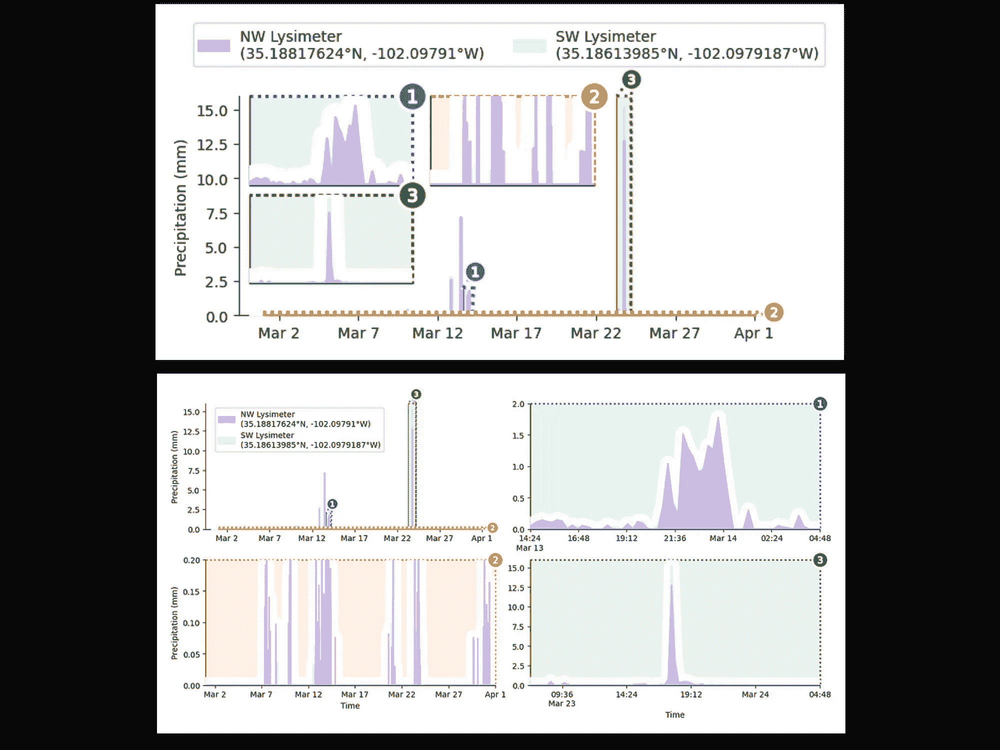
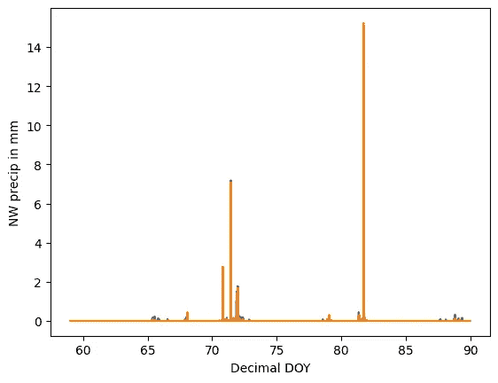
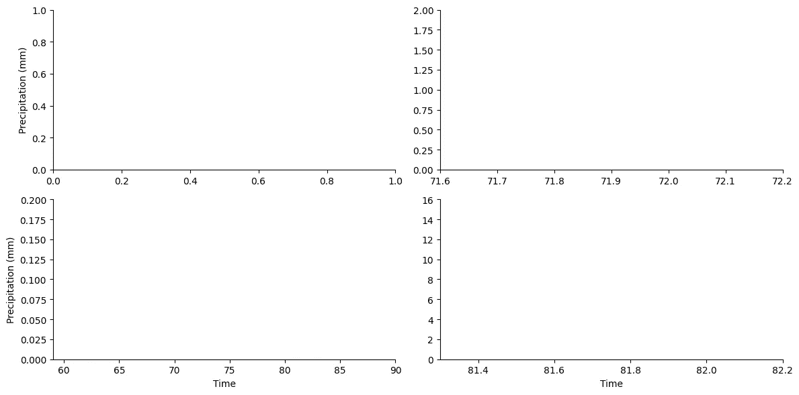
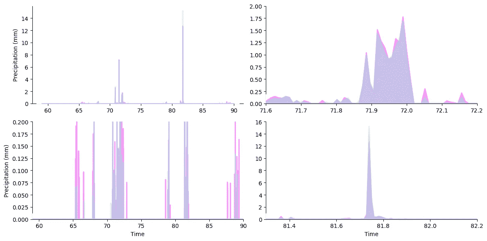
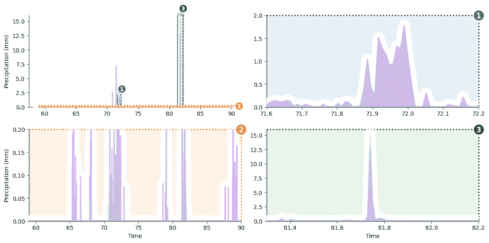
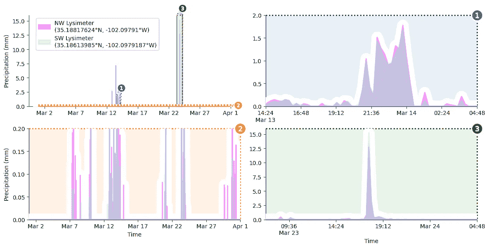
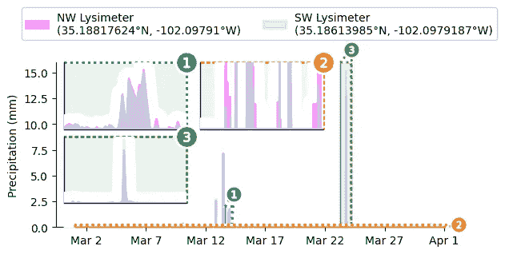
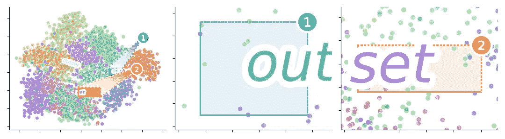
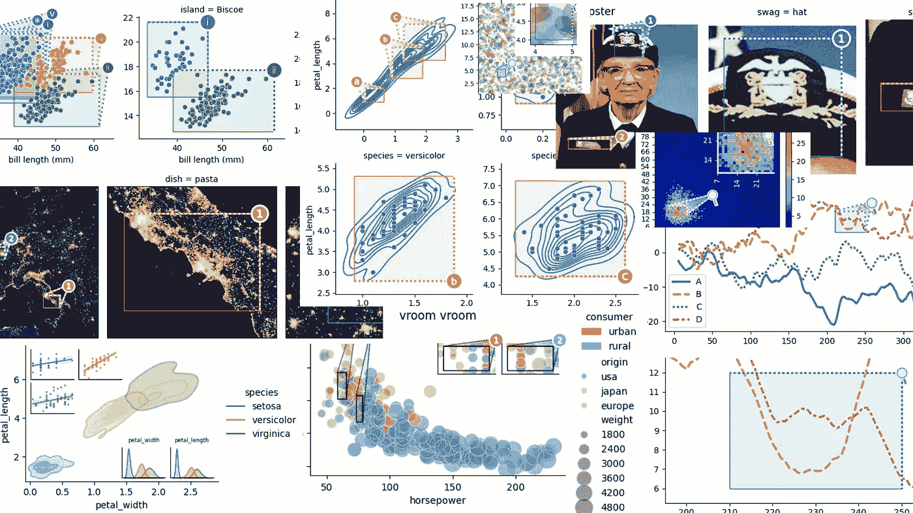

# 解决压缩轴的终极修复，逐步指导

> 原文：[`towardsdatascience.com/unscrunch-your-axes-with-easy-multiscale-data-visualization-in-matplotlib-69a30e96c68f?source=collection_archive---------8-----------------------#2023-12-29`](https://towardsdatascience.com/unscrunch-your-axes-with-easy-multiscale-data-visualization-in-matplotlib-69a30e96c68f?source=collection_archive---------8-----------------------#2023-12-29)

## 使用 matplotlib 制作美丽的多尺度图表，只需三步即可完成。

[](https://medium.com/@mmore500?source=post_page-----69a30e96c68f--------------------------------)[](https://towardsdatascience.com/?source=post_page-----69a30e96c68f--------------------------------) [Matthew Andres Moreno](https://medium.com/@mmore500?source=post_page-----69a30e96c68f--------------------------------)

·

[阅读更多](https://medium.com/m/signin?actionUrl=https%3A%2F%2Fmedium.com%2F_%2Fsubscribe%2Fuser%2Ff226f1e0484b&operation=register&redirect=https%3A%2F%2Ftowardsdatascience.com%2Funscrunch-your-axes-with-easy-multiscale-data-visualization-in-matplotlib-69a30e96c68f&user=Matthew+Andres+Moreno&userId=f226f1e0484b&source=post_page-f226f1e0484b----69a30e96c68f---------------------post_header-----------) 发表在 [Towards Data Science](https://towardsdatascience.com/?source=post_page-----69a30e96c68f--------------------------------) ·8 分钟阅读·2023 年 12 月 29 日[](https://medium.com/m/signin?actionUrl=https%3A%2F%2Fmedium.com%2F_%2Fvote%2Ftowards-data-science%2F69a30e96c68f&operation=register&redirect=https%3A%2F%2Ftowardsdatascience.com%2Funscrunch-your-axes-with-easy-multiscale-data-visualization-in-matplotlib-69a30e96c68f&user=Matthew+Andres+Moreno&userId=f226f1e0484b&source=-----69a30e96c68f---------------------clap_footer-----------)

--

[](https://medium.com/m/signin?actionUrl=https%3A%2F%2Fmedium.com%2F_%2Fbookmark%2Fp%2F69a30e96c68f&operation=register&redirect=https%3A%2F%2Ftowardsdatascience.com%2Funscrunch-your-axes-with-easy-multiscale-data-visualization-in-matplotlib-69a30e96c68f&source=-----69a30e96c68f---------------------bookmark_footer-----------)

大幅度的异常值、细微特征和尖锐的尖峰常常让数据可视化变得令人沮丧。这三者都可能通过将图表组件压缩到过小的区域，使视觉细节变得难以辨识。

有时，通过简单地排除不受控的数据可以解决问题。当包含这些数据对于当前问题至关重要时，应用对数刻度可以重新调整轴的间距，从而更好地分隔低幅度数据。然而，这种方法也只能起到一定的作用。

在本文中，我们将看看另一种选择：缩放图，它通过面板提供感兴趣区域的放大视图来增强可视化。



我们将在本教程中构建的可视化。

缩放图通常作为主图的插图来排列，但也可以与原始图组合成网格。我们将深入探讨这两种方法。

本文提供了一个代码导向的教程，讲解如何使用*matplotlib*和*outset*库中的专业工具来构建缩放图。我们将构建一个关于德克萨斯州降雨数据的可视化，该数据由[Evett 等人通过 USDA 提供](https://doi.org/10.15482/USDA.ADC/1528713)。该数据集包括来自两个相邻地点的一整年雨量读数，间隔为 15 分钟。

短时间的降雨事件和最强降雨的极端强度使问题复杂化。将一个月的 Evett 等人的降雨数据放入一个简单的折线图中，揭示了我们面临的可视化问题。



我们还有不少工作要做来美化这个图表！在我们的可视化中，我们将重点恢复数据的三个特定组件。

1.  第 72 天附近的小雨，

1.  第 82 天附近的大暴雨，以及

1.  整个月的轻度降水事件。

为了更好地展示这些细节，我们将为每个细节创建一个缩放面板。

计划已经制定好，接下来开始编写代码 👍

# 第零步：获取数据

通过[开放科学框架](https://osf.io)获取雨量记录。

```py
# ----- see appendix for package imports
df = pd.read_csv("https://osf.io/6mx3e/download")  # download data
```

这里是数据的预览。

```py
+------+-------------+--------------+--------------+------------+-----------+
| Year | Decimal DOY | NW dew/frost | SW dew/frost | NW precip  | SW precip |
+------+-------------+--------------+--------------+------------+-----------+
| 2019 | 59.73958    | 0            | 0            | 0          | 0         |
| 2019 | 59.74999    | 0            | 0            | 0.06159032 | 0         |
| 2019 | 59.76041    | 0            | 0            | 0          | 0         |
| 2019 | 59.77083    | 0            | 0            | 0.05895544 | 0.0813772 |
| 2019 | 59.78124    | 0            | 0            | 0.05236824 | 0.0757349 |
+ ...  +     ...     +      ...     +      ...     +     ...    +    ...    +
```

在继续之前，先做一些小的准备工作。

```py
nwls = "NW Lysimeter\n(35.18817624°N, -102.09791°W)"
swls = "SW Lysimeter\n(35.18613985°N, -102.0979187°W)"
df[nwls], df[swls] = df["NW precip in mm"], df["SW precip in mm"]

# filter down to just data from March 2019
march_df = df[np.clip(df["Decimal DOY"], 59, 90) == df["Decimal DOY"]]
```

在上面的代码中，我们创建了更详细的列名，并将数据子集化为一个月份的数据

# 第一步：坐标轴网格

我们的第一个绘图步骤是初始化一个`outset.OutsetGrid`实例来管理我们放大图的网格。这个类类似于[seaborn 的](https://seaborn.pydata.org/generated/seaborn.FacetGrid.html)`[FacetGrid](https://seaborn.pydata.org/generated/seaborn.FacetGrid.html)`，它通过基于分类变量将数据分布到坐标轴上，从而方便地构建标准的网格图。

`OutsetGrid`与`FacetGrid`不同，它不仅包括具有分面数据的坐标轴，还准备了一个包含所有数据的初始“源”坐标轴。此外，`OutsetGrid`包括工具来自动生成“标记”注释，显示放大图与原始图的对应关系。下面的示意图概述了`OutsetGrid`的绘图模型。


回到我们的示例，我们将通过提供我们希望放大的主要绘图区域的列表来构建一个`OutsetGrid`，该列表通过`data`参数传递。随后的参数提供样式和布局信息。

```py
grid = otst.OutsetGrid(  # initialize axes grid manager
    data=[
        # (x0, y0, x1, y1) regions to outset
        (71.6, 0, 72.2, 2),  # little shower around day 72
        (59, 0, 90, 0.2),  # all light precipitation events
        (81.3, 0, 82.2, 16),  # big rainstorm around day 82
    ],
    x="Time",  # axes label
    y="Precipitation (mm)",  # axes label
    aspect=2,  # make subplots wide
    col_wrap=2,  # wrap subplots into a 2x2 grid
    # styling for zoom indicator annotations, discussed later
    marqueeplot_kws={"frame_outer_pad": 0, "mark_glyph_kws": {"zorder": 11}},
    marqueeplot_source_kws={"zorder": 10, "frame_face_kws": {"zorder": 10}},
)
```

这里我们为子图指定了宽于高的纵横比，并决定了我们想要的列数。



我们的轴网已经设置好，我们准备好进入下一步。

# 第 2 步：绘图内容

是时候在我们的轴上添加一些内容了。

我们可以使用区域图来共同可视化我们的雨量计读数。（对那些不熟悉的人，区域图就是填充到 *x* 轴的折线图。）应用透明效果将优雅地显示出测量仪一致的地方——以及不一致的地方。

我们可以利用 *matplotlib* 的 `stackplot` 来绘制重叠的区域图。虽然 *stackplot* 设计用于创建“堆叠”在彼此之上的区域图，但我们可以通过对绘图工具进行两次调用来获得重叠区域——每次调用一个测量仪。

为了在网格的所有四个轴上绘制相同的内容，我们将使用 `OutsetGrid` 的 `broadcast` 方法。该方法将绘图函数作为第一个参数，然后在每个轴上调用它，使用任何后续参数。

```py
# draw semi-transparent filled lineplot on all axes for each lysimeter
for y, color in zip([nwls, swls], ["fuchsia", "aquamarine"]):
    grid.broadcast(
        plt.stackplot,  # plotter
        march_df["Decimal DOY"],  # all kwargs below forwarded to plotter...
        march_df[y],
        colors=[color],
        labels=[y],
        lw=2,
        edgecolor=color,
        alpha=0.4,  # set to 60% transparent (alpha 1.0 is non-transparent)
        zorder=10,
    )
```

为了与背景填充获得更好的对比，我们还将使用 `broadcast` 在堆叠图周围添加白色底层。

```py
grid.broadcast(
    plt.stackplot,  # plotter
    march_df["Decimal DOY"],  # all kwargs below forwarded to plotter...
    np.maximum(march_df["SW precip in mm"], march_df["NW precip in mm"]),
    colors=["white"],
    lw=20,  # thick line width causes protrusion of white border
    edgecolor="white",
    zorder=9,  # note lower zorder positions underlay below stackplots
)
```

以下是我们在进入下一阶段之前的图形样貌。



已经看起来不错——在此阶段我们可以看到放大显示在正确的轴上。

# 第 3 步：缩放指示器

现在是时候添加缩放指示框，也就是 `outset` 的“标牌”，以显示我们的辅助图的尺度与主图的尺度之间的关系。

```py
# draw "marquee' zoom indicators showing correspondences between main plot
# and outset plots
grid.marqueeplot(equalize_aspect=False)  # allow axes aspect ratios to vary
```

注意传递给 `outset` 绘图的 kwarg，以允许插图图形采用与主图不同的纵横比。这样，插图数据可以完全扩展，以利用所有可用的轴空间。



我们已经完成了大部分工作——此时只剩下几个最后的修整。

# 就这样！

我们最后要做的就是添加一个图例，并将数字 *x* 刻度更换为适当的时间戳。

```py
grid.source_axes.legend(  # add legend to primary axes
    loc="upper left",
    bbox_to_anchor=(0.02, 1.0),  # legend positioning
    frameon=True,  # styling: turn on legend frame
)

# ----- see appendix for code to relabel axes ticks with timestamps
```

这样，图形就完成了。



就是这么简单，通过 3 个简单步骤完成了缩放图。

# 额外：想要插图而不是缩放？

我们可以通过重新排列放大网格轴的位置来创建插图。以下是使用 *outset* 库的 `inset_outsets` 工具的方法。

```py
otst.inset_outsets(
    grid,
    insets=otst_util.layout_corner_insets(
        3,  # three insets
        "NW",  # arrange in upper-left corner
        inset_margin_size=(0.02, 0),  # allow closer to main axes bounds
        inset_grid_size=(0.67, 0.9),  # grow to take up available space
    ),
    equalize_aspect=False,
)
sns.move_legend(  # move legend centered above figure
    grid.source_axes, "lower center", bbox_to_anchor=(0.5, 1.1), ncol=2
)
```

在这种情况下，我们还使用了 `outset.util.layout_inset_axes` 进行精细调整，以控制插图的大小和位置。



就这样，我们在左上角排列了三个缩放插图。

# 进一步的信息

你可以用 *outset* 做很多其他事情。



除了明确的缩放区域指定，*outset* 库还提供了类似于 *seaborn* 的数据导向 API，以推断包含数据框架分类子集的缩放插图。还提供了广泛的样式和布局自定义选项。

这是库[画廊](https://mmore500.com/outset/gallery.html)的一些亮点预览…



你可以在[`mmore500.com/outset`](https://mmore500.com/outset)的库文档中了解有关*outset*的更多信息。特别是，一定要查看[快速入门指南](https://mmore500.com/outset/quickstart.html)。该项目在 GitHub 上的开源地址是[mmore500/outset](https://github.com/mmore500/outset)，*— 不妨留下一个⭐️！*

*outset*可以通过 pip 安装，命令为`python3 -m pip install outset`。

# 作者

本教程由我贡献，[Matthew Andres Moreno](https://mmore500.com/)。


我目前在[密歇根大学](https://umich.edu)担任博士后学者，我的工作得到了 Eric 和 Wendy Schmidt AI in Science 博士后奖学金的支持，这是 Schmidt Futures 项目的一部分。

我的职位在大学的生态与进化生物学系、复杂性研究中心和密歇根数据科学研究所之间分配。

在 Twitter 上可以找到我[@MorenoMatthewA](https://twitter.com/morenomatthewa)，在 GitHub 上可以找到我[@mmore500](https://github.com/mmore500/)。

*声明：* 我是`outset`库的作者。

# 引用

*Evett, Steven R.; Marek, Gary W.; Copeland, Karen S.; Howell, Terry A. Sr.; Colaizzi, Paul D.; Brauer, David K.; Ruthardt, Brice B. (2023). 蒸发蒸腾、灌溉、露水/霜 — The Bushland, Texas 大豆数据集的水分平衡数据。Ag Data Commons.* [*https://doi.org/10.15482/USDA.ADC/1528713.*](https://doi.org/10.15482/USDA.ADC/1528713.) *访问时间 2023–12–26。*

*J. D. Hunter，“Matplotlib: A 2D Graphics Environment”，《计算科学与工程》，第 9 卷，第 3 期，90–95 页，2007 年* [*https://doi.org/10.1109/MCSE.2007.55*](https://doi.org/10.1109/MCSE.2007.55)

Marek, G. W., Evett, S. R., Colaizzi, P. D., & Brauer, D. K. (2021). 迟播短季大豆的初步作物系数：德克萨斯州高平原。《农业系统、地球科学与环境》，4(2)。 [`doi.org/10.1002/agg2.20177`](https://doi.org/10.1002/agg2.20177)

*用于统计计算的 Python 数据结构，McKinney，《第 9 届 Python 科学会议论文集》，第 445 卷，2010 年* [*https://doi.org/*](https://doi.org/) *10.25080/Majora-92bf1922–00a*

*Matthew Andres Moreno. (2023). mmore500/outset. Zenodo.* [*https://doi.org/10.5281/zenodo.10426106*](https://doi.org/10.5281/zenodo.10426106)

*Waskom, M. L.（2021）。seaborn: 统计数据可视化。《开源软件期刊》，6(60)，3021，* [*https://doi.org/10.21105/joss.03021.*](https://doi.org/10.21105/joss.03021.)

# 附录

你可以在[这里](https://gist.github.com/mmore500/9bdde8fc1a943e72f1659ac795323b06)找到完整的代码，以及在[这里](https://github.com/mmore500/outset/blob/d56c3d8f93c613e4f42e4f04aa81f5daaaea1dc1/docs/example-rain.ipynb)找到笔记本。

要安装此练习的依赖项，

```py
python3 -m pip install \
    matplotlib `# ==3.8.2`\
    numpy `# ==1.26.2` \
    outset `# ==0.1.6` \
    opytional `# ==0.1.0` \
    pandas `# ==2.1.3` \
    seaborn `# ==0.13.0`
```

*所有图像均为作者作品。*
