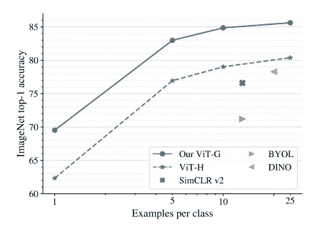
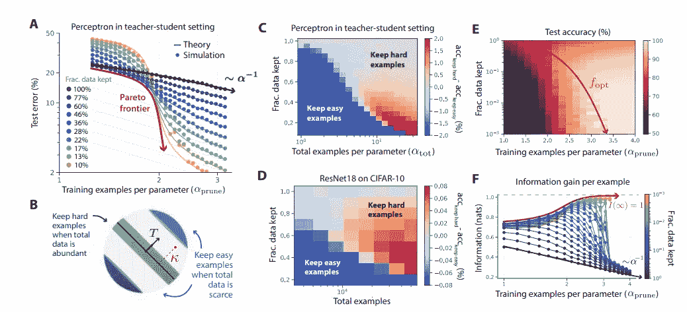
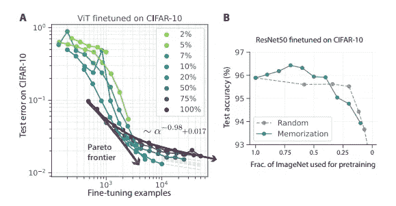
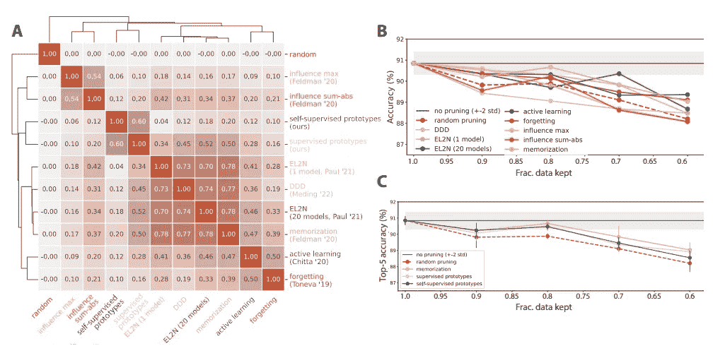
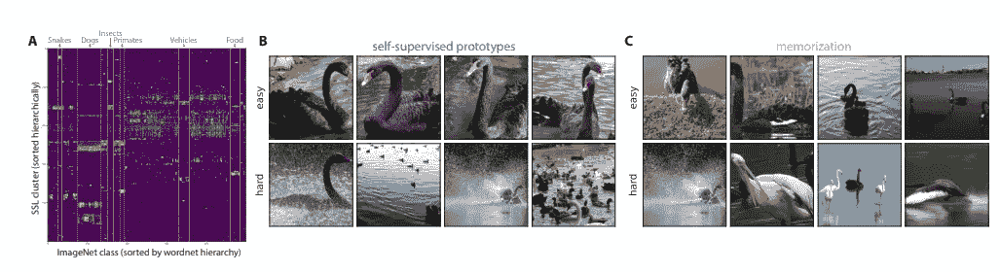

# 无监督数据剪枝：更少的数据学习更好

> 原文：[`towardsdatascience.com/unsupervised-data-pruning-less-data-to-learn-better-30cd2bfbd855`](https://towardsdatascience.com/unsupervised-data-pruning-less-data-to-learn-better-30cd2bfbd855)

## 基础模型 | 扩展法则 | 大型模型 | 数据剪枝

## 数据量的增加并不总是意味着模型更准确，那么如何选择数据呢？

 [Salvatore Raieli](https://salvatore-raieli.medium.com/?source=post_page-----30cd2bfbd855--------------------------------)

·发表于[Towards Data Science](https://towardsdatascience.com/?source=post_page-----30cd2bfbd855--------------------------------) ·11 分钟阅读·2023 年 2 月 27 日

--

图片由作者使用[DALL-E](https://openai.com/dall-e-2/)生成

扩展法则在不同的背景下（图像、文本、语言、语音等）都有观察到。增加参数数量是否真的是提高模型性能的唯一秘诀？如果不是，你实际可以做些什么？

# 什么是扩展法则，它为何成为问题？

近年来，我们看到模型中的参数数量飞跃式增长。所有大型公司都在不断推进创建更强大的模型。这导致了基准数据集误差的减少和意外行为的出现。**但什么是扩展法则？**

**简而言之，扩展法则指出“测试误差通常会随着训练数据量、模型规模或计算量的增加而呈幂律下降。”** 换句话说，要提高模型的性能，必须增加这三者中的任意一个：训练时的示例数量、参数数量或训练时长。

之前的技术研究表明，测试损失可能会随着训练数据集的增大而呈幂律下降。2017 年，[Hestness 探讨了这一观点](https://arxiv.org/pdf/1712.00409.pdf)在不同的机器学习领域（机器翻译、语言建模、图像处理和语音识别）。

扩展法则随后在 OpenAI 的一篇文章中定义，他们展示了通过增加模型大小、数据集规模或训练计算量，性能得到了提升。

扩展法则由 OpenAI 展示（来源：[这里](https://arxiv.org/pdf/2001.08361.pdf)）

他们正式写道：

> 模型性能最强烈地依赖于规模，这包括三个因素：模型参数数量 N（不包括嵌入）、数据集大小 D 和用于训练的计算量 C。在合理的范围内，性能对其他架构超参数（如深度与宽度）的依赖非常弱。— [source](https://arxiv.org/abs/2001.08361)

总结而言，他们断言性能与这三种因素中的每一种都有幂律关系。此外，如果增加参数数量 N，你也必须相应增加示例数量 D，否则会出现惩罚（过拟合）。N 和 D 之间存在一种关系，即如果将参数数量增加 8 倍，你必须将数据量增加 5 倍。

这一概念在 [GPT-3](https://arxiv.org/abs/2005.14165) 和后续模型（[Google 的 LaMDA](https://blog.google/technology/ai/lamda/) 达到了 5000 亿参数以上）中被推向极端。这些模型展示了惊人的能力，有些人猜测大幅增加参数数量将带来通用智能。**那么会吗？**

不。简而言之，[神经网络](https://en.wikipedia.org/wiki/Artificial_neural_network) 是模式匹配机器（或通用逼近器）。神经网络的作用是找到它们在训练集中见过的模式。一个更大并且经过更多数据训练的神经网络可能包含更多的模式并且可能识别更多的模式。**那么无限数据？实际上，数据并不是无限的。**

> 这种幂律扩展促使了对数据收集、计算和相关能源消耗的大量社会投资。然而，幂律扩展是极其微弱且不可持续的。— [source](https://arxiv.org/pdf/2206.14486.pdf)

从 OpenAI 的文章中可以看出，需要一个数量级的数据、参数或计算才能将误差降低仅仅 3–2%。此外，为了扩展视觉变换器，需用到二十亿数据点才能在 [ImageNet](https://ieeexplore.ieee.org/abstract/document/5206848) 上获得更多的准确性。

source ([here](https://arxiv.org/pdf/2106.04560.pdf))

**总结一下，到目前为止我们见证了一种认为更多即更好的范式。但这真的是唯一的策略吗？**

> “我们能否通过一种好的选择训练样本的策略实现指数扩展？”

同时，可以说许多数据是冗余的。模型通常看到许多相似的示例。数据集通常通过随机从互联网下载成千上万的示例来获取。以往的研究表明，例如，可以按难度递增的顺序对训练集中的示例进行排序（从简单和冗余的示例到最困难的示例）。可以在保持性能的同时减少数据集中的示例数量（换句话说，简单和冗余的示例只消耗训练周期，而没有任何学习增益）。

关于这些概念的更多信息，如何高效地缩放视觉变换器，以及以模型为中心和以数据为中心的人工智能之间的区别：

## 为什么我们有巨大语言模型和小型视觉变换器？

### Google ViT-22 为新的大型变换器铺平了道路，并将彻底改变计算机视觉

## 对你的数据集的关键分析

### 停止微调你的模型：你的模型已经很好，但数据不够好

towardsdatascience.com

# **无监督数据剪枝：你能在不知道标签的情况下去除无用的训练数据点吗？**

之前的研究留下了不同的问题悬而未决。同时，是否也可以定义一个关于数据的误差幂律（在不牺牲性能的情况下指数减少示例数量）。其次，上述策略要求所收集的示例必须被标记（费时且昂贵）。因此，最终的策略应该是无监督的。

最近发表了一篇论文试图回答这些问题。该研究由 META、斯坦福大学和图宾根大学的合作进行：

[## 超越神经网络规模定律：通过数据剪枝战胜幂律缩放](https://arxiv.org/abs/2206.14486?source=post_page-----30cd2bfbd855--------------------------------)

### 广泛观察到的神经网络规模定律，其中误差作为训练集大小、模型大小或两者的幂次递减…

[arxiv.org](https://arxiv.org/abs/2206.14486?source=post_page-----30cd2bfbd855--------------------------------)

**作者从扩展法则低效这一事实出发**：幂律的指数接近零（这表明资源使用不充分）。此外，参数或数据量的增加对错误的减少影响很小。**我们希望能够在不改变模型性能的情况下修剪数据集，即使数据集是未标注的**（毕竟，标注数据集是最昂贵和耗时的操作之一）。**怎么做？**

作者在教师-学生设置的情况下探索了这种可能性。这是一种训练方法，其中你有一个已经用大量示例训练过的模型（尽管它是最广泛使用的情况之一，但不限于 CNN）。你向预训练的大模型（教师）提供一些数据，并使用教师的输出（教师提供类别概率作为输出，也称为软标签）训练较小的模型。

简而言之，作者使用了[CIFAR-10](https://www.cs.toronto.edu/~kriz/cifar.html)作为数据集，从教师模型中获得概率，并使用教师的输出概率作为标签训练了学生模型几个时期。然后，他们计算了学生和教师输出之间的边际（这提供了模型学习示例难度的度量）。

图片来源：[原始文章](https://arxiv.org/pdf/2206.14486.pdf)

**第一个有趣的结果是，当训练集中的示例数量较多时，保留困难的示例而修剪（从而减少容易的示例）更好**。当你在训练集中有少量示例时，修剪困难的示例更好。这可能看起来有悖直觉。作者指出，容易的示例提供了关于目标函数的粗略信息（基本上是数据集的一般模式）。相反，更困难的示例提供了可能在大数据集中被遗漏的细化信息。

> 直观地说，在有限的数据情况下，由于基础未得到充分捕捉，建模异常值是具有挑战性的；因此，保留容易的示例更为重要，以便模型能够达到适中的错误。然而，随着数据集的增大，容易的示例可以轻松学习，使得建模异常值成为根本挑战。来源：[这里](https://arxiv.org/abs/2206.14486)

换句话说，当数据量较少时，模型更适合学习关于数据模式的一般信息，而当数据量较大时，困难的示例有助于模型更好地理解类别之间的决策边界。

从[信息论的角度](https://en.wikipedia.org/wiki/Information_theory)来看，作者建议数据修剪可以增加从每个单独示例中获得的信息，因为无信息的示例会被过滤掉。

# 数据修剪提高了迁移学习

图片来自 Pixabay（来源：[这里](https://pixabay.com/it/photos/potatura-di-rose-potatura-7470829/)）

我们对扩展法则感兴趣的原因之一是我们对拥有基础模型感兴趣。一个 [**基础模型**](https://en.wikipedia.org/wiki/Foundation_models) 是一个宽模型（例如变换器、视觉变换器等），它已使用大量未标记数据进行训练，然后可以用于不同的下游任务。

简而言之，我们在大量数据上训练一个非常宽的模型，然后通过迁移学习，将其应用于另一任务。例子有 [BERT](https://arxiv.org/abs/1810.04805)、GPT3 用于文本任务，以及 [ResNet](https://en.wikipedia.org/wiki/Residual_neural_network) 用于计算机视觉任务（实际上，DALL-E 和 [稳定扩散](https://arxiv.org/abs/2112.10752) 也将预训练语言模型作为一个组件）。

**训练基础模型极其昂贵，到目前为止，我们尝试增加其参数和用于训练的数据量。** 然而，[DeepMind 的 Chinchilla](https://www.deepmind.com/publications/an-empirical-analysis-of-compute-optimal-large-language-model-training) 及其后续研究表明，改善用于训练的数据可能会更有用。因此，这项研究的作者们想知道：**数据修剪是否可以帮助迁移学习？**

作者使用了一个预训练的 [视觉变换器 (ViT)](https://en.wikipedia.org/wiki/Vision_transformer)，然后在 10%的 CIFAR-10 的修剪子集上进行了微调。这种方法比在整个 CIFAR-10 上微调 ViT 效果更好。此外，作者在不同的修剪子集（一个缩减版本）上预训练了 ResNet50，然后在 CIFAR-10 上进行了微调。结果显示，在修剪数据集上训练模型比使用整个 ImageNet 的效果更好。

图片来源：[原始文章](https://arxiv.org/pdf/2206.14486.pdf)

> 因此，令人感兴趣的是，在上游任务中修剪预训练数据仍然可以在不同的下游任务中保持高性能。总体而言，这些结果展示了数据修剪在迁移学习中，无论是在预训练还是微调阶段的潜力。

 [## SparseGPT: fewer parameters is better?

### 如何去除 1000 亿个参数并在一个 GPU 上愉快地进行推断

[levelup.gitconnected.com](https://levelup.gitconnected.com/sparsegpt-fewer-parameters-is-better-7b47ad60ac00?source=post_page-----30cd2bfbd855--------------------------------)

# 在大型数据集上扩展方法

之前的剪枝研究主要集中在小数据集上，但了解这些方法在大数据集上的表现也很重要。因此，作者在 ImageNet 上对各种先前的方法进行了基准测试，并评估了它们对模型性能的影响（他们选择了 8 种不同的方法）。

结果显示，这些指标仅保留了少量的困难样本，并且表现优于随机剪枝。**但尽管它们在小数据集上表现良好，只有少数指标与在完整数据集上训练所获得的性能相匹配**。此外，作者还指出：

> 我们发现所有的剪枝指标都会放大类别不平衡问题，从而导致性能下降。图 5 显示，许多数据剪枝指标在 ImageNet 上的扩展效果不好，而少数能够扩展的指标则需要大量的计算资源。此外，这些指标都需要标签，从而限制了它们对大规模基础模型进行剪枝的能力，这些基础模型通常是在大量未标记的数据集上训练的。因此，迫切需要简单、可扩展的自监督剪枝指标。来源：[这里](https://arxiv.org/abs/2206.14486)

图片来源：[原文文章](https://arxiv.org/pdf/2206.14486.pdf)

作者提出了以下解决方案：

+   第一步是使用一个名为 [SWaV](https://arxiv.org/abs/2006.09882) 的预训练模型来提取数据集中每个样本的低维表示。

+   使用 k-means 聚类对样本的表示进行分组。

+   然后，使用余弦距离计算样本到簇中心的距离。如果一个样本离簇中心较近（因此作为表示也更接近其他样本），则它被认为是容易排序的样本；但如果它离中心较远，则被认为是难排序的样本。

+   最后，可以根据情况决定剪枝一部分容易或困难的样本。

> 我们发现，我们的自监督原型指标与最佳监督指标记忆法的性能相匹配或超过，直到仅保留 70%–80% 的数据，尽管我们的指标不使用标签，并且比许多之前提出的监督指标计算起来更简单、更便宜。来源：[这里](https://arxiv.org/abs/2206.14486)

结果与当前最先进的技术记忆法相符，后者需要标签且计算速度较慢。

图片来源：[原文文章](https://arxiv.org/pdf/2206.14486.pdf)

# 结论

作者展示了数据剪枝如何影响与缩放法则一致的错误。此外，他们还展示了通过无监督学习可以获得一个 [coreset](https://arxiv.org/abs/1910.08707)（一个数据集的子集，允许一个模型在该子集上表现与在完整数据集上的表现相同）。**该方法成本低、可扩展，并且不需要标签。**

展望未来，作者建议这种方法仍然可以改进，并允许更激进的剪枝。**这对大型基础模型的训练将极为有用。**他们还建议：

> 如果这些高度剪枝的数据集版本可以用来训练大量不同的模型，可以考虑这些精心挑选的数据子集作为基础数据集，其中数据剪枝的初始计算成本可以在许多下游模型的训练效率提升中摊销，就像训练基础模型的初始计算成本在许多下游任务的微调效率提升中摊销一样。来源：[这里](https://arxiv.org/abs/2206.14486)

总之，减少数据集的规模在训练前可以节省时间和成本（减少标注工作）。更不用说，前瞻性地，如果你减少过度代表的群体，这将有助于在训练过程中对抗和/或识别偏差。

**你们怎么看？你们尝试过剪枝你们的数据集吗？**

# 如果你觉得这很有趣：

你可以查看我的其他文章，你也可以[**订阅**](https://salvatore-raieli.medium.com/subscribe)以便在我发布文章时收到通知，你也可以在[**LinkedIn**](https://www.linkedin.com/in/salvatore-raieli/)**上联系我**。

这是我的 GitHub 仓库的链接，我计划在这里收集与机器学习、人工智能以及更多相关的代码和资源。

 [## GitHub - SalvatoreRa/tutorial: 机器学习、人工智能、数据科学的教程…]

### 机器学习、人工智能、数据科学的教程，包括数学解释和可重复使用的代码（使用 Python…）

[github.com](https://github.com/SalvatoreRa/tutorial?source=post_page-----30cd2bfbd855--------------------------------)

或许你会对我最近的一篇文章感兴趣：

 [## Microsoft BioGPT: 迈向生命科学领域的 ChatGPT？]

### BioGPT 在不同的生物医学自然语言处理任务中达到了**最先进的水平**。

[levelup.gitconnected.com](https://levelup.gitconnected.com/microsoft-biogpt-towards-the-chatgpt-of-life-science-56e251536af6?source=post_page-----30cd2bfbd855--------------------------------)  [## 关于 ChatGPT 的所有信息]

### 了解已知的最新消息、其影响以及正在发生的变化。一篇文章包含所有内容。

[medium.com](https://medium.com/data-driven-fiction/everything-but-everything-you-need-to-know-about-chatgpt-546af7153ee2?source=post_page-----30cd2bfbd855--------------------------------)
