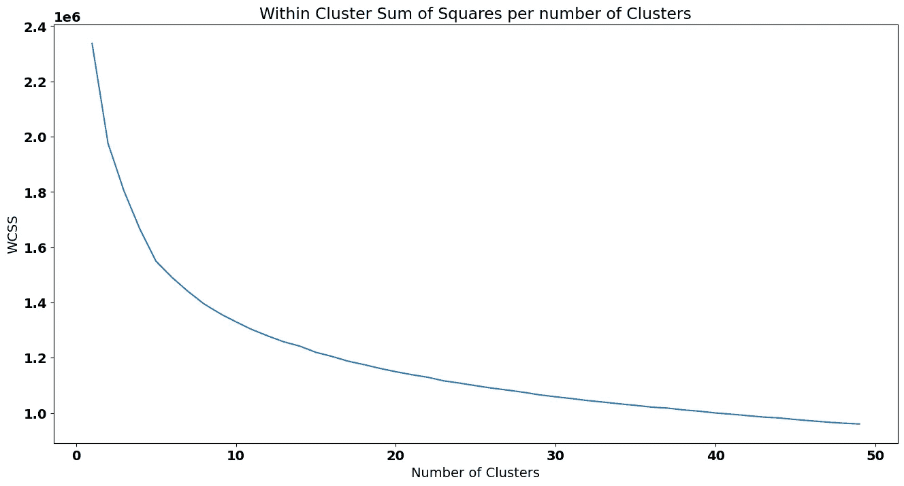

# 无监督学习方法系列 — 探索 K-均值聚类

> 原文：[`towardsdatascience.com/unsupervised-learning-method-series-exploring-k-means-clustering-d129fff3ab6a`](https://towardsdatascience.com/unsupervised-learning-method-series-exploring-k-means-clustering-d129fff3ab6a)

## 让我们探索一种最著名的无监督学习方法之一，看看它如何利用距离将相似的实例映射在一起

[](https://ivopbernardo.medium.com/?source=post_page-----d129fff3ab6a--------------------------------)[](https://towardsdatascience.com/?source=post_page-----d129fff3ab6a--------------------------------) [Ivo Bernardo](https://ivopbernardo.medium.com/?source=post_page-----d129fff3ab6a--------------------------------)

·发表于 [Towards Data Science](https://towardsdatascience.com/?source=post_page-----d129fff3ab6a--------------------------------) ·阅读时间 13 分钟·2023 年 4 月 5 日

--


照片由 [alexlanting](https://unsplash.com/pt-br/@alexlanting) @Unsplash.com 提供

无监督学习是一门神秘而有趣的艺术。虽然没有明确的标签可以预测，评估我们得到的解决方案可能会更困难，但无监督学习方法是理解数据结构和降低数据复杂性的极其有趣的技术。

与可视化和降维技术一起，聚类是无监督机器学习方法的重要组，它帮助我们将单个实例合并为更少的示例，同时丧失一些原始数据的信号。在这个无监督学习系列中，我们将首先介绍 `k-均值` 聚类，这是一种非常有趣和著名的基于距离的聚类方法。

# K-均值算法

K-均值算法通过将每个观察映射到数据集中固定数量（*k*）的簇来工作。

让我们从一个示例开始，在这个示例中，我们将客户映射到一个 2 维图中，按 `年龄` 和 `年收入`：


年龄与年收入示例 — 作者提供的图片

如果我们需要对虚构商店的客户（每个客户是一个点）进行分组，在**没有确定的标签系统来区分这些组的情况下，我们应该选择多少个不同的组？**

为了回答这些问题，我们将首先进行一些实验。**我们最初的假设是有 2 个不同的群体，我们需要将客户分配到这些群体中。**

首先，我们将随机选择图上的两个点，这些点将作为 *聚类中心点*（代表我们组的中心）。这些点为方便识别而被标记为橙色：


聚类中心示例 — 作者图像

橙点的数量被认为是 k-means 的 *k*。我们的解决方案很糟糕。为什么？**因为橙点未能代表潜在的数据。** 我们有一个中心点（左下角），离数据太远了。我们怎么改进？

*k-means* 的第一步是将每个数据点分配给最近的 *中心点*。在我们的案例中，每个客户将被认为是我们在图中看到的橙点的一部分。

为了更容易理解，让我们从给其中一个点命名开始——客户 *Steve*！


Steve 与中心点 — 作者图像

*Steve* 有点困惑——他不知道应该加入哪个小组。**他应该加入右下角的小组**（由橙点表示）**还是左上角的小组**（由另一个橙点表示）？

让我们通过绘制 Steve 与每个小组之间的距离来帮助 Steve：


Steve 到第一组的距离 — 作者图像

表示这一距离的一个简单方法是计算*欧几里得距离*，即 Steve 与该组之间的距离，表示为下列公式：


如果我们将 *P1* 和 *P2* 替换为 *Steve* 和聚类中心点，我们得到以下计算：


Steve 到中心点 1 的距离是 **22.36**。那 Steve 到中心点 2 的距离呢？


Steve 到第二组的距离 — 作者图像

在这种情况下，距离是：


**根据欧几里得距离，Steve 显然离第 1 组**（或中心点 1）更近，因此他将被分配到该组——我们通过将代表 *Steve* 的点涂成红色来实现这一点：


将 Steve 分配到第一组 — 作者图像

如果我们对所有其他客户重复相同的过程，结果将是：


在上图中，我们将靠近中心点 1 的客户标记为红色（就像 *Steve* 一样），将靠近中心点 2 的客户标记为绿色。

我们的聚类解决方案完成了吗？不！

*k-means* 的下一阶段是重新计算中心点（橙点）。我们怎么做呢？我们只需计算分配给每个簇的点的平均值！

在这种情况下：

+   分配给中心点 1 的所有 `Ages` 的平均值是 46.9。该组的所有 `Annual Income` 的平均值是 39.9。

+   质心 2 的所有 `年龄` 的平均值为 37。这个组的所有 `年收入` 的平均值为 91。

坐标 *(46.9, 39.9)* 和 *(37, 91)* 将成为我们新的质心！让我们在 2-D 图中移动它们：


移动我们的质心 — 作者提供的图片

在图上显示新质心后，我们重新分配客户到聚类。*Steve* 和他的朋友们将需要重新分配！


重新设置聚类分配 — 作者提供的图片

我们再次计算每个数据点和质心之间的 *欧几里得距离*——完成后，我们将得到新的组别：


重新设置聚类分配 — 作者提供的图片

注意到我们第一次和第二次迭代之间发生了变化！让我们再次将迭代结果并排可视化。

迭代 1：


K-means 的第一次迭代 — 作者提供的图片

迭代 2：


K-means 的第二次迭代 — 作者提供的图片

一些客户在迭代之间从组 1 移动到组 2——即下面突出显示的紫色点：


移动客户 — 作者提供的图片

这是 *k-means* 聚类的核心主题，因为当**没有点在迭代中更改聚类**时，过程将停止。

在我们的案例中，两次迭代就足够了，因为没有客户会在下一次迭代中改变其组别——*k-means* 完成！

在执行聚类分组后，我们将把数据视为两个单独的数据点，**由质心表示！**


K-means 质心 — 作者提供的图片

这是一个非常重要的步骤——**我们主动选择将数据点减少到仅 2 个。** 这是数据方差的显著损失，也是聚类的核心思想之一。

**我们如何评估这个解决方案？** 一个想法是计算 *簇内平方和*，这是一个衡量每个数据点与其对应聚类之间距离的指标——从视觉上来看：


可视化 WCSS — 作者提供的图片

如果我们计算所有点与其相应质心之间的欧几里得距离，我们将得到一个大约 8850 的值——这个值表示了我们通过将客户视为两个聚类而丧失的信息。此外，我们还可以检查 *簇间平方和 (bcss)*，它衡量所有质心之间的平均平方距离。

**自然地，当我们添加一个新的质心时，*WCSS* 将会更低，因为点到其质心的距离减少：**


用 3 个聚类可视化 WCSS — 作者提供的图片

拥有*k-means*直觉后，我们可以检查 Python 中*sklearn*的实现。此外，我们仍然不知道如何评估适当的簇数（*k*）——这是我们接下来会看到的内容！

# Sklearn 实现

在这一部分，我们将使用[航空公司客户满意度](https://www.kaggle.com/datasets/sjleshrac/airlines-customer-satisfaction)数据集，该数据集包含有关航空公司客户满意度的信息。每个观察值代表一个客户，变量包括客户的 demographic 信息、旅行类型（商务等）以及他们对航班各个方面的满意度评分。

这是数据前 5 行和 13 列的展示：

```py
airline_data = pd.read_csv('/content/data/airline.csv')
airline_data.head(5)
```


航空公司数据预览——图像由作者提供

在我们的管道中进行预处理时，让我们移除一些不希望影响我们簇的列——为此，我将从可能的解决方案中移除所有分类列：

+   满意度；

+   性别；

+   客户类型；

+   类别；

+   旅行类型；

自然，这是一种我在数据管道中做出的选择，原因有两个：

+   我希望这篇博客文章的重点是解释 k-means，并避免构建一个更复杂的数据管道，这会使我们的注意力从这个目标上转移开。

+   对于分类变量，我们不希望有太多虚拟变量影响我们的簇。

随着我们在 k-means 解决方案中添加越来越多的二元（也称为*虚拟*）变量，这些变量在最终的簇距离中开始占据很大权重，即使在标准化之后，所以在向任何*k-means*解决方案中添加这类数据时要非常小心。

```py
airline_data_filter = airline_data.drop([‘satisfaction’, ‘Gender’, ‘Customer Type’, ‘Class’, ‘Type of Travel’], axis=1)
```

我还注意到有 393 行的*Arrival Delay in Minutes*为 NA——*k-means*实现对此处理不是很好，所以我们需要做一些*数据插补*。

如果我们放大这些行，没有模式出现：

```py
airline_data_filter.loc[airline_data_filter[‘Arrival Delay in Minutes’].isna()]
```


到达延误以分钟为单位为空的行——图像由作者提供

对于这些行，我将假设飞机到达的延误与起飞时的延误相同——使用`np.where`应用这个规则：

```py
airline_data_filter['Arrival Delay in Minutes'] = np.where(
    airline_data_filter['Arrival Delay in Minutes'].isna(),
    airline_data_filter['Departure Delay in Minutes'],
    airline_data_filter['Arrival Delay in Minutes']
)
```

规则很简单，我们依赖`np.where`来完成这个操作：

+   当`Arrival Delay in Minutes`为`na`时，我们会将这一列设置为`Departure Delay in Minutes`，否则我们使用原始值。

预处理管道中的下一步是将所有变量标准化到一个共同的尺度。特别是在*k-means*中，距离是算法的关键部分，这一步骤可能对找到有意义的客户极其重要（尽管根据底层变量分布的行为和数字尺度的差异，未经标准化的测试也可能给出良好的结果）。

我将应用`sklearn`中的*StandardScaler*：

```py
scaler = StandardScaler()
scaled_airline = scaler.fit_transform(airline_data_filter)
```

**预处理完成**——我们准备好拟合我们的*k-means*解决方案了！

但是..

我们选择多少个质心？

通常，在*k-means*解决方案中，我们会对不同的*k*值运行算法并评估每个解决方案的*WCSS*——这就是我们将要做的，使用来自*sklearn*的*KMeans*，并获取每个解决方案的`wcss`（存储在`inertia_`属性中）：

```py
from sklearn.cluster import KMeans

wcss = []
for k in range(1, 50):
    print('Now on k {}'.format(k))
    kmeans = KMeans(n_clusters=k, random_state=0).fit(scaled_airline)
    wcss.append(kmeans.inertia_)
```

现在，我们可以可视化每个解决方案中`WCSS`的演变。有[几种方法](https://www.analyticsvidhya.com/blog/2021/05/k-mean-getting-the-optimal-number-of-clusters/)来选择合适的簇数——在这篇文章中，我们将使用`肘部法则`，它选择了使曲线下方变得不那么陡峭的簇数，因为这表示增加新簇不会显著降低`WCSS`：



WCSS 图 — 作者提供的图像

我们将选择 5 作为理想的簇数（请记住，选择肘部图中的点并不科学，实际上测试“肘部”附近的不同解决方案是个好主意）：


WCSS 图 — 作者提供的图像

为了适配 5 个簇的解决方案，我们可以将该值传递给`Kmeans`实现中的参数：

```py
kmeans_5 = KMeans(n_clusters=5, random_state=0).fit(scaled_airline)
```

现在，我们将根据此解决方案对过滤后的数据框中的每个客户进行簇预测——尽管我们应该在 scaled_data 上`预测`（因为它包含了解决方案拟合的相同尺度），实际上将预测结果添加到原始数据框中是个好主意，以便我们能够用有意义的尺度解释簇的均值：

```py
airline_data['cluster_kmeans'] = kmeans.predict(scaled_airline)
```

我们如何分析这些簇？一个很好的想法是比较各簇中特征的均值：

```py
airline_data_filter['cluster_kmeans'] = kmeans_5.predict(scaled_airline)
```

要解释`cluster_kmeans`，我们只需计算每个簇中所有变量的平均值：

```py
airline_data_filter.groupby([‘cluster_kmeans’]).mean()
```


簇均值 — 作者提供的图像

例如，簇索引 1 似乎对他们的`座位舒适度`感到非常不满，因为平均而言，这组客户在调查中仅给了这个变量`1.83`分。虽然我们可以继续对所有变量进行这些比较，但在我们的聚类方案中仍然有很多维度（特征），这使得分析它们之间的差异变得更加困难。

为了从聚类方案中去除一些特征，我们可以应用的一些想法有：

+   去除或合并高度相关的变量。

+   进行主成分分析或其他降维技术。

为了保持文章简洁，我们来分析数值特征之间的相关矩阵：


数值特征的相关矩阵 — 作者提供的图像

从上面的相关矩阵中，我们可以识别出“在线登机”、“机上 Wi-Fi 服务”、“在线支持”和“在线预订的便捷性”似乎相关联。我将把这 4 个变量的平均值合并为一个称为`在线和 Wi-Fi 满意度`的变量：

```py
online_cols = ['Online boarding', 'Inflight wifi service', 'Online support', 'Ease of Online booking']

airline_data_filter['Online and Wi-Fi Satisfaction'] = (
    airline_data_filter[online_cols].mean(axis=1)
)

airline_data_filter.drop(columns=online_cols, inplace=True)
```

座椅舒适度和食品饮料也可以合并成一个“舒适与食品”变量：

```py
comfort_food = ['Seat comfort', 'Food and drink']

airline_data_filter['Comfort & Food'] = (
    airline_data_filter[comfort_food].mean(axis=1)
)

airline_data_filter.drop(columns=comfort_food, inplace=True)
```

最后，我将删除`Arrival Delay in Minutes`，因为它与`Departure Delay in Minutes`的相关性非常高：

```py
airline_data_filter.drop(columns=['Arrival Delay in Minutes'], inplace=True)
```

此外，我们已经为这个数据集拟合了聚类解决方案，所以让我也删除这个变量：

```py
airline_data_filter.drop(columns=[‘cluster_kmeans’], inplace=True)
```

我们只剩下 13 个特征了！*K-means* 解决方案可能也会受到维度灾难的影响（特别是在我们尝试解释聚类时），尝试减少数据集特征可能是以更简单的方式解释我们的聚类解决方案的好主意。

让我们查看基于包含较少特征的新数据集的肘部曲线：


特征较少的 KMeans 的 WCSS 图 — 作者提供的图像

在这种情况下，我将选择 6 个聚类作为解决方案。预测这些聚类，并将新的`cluster`再次添加到`airline_data_filter`数据集中：

```py
kmeans_6 = KMeans(n_clusters=6, random_state=0).fit(scaled_airline)
airline_data_filter['cluster_kmeans'] = kmeans_6.predict(scaled_airline)
airline_data_filter.groupby(['cluster_kmeans']).mean()
```


聚类概况 — 数据集的前几列 — 作者提供的图像


聚类概况 — 数据集的其他列 — 作者提供的图像

在对我们的客户进行分析时，了解我们特征的平均值也是很重要的：


特征的全球平均值 — 作者提供的图像

基于每个变量的平均值比较，我们现在可以对我们的聚类进行一些分析！例如：

+   聚类索引 0 由一组在大多数变量上接近平均水平的客户组成。他们对飞行体验中的一些方面，如`机上和腿部空间服务`、`行李处理`、`值机服务`和`清洁度`，似乎有些不满意。我们怎么知道的？因为他们在调查中对这些变量的平均评分为 2.8 分，比整体平均水平低 0.5 个百分点。

+   聚类索引 1 由非常满意的客户组成。这些客户给航空公司服务打分高于平均水平（对于这个客户群体，大多数变量的平均分数都在 4 星以上）。

+   另一方面，索引为 2 的聚类似乎非常不满意。这些客户给航空公司服务的评分低于平均水平。

+   索引为 3 的聚类包含长途旅行的客户，他们对航空公司服务的评分稍低于平均水平。这些客户似乎也更频繁地受到航班延误的影响。

+   索引为 4 的聚类的客户一般都很满意，除了三个变量：`Departure/Arrival Time Convenience`、`Gate Location`和`Comfort & Food`。可能有一些额外的变量可以解释这些评分，例如这些客户可能是低成本旅行。

+   索引为 5 的集群包含年轻客户。非常有趣的是，他们对大多数变量的评分都为平均分，只有`Inflight Entertainment`、`Online & Wi-Fi Satisfaction` 和 `Comfort and Food` 除外。可能由于这些客户较年轻，他们对在线服务和娱乐的期望与航空公司未能满足的期望不同，这可能影响航空公司吸引年轻客户的能力。

如你所见，在 Python 中设置聚类解决方案非常简单。以下是你可以采取的一些下一步建议：

+   可视化集群内分类变量的分布。

+   检查这些集群如何与客户满意度相关。

+   构建有针对性的营销活动以提高客户满意度。例如，最后一个集群似乎对娱乐和在线服务感到失望——为什么不为年轻客户建立一个个性化的营销活动，以便在这些服务上提供更好的体验呢？

# 结论

就这些了！感谢你花时间阅读这篇博客文章。

我们没有讨论的一些内容是该算法的局限性。让我们用这个结论来讨论：

+   使用*k-means* 时需要记住的一点是算法对质心的初始位置非常敏感。这是因为如果初始质心选择不佳，算法可能会收敛到局部最小值而不是全局最小值。**因此，通常建议多次运行算法，使用不同的初始质心，并选择提供最低总平方距离的解决方案。**

+   k-means 的另一个局限性是它假设集群大致是球形的且大小相等。这意味着它可能在集群形状不规则或大小差异很大的数据集上效果不佳。在这种情况下，其他聚类算法可能更为合适，例如**层次聚类或基于密度的聚类**。

尽管有其局限性，k-means 仍然是一种流行且有效的聚类算法，已广泛应用于许多不同的场景。它相对容易实现，易于解释，并且能够高效处理大数据集。凭借其简单直观的方法，它是探索数据结构和识别可能不立即显现的模式的良好起点。

*如果你想参加我的 Python 课程，欢迎随时加入* ***我的免费课程*** *（*[*Python For Busy People — Python Introduction in 2 Hours*](https://www.udemy.com/course/python-for-busy-people-python-introduction-2-hours/?referralCode=1588B6BF72D40253CDD4)*)* ***或更长的 16 小时版本*** *（*[*The Complete Python Bootcamp for Beginners*](https://www.udemy.com/course/the-python-for-absolute-beginners-bootcamp/?referralCode=8D25992A055C19079B8A)*）。我的 Python 课程适合初学者和中级开发人员，欢迎来参加我的课程！*


Python 初学者课程 — 作者提供的图像

*本文博客使用的数据集遵循* [*CC0: 公共领域*](https://creativecommons.org/publicdomain/zero/1.0/) *许可协议。*
