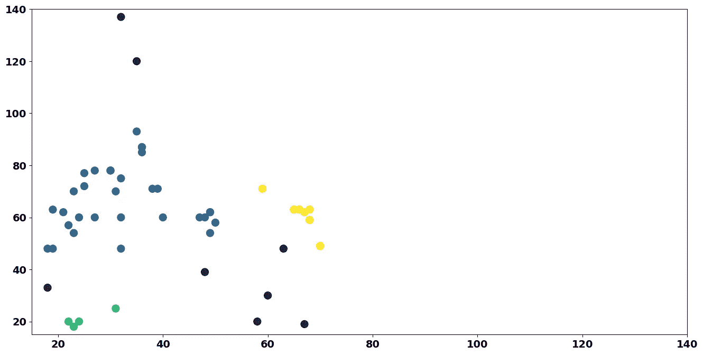

# 无监督学习系列——探索 DBScan

> 原文：[`towardsdatascience.com/unsupervised-learning-series-exploring-dbscan-624c820290ce`](https://towardsdatascience.com/unsupervised-learning-series-exploring-dbscan-624c820290ce)

## 在使用 Python 的 sklearn 时，了解著名的基于密度的聚类算法背后的理论

[](https://ivopbernardo.medium.com/?source=post_page-----624c820290ce--------------------------------)[](https://towardsdatascience.com/?source=post_page-----624c820290ce--------------------------------) [Ivo Bernardo](https://ivopbernardo.medium.com/?source=post_page-----624c820290ce--------------------------------)

·发布在 [Towards Data Science](https://towardsdatascience.com/?source=post_page-----624c820290ce--------------------------------) ·阅读时长 11 分钟·2023 年 11 月 21 日

--


图片来自 [Kier in Sight Archives](https://unsplash.com/pt-br/@kierinsightarchives) @Unsplash.com

聚类算法是数据科学领域最常用的解决方案之一，其中最受欢迎的算法被分为基于距离的方法和基于密度的方法。尽管经常被忽视，基于密度的聚类方法是**k-means**和**层次聚类**的有趣替代方案。

一些著名的基于密度的聚类技术包括*DBScan*（基于密度的空间聚类方法）或均值漂移，这两种算法使用数据点的质心来将观测值分组。

在这篇博客文章中，我们将探索 DBScan，一种特别适用于当你的数据包含以下特征时的聚类算法：

+   聚类具有不规则的形状。例如，非球形。

+   与其他方法相比，DBScan 不会对数据的底层分布做出任何假设。

+   你的数据集包含一些相关的离群值，这些离群值不应影响簇的质心映射。

如果这三句话让你感到困惑，不用担心！在这篇文章中，我们将一步一步实现*DBScan*方法，同时讨论上述话题。此外，我们还会查看著名的`sklearn` Python 实现！

此外，如果你想浏览我无监督学习系列的其他帖子，你可以查看：

+   K 均值

+   层次聚类

+   自组织映射

那么，让我们深入了解一下 DBScan 的工作原理吧！

# 拟合基于距离的聚类解决方案

在这本逐步操作手册中，我们将使用一个包含客户信息的玩具数据集。在这个例子中，我们将使用两个变量的聚类来便于理解。

假设我们经营一家商店，并且拥有关于客户的人口统计信息。**我们希望根据他们的年收入和年龄进行一些营销活动，并且只希望运行 3 到 4 个不同的营销活动。**

首先，我们通过散点图绘制这两个变量：


客户年龄与年收入 — 作者提供的图片

目前，假设某人的年收入为 120 美元是合理的（我们只是使用这个尺度来使年龄和收入之间的值相似，因为这样解释会更直观）。

**如果你查看这些数据，你看到多少个不同的客户群体？** 2 个？3 个？4 个？这是一个开放性问题，我们无法真正回答，因为没有标签或正确答案。

我们可以通过客户在图中的分布方式来争论我们有三种不同的群体：

+   图的左侧有一个散布的簇。

+   在中心处有一组 5 到 6 个客户。

+   在图的右侧有第三组簇。

不过，这只是一个猜测。也许 *k 均值* 可以帮助我们！让我们用 3 个簇拟合 k 均值算法：


带有 3 个质心的 K 均值解决方案 — 作者提供的图片

尽管这是一个有趣的解决方案，但似乎我们的聚类没有识别出一些模式，被离群点分散了。如果我们用 4 个质心进行拟合，结果会怎样？


带有 4 个质心的 K 均值解决方案

再次，*k 均值*解决方案被离群点驱散了。层次聚类会有帮助吗？让我们看看：


Ward 层次聚类 — 作者提供的图片

使用 Ward 方法，我们的结果类似于 *K 均值* 聚类（带有 3 个质心）。让我们改变层次聚类解决方案的连接方式，看看结果：


完整的层次聚类 — 作者提供的图片

哎呀，更糟了！更改连接方法也是一个糟糕的选择。

这个练习的核心是，某些数据集不适合基于距离的聚类。通常，人们急于使用这些类型的聚类模型，因为它们非常易于解释，但这些解决方案在我们的簇是球形且定义明确时效果更好。

# 解密 DBScan

现在我们已经看到基于距离的簇可能不适合某些类型的数据，让我们探讨为什么 *DBScan* 是不同的。

DBScan 从选择数据集中的一个随机点开始：


DBScan 步骤 1 — 作者提供的图像

选择数据点后，我们在该数据点周围绘制一个一定半径的圆。

> 围绕数据点构建的圆的半径是 DBScan 算法的一个超参数。

对于我们的例子，我们将绘制一个半径为 9 单位的圆：


DBScan 步骤 2 — 作者提供的图像

半径触及了多少个数据点？在这个例子中，我们的半径触及了 9 个数据点（包括数据点本身）。 **这个数字与 DBScan 算法的另一个超参数有关：*min_samples***。

如果半径触及的点数等于或多于 *min_samples* 中的数值，我们将所选数据点视为核心点！

> `Min_samples` 是 DBScan 算法的另一个超参数。

被认为是核心点赋予数据点显著的权力：

+   **数据点属于一个簇。**

+   **数据点能够将半径内的其他数据点召唤到簇中。**

在测试数据点是否为核心点后，我们移动到边界内的另一个点：


移动到 DBScan 边界上的另一个点 — 作者提供的图像

我们刚刚移动到第一个数据点上方的那个数据点。接下来的问题自然是，这是否是一个核心点？

你知道如何进行这个测试！让我们开始在新数据点周围绘制一个边界：


在第二个数据点上绘制另一个边界 — 作者提供的图像

*注意：这个圆的半径与我们之前看到的完全相同。*

那么，这是否是一个核心点？不！因为这个数据点的半径仅触及 8 个数据点，少于我们定义的 *min_samples* 超参数。

**我们称之为卫星数据点。** 尽管它属于簇（因为它被另一个数据点“召唤”），但它没有权利将边界内的其他数据点召唤到簇中。 **这是核心点和卫星点之间的主要区别。**

到目前为止，我们已经知道了 DBScan 解决方案中的两种数据点：

+   **核心点：** 属于一个簇，并且有能力将其他点带入其中。

+   **卫星点：** 属于一个簇，但没有将其他数据点带入其中的能力。

**我们认为当触及形成边界的卫星点时，簇才被定义。**

在我们的解决方案中，以下所有数据点都被视为卫星点（使用我们的超参数），而它们边界内的所有点都属于一个簇：


卫星点前沿 —— 图片由作者提供

但仍然有一组数据点我们没有讨论 —— 那些没有被其他数据点调用的数据点怎么办？这些点肯定是核心点。它们也不能被视为卫星数据点，因为它们没有被任何核心点触及。

这些被称为离群点！这是*dbscan*算法的一个有用特性，它在解决方案中包含了离群点的识别。

例如，看看这里的这个数据点：


离群点识别 —— 图片由作者提供

我们也可以在这个数据点周围画一个半径：


离群点的半径 —— 图片由作者提供

注意，这个数据点与其他数据点完全孤立。此外，它的边界内没有足够的数据点来被视为核心数据点。

这使它成为***离群点***。数据点在 DBScan 中可以成为离群点的原因有两个：

+   它的边界内没有足够的数据点，也不是卫星点。

+   只有*卫星点*的边界能够到达它们。记住，卫星点无法将数据点引入自己的簇中。只有核心点承担这一责任。

> DBScan 算法中的数据点被分类为核心、卫星和离群点

在将所有数据点分类为核心、卫星或离群点后，算法完成了！

DBScan 解决方案会在我们的年龄与年收入数据中找到哪些簇？让我们用以下*超参数*拟合一个 dbscan 解决方案（你还记得它们吗？）

+   **Epsilon = 9**

+   **Min_Samples = 5**


第一个 DBScan 解决方案 —— 图片由作者提供

**紫色点不是“簇”。它们被解决方案视为离群点。**

我们在这个解决方案中有一个利弊：

+   我们的 3 个簇是根据点的密度创建的，这可能是一个不错的解决方案。

+   不幸的是，这些超参数在这个解决方案中也过于严格，产生了太多离群点。

> DbScan 对超参数的变化非常敏感

一个常见的技巧是进行一个*DBSCan*聚类，产生大量离群点，然后运行一个距离最小化算法来分配剩余的点（例如，最小欧氏距离到每个簇中心）。

另一个替代方案是调整我们的*超参数*。例如，我们可以提高*EPS*或减少*min_samples*：

+   **EPS** = 12

+   **Min Samples** = 4



第二个 DBScan 解决方案 —— 图片由作者提供

这个结果稍有不同，我们能够将更少的点视为异常值。尽管没有正确的解决方案，但使用不同的超参数分析聚类会给出不同的结果，因为该算法对*eps*和*min_samples*参数非常敏感。

既然我们获得了关于*DBScan*的新知识，那么接下来就将其应用于实际案例吧！

# 实际案例 — 美国的出租车站

我们将在此实际案例中使用的数据集基于[Kaggle](https://www.kaggle.com/competitions/nyc-taxi-trip-duration/data)上的 Taxi Trip Duration 数据集，并在 Google BigQuery DataSets 上提供。为简化起见，我们将仅使用数据集的一个样本，以便在地图上绘制。

数据集包含大量信息，但我们感兴趣的是*pickup_longitude*和*pickup_latitude*。这两列包含乘客加入行程的 GPS 坐标。

我们的目标是让出租车公司知道他们应该在何处建立出租车站。考虑到乘客可以随时使用汽车，他们的目标是将站点建立在最合适的位置，尽量增加他们能从这些站点服务的潜在乘车次数。

要解决这个问题，让我们首先使用`pandas`加载数据：

```py
import pandas as pd

taxi_data = pd.read_csv(‘/content/data/taxi_data_sample.csv’)
```

我们有一些数据点的 GPS 坐标错误。我们需要去除这些异常值：

```py
taxi_data = taxi_data.loc[taxi_data.pickup_longitude > -100]
```

去除这些行后，让我们在二维地图上绘制我们的取车坐标。为了使以下代码正常工作，您需要安装并加载`cartopy`和`contextily`——`cartopy`在本地环境（例如使用`conda`）安装时可能会遇到一些问题——如果您遇到麻烦，请在 Google Colab 环境中安装该库：

```py
!pip install cartopy
!apt-get -V -y -qq install python-cartopy python3-cartopy
!pip install contextily
```

安装依赖项后，我们可以使用以下命令在纽约绘制数据点：

```py
import geopandas as gpd
import matplotlib.pyplot as plt
import contextily as ctx
import cartopy.crs as ccrs

def loadNewYorkMap():
  # Load a GeoDataFrame with New York City boundaries
  ny_shapefile = gpd.read_file(gpd.datasets.get_path('nybb'))
  nyc = ny_shapefile[ny_shapefile['BoroName'] == 'Manhattan']

  # Add new york city boundaries
  ax = plt.axes(projection=ccrs.PlateCarree())
  ax.add_geometries(nyc['geometry'], crs=ccrs.PlateCarree(), edgecolor='black', facecolor='none')

  return ax

ax = loadNewYorkMap()

plt.scatter(
    taxi_data.pickup_longitude,
    taxi_data.pickup_latitude,
    transform=ccrs.PlateCarree(),
    color='red',
    marker='o'
)

# Add a basemap using web tiles from OpenStreetMap
ctx.add_basemap(ax, crs=ccrs.PlateCarree(), source=ctx.providers.OpenStreetMap.Mapnik)
ax.set_xticks([])
ax.set_yticks([])
# Show the plot
plt.show()
```


纽约出租车接客 — 作者提供的图片

在拟合算法之前，我们知道`dbscan`是基于距离的。我们该怎么做？标准化！让我们将`latitude`和`longitude`标准化到相同的尺度。尽管缺乏标准化不会对这些数据造成太多问题，但做标准化仍然是一个好习惯，特别是如果您想将此用例应用于其他数据集：

```py
scaled_taxi = StandardScaler().fit_transform(taxi_data[[‘pickup_latitude’, ‘pickup_longitude’]])
```

假设我们希望每个出租车站点服务至少 100 次行程，这与我们的`dbscan`参数如何匹配？

我们可以调整`min_samples`参数！让我们拟合第一个聚类解决方案：

```py
 from sklearn.cluster import DBSCAN

taxi_data[‘cluster_dbscan’] = DBSCAN(eps=0.25, min_samples=100).fit_predict(scaled_taxi)
```

我们选择了`eps=0.25`。让我们在地图上查看我们的解决方案！……但是我们应该绘制哪些坐标？一个有趣的解决方案是计算每个聚类坐标的平均值：

```py
centroids_dbscan = taxi_data.groupby('cluster_dbscan')[['pickup_latitude', 'pickup_longitude']].mean()
```

此外，`DBScan`用值`-1`表示异常值。让我们排除这些值，因为它们不被视为“聚类”：

```py
# Remove outliers
centroids_dbscan = centroids_dbscan.loc[0:]
```


纽约出租车接客聚类 — 作者提供的图片

非常酷！我们将设置 3 个站点：

+   曼哈顿的一篇。

+   约翰·肯尼迪国际机场的一个。

+   拉瓜迪亚机场的一个。

想查看哪些行程“理论上”由哪个站点服务？


纽约出租车接送聚类 — 作者提供的图像

很酷！紫色点被视为`dbscan`解决方案的离群点。似乎我们对`DBScan`解决方案中簇的定义有些严格。记得如何调整吗？降低`eps`或`min_samples`参数！让我们尝试一下：

```py
taxi_data[‘cluster_dbscan_v2’] = DBSCAN(eps=0.1, min_samples=50).fit_predict(scaled_taxi)
```

检查我们新解决方案的质心并进行绘制：

```py
centroids_solution_2 = taxi_data.groupby(‘cluster_dbscan_v2’)[[‘pickup_latitude’, ‘pickup_longitude’]].mean()

# Remove outliers
centroids_solution_2 = centroids_solution_2.loc[0:]
```


纽约出租车接送聚类 — 作者提供的图像

注意我们如何使用这些新参数设置更多站点。通过调整`eps`和`min_samples`，我们能够在数据中创建更小的簇：


纽约出租车接送聚类 — 作者提供的图像

继续调整`eps`和`min_samples`参数，亲自查看对聚类元素的影响！

# 结论

DBScan 是一种广泛使用的算法，在某些情况下非常酷，特别是当你的簇不是球形的且包含不规则模式时。

DBScan 已在基因表达聚类、客户分析或某些图像分割实例中得到应用。虽然*k-means*和*层次聚类*更为著名，但基于密度的聚类方法是你可以考虑的非常酷的选项，特别是对于你的无监督学习项目。

总之，这里是你应该记住的关于 DBScan 的要点：

+   它能够识别离群点。

+   它将点分为核心点、卫星点和离群点。

+   它使用数据点周围的半径（eps）来创建密度簇。

+   它使用最小样本数（min_samples 参数）来根据其功能（核心、卫星、其他）对数据点进行分类。

如果你喜欢这篇文章，确保阅读我在无监督学习系列中的其他文章：

+   K-Means

+   层次聚类

+   自组织映射

**随时查看** [**YouTube**](https://youtu.be/um3_oEHBBTo) **视频，我在我的频道 The Data Journey 中解释了 DBScan。**

*如果你想加入我的 Python 课程，请随时参加我的* [*完整的 Python 入门训练营*](https://www.udemy.com/course/the-python-for-absolute-beginners-bootcamp/?couponCode=APR2023)*。我的 Python 课程适合初学者/中级开发者，我很希望你能加入我的课程！*

*[本文使用的数据集受公共领域许可证保护]*
