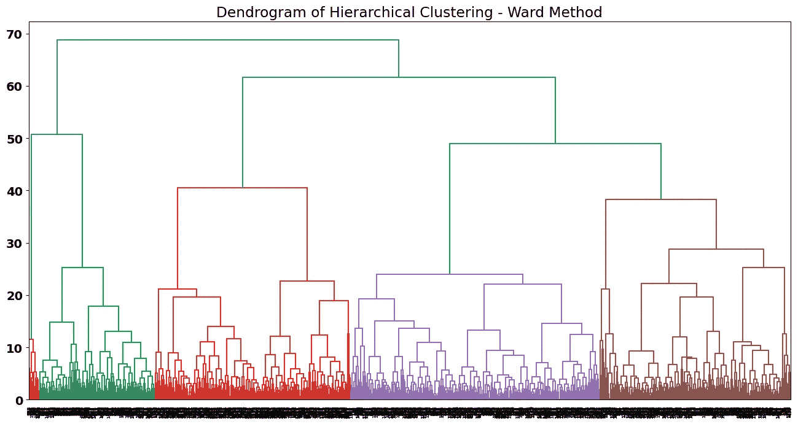

# 无监督学习系列：探索层次聚类

> 原文：[`towardsdatascience.com/unsupervised-learning-series-exploring-hierarchical-clustering-15d992467aa8`](https://towardsdatascience.com/unsupervised-learning-series-exploring-hierarchical-clustering-15d992467aa8)

## 让我们探讨层次聚类是如何工作的，以及它如何基于成对距离构建簇。

[](https://ivopbernardo.medium.com/?source=post_page-----15d992467aa8--------------------------------)[](https://towardsdatascience.com/?source=post_page-----15d992467aa8--------------------------------) [Ivo Bernardo](https://ivopbernardo.medium.com/?source=post_page-----15d992467aa8--------------------------------)

·发布于 [Towards Data Science](https://towardsdatascience.com/?source=post_page-----15d992467aa8--------------------------------) ·阅读时间 11 分钟·2023 年 6 月 20 日

--


图片来源：Nathan Anderson @unsplash.com

在我上一篇无监督学习系列的文章中，我们探讨了最著名的聚类方法之一，[K-means 聚类](https://medium.com/towards-data-science/unsupervised-learning-method-series-exploring-k-means-clustering-d129fff3ab6a)。在这篇文章中，我们将讨论另一种重要聚类技术背后的方法——**层次聚类**！

这种方法也基于距离（欧氏距离、曼哈顿距离等），并使用数据的层次表示来组合数据点。与*k-means* 相反，它不包含任何关于质心数量的超参数（如*k*），这些是数据科学家可以配置的。

大多数情况下，层次聚类可以分为两类：凝聚型聚类和分裂型聚类。在前者中，数据点被视为单一单位，并根据距离聚合到附近的数据点。在后者中，我们将所有数据点视为一个整体簇，并根据某些标准开始将其划分。由于凝聚型版本是最著名和广泛使用的（[sklearn 的内置实现遵循这种协议](https://scikit-learn.org/stable/modules/generated/sklearn.cluster.AgglomerativeClustering.html)），这是我们将在这篇文章中探讨的层次类型。

在这篇博客文章中，我们将分两步探讨凝聚型层次聚类：

+   首先，我们将逐步分析如何构建层次结构，使用凝聚型聚类中的*平均*方法（这是我们用来构建数据点层次结构的方法之一）。

+   然后，我们将看到如何使用 *sklearn* 的实现对实际数据集进行层次聚类的一些示例。这也是我们详细说明构建层次结构的其他方法（*ward, minimum, 等*）的地方。

让我们开始吧！

## 聚类示例 — 步骤详解

在我们的逐步示例中，我们将使用一个包含 5 个客户的虚拟数据集：


层次聚类示例 — 作者图片

设想一下我们经营一个有 5 个客户的商店，并希望根据他们的相似性对这些客户进行分组。我们有两个变量需要考虑：*客户年龄*和*年收入*。

**我们聚类的第一步是计算所有数据点之间的成对距离。** 我们通过将每个数据点表示为[x, y]格式来实现：

+   [60, 30]和[60, 55]之间的距离：**25.0**

+   [60, 30]和[30, 75]之间的距离：**54.08**

+   [60, 30]和[41, 100]之间的距离：**72.53**

+   [60, 30]和[38, 55]之间的距离：**33.30**

+   [60, 55]和[30, 75]之间的距离：**36.06**

+   [60, 55]和[41, 100]之间的距离：**48.85**

+   [60, 55]和[38, 55]之间的距离：**22.0**

+   [30, 75]和[41, 100]之间的距离：**27.31**

+   [30, 75]和[38, 55]之间的距离：**21.54**

+   [41, 100]和[38, 55]之间的距离：**45.10**

尽管我们可以使用任何类型的距离度量，但由于其简单性，我们将使用[欧几里得距离](https://en.wikipedia.org/wiki/Euclidean_distance)。从我们之前计算的成对距离中，哪一个是最小的呢？

**中年客户之间的距离，这些客户年收入不到 90k 美元 — 坐标为[30, 75]和[38, 55]！**

回顾一下两个任意点 *p1* 和 *p2* 之间的欧几里得距离公式：


欧几里得距离公式 — 作者图片

让我们通过连接更近的两个客户，在二维图上可视化我们最小的距离：


连接两个最近的客户 — 作者图片

**层次聚类的下一步是将这两个客户视为我们的第一个簇！**


将最近的客户视为一个簇 — 作者图片

接下来，我们将再次计算数据点之间的距离。**但这一次，我们将把我们分为一个簇的两个客户视为一个数据点**。例如，考虑下面的红点，它位于两个数据点的中间：


将最近的客户视为一个簇 — 作者图片

总之，对于我们层次解决方案的下一次迭代，我们不会考虑原始数据点的坐标（*表情符号*），而是红点（这些数据点之间的*平均值*）。这就是计算***平均连结方法***距离的标准方式。

我们可以用来计算基于聚合数据点的距离的其他方法有：

+   最大（或*完全*连结）：考虑与我们尝试聚合的点相关的集群中最远的数据点。

+   最小（或*单一*连结）：考虑与我们尝试聚合的点相关的集群中最近的数据点。

+   Ward（或*Ward*连结）：在下一次聚合中最小化集群中的方差。

让我在逐步解释中稍作停顿，*深入探讨*一下连结方法，因为这些方法在这种类型的聚类中至关重要。这里是一个关于层次聚类中不同*连结*方法的视觉示例，展示了合并的 3 个虚拟集群：


连结方法可视化

在*sklearn*实现中，我们将能够尝试一些这些连结方法，并在聚类结果中看到显著差异。

返回我们的示例，现在生成所有新数据点之间的距离 — 记住，从现在开始有两个集群被视为一个：


将最接近的客户视为一个集群 — 作者提供的图像

+   [60, 30]与[60, 55]之间的距离：25.0

+   [60, 30]与[34, 65]之间的距离：43.60

+   [60, 30]与[41, 100]之间的距离：72.53

+   [60, 55]与[34, 65]之间的距离：27.85

+   [60, 55]与[41, 100]之间的距离：48.85

+   [34, 65]与[41, 100]之间的距离：35.69

哪个距离最短？ **是坐标[60, 30]和[60, 55]之间的路径：**


将下一个最接近的客户视为一个集群 — 作者提供的图像

下一步自然是将这两个客户合并为一个集群：


创建下一个集群 — 作者提供的图像

在这个新的集群布局中，我们再次计算成对的距离！ **请记住，我们总是将每个集群中数据点之间的平均值（根据我们选择的连结方法）作为距离计算的参考点：**

+   [60, 42.5]与[34, 65]之间的距离：34.38

+   [60, 42.5]与[41, 100]之间的距离：60.56

+   [34, 65]与[41, 100]之间的距离：35.69

**有趣的是，下一个需要聚合的数据点是两个集群**，它们位于坐标[60, 42.5]和[34, 65]：


合并下一个集群 — 作者提供的图像

最终，我们通过将所有数据点聚合成一个大集群来完成算法：


将最终数据点合并到我们的簇中 — 作者提供的图片

考虑到这一点，我们到底在哪里停止呢？拥有一个包含所有数据点的大簇可能不是一个好主意，对吧？

要知道我们在哪里停止，我们可以使用一些启发式规则。但首先，我们需要熟悉另一种可视化我们刚刚完成的过程的方式 —— ***树状图***：


我们的层次聚类解决方案的树状图 — 作者提供的图片

在*y 轴*上，我们有刚刚计算的距离。在*x 轴*上，我们有每个数据点。从每个数据点爬升，我们到达一条水平线 —— 这条线的 y 轴值表示将连接边缘数据点的总距离。

记得我们最初将客户连接成一个簇吗？我们在 2D 图中的观察结果与树状图相符，因为这些正是使用水平线连接的第一个客户（从树状图底部爬升）：


树状图中的第一条水平线 — 作者提供的图片

水平线代表我们刚刚完成的合并过程！**自然地，树状图的末尾是一条连接所有数据点的大水平线。**

既然我们已经熟悉了*树状图*，我们现在准备检查*sklearn*实现，并使用真实数据集来理解如何根据这种酷炫的聚类方法选择适当的簇数量！

## Sklearn 实现

对于 sklearn 实现，我将使用[这里](https://archive.ics.uci.edu/dataset/186/wine+quality)提供的葡萄酒质量数据集。

```py
wine_data = pd.read_csv('winequality-red.csv', sep=';')
wine_data.head(10)
```


葡萄酒质量数据集预览 — 作者提供的图片

这个数据集包含了关于葡萄酒（特别是红葡萄酒）的信息，如柠檬酸、氯化物或密度等特征。数据集的最后一列表示葡萄酒的质量，这是由一个评审小组进行的分类。

**由于层次聚类处理的是距离，而我们将使用欧几里得距离，我们需要对数据进行标准化。** 我们将从对数据应用 `StandardScaler` 开始：

```py
from sklearn.preprocessing import StandardScaler
sc = StandardScaler()
wine_data_scaled = sc.fit_transform(wine_data)
```

使用我们标准化的数据集，我们可以拟合我们的第一个层次聚类解决方案！我们可以通过创建一个 `AgglomerativeClustering` 对象来访问层次聚类：

```py
average_method = AgglomerativeClustering(n_clusters = None, 
                                         distance_threshold = 0, 
                                         linkage = 'average')
average_method.fit(wine_data_scaled)
```

让我详细说明我们在*AgglomerativeClustering*中使用的参数：

+   `n_clusters=None` 用作获取所有簇的完整解决方案的方式（并且在这里我们可以生成完整的树状图）。

+   `distance_threshold = 0` 必须在 `sklearn` 实现中设置，以生成完整的树状图。

+   `linkage = `average``是一个非常重要的超参数。记住，在理论实现中，我们描述了一种考虑新形成簇之间距离的方法。`average`是计算新距离时考虑每个新形成簇之间的平均点的方法。在`sklearn`实现中，我们还有三种其他方法，也就是我们所描述的：`single`，`complete`和`ward`。

在拟合模型后，接下来是绘制树状图。为此，我将使用`sklearn` [文档](https://scikit-learn.org/stable/auto_examples/cluster/plot_agglomerative_dendrogram.html)中提供的辅助函数：

```py
from scipy.cluster.hierarchy import dendrogram

def plot_dendrogram(model, **kwargs):
    # Create linkage matrix and then plot the dendrogram

    # create the counts of samples under each node
    counts = np.zeros(model.children_.shape[0])
    n_samples = len(model.labels_)
    for i, merge in enumerate(model.children_):
        current_count = 0
        for child_idx in merge:
            if child_idx < n_samples:
                current_count += 1  # leaf node
            else:
                current_count += counts[child_idx - n_samples]
        counts[i] = current_count

    linkage_matrix = np.column_stack(
        [model.children_, model.distances_, counts]
    ).astype(float)

    # Plot the corresponding dendrogram
    dendrogram(linkage_matrix, **kwargs)
```

如果我们绘制我们的层次聚类解决方案：

```py
plot_dendrogram(average_method, truncate_mode="level", p=20)
plt.title('Dendrogram of Hierarchical Clustering - Average Method')
```


平均方法的树状图 — 作者提供的图像

这个树状图不是很好，因为我们的观察似乎有点拥挤。有时，`average`，`single`和`complete`链接可能会导致奇怪的树状图，尤其是当数据中有强烈的离群值时。`ward`方法可能适合这种类型的数据，因此我们来测试一下这个方法：

```py
ward_method = AgglomerativeClustering(n_clusters = None, 
                                         distance_threshold = 0, 
                                         linkage = 'ward')
ward_method.fit(wine_data_scaled)

plot_dendrogram(ward_method, truncate_mode="level", p=20)
```



Ward 方法的树状图 — 作者提供的图像

更好了！注意到这些簇似乎根据树状图得到了更好的定义。正如我们在帖子第一部分中描述的，ward 方法试图通过最小化新形成簇之间的内部方差来划分簇（[`online.stat.psu.edu/stat505/lesson/14/14.7`](https://online.stat.psu.edu/stat505/lesson/14/14.7)）。目标是使得每次迭代中要聚合的簇最小化方差（数据点与新簇之间的距离）。

再次，通过更改`linkage`参数可以在`AgglomerativeClustering`函数中实现更换方法！

由于我们对`ward`方法的树状图效果满意，我们将使用该解决方案进行簇分析：


Ward 方法的树状图 — 作者提供的图像

你能猜到我们应该选择多少个簇吗？

根据距离，一个好的选择是将树状图在这个点切割，在这里每个簇似乎相对彼此远离：


Ward 方法的树状图，截止点在 30 — 作者提供的图像

我们的线穿过的垂直线数即为最终解的簇数。选择簇的数量并不是很“科学”，不同的簇数可能会得到不同的聚类解，这取决于业务解释。例如，在我们的案例中，稍微在树状图上方切割并减少最终解的簇数也可能是一种假设。

我们将坚持使用 7 个簇的解决方案，因此让我们将`ward`方法与这些`n_clusters`进行拟合：

```py
ward_method_solution = AgglomerativeClustering(n_clusters = 7,
                                         linkage = 'ward')
wine_data['cluster'] = ward_method_solution.fit_predict(wine_data_scaled)
```

**由于我们希望基于原始变量解释我们的集群，我们将对标准化数据使用预测方法（距离基于标准化数据集）但将集群添加到原始数据集中。**

让我们使用每个变量的均值来比较我们的集群，条件是 `集群` 变量：

```py
wine_data.groupby([‘cluster’]).mean()
```


集群特征分析——作者图像

有趣的是，我们可以开始对数据进行一些见解——例如：

+   低质量的葡萄酒似乎有较高的 `总二氧化硫` 含量——请注意最高平均质量集群和较低质量集群之间的差异：


集群 6 和 2 之间的二氧化硫——作者图像

如果我们比较这些集群中葡萄酒的 `质量`：


集群 6 和 2 之间的质量密度图——作者图像

显然，平均而言，集群 2 包含更高质量的葡萄酒。

另一个有趣的分析是对聚类数据均值进行相关矩阵分析：


集群均值的相关矩阵——作者图像

这为我们提供了一些可以探索的潜在线索（即使是对监督学习）。例如，在多维层面上，含有较高 `硫酸盐` 和 `氯化物` 的葡萄酒可能会被聚集在一起。另一个结论是，含有更高酒精度的葡萄酒往往与更高质量的葡萄酒相关。

# 结论

就是这样！感谢您花时间阅读这篇关于无监督学习的博客文章。我会继续在这个系列中添加更多无监督学习算法，以展示我们可以使用的不同类型的方法来了解数据的结构。

自然地，层次聚类有一些优缺点，我们可以讨论：

+   算法的一个大缺点是它可能需要过多的启发式方法来达到最终解决方案。可能需要结合树状图分析、基于距离的分析或轮廓系数方法来确定合理的集群数量。此外，必须避免将这些技术方法与一些业务知识结合，以避免陷入某种聚类陷阱。

+   从积极的一面来看，层次聚类方法非常可解释，有助于揭示数据中的隐藏结构。

+   另外，层次聚类不受中心点初始化问题的影响——这可能对某些数据集来说是一个优势。

层次聚类是一种非常著名的聚类方法，已应用于多种不同的应用场景：

+   客户细分；

+   异常值分析；

+   分析多维基因表达数据；

+   文档聚类；

这是一种非常酷的方法，数据科学家应该在他们的工具箱中拥有它。可以在下一个项目中尝试，并关注更多关于这个**无监督学习系列**的帖子！

*如果你有兴趣参加我的 Python 课程，请随时加入* ***我的免费课程*** *（*[*Python For Busy People — Python Introduction in 2 Hours*](https://www.udemy.com/course/python-for-busy-people-python-introduction-2-hours/?referralCode=1588B6BF72D40253CDD4)*)* ***或一个更长的 16 小时版本*** *（*[*The Complete Python Bootcamp for Beginners*](https://www.udemy.com/course/the-python-for-absolute-beginners-bootcamp/?referralCode=8D25992A055C19079B8A)*）。我的 Python 课程适合初学者/中级开发人员，我非常希望你能来上我的课！*

*本文使用的数据集遵循* [*创意共享署名 4.0 国际*](https://creativecommons.org/licenses/by/4.0/legalcode) *(CC BY 4.0) 许可协议，相关链接如下：* [`archive.ics.uci.edu/dataset/186/wine+quality`](https://archive.ics.uci.edu/dataset/186/wine+quality)
