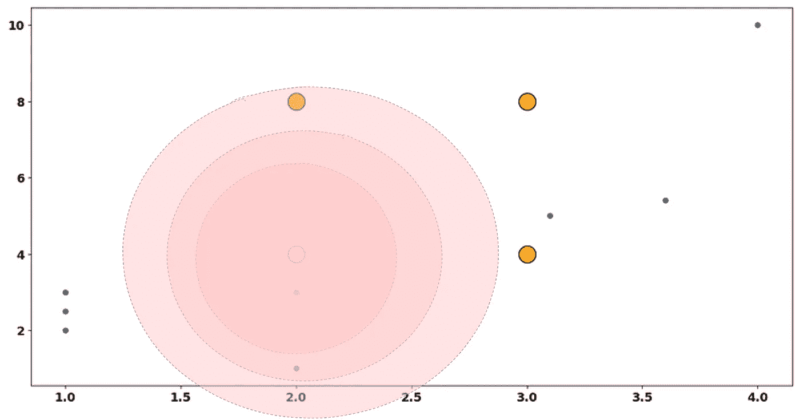
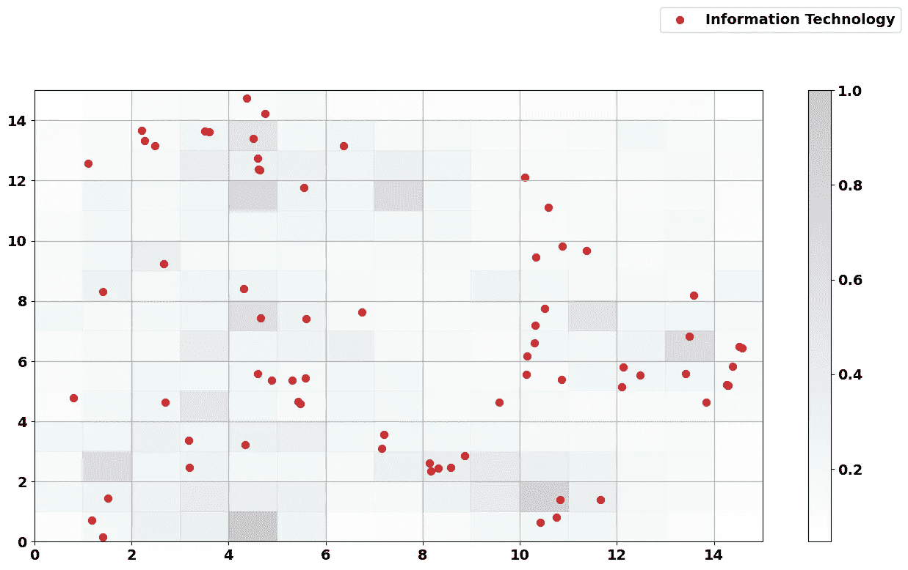

# 无监督学习系列——探索自组织映射

> 原文：[`towardsdatascience.com/unsupervised-learning-series-exploring-self-organizing-maps-fe2efde9f7a1`](https://towardsdatascience.com/unsupervised-learning-series-exploring-self-organizing-maps-fe2efde9f7a1)

## 了解自组织映射的工作原理以及它们为什么是有用的无监督学习算法

[](https://ivopbernardo.medium.com/?source=post_page-----fe2efde9f7a1--------------------------------)[](https://towardsdatascience.com/?source=post_page-----fe2efde9f7a1--------------------------------) [Ivo Bernardo](https://ivopbernardo.medium.com/?source=post_page-----fe2efde9f7a1--------------------------------)

·发表于 [Towards Data Science](https://towardsdatascience.com/?source=post_page-----fe2efde9f7a1--------------------------------) ·阅读时间 16 分钟·2023 年 8 月 6 日

--


图片由 [teckhonc](https://unsplash.com/pt-br/@teckhonc) @Unsplash.com

**自组织映射（SOMs）是一种用于聚类的无监督神经网络类型** 和 **高维数据的可视化**。SOMs 通过一种竞争学习算法进行训练，在这种算法中，网络中的节点（也称为神经元）竞争表示输入数据的权利。

SOM 架构由一个 2D 网格节点组成，其中每个节点都与一个权重向量相关，该向量表示 SOM 解决方案中的质心均值。节点以这样的方式组织，使得节点围绕相似的数据点组织，从而产生一个表示潜在数据的层。

SOMs 通常用于各种任务，如：

+   数据可视化

+   异常检测

+   特征提取

+   聚类

**我们还可以将 SOMs 视为最简单的无监督学习神经网络版本！**

虽然最初看起来有些困惑，但自组织映射（或称 Kohonen 映射，以其[发明者](https://en.wikipedia.org/wiki/Teuvo_Kohonen)命名）是一种有趣的算法类型，能够从数据中映射出潜在结构。它们可以描述如下：

+   一种单层无监督神经网络，没有反向传播。

+   一种受限的 *k-means* 解决方案，其中节点有能力影响其他节点的移动（在 k-means 的上下文中，节点被称为质心）。

在这篇博客文章中，我们将对 SOM 模型进行几个实验。之后，我们将把自组织映射应用于一个实际案例，在那里我们将能够看到算法的主要特性和缺陷。

# 理解 SOM 如何学习

要理解 SOMs 如何学习，我们从在 2 维中绘制一个玩具数据集开始。

我们将创建一个`numpy`数组，并随后绘制出来：

```py
import numpy as np
X = np.array([[1, 2], [2, 1], [1, 3], [1, 2.5], [3.1, 5], [4, 10], [3.6, 5.4], [2, 3]])
```


玩具数据集绘制 — 作者提供的图像

这 8 个数据点使用 *X* 和 *Y* 轴进行排列，代表任意变量。

我们如何开始在这个数据集上训练自组织映射？**SOM 的第一个重要特征是它是一个依赖于多个超参数的算法。** 了解这些超参数的工作原理及其对学习过程的影响非常重要。

第一组超参数定义了 SOM 的大小，通常称为 *网格*。这个值类似于 *k-means* 的质心数量和神经网络层的 *神经元数量*。它提供了我们将用于减少数据点的元素数量。

在这个例子中，我们将构建一个简单的 2 by 2 *网格*。这意味着我们将有 4 个质心（神经元）来表示我们的完整数据集。

> 学习 1: 网格的大小是 SOM 的一个超参数

让我们绘制它们：

```py
plt.scatter(X[:,0], X[:,1])
neurons = [[2,4], [2,8], [3,4], [3,8]]

for neuron in neurons:
      plt.scatter(neuron[0], neuron[1], c='orange', s=400, edgecolor='black')
```


2 by 2 网格 — 作者提供的图像

在橙色中，我们可以看到我们的 *网格* 作为数据中的质心进行表示。我们还可以将这些数据点以“*隐藏层*”格式表示，仿佛我们在谈论一个神经网络，在这个网络中，每个神经元由 *X* 和 *Y* 特征的值（权重）表示：


2 by 2 网格的网络格式 — 作者提供的图像

黑线表示 *x* 轴的 *权重*（值），红色虚线表示 *y* 轴的 *权重*（值）。

> 学习 2: 我们可以将 SOM 的单元称为节点（神经网络术语）或质心（聚类术语）

SOM 训练的第 1 步：选择一个随机点，并计算到每个 *神经元/质心* 的欧几里得距离


SOM 训练的第一步 — 作者提供的图像

这个数据点将选择与 **最佳匹配单元 (BMU)** 距离最短的神经元。

> 学习 3: 最佳匹配单元是我们的数据点选择为最相似的单元

**这个单元是将被拖向我们的数据点的神经元。**

但是.. 是否只有这个节点会在此次训练迭代中移动？不！所有其他质心也会移动，**根据它们与 BMU 的距离**。这与 *K-Means* 有显著不同，在 *K-Means* 中，质心没有能力在算法的每次迭代中拖动其他质心。

**BMU** 和其他节点将被拖向数据点。这一移动将使用一个邻近函数，该函数将作为我们在推动 SOM 节点时应用的“力量”。

定义这种“邻近函数”的一种最常见方式是创建 *基于距离的高斯方法*。我们首先计算节点与 **BMU** 之间的距离：


节点与 BMU 之间的距离 — 作者图片

在这种情况下，我们使用的是欧氏距离，其中 *distance = sqrt((x2-x1)² + (y2-y1)²)*。

现在，我们需要将这个距离输入到高斯核中，以考虑 BMU 对其他节点的影响。

这个高斯近似将基于以下函数：


高斯核示例 — 作者图片

分子是神经元之间的欧氏距离，分母将标准差 (*σ*) 乘以 2。请记住，这个标准差是算法的另一个超参数！

让我们从视觉上来看这个问题。如果我们考虑较小的标准差，一个类似于这个的高斯核将“绘制”围绕**BMU**的以下圆圈：



BMU 周围的高斯核 — 作者图片

上面图像的阴影不透明度是节点将被拉向数据点的力量的代理。

如果我们选择更高的标准差，BMU 的影响会更大，更多的节点会受到影响：


BMU 周围的高斯核，大的标准差 — 作者图片

> 学习 4：标准差是我们可以在 SOM 训练中配置的超参数

我会将高斯公式的结果称为*howclose* — 例如，*howclose* 在我们 BMU 节点（记住它是由数据点选择的）和其他节点之间的值如下（使用 *σ=1*）：


BMU 与每个数据点的 *howclose* — 作者图片

现在我们知道了**我们将在每个节点上施加的力量**，以将其拉向数据点。对于邻近节点，我们将施加最多力量的数据点是位于右下角的节点。相反，我们几乎不会移动位于右上角和左上角的节点。

我们知道了更新 SOM 时将使用的力量，但仍需要知道我们将如何移动每个节点。这可以通过更新公式来实现：


节点值更新公式 — 作者图片

其中：

+   *wi,k* 是节点 *k* 的变量 *i* 的当前坐标。

+   *howclose* 是我们之前计算的力量。

+   *learningrate* 是 SOM 算法的另一个超参数，类似于其他神经网络训练过程。

+   *(xi-w i,k)* 是**我们将推动节点的方向**。例如，在我们的示例中，所有节点都会被向下拖动，因为数据点位于每个节点下方（在 y 变量上）。

**上述计算的结果将为我们提供 SOM 中现有节点的新坐标！** 另一个重要细节：我们没有对 BMU 应用权重的计算（仅对邻近节点）。**一种常见的方法是应用最大强度来拖动 BMU（高斯函数的输出=1）。**

如果我们应用此逻辑，节点的新坐标是什么？计算结果见下表：


节点值更新摘要 — 图片由作者提供

让我们看看右下角节点的示例：

+   在*x 轴*（上表的第一行），**此点的新坐标将是 2.53**，而不是 3**。这是应用强度乘以学习率并将节点更新到 x 变量的数据点的结果。

+   在*y 轴*（上表的第四行），此点的新坐标将是 3.377**，而不是 4**。这是应用强度乘以学习率并将节点更新到 y 变量的数据点的结果。

此外，注意到右上角和左侧的节点移动微乎其微。为什么？因为*howclose*在将这些节点推向数据点时施加了较低的强度。

我们的 BMU 将如何移动？自然，它将被拖到数据点的顶部：


更新 BMU — 图片由作者提供

根据我们在*更新值*表中获得的坐标，让我们查看我们“新的”SOM：


SOM 中的新节点 — 图片由作者提供

紫色节点是更新后的“SOM”节点。我们的自组织映射图试图通过根据我们选择的随机点进行调整来模拟潜在的数据点。让我们看看三维视图中发生了什么：


SOM 中的新节点 — 3D 视图 — 图片由作者提供

注意，当我们将其与原始随机网络进行比较时，我们的 SOM 稍微移动了一下，新的黑色和虚线表示节点的新权重。


原始随机 SOM — 3D 视图 — 图片由作者提供

我们的 SOM 将对数据集中所有可用的数据点执行此过程（每次迭代时调整自身）。记住每一步：

+   *计算 BMU*（最佳匹配单元）使用距离度量。

+   *计算 BMU 周围的核*以了解如何将其他节点拉向数据点。

+   *使用强度、学习率和方向的组合来拉动节点。*

+   移动到下一个点并重复。

就像其他神经网络模型一样，SOM 中的纪元数是我们需要定义的另一个超参数。一个纪元包括对整个数据集的单次遍历。

> 学习 5：SOM 将继续调整自身，直到达到用户定义的纪元数。

在 Python 中，我们可以使用*minisom*包来训练自组织映射：

```py
from minisom import MiniSom

som = MiniSom(
 2, 2, 2, sigma=1, 
 learning_rate=1, neighborhood_function=’gaussian’, random_seed=42)
 som.train(X, 100)
```

`Minisom`函数的参数如下：

+   前三个数字表示 SOM 的维度：*x 轴*上的节点数量，*y 轴*上的节点数量，以及变量的数量。

+   Sigma 包含起始标准差。

+   然后我们有算法的起始学习率（在这种情况下，设置为 1）。

+   `neighborhood_function`定义了我们的邻域的`gaussian`核。

+   `random_seed`确保我们的 SOM 结果可复现。

在对这个自组织映射（SOM）进行拟合和训练（如`som.train`函数中指定的 100 轮）后，节点会最终在哪里呢？让我们来看一下：

```py
nodes = som.get_weights().reshape(4, 2)
 plt.scatter(nodes[:,0], nodes[:,1], c=’purple’, s=400, edgecolor=’black’)
 plt.show()
```


训练后的 SOM——作者图片

注意我们的 SOM 尽力模仿了底层数据点的特征！

尽管你可能认为这与*k-means*非常相似，但让我们看看在这个数据集上拟合 4 个质心的 k-means 解决方案的结果：


注意，在这个 k-means 解决方案中，右上角的节点被拉向了离群值。**节点通过邻域函数连接在 SOM 中的这一事实，是算法的主要特征之一，防止节点被离群值拉离。**

好的，很棒！我们已经对 SOM 有了很好的介绍，现在让我们看看 SOM 在实际数据中的应用！

# 将 SOM 应用于实际数据

在这部分博客文章中，我将使用一个包含 S&P 500 公司信息的数据集：

```py
financial_valuation_data = pd.read_csv(‘/data/constituents-financials_csv.csv’)
```

这里是数据框的前 5 行：


financial_valuation_data 前 5 行——作者图片

在这个数据集中，我们可以看到以下列：

+   *符号*：公司的股票代码。

+   *名称*：公司的名称。

+   *行业*：公司的行业。

+   *价格*：公司当前的股价（截至 2014 年 12 月 31 日）。

+   *价格/收益*：股价与每股收益的比率。

+   *每股收益*：公司每股的收益金额。

+   *52 周低点*：过去一年中的最低股价。

+   *52 周高点*：过去一年中的最高股价。

+   *市值*：公司的总价值，等于每股价格乘以股份数量。

+   *EBITDA*：息税折旧摊销前利润。

+   *价格/销售额*：价格除以每股收入。

+   *价格/账面价值*：将价格除以公司的账面价值（*资产-负债*）的财务估值指标。

此外，我还会创建一个变量来模拟股价的波动性（尽管这不是股价波动性的理论公式，但它是一个简单的代理）：

```py
financial_valuation_data[‘Volatility’] = (
 financial_valuation_data[’52 Week High’]-financial_valuation_data[’52 Week Low’]
 )/financial_valuation_data[’52 Week High’]
```

很好！所以我们从子集化几个列开始，使我们的 SOM 更简单：

```py
financial_valuation_data_subset = (
 financial_valuation_data[[‘Price/Earnings’,’Dividend Yield’,’Earnings/Share’,’Price/Sales’, ‘Price/Book’, ‘Volatility’]]
)
```

**你能根据上述子集确定我们的 SOM 将有多少维度吗？**

**6，我们刚提取的变量数量！** 我们的玩具示例中的 SOM 只有两个维度（用于可视化）。这个新的 SOM 将更难以可视化，但幸运的是，还有一些图可以为我们提供训练模型的洞察。

我们在玩具示例中没有涉及的另一个步骤是标准化过程。记得自组织映射开始时计算随机数据点与每个节点之间的距离吗？因此（而且我们通常使用欧几里得距离），我们需要对数据进行标准化！我们将使用`sklearn's StandardScaler`来实现：

```py
scaled_data = StandardScaler().fit_transform(financial_valuation_data_subset)
scaled_data = np.nan_to_num(scaled_data, nan=0)
```

我还会将一些`nans`填补为 0。由于我们数据集中只有少量`nas`，这不会造成太大影响。

数据集准备好后，我们可以尝试使用`MiniSom`包训练我们的`SOM`。让我们定义以下超参数：

+   一个 15 乘 15 的网格（225 个节点）——这是一个大型网络！

+   6 个特征（SOM 的维度）。

+   σ为 0.5。

+   学习率为 1。

+   高斯近似函数。

```py
som = MiniSom(
    15,
    15,
    6,
    sigma=0.5,
    learning_rate=1,
    neighborhood_function='gaussian',
    random_seed=42
    )
```

你可能会想...我应该在 SOM 中使用多少次迭代？

一种很酷的可视化方式是分批训练 SOM 并计算`quantization_error`，这是一个检查每个数据点与其 BMU 之间平均距离的度量：

```py
np.random.seed(42)

num_iterations = 1000

q_errors = []
for i in range(1, num_iterations):
 som.train_batch(scaled_data, i)
 q_errors.append(som.quantization_error(scaled_data))
```

这将告诉我们我们的 SOM 在复制底层数据点方面的效果如何。理想情况下，量化误差应该为零**（几乎不可能，因为 SOM 的目标是减少数据集的维度，并且一定会涉及一些误差）**。


SOM 训练过程 — 作者插图

有趣的是，在约 500 次迭代后，我们的量化误差相当稳定。这个图给了我们一个关于训练过程中可能需要的迭代次数的概述。

为了安全起见，我们将训练 SOM 1000 次，使用与之前相同的参数：

```py
som = MiniSom(
 15, 15, 6, sigma=0.5,
 learning_rate=1, neighborhood_function=’gaussian’, random_seed=42)
som.train(scaled_data, 1000)
```

我们刚刚在这些数据上训练了我们的 SOM！处理完这些后，我们将查看我们的数据点如何与我们创建的地图相关。

第一行由以下数组表示：

```py
scaled_data[0]
```


第一行数组 — 作者插图

有了训练好的模型，我们可以调用`som.winner()`函数来检索`BMU`（最近的 SOM 节点）：

```py
som.winner(scaled_data[0])
```

上述代码的输出是*(2, 11)* — 这意味着在 SOM 训练结束时，距离此数据点最近的节点坐标是 2,11（记住 Python 的索引从 0 开始）：


我们第一个数据点的 BMU — 作者插图

上述 SOM 中的每个节点由一个包含 6 个值（维度或变量数量）的数组描述。继续这个过程，让我们看看第二个数据点的 BMU 是什么：

```py
som.winner(scaled_data[1])
```


我们第二个数据点的 BMU — 作者插图

我们可以将这种行为推广到数据框中的所有数据点：

```py
financial_valuation_data[‘winner_node’] = (
 [som.winner(scaled_data[i]) for i in range(0, len(scaled_data))]
)
```

自然的后续问题是：“我们能否看到哪些节点附近有更多的数据点？” *(这类似于 k-means 中最具代表性的簇)*

```py
financial_valuation_data.groupby(‘winner_node’).size().sort_values().tail(10)
```


根据数据点表示的前 10 个节点 — 作者提供的图像

另一个我们可以用训练好的 SOM 做的常见图是距离图。这个图显示了每个节点与其邻居之间的标准化平均距离：


SOM 距离图（U-Matrix）— 作者提供的图像

在这个距离图中，我们可以理解到有 7 或 8 个节点（红色的）与其他 SOM 节点相对较远。如果这些节点上附有数据点，可能有些特殊之处——例如：


SOM 中的远离节点 — 作者提供的图像

```py
(
 financial_valuation_data
 .loc[financial_valuation_data[‘winner_node’]
 .apply(lambda x: (x[0] == 4) & (x[1] == 0))]
)
```

通过筛选以此节点作为 BMU 的公司，我们获得了以下数据：


附属于 BMU 节点的公司 — 作者提供的图像

下一个问题是——为什么这些公司在这个节点上聚集在一起？**可能是因为我们分析的 6 个维度中的一个在这个节点上有一个非常特殊的值。**

我们可以通过查看每个节点的变量权重值来检查这一点：


每个节点的变量权重 — 作者提供的图像

**这是另一种可视化训练好的 SOM 的有用图表，因为它显示了变量在 SOM 中的影响。**

**对于 L Brands 和 Philip Morris，它们的市净率值似乎非常高（> 1000）——这可以在节点的价格/账面价值影响中看到**。这可能需要进一步的调查，特别是因为我们数据集的平均账面价值是 14。

让我们通过查看其他变量来进一步探讨 SOM 中的权重，例如检查具有异常市盈率的节点区域：


PE 比率在 SOM 节点上的权重

从红色区域中的高值节点开始：

```py
(
    financial_valuation_data 
    .loc[financial_valuation_data['winner_node']
         .apply(lambda x: (x[0] >= 9) & (x[0] <= 11) & (x[1] == 1))]
)
```


市盈率高的公司 — 作者提供的图像

另一方面，让我们看看蓝色阴影区域，我们预计在这里会有市盈率较低的公司：

```py
(
 financial_valuation_data
 .loc[financial_valuation_data[‘winner_node’]
 .apply(lambda x: (x[0] >= 7) & (x[0] <= 8) & (x[1] == 12))]
)
```


市盈率低的公司 — 作者提供的图像

我们只有一家公司与这些节点相关联，并且市盈率非常低！有趣的是，具有此数据点的节点在 `distance_map` 中也被标记为远离其他节点。

拥有训练好的 SOM 可以帮助我们理解数据的潜在结构，特别是数据点如何围绕这些质心进行聚集，以及哪些变量与这些质心相关。另一个常见的做法是尝试理解不同类别如何围绕节点进行聚集。例如，我们能否在训练好的 SOM 上捕捉到任何行业趋势？

我们可以在每个节点内部绘制每个数据点的行业，以评估以下内容：


SOM 中按行业分类的数据点 — 作者提供的图片

每个方块代表一个 SOM 节点，在方块内部，我们绘制了附加到该节点的每个数据点。根据我们为网络选择的变量，我们能否识别出任何行业趋势？

*（剧透：实际上有两个行业，我们的 SOM 可能能够很好地识别并将行业聚集在一起）。*

让我们在上面的图中子集“*房地产*”和“*公用事业*”公司：


SOM 中的房地产和公用事业公司 — 作者提供的图片

看看我们的数据点在少数节点中如何紧密聚集！如果我们将其与“*信息技术*”行业进行比较：



SOM 中的信息技术公司 — 作者提供的图片

如果我们想在这些数据上进行一些监督模型（预测行业），这个 SOM 会为我们提供一些关于为什么我们会在使用的变量下预测“信息技术”类别时遇到困难的有益见解。

想了解更多示例，请查看很棒的[JustGlowing](https://github.com/JustGlowing)（minisom 包的创作者）[示例](https://github.com/JustGlowing/minisom/tree/master/examples)库。

# 结论

感谢您花时间阅读这篇帖子！

SOMs 是非常有趣的被忽视的算法，能够详细描述我们数据集的结构。它们可以帮助完成多种任务，例如检测异常值（在大型 SOMs 中）或构建对异常值具有鲁棒性的聚类算法（较小的 SOMs）。SOMs 在历史上已被用于解决各种问题，如 [图像压缩](https://ieeexplore.ieee.org/abstract/document/668891?casa_token=Skb2_ne1VHEAAAAA%3AwSrP8MPLH9xMcSVYVuCzJh3-RwmUKiYj0GK1evhBKcgo_dRqiMbgubabTSUE1bz310-FP-y3bg)、[检测系统](https://ieeexplore.ieee.org/abstract/document/8370435?casa_token=f_sMzz7FmjsAAAAA%3AXQvBv1DA39RMjl5jAIio1YhKU0eTI8ry0544AfpFB3CbRECrstASiXbWofxN2pyXEakXOW7TLw) 和与 [地球科学](https://d1wqtxts1xzle7.cloudfront.net/40037324/00463515e8c54d6911000000.pdf20151115-68247-iz3ok7-libre.pdf?1447636982=&response-content-disposition=inline%3B+filename%3DThe_self_organizing_map_the_Geo_SOM_and.pdf&Expires=1691321052&Signature=FI53U9nEQTeZtjWlnZH4ACWHUtK66MCmnjHKHr846t9BY3HbZJE%7ElC%7Ehwoj6UB1Y6iGL2RZhwK8IXjnAYcRhf%7Eh28iEc2r1heLxNT8XCZoM9eNGq0QOQTuzFfkh2YcBSwe7oZVnPVCXhwTEK6-QS9sYdB5tK7moddNxJegksJmvhGx%7EUsrCq4IPEevn80LjDJYX1PadWEAng9W4FDUslrPikl5PeKvaXndrg0ItGp8MbP-6jpwJ7svwWTkJMLvDGn1fSQtVJn%7EJjPBEFL4fZHLA40kURkejx0BtK4dZHfLeB7UUkY2MPBjKcdgzMjF2Xw1xbY3LqpZEIehmohMl8wQ__&Key-Pair-Id=APKAJLOHF5GGSLRBV4ZA) 相关的问题。

与 *K-Means* 和 *层次聚类* 相比，自组织映射在对异常值的鲁棒性方面通常更强，特别是在相同数量的聚类时（不要混淆这一点与大型 SOMs 能识别数据中的边界情况的事实）。

总之，你可以将它们用于各种数据科学任务，例如：

+   预处理步骤（使用大型 SOMs 识别异常值，理解特征之间的高相关性）。

+   理解你的特征预测类别的能力。

+   构建聚类算法。

如果你喜欢这篇文章，确保阅读我在无监督学习系列中的其他文章：

+   K-Means

+   层次聚类

*我们在这篇文章中使用的数据集采用了开放数据共享许可，并且可以在* [*这里*](https://github.com/datasets/s-and-p-500-companies-financials/tree/main) 获取。
