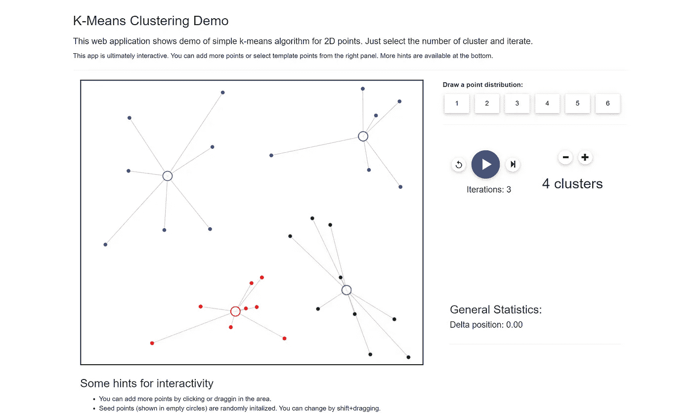

# 无监督学习与 K-Means 聚类：从图像生成颜色调色板

> 原文：[`towardsdatascience.com/unsupervised-learning-with-k-means-clustering-generate-color-palettes-from-images-94bb8e6a1416`](https://towardsdatascience.com/unsupervised-learning-with-k-means-clustering-generate-color-palettes-from-images-94bb8e6a1416)

## 这是关于无监督机器学习和 K-Means 算法的全面指南，包含了一个基于颜色对图像像素进行分组的聚类用例的演示

 [Nabanita Roy](https://nroy0110.medium.com/?source=post_page-----94bb8e6a1416--------------------------------)

·发表于 [Towards Data Science](https://towardsdatascience.com/?source=post_page-----94bb8e6a1416--------------------------------) ·阅读时间 13 分钟·2023 年 4 月 14 日

--

[Billy Huynh](https://unsplash.com/@billy_huy?utm_source=medium&utm_medium=referral) 的照片，来自 [Unsplash](https://unsplash.com/?utm_source=medium&utm_medium=referral)

无监督学习是一种方法，在这种方法中，可以发现数据中的潜在模式，而无需向机器学习算法提供额外的信息（或标签/目标）。在本文中，我记录了最近在阅读一些图像处理文章时发现的一个相当酷的 K-Means 聚类算法应用，以及无监督聚类方法在机器学习中的介绍。

**本文的关键要点：**

1️⃣ 无监督机器学习：介绍、分类和应用

2️⃣ K-Means 聚类的全面理解

3️⃣ 使用 Scikit Learn Python 库进行逐步的 K-Means 聚类应用，以从给定图像生成颜色调色板

4️⃣ 使用 Pillow、Requests 和 Numpy 读取和处理图像

# 让我们首先深入了解无监督学习

机器学习（ML），一种通过给定数据来训练机器以吸收和学习的技术，通常可以分为监督学习、无监督学习和强化学习。

图片来源：作者

**✅ *监督学习***是通过提供带有元数据（在机器学习术语中称为标签）的样本来教机器学习的过程，以帮助识别过程。例如，在欺诈检测用例中，事务由分析师手动标记为欺诈或真实，然后用于训练机器学习模型。这个机器学习模型从欺诈事务的模式或行为示例中学习，并能够将学习应用到新的事务中，评估它是否符合用于学习的欺诈或真实事务的模式。然后，模型将新事务与欺诈或真实类别之一关联，根据识别的模式进行预测。通常，这些预测会与置信区间或概率得分相关，以指示模式与未见样本的匹配程度。较高的得分表示机器学习模型认为预测可能是正确的。

**✅ *无监督学习***也会发现样本中隐藏的这些模式。不同之处在于没有标签/类别。无监督技术非常适合于探索数据和理解那些从庞大的数据集中难以被人类识别的行为。*它们广泛应用于文本分类（如新闻文章）、异常检测、卫星与空间图像处理、医学图像分析、客户细分和推荐引擎等。*

无监督学习用于三个主要任务—— *聚类、关联和降维。*

+   ***聚类***是一种自动将样本分组的技术。

+   ***关联***是一种用于发现数据集中特征之间关系的技术。

+   ***降维***是一种用于减少数据集中高维特征数量的技术。

在本文中，我将重点关注聚类作为一种分组技术。

# 机器学习中的**聚类**

聚类可以用于多个应用，例如评估数据点之间的相似或不同、数据点在向量空间中的密集程度、提取主题等。主要有四种类型的聚类技术——

图片来源：作者

1.  ***基于中心点的聚类***是通过计算数据点到中心点的平均距离来识别数据点的组。可以有多个中心点，并且初始中心点会在多个迭代中进行优化。这种技术简单、高效且有效，但对初始超参数配置敏感。**K 均值聚类是最受欢迎的属于这种技术的聚类算法。**

1.  ***基于密度的聚类*** 将高密度区域分组为簇。这对于空间数据处理非常有用。例如，这种技术可以用来定位 COVID-19 感染家庭的高密度区域、定位人口密集区或进行森林砍伐分析。**DBSCAN（基于密度的空间聚类与噪声）是最常用于检测基于密度的簇的算法。** 通常，这些算法会忽略异常值。

1.  ***基于分布的聚类*** 用于检测数据中是否嵌入了特定的分布（例如高斯分布）。如果已知数据中嵌入了某种特定类型的分布，推荐使用这种技术。

1.  ***层次聚类*** 用于检测数据中是否存在层次关系或分类法。这种技术可以进一步分为“自上而下”和“自下而上”方法。**树状图** 是一种数据可视化技术，通过创建分类地图来帮助解释层次聚类的结果。层次聚类的应用包括使用 DNA 序列理解和绘制生命科学领域的进化过程，以及在 Covid-19 期间跟踪感染簇，将其建模为区域并细化为子区域。

聚类的其他方法和定义包括**划分/排他性聚类**（每个数据点被分配到一个且只有一个簇）、**重叠/非排他性聚类**（一个数据点可以被分配到多个簇）、**模糊或非模糊** 方法以及**部分**（数据点可能没有被分配到任何簇）或**完全聚类技术**（所有数据点都有一个或多个簇分配）。

在下一部分，我将重点讲解 K 均值聚类技术、scikit-learn 实现以及该算法的优缺点。

# K 均值聚类介绍

K 均值聚类是最受欢迎的基于中心点的聚类方法之一，其具有划分簇。簇的数量是预定义的，通常用 *k* 表示。所有数据点都被分配到这 *k* 个簇中的一个且仅一个。下面演示了在二维空间中（随机）数据点在经过 3 次迭代（如右侧所设定）后被划分成 4 组的过程。

由[中东技术大学（METU）](https://www.metu.edu.tr/)提供的 K 均值聚类模拟器 | 图片来源与模拟器链接：[`user.ceng.metu.edu.tr/~akifakkus/courses/ceng574/k-means/`](https://user.ceng.metu.edu.tr/~akifakkus/courses/ceng574/k-means/)

从训练 K 均值模型获得的每个簇包含一个质心（在上图中由较大的圆圈标记）并且每个数据点被分配到距离最近的质心的簇中。簇的质心是该簇中所有数据点的均值。简而言之，K 均值算法通过迭代地最小化质心与每个数据点之间的距离，将数据点分成*k*个簇。通常，[欧几里得距离](https://en.wikipedia.org/wiki/Euclidean_distance)用于测量质心与数据点之间的距离。

如果你熟悉机器学习中的成本函数，你会知道这个函数的评估估计了机器学习模型预测的误差，并且提升模型性能包括了最小化该函数的策略以实现最终效果。在聚类中，成本函数求和了各个簇的扭曲度。

就 K 均值聚类而言，扭曲度是所有点到其最近簇中心的平方距离（假设使用了欧几里得距离）。为了获得最佳簇，扭曲函数需要被最小化。

扭曲函数 | 图像来源：作者 | 参考文献：[`cs229.stanford.edu/notes2020spring/cs229-notes7a.pdf`](http://cs229.stanford.edu/notes2020spring/cs229-notes7a.pdf)

K 均值算法最小化*J*关于*c*，保持*µ*固定（当数据点根据距离被（重新）分配到固定的质心时），然后最小化*J*关于*µ*，保持*c*固定（当质心在根据距离（重新）分配数据点之后（重新）更新时）。

K 均值的一个变体是 K-中位数，它依赖于从质心到数据点的[曼哈顿距离](https://wikipedia.org/wiki/Taxicab_geometry)。

**K 均值算法：**

图像来源：作者

*步骤 1:* 随机初始化每个*k*簇的质心

*步骤 2:* 将每个点分配给最近的质心，将数据点分组到初始的*k*簇中。

*步骤 3:* 通过计算每个*k*簇中所有点的平均值来重新计算质心。由于质心被重新计算并因此被更新，数据点随后也会被重新分配到最近的质心。

*步骤 4:* 重新计算质心并将数据点重新分配到更新后的质心（即重复步骤 3），直到点不再改变簇。

**Scikit-Learn 的 K 均值实现：**

图像来源：[`scikit-learn.org/stable/modules/generated/sklearn.cluster.KMeans.html`](https://scikit-learn.org/stable/modules/generated/sklearn.cluster.KMeans.html)

[**K 均值实现**](https://scikit-learn.org/stable/modules/generated/sklearn.cluster.KMeans.html) **在 Scikit-Learn 中的关键超参数包括：**

1.  *n_clusters*: 用户必须提供的簇的数量

1.  *init*: 初始化质心的策略。尽管这些质心是随机选择的，为了加速收敛并获得最佳的聚类，可以应用像 K-means++ 技术这样的策略。否则，‘random’ 使用随机初始化的聚类。K-Means++ 随机选择一个质心，然后将剩余的 *k−1* 个质心放置在彼此尽可能远的位置。[这里有一篇深入探讨 K-Means++ 的论文。](https://dl.acm.org/doi/10.5555/1283383.1283494)

1.  *n_init*: K-means 算法运行的次数，每次使用不同的质心种子。如果设置为 1，则对于稀疏数据，簇可能会出现高度不平衡。为了解决这个问题，*n_init* 次数的聚类算法被应用，并返回具有最佳惯性（用于聚类的性能评估指标）的簇分布。

1.  *max_iter*: 质心可以被重新计算的最大次数。这对于处理时间较长的大数据集非常有用，但低的 max_iter 也可能导致在算法收敛之前被终止，从而导致亚最佳簇。

1.  *algorithm*: 选择 Lloyd 或 Elkan。‘Lloyd’s algorithm’ 通常用于 K-Means。在维基百科中指出，这种算法（由 [Stuart P. Lloyd, Bell Labs, 1957](https://en.wikipedia.org/wiki/Lloyd%27s_algorithm)）用于在 [欧几里得空间](https://en.wikipedia.org/wiki/Euclidean_space) 的子集（即建立质心）中寻找均匀分布的点集，并将这些子集划分为形状良好且大小均匀的凸单元（分配和聚类与质心相关的数据点）。

**现在，让我们来看看训练中可用的关键属性：**

1.  *cluster_centers_* : 质心的坐标数组

1.  *labels_* : 每个数据点的标签

1.  *inertia_*: 样本到其最近簇中心的平方距离之和，如果提供了样本权重，则按样本权重加权。这通常用于评估簇的形成情况。

注意，与监督学习方法不同，模型仅在训练数据上进行拟合。因此，*fit*、*fit_transform* 和 *fit_predict* 方法将只接受一个参数，即观察的数据集。

所有可用超参数、属性和方法的详细概述见[此处](https://scikit-learn.org/stable/modules/generated/sklearn.cluster.KMeans.html)。

**✅ 为什么 K-Means 算法如此受欢迎？**

+   简单、快速、高效且易于解释

+   对于大数据集，易于扩展

+   对于常见的相似性度量，如欧几里得距离、相关性和余弦相似性，收敛是有保证的

+   灵活且可以推广以适应各种簇大小、形状和密度

**⚠️ 挑战：**

1.  手动设置簇的数量 (*k*)

1.  质心容易受到异常值的影响

1.  K-means 聚类算法主要适用于大致圆形的聚类，对于大小和密度变化较大的数据表现较差。然而，通过应用泛化策略，可以消除这一问题。

# 色彩调色板生成器

一个典型的聚类过程包括：

➡️ 准备数据 ➡️ 向量化数据（例如文本的相似性评分嵌入或图像的 RGB 值） ➡️ 运行所选择的聚类算法 ➡️ 解释结果 ➡️ 通过使用更新的数据或超参数重新训练模型来进行调整。

**💡 *在这个项目中，给定一张图片，目标是对像素 RGB 值进行聚类，应用聚类算法并获得代表调色板颜色的聚类中心。附加任务：对调色板颜色进行排序，并在 Python 的数据可视化库中使用它们。***

图片来源：作者

**让我们开始吧👍**

**步骤 1：获取图像数据**

首先，我们需要一张图片并获取每个像素的 RGB 值。为了在屏幕上表示颜色，每个像素实际上由三个颜色组件组成：**红色 (R)、绿色 (G) 和蓝色 (B)**。这些通常被称为像素的 RGB 值。

**一些注意事项：**

🔴RGB 值 (255, 0, 0) 是一个红色像素

🟢RGB 值 (0, 255, 0) 是一个绿色像素

🔵RGB 值 (0, 0, 255) 是一个蓝色像素

⚪RGB 值 (255, 255, 255) 是一个白色像素

⚫RGB 值 (0, 0, 0) 是一个黑色像素

这里是如何使用 Pillow Python 库在 Python 中完成这项工作的。在 *第 5 行*，我使用 ***Image.open()*** 读取了图片，在 *第 15 行*，我将图片转换为 [Numpy array](https://numpy.org/doc/stable/reference/generated/numpy.array.html) 的 RGB 代码，最后在 *第 18 行*，将这些值放入 [Pandas DataFrame](https://pandas.pydata.org/docs/reference/api/pandas.DataFrame.html) 中。

图片来源：作者

你可以简单地使用 ***image_variable_name***（在我的例子中是 img）来查看图像，或者使用 **display(img)** 或 **img.show()** 来显示图像。

图片来源：作者

RGB DataFrame 的结果如下：

图片来源：作者

此外，为了从 URL 读取图片，下面是我使用 [requests](https://pypi.org/project/requests/) 库来获取图片的实现。

图片来源：作者

接下来，按照之前的步骤获取 RGB 值并将其转换为 DataFrame 以继续处理。

**步骤 2：使用 SkLearn 的 K-Means 实现进行聚类**

现在我已经有了 RGB 值，我正在使用 [scikit-learn 中的 K-Means 聚类算法](https://scikit-learn.org/stable/modules/generated/sklearn.cluster.KMeans.html)。我使用的参数如下：

+   *n_cluster*：表示聚类数量的整数。我使用了 6。这个数量也表示调色板中的颜色数量，因为我们将选择聚类中心（~ RGB 值）来代表调色板中的颜色。

+   *random_state*：用于质心初始化的随机种子。我使用了 0。

+   *init*：质心初始化方法。我使用了 k-means++，它通过基于点对整体惯性的贡献的经验概率分布来选择初始簇质心，然后在每个采样步骤进行多次试验，以选择最佳的质心。

+   *n_init*：k-means 算法用不同的质心种子运行的次数。由于我选择了*init*: *K-means++*，*n_init*被自动设置为 1。

此外，我使用了*max_iter (300)*和*algorithm(Lloyd)*的默认值。

接下来，我使用了***fit()***方法将模型拟合到*line 9*中的 RGB DataFrame。

模型成功训练后，我访问了*cluster_centers_*属性，将其转换为整数，并放入*list*中。这个嵌套列表是调色板颜色的 RGB 值，其中每个元素都是一个包含 R、G 和 B 值的列表。

图像来源：作者

**步骤 3（可选）：重新排序簇质心，即你的调色板颜色**

这是一个可选步骤，我根据其 HSV 表示中的值对颜色进行了排序，其中 H — 色调，S — 饱和度，V — 值。通过使用[colorsys](https://docs.python.org/3/library/colorsys.html)的 rgb_to_hsv()方法转换后，访问[h, s, v]列表的最后一个元素，我选择按“值”排序，该值描述了颜色的亮度或强度。它由 0 到 100（百分比）之间的整数表示，其中 0 是完全黑色，100 是最亮的，显示出最丰富的颜色。

图像来源：作者

这是一个总结，用于比较排序前后的调色板。

图像来源：作者

详细代码在笔记本中，但下面是我如何使用 Plotly 生成调色板的。

图像来源：作者

**步骤 4：簇分析**

如果你对图像中分组在一起的像素感到好奇，这里有一种可视化它们的方法。使用***predict()***方法预测数据中每个样本最接近的簇。由于我们不是在评估性能，而是在评估数据中的模式，所以可以在训练数据上执行此操作 —— 即未标记的训练数据或未见过的数据集，因此，我将其传递给了*line 1*中的***predict()***。然后，将预测的簇编号数组添加回数据集。

图像来源：作者

在*line 3*中，我使用了 lambda 函数来映射 RGB DataFrame 中每列的单个 R、G 和 B 值，并将 RGB 值转换为相应的 Hex 代码，因为使用[Seaborn 的 color_palette()方法](https://seaborn.pydata.org/generated/seaborn.color_palette.html)绘制起来更简单。下面是用于将 RGB 转换为 Hex 的函数。

图像来源：作者

最后，我将每个簇的可视化过程包裹在一个 for 循环中（*第 4 到第 6 行*），对于每个簇编号，从 0 到调色板大小/簇数（[排除](https://www.geeksforgeeks.org/python-range-function/)），使用 ***seaborn.color_palette()*** 方法在 *第 6 行* 显示相应的 Hex 代码（最多 10 个，如 [:10] 指定的）。

这是颜色调色板或簇中心，用于比较和关联簇：

图片来源：作者

下面是每个簇中的颜色。 *请注意，调色板按之前显示的顺序排序，它们分别对应于簇 3、0、5、2、4 和 1。*

图片来源：作者

**第 5 步：使用流行的可视化库中的调色板**

为此，我将 RGB 值转换为可以直接作为颜色列表传递到可视化方法中的 Hex 值列表。以下是代码：

图片来源：作者

1.  **Seaborn**

这是在 Seaborn 条形图上使用调色板的示例。在 Seaborn 中，我们可以像在 *第 3 行* 中那样设置调色板，或者直接传递 *list_hex*。

图片来源：作者

图片来源：作者

**2\. Plotly**

这是在 Plotly 条形图上使用调色板的示例。我使用了 *list_hex* 作为参数 color_discrete_sequence，如 *第 3 行* 所示。

图片来源：作者

图片来源：作者

**3\. Matplotlib**

这是在 Matplotlib 条形图上使用调色板的示例，其中我将 *list_hex* 作为参数 color 传递在 *第 8 行*。

图片来源：作者

图片来源：作者

希望你喜欢这个聚类练习 🙂。 ***这是完整的*** [***笔记本***](https://github.com/royn5618/Medium_Blog_Codes/blob/master/color_palette_generator/color_palette_generator.ipynb) ***和下面的演示！***

视频来源：作者

# 参考文献：

1.  [聚类算法](https://developers.google.com/machine-learning/clustering/clustering-algorithms) | Google

1.  [什么是无监督学习？ | IBM](https://www.ibm.com/topics/unsupervised-learning#:~:text=the%20next%20step-,What%20is%20unsupervised%20learning%3F,the%20need%20for%20human%20intervention)

1.  [图形设计中的 HSV 颜色模型](https://www.lifewire.com/what-is-hsv-in-design-1078068)

1.  [数字图像基础](https://www.shsu.edu/~csc_dsb/DigitalImage/DigitalImages.html)

1.  [n_init 参数实际上做了什么？](https://stackoverflow.com/questions/46359490/python-scikit-learn-k-means-what-does-the-parameter-n-init-actually-do) | StackOverFlow

1.  [如何实现 K-Means++ 算法？](https://stackoverflow.com/questions/5466323/how-could-one-implement-the-k-means-algorithm) | StackOverFlow

1.  [讲座 2 — k-means 聚类问题](https://cseweb.ucsd.edu/~dasgupta/291-unsup/lec2.pdf) | 加州大学圣地亚哥分校

1.  [第 10 讲：k-means 聚类](http://www.cs.yale.edu/homes/el327/datamining2013aFiles/10_k_means_clustering.pdf) | 耶鲁大学

1.  [CS229 讲义 | Andrew Ng](http://cs229.stanford.edu/notes2020spring/cs229-notes7a.pdf)

🔍 寻找监督学习相关文章？

 ## 电气和电子工程师的监督学习简化解释

### 如果你进入了电气或电子工程领域（就像我曾经一样），你可能正在处理……

towardsdatascience.com  ## 预测危险的地震突发 Part I：探索性数据分析、特征工程与不平衡数据集拆分

### 本文展示了探索性数据分析（EDA）、特征工程以及不平衡数据集的拆分策略……

towardsdatascience.com  ## 预测危险的地震突发 Part II：训练与调优监督机器学习分类器和模型……

### 本文展示了使用二分类器预测危险的地震突发，调整模型超参数……

towardsdatascience.com  ## 使用 NLP 和机器学习预测假新闻 | Scikit-Learn | GloVe | Keras | LSTM

towardsdatascience.com

*感谢访问！*

**我的链接：** [Medium](https://medium.com/@nroy0110) | [LinkedIn](https://www.linkedin.com/in/nabanita-roy/) | [GitHub](https://github.com/royn5618)
