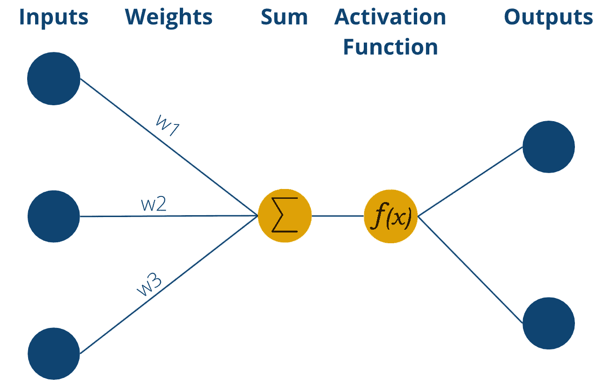
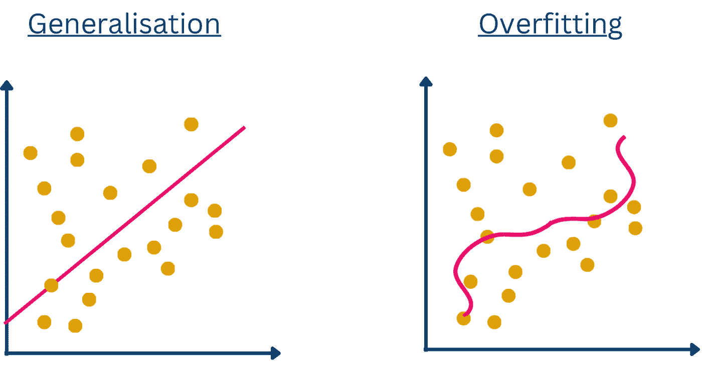

# 揭开 dropout 层的面纱：提升神经网络的必备工具

> 原文：[`towardsdatascience.com/unveiling-the-dropout-layer-an-essential-tool-for-enhancing-neural-networks-e090b726561e`](https://towardsdatascience.com/unveiling-the-dropout-layer-an-essential-tool-for-enhancing-neural-networks-e090b726561e)

## 理解 dropout 层：通过 dropout 正则化提高神经网络训练效果并减少过拟合

 [Niklas Lang](https://medium.com/@niklas_lang?source=post_page-----e090b726561e--------------------------------)

·发布于[Towards Data Science](https://towardsdatascience.com/?source=post_page-----e090b726561e--------------------------------) ·阅读时间 7 分钟·2023 年 5 月 19 日

--

照片由[马丁·桑切斯](https://unsplash.com/@martinsanchez?utm_source=medium&utm_medium=referral)拍摄，发布在[Unsplash](https://unsplash.com/?utm_source=medium&utm_medium=referral)

dropout 层是构建[神经网络](https://databasecamp.de/en/ml/artificial-neural-networks)时用于防止[过拟合](https://databasecamp.de/en/ml/overfitting-en)的一层。在这个过程中，使用一定的概率在不同的训练运行中排除个别节点，仿佛它们根本不属于网络结构。

但是，在深入了解这一层的细节之前，我们应首先了解神经网络是如何工作的以及为何会发生[过拟合](https://databasecamp.de/en/ml/overfitting-en)。

# 快速回顾：感知机是如何工作的？

感知机是一个受到人脑结构启发的数学模型。它由一个接收具有不同权重的数值输入的单一神经元组成。输入值与其权重相乘后加总，结果通过激活函数处理。在最简单的形式中，感知机基于激活函数产生二进制输出，如“是”或“否”。常用的激活函数是 sigmoid 函数，它将加权和映射到 0 和 1 之间的值。如果加权和超过某个阈值，输出将从 0 转变为 1。

感知机的基本结构 | 来源：作者

欲深入了解感知机的概念，欢迎参阅这篇文章：

## 揭开感知机的力量：深度学习的构建块

### 探索人工神经网络的基础及其实际应用

towardsdatascience.com

# 快速回顾：什么是过拟合？

[过拟合](https://databasecamp.de/en/ml/overfitting-en)发生在预测模型对训练数据过于特定时，学习了数据中的模式和噪声。这会导致对新数据的泛化能力差和预测不准确。深度神经网络特别容易过拟合，因为它们可以学习训练数据的统计噪声。然而，放弃复杂架构并不可取，因为它们能够学习复杂的关系。引入丢弃层有助于解决过拟合问题，通过提供平衡模型复杂性和泛化能力的解决方案。

泛化与过拟合的区别 | 来源: 作者

有关过拟合的更详细文章，请参考我们的相关文章：

[## 过拟合是什么？ | 数据库营

### 过拟合是数据科学领域的术语，描述了模型对数据过度适应的特性……

[databasecamp.de](https://databasecamp.de/en/ml/overfitting-en?source=post_page-----e090b726561e--------------------------------)

# 丢弃层是如何工作的？

使用丢弃法，某些节点在训练运行中被设置为零，即从网络中移除。因此，它们对预测没有影响，并且在[反向传播](https://databasecamp.de/en/ml/backpropagation-basics)中也是如此。因此，每次运行中都会构建一个新的、略微修改的网络架构，网络学会在没有某些输入的情况下产生良好的预测。

在安装丢弃层时，还必须指定一个所谓的丢弃概率。这决定了层中多少节点将被设置为 0。如果我们有一个包含十个输入值的输入层，10%的丢弃概率意味着在每次训练中，一个随机输入将被设置为零。如果是隐藏层，则对隐藏节点应用相同的逻辑。因此，10%的丢弃概率意味着每次运行中 10%的节点将不会被使用。

最佳的概率也在很大程度上取决于层的类型。正如各种论文所发现的，对于输入层，接近 1 的丢弃概率是最佳的。而对于隐藏层，接近 50%的概率会产生更好的结果。

# 为什么丢弃层能防止过拟合？

在深度神经网络中，过拟合通常发生在不同层的某些神经元互相影响时。简单来说，这导致例如某些神经元纠正前一节点的错误，从而彼此依赖，或者只是传递前一层的好结果而没有重大变化。这会导致相对较差的泛化能力。

另一方面，通过使用 dropout 层，神经元不能再依赖于来自前一层或后一层的节点，因为它们无法假设这些节点在特定的训练过程中存在。这导致神经元实际上识别数据中更基本的结构，这些结构不依赖于个别神经元的存在。这些依赖关系在常规神经网络中实际上发生得相对频繁，因为这是快速减少损失函数并迅速接近模型目标的一种简单方法。

如前所述，dropout 也会稍微改变网络的架构。因此，训练出的模型是许多稍微不同模型的组合。我们已经从集成学习中熟悉这种方法，比如在[随机森林](https://databasecamp.de/en/ml/random-forests)中。这表明，许多相对相似的模型的集成通常比单个模型给出更好的结果。这种现象被称为“群体智慧”。

# 如何将 Dropout 构建到现有网络中？

实际上，dropout 层通常在全连接层之后使用，因为全连接层具有相对较多的参数，且所谓的“共适应性”，即神经元之间的依赖性，非常高。然而，从理论上讲，dropout 层也可以插入在任何层之后，但这可能导致更差的结果。

实际上，dropout 层只是插入在期望的层之后，然后使用前一层的神经元作为输入。根据概率值，这些神经元中的一些会被设置为零，然后传递到后续层。

在较大的神经网络中使用 dropout 层特别有用。这是因为具有许多层的架构比较小的网络更容易过拟合。当添加 dropout 层时，增加节点的数量也很重要。作为经验法则，节点的数量在引入 dropout 之前应除以 dropout 率。

# 推理过程中 dropout 会发生什么？

正如我们现在已经确定的那样，在训练过程中使用 dropout 层是避免过拟合的一个重要因素。然而，问题仍然是这个系统是否也在模型训练完成后用于对新数据进行预测时使用。

实际上，训练后 dropout 层将不再用于预测。这意味着所有神经元都将用于最终预测。然而，模型现在拥有比训练期间更多的神经元。因此，输出层的权重显著高于训练期间学到的权重。因此，权重会按照 dropout 率进行缩放，以确保模型仍能做出良好的预测。

# 如何在 Python 中使用 dropout 层？

对于 [Python](https://databasecamp.de/en/python-coding)，已经有许多预定义的实现，你可以使用这些实现来应用 dropout 层。最著名的可能是 Keras 或 [TensorFlow](https://databasecamp.de/en/python-coding/tensorflow-en)。你可以通过“tf.keras.layers”导入这些层类型：

然后，你需要传递参数，即一方面是输入向量的大小和 dropout 概率，选择这些参数时应考虑层的类型和网络结构。然后，可以通过在变量“data”中传递实际值来使用该层。还有一个参数“training”，它指定 dropout 层是否仅在训练中使用，而不在新值的预测，即推断中使用。

如果参数未被明确设置，dropout 层将仅在“model.fit()”即训练中处于活动状态，而在“model.predict()”即预测新值时不活动。

# 你应该记住的要点

+   Dropout 是一种神经网络层，它以定义的概率将神经元设置为零，即在训练运行中忽略它们。

+   通过这种方式，可以减少深度神经网络中的过拟合风险，因为神经元不会在彼此之间形成所谓的适应，而是识别数据中的更深层次结构。

+   Dropout 层可以用于输入层以及隐藏层。然而，研究表明，不同的 dropout 概率应根据层的类型来使用。

+   然而，一旦训练完成，dropout 层将不再用于预测。然而，为了使模型继续产生良好的结果，权重会根据 dropout 率进行缩放。

*如果你喜欢我的工作，请* [*点击这里*](https://medium.com/subscribe/@niklas_lang) *订阅*，*或者查看我的网站* [*Data Basecamp*](http://www.databasecamp.de/en/homepage)*！此外，Medium 允许你每月免费阅读* ***3 篇文章*** *。如果你希望* ***无限*** *访问我的文章和数千篇优秀文章，请点击我的推荐链接，会员费用为每月 $****5*** *：* [`medium.com/@niklas_lang/membership`](https://medium.com/@niklas_lang/membership)

 ## 解开反向传播的神秘面纱：全面指南

### 理解反向传播算法在训练神经网络中的内部工作机制。

[towardsdatascience.com  ## 从向量到张量：探索张量代数的数学原理

### 《张量在机器学习及其应用中的使用》

[towardsdatascience.com  ## 机器学习中交叉验证的重要性

### 解释为什么机器学习需要交叉验证以及如何在 Python 中实现。

[towardsdatascience.com
