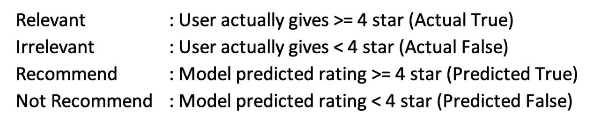
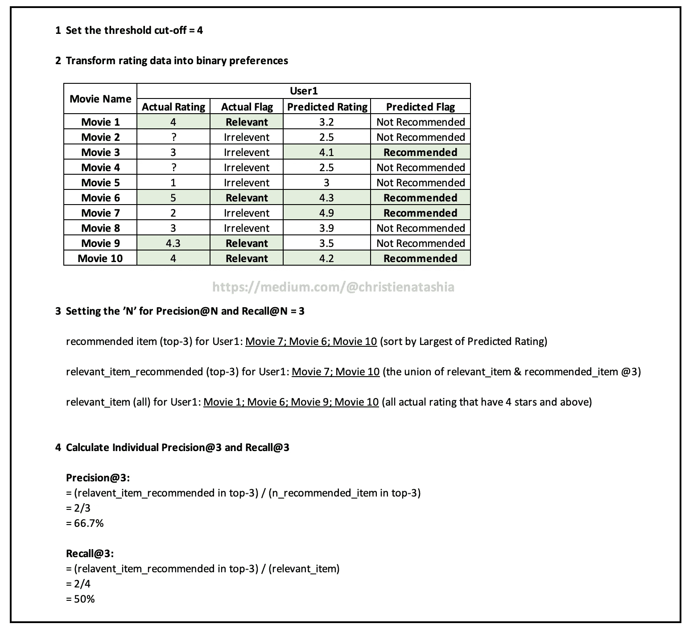
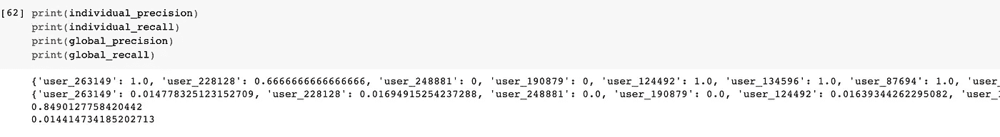

# 揭示推荐系统中的精确度@N 和召回率@N

> 原文：[`towardsdatascience.com/unveiling-the-precision-n-and-recall-n-in-recommender-system-7a4c6b69d060`](https://towardsdatascience.com/unveiling-the-precision-n-and-recall-n-in-recommender-system-7a4c6b69d060)

## 优化推荐系统：精确度和召回率使用案例的深入解读

 [Christie Natashia](https://medium.com/@christienatashia?source=post_page-----7a4c6b69d060--------------------------------)

·发表于[Towards Data Science](https://towardsdatascience.com/?source=post_page-----7a4c6b69d060--------------------------------) ·阅读时间 7 分钟·2023 年 6 月 29 日

--

图片由[诺伯特·布劳恩](https://unsplash.com/@medion4you?utm_source=medium&utm_medium=referral)提供，来源于[Unsplash](https://unsplash.com/?utm_source=medium&utm_medium=referral)

**讨论的主要话题是：**

1.  精确度和召回率概述

1.  将精确度和召回率定义适配于推荐系统使用案例

+   二进制偏好转换的需求

+   实际召回率的问题

+   实际召回率的解决方案：Top-N 项目

+   一个说明性实现

+   代码实现

# **介绍**

准确度指标是评估机器学习整体表现的有用指标，它代表数据集中正确分类实例的比例。准确度指标结合精确度和召回率等评估指标，用于更全面地理解模型的表现。

一般来说，精确度和召回率将预测的类别与测试集的实际类别进行比较，并计算正确预测与总预测数量的比例。

# 分类问题中的精确度和召回率

在监督分类问题中，目标值（y 值）必须是二进制的（尽管分类问题不限于多二进制值）。*例如，良性或恶性，好或坏，垃圾邮件或非垃圾邮件。* 这些二进制值允许应用精确度和召回率来衡量模型对预测值的分类正确性。

精确度衡量所有被预测为正的实例中正确预测的正实例（真正例）的比例

召回率衡量的是在数据集中所有实际正实例中，正确预测的正实例（真正例）的比例。

> 精确度和召回率提供了对模型性能的互补见解。精确度关注的是正预测的准确性，而召回率则关注模型找到所有正实例的能力。

# 将精确度和召回率定义适配到推荐使用案例

在构建推荐模型时，我们期望模型能够提供准确的项目推荐。分类准确率指标通过量化正确预测的实例占数据集中所有实例的百分比来衡量模型的性能。然而，在推荐系统的背景下，目标值通常由评分尺度表示，例如电影的 1-5 星评分。

因此，为了使精确度和召回率在推荐任务中适当地使用，有必要将评分尺度转换为二进制偏好。这通常通过将评分尺度转化为“相关”与“无关”项目的区分来实现。

## 二进制偏好转换的必要性

在这一阶段，确定一个明确的截止点非常重要。为此，我们假设任何评分高于 4 的项被认为是相关项，而评分低于 4 的项被认为是无关项（4 的截止值只是我选择的阈值，这个值可以根据每个使用案例的要求有所不同）。

在这一点上，这张插图可以帮助全面理解为何将偏好转换为二进制形式能够使推荐系统中的准确性指标如精确度和召回率变得可行。

作者插图

## **召回率不切实际的问题**

然而，根据这篇[文章](https://grouplens.org/site-content/uploads/evaluating-TOIS-20041.pdf) [1]，

> **召回率在推荐系统中几乎总是难以测量。按纯粹的意义上讲，测量召回率需要知道每个项目是否相关；对于电影推荐系统，这将涉及要求许多用户观看所有 5000 部电影（在电影数据库中），以测量我们成功推荐每部电影给每位用户的程度——** Herlocker 等（2004）

为了简化上述陈述，例如，电影平台如 Netflix 不可能要求所有用户观看 5000 部电影来衡量推荐电影的准确性。由于每个用户评分的项目数量与数据集中项目的总数之间的巨大差异，召回率往往相对较低。

因此，上述**问题的解决方案**应集中于向用户推荐前 5 名/前 10 名的电影列表。考虑到向每个用户推荐数据库中所有可用电影既不现实也不可行。

## **不切实际的召回解决方案**: **Top-N 项目**

在这里，Top-N 项目可以是一个适当的方式来**利用**精度和召回率指标进行推荐系统评估。它应预测**用户评分的前 N 项**。其中 N 是与前 N 推荐目标对应的整数。

这可以通过将数据集分为训练集和测试集来完成。训练集用于训练算法，然后在下一步中，测试集将用于预测前 N 项。为此，采用**precision@N**和**recall@N**指标。这种方法能够更相关和准确地评估系统在向用户推荐最相关项方面的表现。

> **Precision@N**: 前 N 个推荐项中有多少对用户是相关的。精度 80%@10 表示模型提供了 10 个推荐电影，但只有 8 个实际上符合用户偏好

`**Precision = (top-N 中推荐的相关项数量) / (推荐项总数)**`

> **Recall@K**: 数据集中相关项中有多少被系统推荐的前 N 项包含。召回率 60%@10 表示相关项的总数中有 60% 出现在前 N 个结果中。

`**Recall = (top-N 中推荐的相关项数量) / (相关项总数)**`

到此阶段，希望你理解了相关性和推荐定义（假设 4 星为分界线）

图片由作者提供

# 一个示例实现

如上所述，这里是需要的步骤：

+   设置阈值（*如果 4 星被设定为分界线，则任何高于 4 的评分被视为相关项，任何低于 4 的评分被视为不相关项，推荐/不推荐也适用相同标准*）

+   将评分数据转换为二进制偏好

+   为 Precision@N 和 Recall@N 设置 ’N’

+   计算单个 Precision@N 和 Recall@N

图片由作者提供

# 代码实现

如果你希望从零开始构建一个推荐系统，可以参考我之前的写作，你可以了解推荐系统背后的数学概念。然而，如果你对推荐任务已有充分了解，可以跳过这一部分。

 ## 使用矩阵分解的推荐系统

### 矩阵分解背后的概念及其在 Python 中的实际实现

towardsdatascience.com

回到 daaa 代码！！

这里是计算 Precision@N 和 Recall@N 的 Python 代码片段。此外，你可以访问整个笔记本 [这里](https://github.com/christienatashiaarchie/Precision-N-and-Recall-N-Recommender-System/blob/main/Precision_and_Recall_of_Recomender_Systems_Final.ipynb)。

输出结果如下：

输出片段

再次强调，由于**模型推荐的相关项**与**每个用户评分的项数**之间的巨大差异，这里的召回率值可能相对较低（尽管我们可以使用一个数据集，其中用户给出了相当多的评分，以应对接近 0 的较低召回率）。

此外，我想强调一个关于推荐系统中**召回率**的**重要****注意事项**，这也是 Herlocker 等人（2004 年）[1] 研究结果所支持的，如下所示：

> recall@N 指标应仅在相同数据集上进行比较使用；不应将其解读为绝对度量

# 摘要

以上总结了我对 Precision@N 和 Recall@N 的全面解释。除此之外，我还在参考文献部分提供了一些对我的研究有显著贡献的有价值的论文和文章。

# 参考文献

[1] J.L. Herlocker, J.A. Konstan, L.G. Terveen, J.T. Riedl, 评估协同过滤推荐系统，ACM Trans Inform Syst, 22 (1) (2004), 第 5-53 页。可在此访问: [`grouplens.org/site-content/uploads/evaluating-TOIS-20041.pdf`](https://grouplens.org/site-content/uploads/evaluating-TOIS-20041.pdf)

 ## 基于矩阵分解的推荐系统

### 矩阵分解背后的概念及其在 Python 中的实际应用

towardsdatascience.com  [## Precision-N-and-Recall-N-Recommender-System/Precision_and_Recall_of_Recomender_Systems_Final.ipynb…

### 推荐系统中的 Precision@N 和 Recall@N。贡献于……

github.com](https://github.com/christienatashiaarchie/Precision-N-and-Recall-N-Recommender-System/blob/main/Precision_and_Recall_of_Recomender_Systems_Final.ipynb?source=post_page-----7a4c6b69d060--------------------------------) [## FAQ - Surprise 1 文档

### 在这里你会找到常见问题解答，以及一些其他的用例示例，这些示例不属于……

[surprise.readthedocs.io](https://surprise.readthedocs.io/en/latest/FAQ.html?source=post_page-----7a4c6b69d060--------------------------------#how-to-compute-precision-k-and-recall-k)  [## 推荐系统中的召回率和精准率

### 详细说明与示例

[medium.com](https://medium.com/@m_n_malaeb/recall-and-precision-at-k-for-recommender-systems-618483226c54?source=post_page-----7a4c6b69d060--------------------------------)
