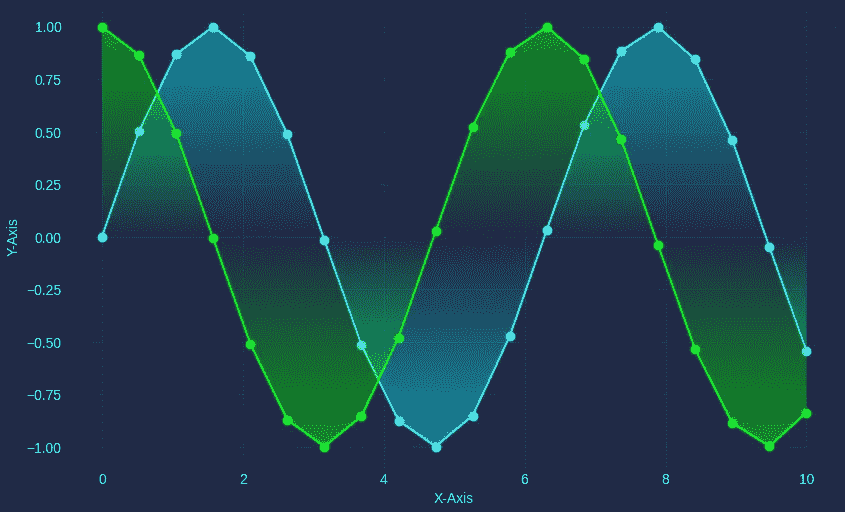

# 升级您的数据可视化：4 个 Python 库，增强您的 Matplotlib 图表

> 原文：[`towardsdatascience.com/upgrade-your-data-visualisations-4-python-libraries-to-enhance-your-matplotlib-charts-74361bc3b92e?source=collection_archive---------1-----------------------#2023-04-11`](https://towardsdatascience.com/upgrade-your-data-visualisations-4-python-libraries-to-enhance-your-matplotlib-charts-74361bc3b92e?source=collection_archive---------1-----------------------#2023-04-11)

## 用这些易于使用的 Matplotlib 风格库提升您的数据可视化

 [Andy McDonald](https://andymcdonaldgeo.medium.com/?source=post_page-----74361bc3b92e--------------------------------)

·

[关注](https://medium.com/m/signin?actionUrl=https%3A%2F%2Fmedium.com%2F_%2Fsubscribe%2Fuser%2F9c280f85f15c&operation=register&redirect=https%3A%2F%2Ftowardsdatascience.com%2Fupgrade-your-data-visualisations-4-python-libraries-to-enhance-your-matplotlib-charts-74361bc3b92e&user=Andy+McDonald&userId=9c280f85f15c&source=post_page-9c280f85f15c----74361bc3b92e---------------------post_header-----------) 发表在 [Towards Data Science](https://towardsdatascience.com/?source=post_page-----74361bc3b92e--------------------------------) ·10 分钟读完·2023 年 4 月 11 日

--

示例线图，使用赛博朋克主题生成渐变填充。作者提供的图片。

[**Matplotlib**](https://matplotlib.org/)是一个广泛使用的数据可视化 Python 库，通常在数据科学和 Python 学习过程中早期接触。然而，多年来，它因创建外观平淡的图形而声名鹊起，并且使用起来可能会很尴尬，尤其是对新手来说。

在我最近几篇文章中，我展示了如何将[**matplotlib**](https://matplotlib.org/)创建的基本图表转变为[**更引人注目且更具美感的图表**](https://medium.com/p/421ab8cdd36f)。这包括通过编写几行额外代码来扩展绘图代码，或者仅仅添加几行代码。

在这篇文章中，我将与您分享四个 matplotlib 主题库，这些库可以轻松地让你的 matplotlib 图形从乏味变得有趣。每个主题只需两行代码——一行导入语句和一行 matplotlib 的使用语句。

尽管这些库非常适合创建时尚的图表，但你需要了解你的目标观众以及他们可能遇到的不同视觉问题，包括色盲。
