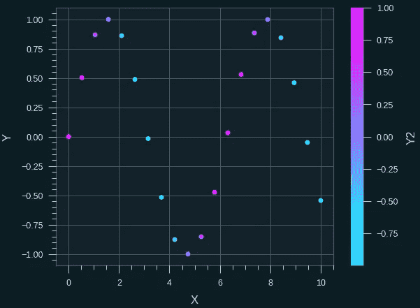

# 提升您的数据可视化：4 个 Python 库以增强您的 Matplotlib 图表

> 原文：[`towardsdatascience.com/upgrade-your-data-visualisations-4-python-libraries-to-enhance-your-matplotlib-charts-74361bc3b92e`](https://towardsdatascience.com/upgrade-your-data-visualisations-4-python-libraries-to-enhance-your-matplotlib-charts-74361bc3b92e)

## 使用这些易于使用的 Matplotlib 风格库改善您的数据可视化

[](https://andymcdonaldgeo.medium.com/?source=post_page-----74361bc3b92e--------------------------------)[](https://towardsdatascience.com/?source=post_page-----74361bc3b92e--------------------------------) [Andy McDonald](https://andymcdonaldgeo.medium.com/?source=post_page-----74361bc3b92e--------------------------------)

·发表于 [Towards Data Science](https://towardsdatascience.com/?source=post_page-----74361bc3b92e--------------------------------) ·阅读时间 10 分钟·2023 年 4 月 11 日

--


示例折线图，带有渐变填充，由 CyberPunk matplotlib 主题生成。图片由作者提供。

[**Matplotlib**](https://matplotlib.org/) 是一个广泛使用的数据可视化 Python 库，通常在数据科学和 Python 学习的早期阶段就会遇到。然而，多年来，它因制作外观简单的图形而声名狼藉，而且使用起来可能会很尴尬，尤其是对于新手。

在我之前的几篇文章中，我展示了如何将 [**matplotlib**](https://matplotlib.org/) 创建的基本图表变成 [**更具吸引力和美观**](https://medium.com/p/421ab8cdd36f)。这从扩展绘图代码到仅添加几行代码不等。

在这篇文章中，我将与您分享四个 matplotlib 主题库，它们可以轻松地将您的 matplotlib 图形从乏味变得有趣。每个主题只需使用两行代码即可应用——一行导入语句和一行 matplotlib 使用语句。

尽管这些库非常适合创建时尚的图表，但您需要注意您的目标受众和人们可能存在的不同视觉问题，包括色盲。

让我们开始吧！

# 创建虚拟数据

在我们开始使用 matplotlib 样式之前，我们首先需要创建一些虚拟数据，以便我们有东西可以展示。

可以这样轻松完成：

```py
import numpy as np

# Generate x values
x = np.linspace(0, 10, 20)

# Generate y values
y = np.sin(x)
y2 = np.cos(x)
```

# CyberPunk 风格与 mplcyberpunk

Cyberpunk 是一种流行的科幻子流派，以其反乌托邦、技术先进的世界和反主流的态度而闻名。场景通常以未来主义风格描绘，具有霓虹灯和鲜艳的颜色。


图像由作者使用 Midjourney 生成。（一个繁忙的反乌托邦赛博朋克风格的未来城市街道，特色是有很多街头摊贩的地方。商店和区域周围有明亮的霓虹灯。阴雨和黑暗的氛围。逼真。— ar 3:2）

有时在制作海报或信息图时，你需要额外的亮点来吸引读者。这是我觉得 CyberPunk 风格发挥作用的时候。然而，你需要意识到，当为出版物制作图表时，它可能不会被视为专业，而且可能不适合有色盲问题的读者。

我们可以轻松地将这种样式应用到我们的图表中，使用[**CyberPunk 主题**](https://github.com/dhaitz/mplcyberpunk)。


一个 CyberPunk 风格的 Matplotlib 图例。图像由 dhaitz 提供，来自 CyberPunk Readme。

要开始使用这个主题，我们可以这样安装：

```py
pip install mplcyberpunk
```

要使用 CyberPunk 主题，我们只需调用`plt.style.use()`并传入参数`cypberpunk`。

为了让我们的点发光，我们需要调用`make_scatter_glow()`函数。这似乎是在每次调用`plt.scatter()`后都需要的。

```py
import mplcyberpunk

plt.style.use('cyberpunk')
plt.figure(figsize = (8,8))

plt.scatter(x, y, marker = 'o')
mplcyberpunk.make_scatter_glow()

plt.scatter(x, y2, marker = 'o', c='lime')
mplcyberpunk.make_scatter_glow()

plt.xlabel('X-Axis')
plt.ylabel('Y-Axis')

plt.show()
```

当我们运行上述代码时，我们得到以下图表。


应用 CyberPunk 主题后的散点图。图像由作者提供。

我们也可以将 CyberPunk 主题应用于折线图。为了让线条发光，我们可以调用`mplcyberpunk.make_lines_glow()`。

```py
plt.style.use('cyberpunk')
plt.figure(figsize = (8,8))

plt.plot(x, y, marker = 'o')
plt.plot(x, y2, marker = 'o', c='lime')

mplcyberpunk.make_lines_glow()

plt.xlabel('X-Axis')
plt.ylabel('Y-Axis')

plt.show()
```

运行时，返回的图表将显示类似霓虹灯的线条。


应用 CyberPunk 主题后的 Matplotlib 图表。图像由作者提供。

我们可以将上面的图表更进一步，加入线条与零点之间的渐变填充。

```py
plt.style.use('cyberpunk')
plt.figure(figsize = (8,8))

plt.plot(x, y, marker = 'o')
plt.plot(x, y2, marker = 'o', c='lime')

mplcyberpunk.add_gradient_fill(alpha_gradientglow=0.5, gradient_start='zero')

plt.xlabel('X-Axis')
plt.ylabel('Y-Axis')

plt.show()
```

这会产生一个非常有趣的效果，如下所示。


应用 CyberPunk 主题后的 Matplotlib 图表，带有发光渐变填充。图像由作者提供。

CypberPunk 库还有几个其他选项，值得查看其[仓库](https://github.com/dhaitz/mplcyberpunk?source=post_page-----74361bc3b92e--------------------------------)。

[](https://github.com/dhaitz/mplcyberpunk?source=post_page-----74361bc3b92e--------------------------------) [## GitHub - dhaitz/mplcyberpunk: "Cyberpunk style" for matplotlib plots

### 在 matplotlib 基础上创建'cyberpunk'风格图表的 Python 包，只需额外增加 3 行代码。之后…

[github.com](https://github.com/dhaitz/mplcyberpunk?source=post_page-----74361bc3b92e--------------------------------)

# Matplotx

[**matplotx 库**](https://github.com/nschloe/matplotx) 提供了一种立即为 matplotlib 图形添加样式的简便方法。该库包含多个主题，可以轻松访问并应用于任何 matplotlib 图形。

在黑暗主题的 Jupyter Notebook 或 VSCode 中工作时，明亮的白色图形可能会令人感到刺眼。

为了减少这种影响，我们可以使图形采用黑暗主题。然而，这确实需要几行代码来正确设置样式。

Matplotx 使这个过程变得更容易，如下所示。由于它包含多个主题，我可以轻松找到一个与我的 VSCode 主题匹配的。

可以通过打开终端/命令提示符并运行以下命令将 Matplotx 安装到 Python 环境中。

```py
pip install matplotx
```

安装库后，我们可以简单地使用 with 语句调用 `plt.style.context` 并传入 `matplotx.styles`。从这里，我们可以选择许多可用的主题之一。

在这个例子中，我选择了非常流行的 Dracula 主题

```py
 import matplotx

with plt.style.context(matplotx.styles.dracula):
  plt.scatter(x, y, c=y2)

  plt.colorbar(label='Y2')
  plt.xlabel('X')
  plt.ylabel('Y')
  plt.show()
```

运行后，我们会得到以下结果


应用 matplotx 的 dracula 主题后的散点图。图像由作者提供。

matplotx 中有很多不同的样式：


来自 matplotx 的一些可用样式。图像来自 matplotx GitHub 仓库

让我们查看使用 Pitaya Smoothie 主题的折线图。

由于有多个子主题，我们需要使用方括号访问它们。在这个例子中，我们有一个黑暗主题，因此我们需要传入 `dark` 来访问它。

```py
import matplotlib.pyplot as plt
import matplotx

with plt.style.context(matplotx.styles.pitaya_smoothie['dark']):
  plt.plot(x, y, marker='o')
  plt.plot(x, y2, marker='o')

  plt.xlabel('X')
  plt.ylabel('Y')
  plt.show()
```

当我们运行上述代码时，我们会在所选主题中得到以下折线图。


应用 Pitaya Smoothie 黑暗主题后的 Matplotlib 折线图。图像由作者提供

还有许多浅色主题。例如，Pitaya Smoothie 具有一个，可以通过如下方式访问：

```py
with plt.style.context(matplotx.styles.pitaya_smoothie['light']):
```


应用 Pitaya Smoothie 浅色主题后的 Matplotlib 折线图。图像由作者提供

如果你想了解更多关于这个库的信息，可以查看我之前的文章：

[](/from-dull-to-stunning-how-matplotx-can-improve-your-matplotlib-charts-f370cbf7acc?source=post_page-----74361bc3b92e--------------------------------) ## 从乏味到惊艳：Matplotx 如何改善你的 Matplotlib 图表

### 简化使用 Matplotx 创建惊艳图表的过程

towardsdatascience.com

或者，如果你想获取主题并亲自尝试，可以查看下面的链接：

[](https://github.com/nschloe/matplotx?source=post_page-----74361bc3b92e--------------------------------) [## GitHub - nschloe/matplotx: 更多样式和有用的 Matplotlib 扩展

### 一些有用的 Matplotlib 扩展。这个包包括一些有用或美观的 Matplotlib 扩展。大多数…

github.com](https://github.com/nschloe/matplotx?source=post_page-----74361bc3b92e--------------------------------)

# Quantum Black Styles

QuantumBlack Labs 是一家成立于 2012 年的公司，帮助其他公司利用数据做出更好的决策。他们使用先进的技术，如机器学习和人工智能，来分析跨医疗保健、金融和交通等多个行业的复杂数据集。

几年前，他们在[**GitHub**](https://github.com/quantumblacklabs/qbstyles)上发布了自己的样式


应用 Quantum Black Labs 样式库到 matplotlib 图形的示例。图片由 Quantum Black Labs 创建。

要使用该主题，我们可以这样安装样式库：

```py
pip install qbstyles
```

安装后，我们需要添加以下代码来导入它。

```py
from qbstyles import mpl_style
```

如果你在 Jupyter Notebook 中工作，你需要在上述代码和下面的代码之间使用不同的单元格。

如果我们想使用深色主题，可以调用以下内容：

```py
mpl_style(dark=True)
```

或者，如果我们想使用浅色主题：

```py
mpl_style(dark=False)
```

然后我们可以开始编写创建散点图的代码

```py
plt.scatter(x, y, c=y2)

plt.colorbar(label='Y2')
plt.xlabel('X')
plt.ylabel('Y')
plt.show()
```

根据你选择的是浅色还是深色主题，我们将得到以下其中一个图表。



应用 Quantum Black Labs 主题后的 Matplotlib 散点图（左侧为浅色模式，右侧为深色模式）。图片由作者提供

让我们看看深色主题在折线图上的效果。

```py
mpl_style(dark=True)

plt.plot(x, y, marker='o')
plt.plot(x, y2, marker='o')

plt.xlabel('X')
plt.ylabel('Y')
plt.show()
```

当我们运行上述代码时，会得到以下图表。


应用 Quantum Labs Dark 主题后的 Matplotlib 折线图。图片由作者提供。

使用这个库来美化图表，虽然比 Matplotx 生成的图表稍显低调，但确实使它们感觉更专业，特别是浅色风格的图表。我完全不犹豫地将这些图表纳入专业演示或培训材料中。

你可以查看下面的链接来了解主题：

[](https://github.com/quantumblacklabs/qbstyles?source=post_page-----74361bc3b92e--------------------------------) [## GitHub - quantumblacklabs/qbstyles: QuantumBlack Matplotlib styles

### QB Styles 是一个 Python 包，包含浅色和深色的 matplotlib 样式。暗色样式 浅色样式 qbstyles 是一个 Python…

github.com](https://github.com/quantumblacklabs/qbstyles?source=post_page-----74361bc3b92e--------------------------------)

# Science Plots

在撰写科学期刊或会议文章时，创建清晰、简单、易于解释的图形是至关重要的。某些期刊，如《自然》，要求使用特定的样式，而在其他情况下，有一个统一的样式可以防止出现难以解释的图形。

这就是**SciencePlots 库**发挥作用的地方。

它用于生成使用常见科学期刊样式的图表，使得创建图形变得更加容易。

这个库的一个优点是它使图形适合以黑白打印——这在研究人员中仍然是常见的做法。这将使得通过改变线条样式或确保在散点图中使用不同的形状来区分类别数据的线条变得容易。

如果你想探索更多[SciencePlots](https://github.com/garrettj403/SciencePlots)中提供的样式，我建议你查看库的 GitHub 页面上的 Wiki 页面：

[画廊](https://github.com/garrettj403/SciencePlots/wiki/Gallery?source=post_page-----74361bc3b92e--------------------------------)

### 你现在无法执行该操作。你已经在另一个标签页或窗口中登录。你在另一个标签页或…

[GitHub 页面](https://github.com/garrettj403/SciencePlots/wiki/Gallery?source=post_page-----74361bc3b92e--------------------------------)

运行 SciencePlots 样式库需要在计算机上安装 LaTeX。你可以在[**这里**](https://www.latex-project.org/get/)找到有关 LaTeX 和如何安装的更多详细信息。

如果在 Google Colab 上运行，你可以在一个单元格中运行以下代码来安装 LaTeX。

```py
!sudo apt-get install dvipng texlive-latex-extra texlive-fonts-recommended texlive-latex-recommended cm-super
!pip install SciencePlots
```

一旦设置好库和 LaTeX，你可以使用以下代码创建你的第一个科学图表。

```py
import scienceplots

with plt.style.context(['science', 'high-vis']):
    plt.figure(figsize = (6,6))
    plt.plot(x, y, marker='o', label='Line 1')
    plt.plot(x, y2, marker='o', label='Line 2')

    plt.xlabel('X')
    plt.ylabel('Y')
    plt.legend()
    plt.show()
```

当我们运行上述代码时，我们得到如下图表，适合包含在期刊出版物中。它简单且易于区分不同的线条。


应用 SciencePlots 主题到线性图上，提供高可见度，适合包含在科学期刊中。图片由作者提供。

让我们看看 IEEE 风格是什么样的。我们可以通过修改以下代码来创建一个。

```py
with plt.style.context(['science', 'ieee']):
```

与上面略有不同，颜色也有所改变，但仍然是一个非常漂亮的科学期刊图表。


应用 IEEE 样式的 SciencePlots 主题到线性图上。图片由作者提供。

多年来，我为会议和期刊撰写了大量技术论文。这些论文中包含了很多图表，这些图表通常是在 Excel 中创建的，或者用几行 Python 绘图代码生成的。这可能很耗时，尤其是在调整尺寸、颜色和线条样式时。

未来，在我所有的论文中，我将以 SciencePlots 主题作为起点。

如果你有兴趣尝试，你可以从以下链接获取 SciencePlots 主题：

[GitHub - garrettj403/SciencePlots: Matplotlib 科学绘图样式](https://github.com/garrettj403/SciencePlots?source=post_page-----74361bc3b92e--------------------------------)

### 警告：从版本 2.0.0 开始，你需要在设置样式之前添加`import scienceplots`（…

[github.com](https://github.com/garrettj403/SciencePlots?source=post_page-----74361bc3b92e--------------------------------)

# 摘要

在本文中，我们介绍了四个非常有用的 matplotlib python 库，这些库可以将您的无聊的 matplotlib 图形提升到一个新的水平。每个库都为您的图表提供了独特的样式。

尽管这些风格提供了很好的创意可视化，但您需要考虑您的受众，尤其是那些有色盲和其他眼部问题的人群。

请记住，创建出色的数据可视化的关键在于使您的信息易于理解，并以最佳方式讲述您的故事。

但是，有时候，玩弄数据并全力以赴地使用赛博朋克主题也是不错的选择。

*感谢阅读。在离开之前，您一定要订阅我的内容，并将我的文章发送到您的收件箱。* [***您可以在这里进行订阅！***](https://andymcdonaldgeo.medium.com/subscribe)*或者，您可以* [***注册我的新闻通讯***](https://fabulous-founder-2965.ck.page/2ca286e572) *以免费获得额外的内容，直接发送到您的收件箱。*

*其次，通过注册会员，您可以获得完整的 Medium 体验，并支持其他成千上万的作家和我。每月仅需 $5，您可以完全访问所有精彩的 Medium 文章，并且有机会通过您的写作赚取收入。*

*如果您使用* [***我的链接***](https://andymcdonaldgeo.medium.com/membership)***，*** *您将直接支持我，并且费用不会增加。如果您这样做，非常感谢您的支持。*
