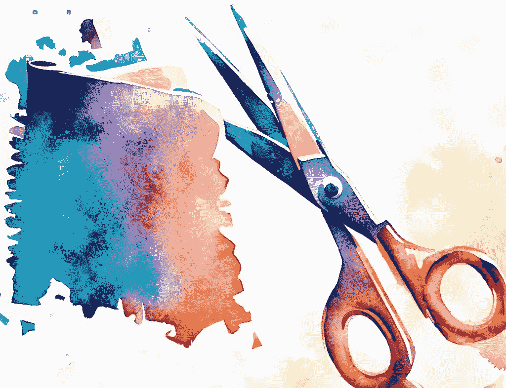
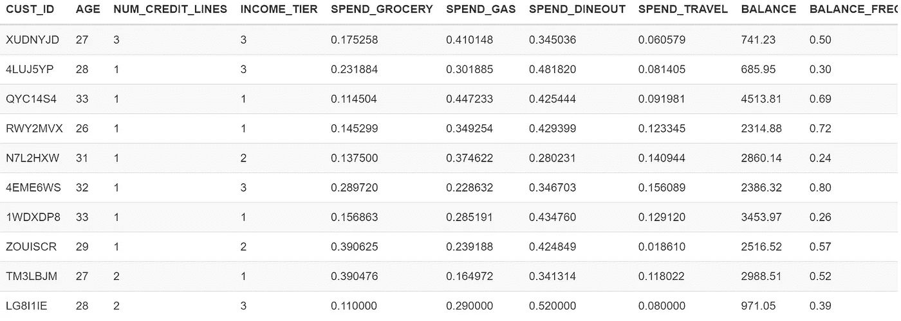

# 提升建模 — 数据科学家优化信用卡续卡活动指南

> 原文：[`towardsdatascience.com/uplift-modeling-a-data-scientists-guide-to-optimizing-a-credit-card-renewal-campaign-9f02f863067a`](https://towardsdatascience.com/uplift-modeling-a-data-scientists-guide-to-optimizing-a-credit-card-renewal-campaign-9f02f863067a)

## 应用因果机器学习来缩减活动目标受众 — 第一部分/2

 [Abhijeet Talaulikar](https://abhijeetstalaulikar.medium.com/?source=post_page-----9f02f863067a--------------------------------)

·发表于 [Towards Data Science](https://towardsdatascience.com/?source=post_page-----9f02f863067a--------------------------------) ·阅读时间 9 分钟·2023 年 7 月 13 日

--

由作者使用 Bing Image Creator 生成

**第一部分：** 缩减信用卡续卡活动的目标受众

**第二部分：** [在信用卡返现活动中识别最佳客户旅程](https://pub.towardsai.net/discrete-time-markov-chains-identifying-winning-customer-journeys-in-a-cashback-campaign-39b62eb8a6fe)

作为一个新兴的数据科学家，我的学术背景教会我将准确性视为成功项目的标志。而行业则关注的是短期和长期的盈利和节省成本。**这篇文章是关于投资回报率（ROI）的课程——商业行为的圣杯。**

大部分促销活动针对的是客户的细分群体，而非直接面对个人。例如，付费搜索、展示广告、付费社交等。而直接面向消费者（D2C）的活动则是直接针对个人客户。这些包括直邮、电子邮件、短信或甚至推送通知。银行和金融科技领域的企业能够开展大规模的 D2C 活动，因为每个人都有应用程序。但如今，这些企业希望在促销支出上提高效率（怎么做？）。

# 理解问题

有了这些背景信息，让我们来谈谈信用卡发行商 Flex，它提供第一年免费——即没有年费。从第二年开始，它会收取全额年费。在过去的 3 年里，他们观察到年保留率较低，仅有 30% 的持卡人在第一年后继续使用这张卡。Flex 决定对特定客户进行续约优惠试验，以继续扩大其客户基础。问题是——如果不小心，这种策略可能会很昂贵。

**作为数据科学家，我们的任务是从 500 万名即将续约的客户中，准备出最小的目标客户群体以进行这些优惠。**

# 提升建模简要说明

多年来，数据科学家一直致力于建立响应模型，以预测客户对直接营销活动的回应可能性。对于较新的企业，这可能有效，但随着品牌的发展，他们的问题也在不断演变。

响应模型无法解决的问题有：

1.  客户在接触到活动时回应的可能性会增加多少？

1.  我们如何优先考虑那些面临流失风险的客户？他们是谁？

1.  是否有客户可能对促销信息产生负面回应？他们是谁？

1.  我们如何减少活动中的目标客户数量而不影响增量收入？

介绍提升建模。这是一种机器学习技术，它预测处理对个人购买行为的增量影响，而不仅仅是行为的可能性。通过这种方式，你可以针对那些最有可能受到你活动影响的客户，避免在那些不容易被影响的人身上浪费资源。这将提升活动的投资回报率和客户满意度。

图片由作者提供

你可能以前见过这种客户分类。*确定的客户* 对你的品牌或产品有强烈的好感，无论如何都会购买。*无可救药的客户* 对你的产品没有需求。促销活动不太可能改变这两类客户。*潜在的客户* 是那些如果没有促销会购买的客户。**真正的*说服型客户* 是那些只有在市场推广的情况下才会购买的客户。** **他们能提升活动的投资回报率。**

在这项任务中，我们首先要识别出*说服型客户*。其次，为他们找到最合适的优惠。

# 准备信用卡客户数据集

我们有一个包含 500 万客户的数据集，这些客户的服务期限为 10 个月，这意味着他们有 2 个月的时间进行续约。这是模拟客户数据，你可以通过这个 [Python 代码](https://gist.github.com/abhijeet-talaulikar/60c612ffd381b559d046a57fe05ca829)自己创建。

图片由作者提供

我们在这里需要做一些探索性数据分析（EDA），我使用了[ydata-profiling](https://pypi.org/project/ydata-profiling/)（以前称为 Pandas Profiling）工具生成了一个交互式报告。

作者提供的图片

作者提供的图片

我们有 20 个客户变量——包括定性（如年龄、收入层次）和定量（交易次数、分类消费）。其中一些变量的相关性相当高。

# 试点——深入了解之前的续订活动

Flex 已经在 5 万客户中进行了试点活动，消息内容如下。

> 我们很高兴地通知您，您的信用卡有资格享受特别续订优惠。在有限的时间内，您可以以仅$49 的降低年费续订您的信用卡，比常规费用节省高达 50%。此优惠仅限于像您这样的忠实客户，前提是您已使用我们的信用卡超过一年。

根据客户在第二年支付的金额，有 3 种优惠——30%、50%或 70%。从活动中得出的结论是，接受处理的客户群体的保留率为 55%，相比支付全额年费的对照组提高了 25%（55 减去 30）。这被称为**平均处理效应（ATE）**。

作者提供的图片

我们有活动结果，这些数据可以用来优化下一次活动。为此，我们必须计算每个客户的**条件平均处理效应（CATE）**——这是客户级别效果的高大上名称。

*注意——试点活动是对推广或营销策略进行的小规模测试，目的是在大规模推出之前评估策略的有效性、可行性和成本，并识别和解决任何问题或挑战。试点活动可以帮助优化营销计划，提高投资回报率，并减少失败的风险。*

# 倾向得分匹配——获得一个代表性的对照组

倾向得分匹配（PSM）旨在基于客户的观察特征匹配具有类似接受处理概率的客户。PSM 可以帮助减少观察性研究中因混杂变量造成的偏倚，其中无法随机分配处理。它包括为每个客户估计倾向得分，即在给定协变量的情况下接受处理的条件概率，然后匹配具有类似得分的处理和未处理客户。

由于在试点活动中有 3 种不同的处理方法，我将使用 PSM 来为每个处理组近似一个相同的对照组。例如——对照组中的一组客户（支付了全年的费用）与接受了*年费 x 30%*处理的客户类似。类似地，对于*年费 x 50%*和*年费 x 70%*的组。这样可以消除实验设置中的任何混杂变量，从而能够确定每个处理组的真实提升。

通常，倾向评分是使用简单的逻辑回归模型计算的。我还推荐如[*psmpy*](https://pypi.org/project/psmpy/)等包，这些包可以很好地完成这项工作，并处理类不平衡问题。

# 特征选择——导致提升增加的因素

经过倾向评分匹配后，我们有 3 对数据集——

(Control₃₀, Treatment₃₀)

(Control₅₀, Treatment₅₀)

(Control₇₀, Treatment₇₀)

我使用这些数据对构建了 3 个模型，每个处理组一个，使用[CausalML](https://causalml.readthedocs.io/en/latest/about.html)库中的 X-learner 算法。SHAP 值可以用来检查哪些特征与提升相关。

图片来源：作者

# 评估 X-learner 模型

我们构建了 3 个 Qini 曲线，在这些曲线中，我们可以看到从最高到最低 CATE 的客户加入目标后的累计提升。这类似于传统机器学习中的 ROC 曲线。较低的线是随机分配到处理/对照组的提升。这里我们报告提升曲线下的面积或 Qini 分数——分数越高越好。

图片来源：作者

正如预期的那样，*年费 x 30%*处理具有最高的 Qini 分数。现在模型已经准备好，我们可以在新数据上应用它们。

# 预测样本外提升——设计下一次活动

我们转向 500 万名待续订的客户。我们可以选择提供*年费 x 30%*、*年费 x 50%*或*年费 x 70%*。或者什么都不提供——*全额年费*。通过三个 X-learner，我预测每个处理的 CATE。具有最大 CATE 的处理将是**最佳处理**。如果所有处理的 CATE 相似（相互之间在±10%以内），则我们选择*年费 x 70%*的处理（当然，我们希望获得更高的收入）。如果最大 CATE 为负数，则我们不对该客户进行营销（他们是沉睡的狗）。

图片来源：作者

这是我们最佳的分配方案。大约有 50 万名客户不建议接受处理。

图片来源：作者

在这种类型的表示（见下图）中，我们根据 CATE 将客户分为分位数。分位数 1 具有最高的 CATE，分位数 10 具有最低的 CATE。如果我们给所有客户一种处理方式，我们可以看到较低的分位数会更早地跌到 0 以下。因此，我们将坚持在下一次活动中使用**最佳处理**。

图片由作者提供

Qini 曲线告诉我们，我们期望从运行这个活动中获得相当大的提升。在曲线上没有明显的截止点或拐点来分离*说服者*。

图片由作者提供

# 增量响应——我们应该针对哪些客户？

下一次活动的平均提升预计为 0.052。那些提升高于平均水平的分位数是可以针对的客户。但为了节俭进行本次活动，我们将只选择前 20%，称之为*说服者*。那些提升为负的分位数是*沉睡的狗*。其余的要么是*确定的事情*，要么是*失落的原因*。

在这个重新设计的**最佳处理**图表中，更容易可视化*说服者*。在这种情况下，它们是前五分之一的分位数。

图片由作者提供

我们无法向业务团队报告提升，因此让我们将其转换为增量 ROI 和收入规模。对于分位数*d*，增量 ROI 为

收入是来自分位数的续订费用总额。活动成本是 Flex 自身承担的续订费用部分。我们看到，只有对前 7 个分位数或前 70%的客户提供折扣才是有利可图的。

图片由作者提供

**前 20%，即*说服者*，预计将从这 500 万客户的续订中带来 80%的总收入。** 这在商业中经常被观察到，他们称之为帕累托原理。这样的条形图也可以用来构建 CLV（客户生命周期价值），以了解活动的长期投资回报率。

图片由作者提供

所以为了回答这个问题——我们应该针对谁？就是*说服者*，大约有 100 万客户。我们如何个性化他们的优惠？我们使用具有最高条件平均处理效应的最佳处理。

# 结论

通过这种方式，提升建模识别出将为活动带来最多增量 ROI 的客户，并据此进行目标定位。通过这样做，提升建模优化了活动的投资回报率并减少了浪费开支。

我希望你发现这篇文章有用且信息丰富，并且你会在下一次的推广或营销活动中尝试提升建模。

提升模型通常应用于 D2C（直接面向消费者）活动，如直邮、电子邮件、短信或应用通知。**如果你想优化付费媒体，请前往我关于** [**市场营销组合建模**](https://medium.com/@abhijeetstalaulikar/list/marketing-mix-modeling-ebceca2350ff)**的系列文章。**

感谢阅读！😄
