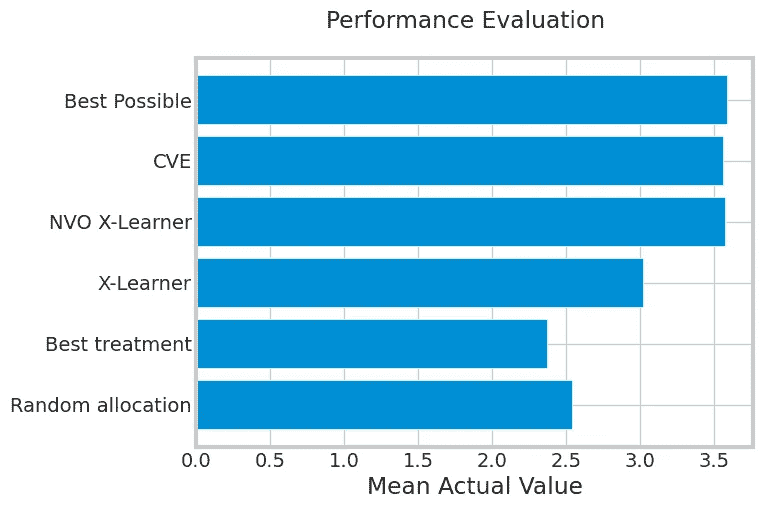

# 成本优化中的提升建模

> 原文：[`towardsdatascience.com/uplift-modeling-with-cost-optimization-1c67a4e13f2?source=collection_archive---------0-----------------------#2023-03-10`](https://towardsdatascience.com/uplift-modeling-with-cost-optimization-1c67a4e13f2?source=collection_archive---------0-----------------------#2023-03-10)

## 如何调整 CATE 以考虑与治疗相关的成本

[](https://medium.com/@smsmith714?source=post_page-----1c67a4e13f2--------------------------------)[](https://towardsdatascience.com/?source=post_page-----1c67a4e13f2--------------------------------) [肖恩·史密斯](https://medium.com/@smsmith714?source=post_page-----1c67a4e13f2--------------------------------)

·

[关注](https://medium.com/m/signin?actionUrl=https%3A%2F%2Fmedium.com%2F_%2Fsubscribe%2Fuser%2F6957f6523097&operation=register&redirect=https%3A%2F%2Ftowardsdatascience.com%2Fuplift-modeling-with-cost-optimization-1c67a4e13f2&user=Sean+Smith&userId=6957f6523097&source=post_page-6957f6523097----1c67a4e13f2---------------------post_header-----------) 发表在 [Towards Data Science](https://towardsdatascience.com/?source=post_page-----1c67a4e13f2--------------------------------) ·13 分钟阅读·2023 年 3 月 10 日[](https://medium.com/m/signin?actionUrl=https%3A%2F%2Fmedium.com%2F_%2Fvote%2Ftowards-data-science%2F1c67a4e13f2&operation=register&redirect=https%3A%2F%2Ftowardsdatascience.com%2Fuplift-modeling-with-cost-optimization-1c67a4e13f2&user=Sean+Smith&userId=6957f6523097&source=-----1c67a4e13f2---------------------clap_footer-----------)

--

[](https://medium.com/m/signin?actionUrl=https%3A%2F%2Fmedium.com%2F_%2Fbookmark%2Fp%2F1c67a4e13f2&operation=register&redirect=https%3A%2F%2Ftowardsdatascience.com%2Fuplift-modeling-with-cost-optimization-1c67a4e13f2&source=-----1c67a4e13f2---------------------bookmark_footer-----------)

照片由 [Remy Gieling](https://unsplash.com/@gieling?utm_source=medium&utm_medium=referral) 提供，来源于 [Unsplash](https://unsplash.com/?utm_source=medium&utm_medium=referral)

吸引顾客回到你的生意中是困难的。在竞争激烈的行业激励下，品牌们花费大量资金希望顾客再次光顾你的店铺。一种说服顾客回到公司中的方法是通过与他们互动，展示不同的广告以期望新的转化。

有时这些广告有效，有时客户需要更多的激励。这时，我们可以向客户提供折扣，以便他们在与品牌互动时感受到额外的价值，并放弃我们平等成本的广告方法。这些折扣的明显挑战是品牌在交易中会损失价值。这是我们将重点关注的问题：**我们如何知道向客户发送哪个（如果有的话）折扣，以增加他们的转化概率？**

一些读者可能注意到这个问题接近于典型的 Uplift 建模场景。我们对一些观察到的处理进行比较，选择具有最大条件平均处理效应（CATE）的处理。当我们没有同时观察到处理和对照时，我们估计反事实（即未发生的情况）。为了适应 Uplift 框架，我们可以将之前的问题重述为：**我们如何调整 CATE 以考虑每种处理相关的成本？**

这是一个数据科学家需要解决的问题。我们可以帮助经验丰富的广告商筛选广告和折扣的集合，并确定每个客户应看到的内容，基于先前观察到的互动数据。基于这些观察数据，我们可以帮助企业或品牌决定在所述情景中与客户互动的最佳策略。

我们从对 Uplift 建模和 Meta Learners 的快速介绍开始，学习它们各自的定义及如何解决平等成本问题。接着我们介绍净值 CATE，并展示我们需要对 Meta Learners 进行的细微修改以考虑成本。除了 Meta Learner 的调整，我们还将探讨 CausalML 中的一种解决方案——反事实价值估计器（CVE），以及这种方法如何解决净值问题。最后，我们将查看一些实验并讨论在生产环境中如何实际应用。

# Uplift 建模的快速概览

为了确保我们在 Uplift 建模方面达成一致，我在这里提供了一个简要概述。Uplift 建模是因果推断下的一个框架，专注于确定最佳处理方案。与传统的统计学习技术相比，Uplift 建模的优势在于我们估计反事实效应，即未发生情景的结果。通过这种估计，我们可以预测未接受的处理的效果，从而回答“如果我们做了 X 会发生什么？”的问题。

这种治疗组和对照组之间差异的度量被称为条件平均治疗效应（CATE）。为了形式化这一概念，我将转向一些方程。我们将受试者的结果表示为 Y，将治疗表示为 t，将治疗标识符表示为 j，其中 j=0 是对照组。在我们的案例中，Y 是一个二元变量，指示用户是否转化。我们将差异条件化在一个包含受试者信息的列向量 x 上，其中最重要的可能是购买行为。使用这种符号，我们得到了下面的公式。

CATE 公式

现在我们有了一个期望的值，我们需要一种方法来估计这个值。在 Uplift Modelling 的背景下，最流行的方法是通过使用 Meta Learners。Meta Learners 利用我们熟悉的统计模型（即逻辑回归、线性回归、XGBoost 等），但将问题重新格式化，以学习解决 CATE 的方法。

从本质上讲，Meta Learners 试图学习每个治疗的伪效应，并将其学习围绕该估计进行。伪效应通过比较每个治疗的统计学习模型估计值与观察值和估计值之间的差异来学习。在 Meta Learner 工作流程结束时，我们输出每个治疗的 CATE。

对于本文来说，了解 CATE 是重要的，而学习如何估计 CATE 的方法则不那么重要。这种传统的提升建模解释来估计 CATE 非常快速，对于实际应用这种方法并不全面。我建议阅读这篇文章以获得良好的介绍，而对于因果推断相关的全面介绍，我建议阅读[《勇敢而真实的因果推断》](https://matheusfacure.github.io/python-causality-handbook/landing-page.html)。

# 扩展 CATE 以捕捉净值

如上所示，我们的 CATE 值仅捕捉了转化概率。在这里，我们转变视角，考虑一个 CATE，用于考虑转化的总价值以及激活转化所用治疗的成本。

为了考虑价值，我们需要引入 Zhao 和 Harinen [1] 的一些新符号。我们引入 v 作为交易的预期值，s 作为转化成本（即激活时的治疗/折扣成本），以及 c 作为展示成本（即向消费者展示治疗/折扣的成本）。再次，t 代表一个治疗，j 代表具体的治疗，其中 j=0 是对照组的特殊情况。下面我们可以看到我们如何使用这些值来更新 CATE 公式，以考虑总净值。

净值 CATE 方程

这个公式为我们在考虑具有相关成本的治疗应用时提供了一些新的灵活性。我们可以看到，当我们比较净值 CATE 时，我们有考虑定价的治疗效果。

# 使用 X-Learner 考虑净值

基于我们上述的净值 CATE 概念，扩展 X-Learner 以处理这种新的 CATE 基础是相当简单的。在使用 X-Learner 时，一个主要步骤是学习给定预测和真实情况的治疗伪效应。为此，我们为每个治疗拟合一个响应模型（表示为 mu），并计算治疗组与对照组之间的差异。对于我们没有的值（反事实），我们使用训练好的响应模型，通过数据集中每个个体的一组特征进行估计。标准伪效应如下所示：

没有净值的伪效应。

如上所述，我们希望在伪效应中捕捉净值。我们可以使用赵和哈里宁[1]提出的方法，以我们对 CATE 所做的相同修改来实现这一点。如果你注意到，伪效应是 CATE 的估计，即给定关于受试者的一组特征，治疗效果比其他治疗好多少。通过对期望值做出相同的修改，我们可以将净值伪效应重新整理为：

带有净值的伪效应。

通过 CATE 建模净值的一个良好结果是，这也是我们对 X-Learner 所需的唯一调整。由于 CATE 已经是一个连续变量，因此需要训练的后续模型可以处理回归任务。

# 使用反事实价值估计器考虑净值

还有一些其他方法可以在比较中考虑净值。我们在这里考虑的一种方法是由 Uber 维护的 Python 库 CausalML 中实现的解决方案。他们的解决方案，即反事实价值估计器（CVE），在计算净值 CATE 的相同理念上进行了创新，但在计算发生的位置上采取了略微不同的方法。

CVE 是一个后建模优化器，它从几个模型中获取输入，以估计净值 CATE。第一个使用的模型是转化概率模型。该模型用于预测受试者在给定其特征和接受的治疗情况下的转化概率。

下一个为 CVE 训练的模型是任何能够预测 CATE 的学习器。CATE 与转化概率相结合，以确定在治疗场景下相对于反事实的收敛概率。这种计算如下所示：

CVE 中的 CATE 方程。方程取自[2]。

针对 CVE 训练的下一个模型是预期转化价值预测器。根据场景，这个模型可能不是必需的。如果你可以轻松地用历史支出代替用户将要支出的金额，那么这是一个可行的选项。然而，如果你有关于用户如何与品牌互动或者他们在下一个交易中可能花费多少的信息，那么你可以通过回归问题来建模这一点。

到此为止，我们已经拥有了所有预测值，我们需要使用上述描述的净值 CATE 来优化哪个治疗可能会带来最大的净值回报。有关这种方法的更多信息，你可以查看[2]中提供的信息。稍后在文章中，我们将通过代码进一步探讨这个概念。

# 示例

在这里，我们将通过一个示例来说明如何应用到目前为止讨论的方法。我们将使用一些来自 CausalML 的辅助函数，并且还会调整他们的一个笔记本来进行示例演示。我们还将按他们在笔记本中所做的那样进行评估。要查看他们的演示，请访问这个[链接](https://github.com/uber/causalml/blob/master/examples/counterfactual_value_optimization.ipynb)。

我们将使用的度量标准是潜在收益启发式方法，用于评估如果我们在之前的数据批次中采用这种治疗分配策略，我们的平均收益会是多少。在保留数据中，我们匹配所有治疗等于观察到的治疗的情况。当这些相等时，我们计算这些个体的平均值。为了进一步说明，我在下面写了一些假设性的 SQL 代码，展示了如何计算这个值，列名对应于我们在整篇文章中讨论的变量。

```py
SELECT AVG((expected_value - conversion_cost) * conversion - impression_cost)
FROM preds_and_ground_truth
WHERE predicted_treatment = ground_truth_treatment;
```

首先，我们需要创建我们的数据。在这个示例中，我们将使用两种治疗和一个对照组。我设置了 `positive_class_proportion=0.1`，这代表了 10% 的转化率。这个数字可能会根据你的情况有所不同，所以如果你在模拟，请确保相应地选择这个值。

```py
df, X_names = make_uplift_classification(
    n_samples=5000,
    treatment_name=["control", "treatment1", "treatment2"],
    positive_class_proportion=0.1,
)
```

接下来我们要做的是创建与成本相关的函数。第一个函数是期望值，我将其创建为一个无关特征的函数。这个特征对转化没有影响，因此它测试我们在进行优化时计算预期支出的能力。

```py
df['expected_value'] = np.abs(df['x6_irrelevant']) * 20 + np.random.normal(0, 5)
```

现在我们将使用来自 CausalML 的辅助函数创建所有的成本信息。我们将创建我们的转化成本数组 `cc_array`、展示成本数组 `ic_array`，并获取条件（我们的治疗）。转化价值数组就是我们上面创建的期望值。

```py
# Put costs into dicts
conversion_cost_dict = {"control": 0, "treatment1": 2.5, "treatment2": 10}
impression_cost_dict = {"control": 0, "treatment1": 0, "treatment2": 0.02}

# Use a helper function to put treatment costs to array
cc_array, ic_array, conditions = get_treatment_costs(
    treatment=df["treatment_group_key"],
    control_name="control",
    cc_dict=conversion_cost_dict,
    ic_dict=impression_cost_dict,
)

# Put the conversion value into an array
conversion_value_array = df['expected_value'].to_numpy()
```

接下来我们可以创建实际的价值数组。这是按照上述期望的相同公式计算的交易价值。

```py
actual_value = get_actual_value(
    treatment=df["treatment_group_key"],
    observed_outcome=df["conversion"],
    conversion_value=conversion_value_array,
    conditions=conditions,
    conversion_cost=cc_array,
    impression_cost=ic_array,
)
```

## 随机策略

我们首先要查看的策略是将治疗随机分配给不同的对象。这可能看起来像这样：

```py
test_actual_value = actual_value.loc[test_idx]
random_treatments = pd.Series(
    np.random.choice(conditions, test_idx.shape[0]), index=test_idx
)
test_treatments = df.loc[test_idx, "treatment_group_key"]
random_allocation_value = test_actual_value[test_treatments == random_treatments]
```

## 最佳治疗策略

下一个策略是采取具有最高平均处理效果（ATE）的处理。这完全不考虑受试者的背景。

```py
best_ate = df_train.groupby("treatment_group_key")["conversion"].mean().idxmax()

actual_is_best_ate = df_test["treatment_group_key"] == best_ate

best_ate_value = actual_value.loc[test_idx][actual_is_best_ate]
```

## 最佳可能

最佳可能政策是一个我们可以用来评估模型比较的标准。这个模型只考虑那些我们没有损失价值的情况。当受试者在对照组中或在我们提供的两个处理方案中有一个发生了转化时，就是这种情况。

```py
test_value = actual_value.loc[test_idx]
best_value = test_value[test_value >= 0]
```

## X Learner

在这里，我们将使用一个没有成本优化的普通 X Learner。我在这里使用的 X Learner 是我自己实现的，如果你想试验一下，我在下面的链接中包括了我的仓库链接。

```py
xm = XLearner()
encoder = {"control": 0, "treatment1": 1, "treatment2": 2}
X = df.loc[train_idx, X_names].to_numpy()
y = df.loc[train_idx, "conversion"].to_numpy()
T = np.array([encoder[x] for x in df.loc[train_idx, "treatment_group_key"]])

xm.fit(X, y, T)
```

要根据 X-Learner 获得最佳处理，我们可以获取预测的 CATE 值，并通过对数据框进行 argmax 操作来选择最大值的处理。

```py
X_test = df.loc[test_idx, X_names].to_numpy()
xm_pred = xm.predict(X_test).drop(0, axis=1)
xm_best = xm_pred.idxmax(axis=1)
xm_best = [conditions[idx] for idx in xm_best]

actual_is_xm_best = df_test["treatment_group_key"] == xm_best
xm_value = actual_value.loc[test_idx][actual_is_xm_best]
```

## 反事实价值估计器

要使用 CausalML 的 CVE，我们需要首先训练几个模型。第一个模型是转化分类器。这只是一个简单的分类问题。我们使用分类器来预测在给定处理暴露和我们可能知道的其他信息的情况下转化的概率。

```py
proba_model = lgb.LGBMClassifier()

W_dummies = pd.get_dummies(df["treatment_group_key"])
XW = np.c_[df[X_names], W_dummies]

proba_model.fit(XW[train_idx], df_train["conversion"])
y_proba = proba_model.predict_proba(XW[test_idx])[:, 1]
```

接下来我们需要训练的模型是预测客人转化期望值的模型。这是另一个简单的问题，这次是回归问题。

```py
expected_value_model = lgb.LGBMRegressor()
expected_value_model.fit(XW[train_idx], df_train['expected_value'])
pred_conv_value = expected_value_model.predict(XW[test_idx])
```

我们为这个模型使用的另一个值是预测的 CATE 值。在前一步中我们拟合了一个 X-Learner，它为我们预测了 CATE。现在我们可以使用 CVE 来优化我们的行动。

```py
cve = CounterfactualValueEstimator(
    treatment=df_test["treatment_group_key"],
    control_name="control",
    treatment_names=conditions[1:],  # idx 0 is control
    y_proba=y_proba,
    cate=xm_pred,
    value=pred_conv_value,
    conversion_cost=cc_array[test_idx],
    impression_cost=ic_array[test_idx],
)
```

CVE 是一个非参数优化器。这意味着我们在使用 CVE 时不会学习任何权重。相反，我们利用已经学到的值并在预测行动时优化它们以应对外部成本。下面是如何从 CVE 获得最佳行动的示例。

```py
cve_best_idx = cve.predict_best()
cve_best = [conditions[idx] for idx in cve_best_idx]
actual_is_cve_best = df.loc[test_idx, "treatment_group_key"] == cve_best
cve_value = actual_value.loc[test_idx][actual_is_cve_best]
```

## 净值优化 X-Learner

接下来我们将再次查看 X-Learner，但这次考虑的是净值 CATE 而不是普通的 CATE。这是之前提到的那个 X-Learner，来自我的仓库。如果你想试验一下，请查看下面链接的仓库。

```py
nvex = XLearner(ic_lookup=ic_lookup, cc_lookup=cc_lookup)

X = df.loc[train_idx, X_names].to_numpy()
y = df.loc[train_idx, "conversion"].to_numpy()
T = np.array([encoder[x] for x in df.loc[train_idx, "treatment_group_key"]])
value = df.loc[train_idx, "expected_value"].to_numpy()

nvex.fit(X, y, T, value)
```

# 结果比较

下面我们可以看到每个策略在测试集上的平均值结果。正如我们预期的那样，优化了处理分布中的值的方法优于那些没有考虑值的方法。随机分配和最佳处理作为良好的基准测量，但没有提供足够的性能，使其成为具有竞争力的简单方法。X-Learner 比简单方法有了很大改善，但表现不如考虑净值的方法。最佳表现来自于净值优化（NVO）X-Learner 和 CVE。这是因为这些方法针对的是净值，这是我们衡量它们的标准。



测试集每个受试者的平均值。

要在正式的活动中衡量成功，我建议采用稍微复杂一点的方法，遵循回测范式。对于那些不熟悉的人，回测涉及在历史数据上测试算法，使用截止日期上的持出集。假设你有 90 天的数据。对策略/算法进行回测审查将包括在前 45 天进行训练，并在接下来的 45 天进行测试，然后通过一些固定的天数增量来增加训练集，并重复训练和验证问题。在这里，我们可以使用相同的方法进行测试，看看算法在历史增量上的表现。

# 数据收集和验证的考虑

在执行这样的活动时，你的模型只有在你的数据质量上才会有用。随机数据很昂贵，可能不适合你全部的数据，但拥有一些随机数据还是很重要的。在分配处理时，确保收集一些随机分配的子样本。这些数据最好用于验证目的，以确保你训练的算法没有学习到由于处理分配不平衡而产生的趋势。

对于那些担心在观察数据上训练的人，有几种自然的方法可以考虑。在 X-Learner 中，我们学习一个用于处理分配的倾向模型。当考虑处理效果时，我们学习了个体被分配到该处理组的可能性加权平均值。欲了解更多信息，我建议查看[1]中的公式 (10)、(11) 和 (12)。

观察数据的不平衡也可以在转换模型和回归模型中加以考虑。通过测量转换和预期价值模型中处理组的准确性，我们可以确保数据不会偏向任何一组。如果结果确实出现偏差，可以使用许多采样技术来解决这个问题（这是一个简单的解决方法的好例子）。

# 结论

在这里，我们介绍了在分配处理时如何优化价值。我们讨论了如何处理这个问题，包括对 Uplift Modelling 的快速介绍，并介绍了 ATE 和 CATE。然后，我们修改了 CATE 的计算方法，将价值、转换成本和印象成本包含在期望值中，以学习净值 CATE。接下来，我们查看了 CausalML 提供的现有解决方案，即 Counterfactual Value Estimator，并了解了它如何考虑净值 CATE。最后，我们通过 CausalML 的笔记本，并与我们的净值优化 X-Learner 进行了扩展。

*你可以在这里访问我的仓库* [*这里*](https://github.com/sms1097/uplift-optimization)*！*

*你可以从 CausalML 访问原始笔记本* [*这里*](https://github.com/uber/causalml/blob/master/examples/counterfactual_value_optimization.ipynb)*！*

*除非另有说明，所有图片均属于作者。*

[1] Zhao, Z., & Harinen, T.. (2019). 多重处理的提升建模与成本优化。

[2] Huigang Chen, Totte Harinen, Jeong-Yoon Lee, Mike Yung, & Zhenyu Zhao. (2020). CausalML: 用于因果机器学习的 Python 包。
