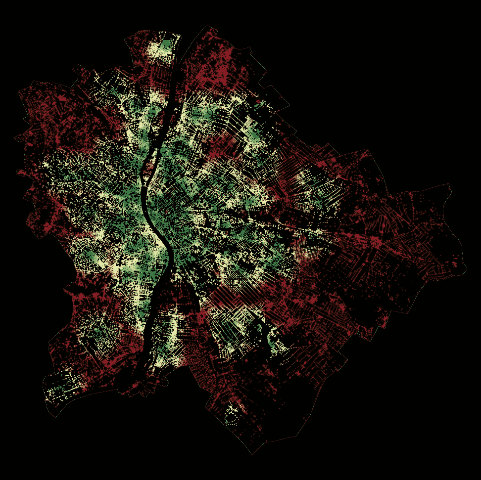

# 城市可达性——如何及时找到除颤器

> 原文：[`towardsdatascience.com/urban-accessibility-how-to-reach-defibrillators-on-time-c865d9194448?source=collection_archive---------0-----------------------#2023-10-01`](https://towardsdatascience.com/urban-accessibility-how-to-reach-defibrillators-on-time-c865d9194448?source=collection_archive---------0-----------------------#2023-10-01)

图片由作者提供。

## 在这篇文章中，我将早期关于城市可达性或步行性研究与公开数据中的公共除颤器设备位置相结合。此外，我还结合了全球人口数据和 Uber 的 H3 网格系统，估算了布达佩斯和维也纳市区内，任何设备在合理距离范围内的人口比例。

 [米兰·贾诺索夫](https://medium.com/@janosovm?source=post_page-----c865d9194448--------------------------------)

·

[关注](https://medium.com/m/signin?actionUrl=https%3A%2F%2Fmedium.com%2F_%2Fsubscribe%2Fuser%2F838408aa2ad4&operation=register&redirect=https%3A%2F%2Ftowardsdatascience.com%2Furban-accessibility-how-to-reach-defibrillators-on-time-c865d9194448&user=Milan+Janosov&userId=838408aa2ad4&source=post_page-838408aa2ad4----c865d9194448---------------------post_header-----------) 发表在 [Towards Data Science](https://towardsdatascience.com/?source=post_page-----c865d9194448--------------------------------) · 11 分钟阅读 · 2023 年 10 月 1 日

--

城市可达性的根源，或[步行性](https://en.wikipedia.org/wiki/Walkability)，在于基于图的计算，测量欧几里得距离（将其转换为步行分钟，假设速度恒定且没有交通堵塞和障碍物）。这类分析的结果可以告诉我们，从城市内每一个位置到达特定类型的设施有多容易。更准确地说，是从城市道路网络中的每一个节点，但由于大量的道路交叉，这种近似通常可以忽略。

在当前的案例研究中，我专注于一种特定类型的兴趣点（POI）：除颤器设备的位置。虽然奥地利政府的开放数据门户网站提供了官方记录，但在匈牙利，我只能获得不到一半覆盖率的众包数据…
