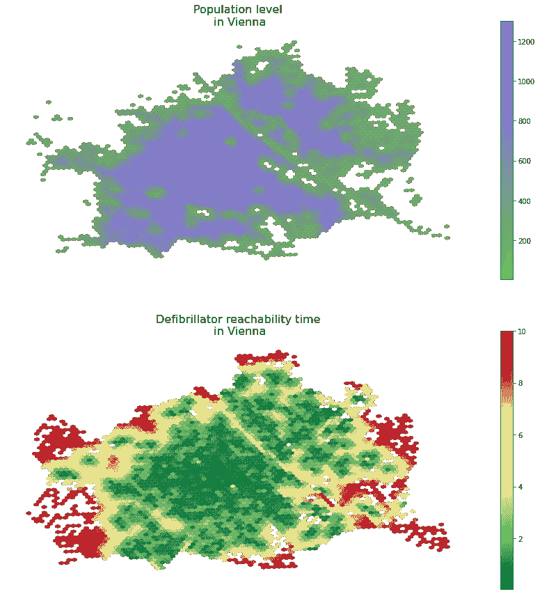

# 城市可达性 — 如何及时到达除颤器

> 原文：[`towardsdatascience.com/urban-accessibility-how-to-reach-defibrillators-on-time-c865d9194448`](https://towardsdatascience.com/urban-accessibility-how-to-reach-defibrillators-on-time-c865d9194448)


作者提供的图片。

## 在这篇文章中，我将早期的城市可达性或步行性研究与有关公共除颤器设备位置的开源数据结合起来。此外，我还结合了全球人口数据和 Uber 的 H3 网格系统，以估算布达佩斯和维也纳范围内的人口中可以合理到达任何设备的比例。

[](https://medium.com/@janosovm?source=post_page-----c865d9194448--------------------------------)[](https://towardsdatascience.com/?source=post_page-----c865d9194448--------------------------------) [米兰·贾诺索夫](https://medium.com/@janosovm?source=post_page-----c865d9194448--------------------------------)

·发布于 [走向数据科学](https://towardsdatascience.com/?source=post_page-----c865d9194448--------------------------------) ·11 分钟阅读·2023 年 10 月 1 日

--

城市可达性的根源，或称为[步行性](https://en.wikipedia.org/wiki/Walkability)，在于一种基于图的计算方法，该方法测量欧几里得距离（将其转化为步行分钟，假设速度恒定且没有交通堵塞和障碍物）。这种分析的结果可以告诉我们，从城市内的每一个位置到达特定类型设施的难易程度。更准确地说，从城市道路网络中的每一个节点出发，但由于大量的道路交叉，这种近似通常是可以忽略的。

在当前的案例研究中，我专注于一种特定类型的兴趣点（POI）：除颤器设备的位置。虽然奥地利政府的开放数据门户分享了有关这一点的官方记录，但在匈牙利，我只能获得一个覆盖率不到一半的众包数据集——希望未来该数据集在绝对规模和数据覆盖范围上都能增长。

在我的文章的第一部分，我将为每个城市创建可达性地图，展示在 15km/h 的跑步速度下，达到最近的除颤器单元所需的时间，范围为 2.5 公里。然后，我将使用 Uber 的 H3 库将城市划分为六边形网格，以计算每个网格单元的平均除颤器可达时间。我还根据我之前的文章估算每个六边形单元的人口水平。最后，我将这些数据结合起来，计算作为可达性（跑步）时间函数的人口比例。

作为免责声明，我想强调我不是经过专业培训的医学专家——我也不打算对除颤器设备相较于其他[生命](https://www.youtube.com/watch?v=-A0nAKWTewI)支持手段的重要性表态。然而，基于常识和城市规划原则，我假设获取这些设备越容易越好。

# 1\. 数据来源

一如既往，我喜欢从探索我使用的数据类型开始。首先，我将收集我研究城市的行政边界——匈牙利布达佩斯和奥地利维也纳。

然后，基于我之前关于如何处理栅格化人口数据的文章，我从 WorldPop 中心添加了城市级别的人口信息。最后，我结合了维也纳官方政府数据和我自己通过网络抓取的相同数据，尽管数据来源繁杂且固有不完整，适用于布达佩斯。

**1.1\. 行政边界**

首先，我使用[OpenStreetMap](http://openstreetmap.org/)和[OSMNx](http://osmnx.readthedocs.io)库查询布达佩斯和维也纳的行政边界：

```py
import osmnx as ox # version: 1.0.1
import matplotlib.pyplot as plt # version: 3.7.1

admin  = {}
cities = ['Budapest', 'Vienna']
f, ax  = plt.subplots(1,2, figsize = (15,5))

# visualize the admin boundaries
for idx, city in enumerate(cities):
    admin[city] = ox.geocode_to_gdf(city)
    admin[city].plot(ax=ax[idx],color='none',edgecolor= 'k', linewidth = 2)    ax[idx].set_title(city, fontsize = 16)
```

这段代码块的结果：


图 1\. 布达佩斯和维也纳的行政边界。图片由作者提供。

**1.2\. 人口数据**

其次，按照这篇文章中的步骤，我为这两个城市创建了矢量数据格式的人口网格，基于 WorldPop 在线人口数据库。为了避免重复步骤，我直接读取了包含这些城市人口信息的过程输出文件。

此外，为了让效果更加美观，我使用 Matplotlib 和 ChatGPT 的快速脚本创建了 2022 年颜色“Very Peri”的色彩图。

```py
import matplotlib.pyplot as plt
from matplotlib.colors import LinearSegmentedColormap

very_peri = '#8C6BF3'  
second_color = '#6BAB55'   

colors = [second_color, very_peri ]
n_bins = 100
cmap_name = "VeryPeri"
colormap = LinearSegmentedColormap.from_list(cmap_name, colors, N=n_bins)
```

```py
import geopandas as gpd # version: 0.9.0

demographics = {}
f, ax = plt.subplots(1,2, figsize = (15,5))

for idx, city in enumerate(cities):
    demographics[city] = gpd.read_file(city.lower() + \
      '_population_grid.geojson')[['population', 'geometry']]
    admin[city].plot(ax=ax[idx], color = 'none', edgecolor = 'k', \
      linewidth = 3)
    demographics[city].plot(column = 'population', cmap = colormap, \
      ax=ax[idx], alpha = 0.9, markersize = 0.25)
    ax[idx].set_title(city)
    ax[idx].set_title('Population density\n in ' + city, fontsize = 16)
    ax[idx].axis('off')
```

这段代码块的结果：


图 2\. 基于 WordPop 数据的人口密度地图。图片由作者提供。

**1.3\. 除颤器位置**

第三，我收集了两个城市中可用除颤器的位置信息。

对于维也纳，我从[奥地利政府官方开放数据门户](https://www.data.gv.at/katalog/dataset/96196887-5a20-4e93-a302-72f306f32c9d)下载了包含 1044 个单元点位置的数据集：

尽管布达佩斯/匈牙利没有这样的官方开放数据门户，但匈牙利国家心脏基金会运营一个[众包网站](http://www.mnsza.hu/hirtelen/aed_db_lista.php)，运营商可以更新他们的除颤器位置。他们的全国数据库包含 677 个单位；然而，他们的免责声明称他们知道至少有一千个单位在该国运营——并等待其所有者上传。通过一个简单的网络爬虫，我下载了每个 677 个注册单位的位置，并将数据集筛选到布达佩斯，结果得到 148 个单位的数据集。

```py
# parse the data for each city
gdf_units= {}

gdf_units['Vienna'] = gpd.read_file('DEFIBRILLATOROGD')
gdf_units['Budapest'] = gpd.read_file('budapest_defibrillator.geojson')

for city in cities:
    gdf_units[city] = gpd.overlay(gdf_units[city], admin[city])

# visualize the units
f, ax = plt.subplots(1,2, figsize = (15,5))

for idx, city in enumerate(cities):
    admin[city].plot(ax=ax[idx],color='none',edgecolor= 'k', linewidth = 3)
    gdf_units[city].plot( ax=ax[idx], alpha = 0.9, color = very_peri, \
      markersize = 6.0)
    ax[idx].set_title('Locations of defibrillator\ndevices in ' + city, \
      fontsize = 16)
    ax[idx].axis('off')
```

这个代码块的结果：


图 3\. 布达佩斯和维也纳的除颤器位置。图片由作者提供。

# 2\. 可达性计算

接下来，我总结了 Nick Jones 于 2018 年撰写的这篇出色的文章，讲述如何计算步行可达性：

```py
import os
import pandana # version: 0.6
import pandas as pd # version: 1.4.2
import numpy as np # version: 1.22.4
from shapely.geometry import Point # version:  1.7.1
from pandana.loaders import osm

def get_city_accessibility(admin, POIs):

    # walkability parameters
    walkingspeed_kmh = 15
    walkingspeed_mm  = walkingspeed_kmh * 1000 / 60
    distance = 2500

    # bounding box as a list of llcrnrlat, llcrnrlng, urcrnrlat, urcrnrlng
    minx, miny, maxx, maxy = admin.bounds.T[0].to_list()
    bbox = [miny, minx, maxy, maxx]

    # setting the input params, going for the nearest POI
    num_pois = 1
    num_categories = 1
    bbox_string = '_'.join([str(x) for x in bbox])
    net_filename = 'data/network_{}.h5'.format(bbox_string)
    if not os.path.exists('data'): os.makedirs('data')

    # precomputing nework distances

    if os.path.isfile(net_filename):
        # if a street network file already exists, just load the dataset from that
        network = pandana.network.Network.from_hdf5(net_filename)
        method = 'loaded from HDF5'
    else:
        # otherwise, query the OSM API for the street network within the specified bounding box
        network = osm.pdna_network_from_bbox(bbox[0], bbox[1], bbox[2], bbox[3])
        method = 'downloaded from OSM'

        # identify nodes that are connected to fewer than some threshold of other nodes within a given distance
        lcn = network.low_connectivity_nodes(impedance=1000, count=10, imp_name='distance')
        network.save_hdf5(net_filename, rm_nodes=lcn) #remove low-connectivity nodes and save to h5

    # precomputes the range queries (the reachable nodes within this maximum distance)
    # so, as long as you use a smaller distance, cached results will be used
    network.precompute(distance + 1)

    # compute accessibilities on POIs
    pois = POIs.copy()
    pois['lon'] = pois.geometry.apply(lambda g: g.x)
    pois['lat'] = pois.geometry.apply(lambda g: g.y)
    pois = pois.drop(columns = ['geometry'])
    network.init_pois(num_categories=num_categories, max_dist=distance, max_pois=num_pois)

    network.set_pois(category='all', x_col=pois['lon'], y_col=pois['lat'])

    # searches for the n nearest amenities (of all types) to each node in the network
    all_access = network.nearest_pois(distance=distance, category='all', num_pois=num_pois)

    # transform the results into a geodataframe
    nodes = network.nodes_df
    nodes_acc = nodes.merge(all_access[[1]], left_index = True, right_index = True).rename(columns = {1 : 'distance'})
    nodes_acc['time'] = nodes_acc.distance / walkingspeed_mm
    xs = list(nodes_acc.x)
    ys = list(nodes_acc.y)
    nodes_acc['geometry'] = [Point(xs[i], ys[i]) for i in range(len(xs))]
    nodes_acc = gpd.GeoDataFrame(nodes_acc)
    nodes_acc = gpd.overlay(nodes_acc, admin)

    nodes_acc[['time', 'geometry']].to_file(city + '_accessibility.geojson', driver = 'GeoJSON')

    return nodes_acc[['time', 'geometry']]

accessibilities = {}
for city in cities:
    accessibilities[city] = get_city_accessibility(admin[city], gdf_units[city])
```

```py
for city in cities:
    print('Number of road network nodes in ' + \
      city + ': ' + str(len(accessibilities[city])))
```

这个代码块输出布达佩斯（116,056）和维也纳（148,212）的道路网络节点数量。

现在可视化可达性地图：

```py
for city in cities:
    f, ax = plt.subplots(1,1,figsize=(15,8))
    admin[city].plot(ax=ax, color = 'k', edgecolor = 'k', linewidth = 3)
    accessibilities[city].plot(column = 'time', cmap = 'RdYlGn_r', \
      legend = True,  ax = ax, markersize = 2, alpha = 0.5)
    ax.set_title('Defibrillator accessibility in minutes\n' + city, \
      pad = 40, fontsize = 24)    
    ax.axis('off')
```

这个代码块输出以下图形：


图 4\. 布达佩斯的除颤器可达性（分钟）。图片由作者提供。


图 5\. 维也纳的除颤器可达性（分钟）。图片由作者提供。

# 3\. 映射到 H3 网格单元

目前，我已经有了人口和可达性数据；我只需要将它们结合起来。唯一的难点是它们的空间单位不同：

+   可达性被测量并附加到每个城市道路网络中的节点上

+   人口数据来源于光栅网格，现在由每个光栅网格的质心的 POI 描述

尽管重新处理原始光栅网格可能是一个选项，出于更明显的普遍性（并添加一点我的个人风格），我现在将这两种点数据集映射到[Uber 的 H3 网格系统](https://www.uber.com/en-HU/blog/h3/)，对于那些尚未使用过它的人，现在知道它是一个优雅、高效的空间索引系统，使用六边形瓷砖即可。更多阅读，请点击此链接！

**3.1\. 创建 H3 单元**

首先，编写一个函数，将城市分割成任意分辨率的六边形：

```py
import geopandas as gpd
import h3 # version: 3.7.3
from shapely.geometry import Polygon # version: 1.7.1
import numpy as np

def split_admin_boundary_to_hexagons(admin_gdf, resolution):
    coords = list(admin_gdf.geometry.to_list()[0].exterior.coords)
    admin_geojson = {"type": "Polygon",  "coordinates": [coords]}
    hexagons = h3.polyfill(admin_geojson, resolution, \
      geo_json_conformant=True)
    hexagon_geometries = {hex_id : Polygon(h3.h3_to_geo_boundary(hex_id, \
      geo_json=True)) for hex_id in hexagons}
    return gpd.GeoDataFrame(hexagon_geometries.items(), columns = ['hex_id', 'geometry'])

resolution = 8  
hexagons_gdf = split_admin_boundary_to_hexagons(admin[city], resolution)
hexagons_gdf.plot()
```

这个代码块的结果：


图 6\. 维也纳 H3 六边形分割，分辨率为 8。图片由作者提供。

现在，查看几个不同的分辨率：

```py
for resolution in [7,8,9]:

    admin_h3 = {}
    for city in cities:
        admin_h3[city] = split_admin_boundary_to_hexagons(admin[city], resolution)

    f, ax = plt.subplots(1,2, figsize = (15,5))

    for idx, city in enumerate(cities):
        admin[city].plot(ax=ax[idx], color = 'none', edgecolor = 'k', \
          linewidth = 3)
        admin_h3[city].plot( ax=ax[idx], alpha = 0.8, edgecolor = 'k', \
           color = 'none')
        ax[idx].set_title(city + ' (resolution = '+str(resolution)+')', \
            fontsize = 14)
        ax[idx].axis('off')
```

这个代码块的结果：


图 7\. 不同分辨率下布达佩斯和维也纳的 H3 六边形分割。图片由作者提供。

让我们保持分辨率 9！

**3.2\. 将值映射到 h3 单元**

现在，我已经将我们的两个城市放在一个六边形网格格式中。接下来，我将根据每个点几何体落入的网格单元，将人口和可达性数据映射到六边形单元格中。为此，GeoPandasa 的 sjoin 函数做了很好的空间连接，是一个不错的选择。

此外，由于每个城市中有超过 100k 个道路网络节点和数千个人口网格重心，因此每个六边形网格单元中很可能会映射多个 POI。因此，需要进行聚合。由于人口是一个累加量，我将通过将其相加来聚合同一六边形内的人口水平。然而，可达性不是广泛的，所以我将计算每个瓷砖的平均除颤器可达性时间。

```py
demographics_h3 = {}
accessibility_h3 = {}

for city in cities:

    # do the spatial join, aggregate on the population level of each \
    # hexagon, and then map these population values to the grid ids
    demographics_dict = gpd.sjoin(admin_h3[city], demographics[city]).groupby(by = 'hex_id').sum('population').to_dict()['population']
    demographics_h3[city] = admin_h3[city].copy()
    demographics_h3[city]['population'] = demographics_h3[city].hex_id.map(demographics_dict)

    # do the spatial join, aggregate on the population level by averaging 
    # accessiblity times within each hexagon, and then map these time score  #  to the grid ids
    accessibility_dict = gpd.sjoin(admin_h3[city], accessibilities[city]).groupby(by = 'hex_id').mean('time').to_dict()['time']
    accessibility_h3[city]   = admin_h3[city].copy()
    accessibility_h3[city]['time'] = \
      accessibility_h3[city].hex_id.map(accessibility_dict)

    # now show the results
    f, ax = plt.subplots(2,1,figsize = (15,15))

    demographics_h3[city].plot(column = 'population', legend = True, \
      cmap = colormap, ax=ax[0], alpha = 0.9, markersize = 0.25)
    accessibility_h3[city].plot(column = 'time', cmap = 'RdYlGn_r', \
      legend = True,  ax = ax[1])

    ax[0].set_title('Population level\n in ' + city, fontsize = 16)
    ax[1].set_title('Defibrillator reachability time\n in ' + city, \
      fontsize = 16)

    for ax_i in ax: ax_i.axis('off')
```

这个代码块的结果是以下图形：


图 8\. 布达佩斯的城市特征。图片由作者提供。



图 9\. 维也纳的城市特征。图片由作者提供。

# 4\. 计算人口可达性

在这最后一步，我将估计在一定时间内从最近的除颤器单元可达的人口比例。在这里，我仍然基于相对快速的 15 公里/小时跑步速度和 2.5 公里距离限制。

从技术角度来看，我合并了 H3 级别的人口和可达性时间数据框，然后对时间维度进行简单的阈值处理，对人口维度进行求和。

```py
f, ax = plt.subplots(1,2, figsize = (15,5))

for idx, city in enumerate(cities):

    total_pop  = demographics_h3[city].population.sum()
    merged = demographics_h3[city].merge(accessibility_h3[city].drop(columns =\
     ['geometry']), left_on = 'hex_id', right_on = 'hex_id')

    time_thresholds = range(10)
    population_reached = [100*merged[merged.time<limit].population.sum()/total_pop for limit in time_thresholds]

    ax[idx].plot(time_thresholds, population_reached, linewidth = 3, \
      color = very_peri)
    ax[idx].set_xlabel('Reachability time (min)', fontsize = 14, \
      labelpad = 12)
    ax[idx].set_ylabel('Fraction of population reached (%)', fontsize = 14, labelpad = 12)
    ax[idx].set_xlim([0,10])
    ax[idx].set_ylim([0,100])
    ax[idx].set_title('Fraction of population vs defibrillator\naccessibility in ' + city, pad = 20, fontsize = 16) 
```

这个代码块的结果是以下图形：


图 10\. 以奔跑速度从最近的除颤器单元可到达的人口比例。图片由作者提供。

# 5\. 结论

在解释这些结果时，我想强调，一方面，除颤器可达性可能与心脏病发作的生存率没有直接关系；评估这种影响超出了我的专业范围和这个项目的范围。此外，用于布达佩斯的数据明显不完整且来源拥挤，而非官方的奥地利数据源。

在免责声明之后，我们看到了什么？一方面，我们看到在布达佩斯，约 75–80% 的人口可以在 10 分钟内到达一个设备，而在维也纳，我们已经能在 6–7 分钟内几乎实现完全覆盖。此外，我们需要仔细阅读这些时间值：如果我们遇到不幸事件，需要在每一分钟可能都是生死攸关的情况下，到达设备，取出它，返回（使旅行时间是可达时间的两倍），安装等。

从开发的角度来看，结论是确保我们拥有完整的数据，然后使用可达性和人口图，将它们结合起来，进行分析，并在部署新设备和新位置时构建，以最大化有效覆盖的人口。
