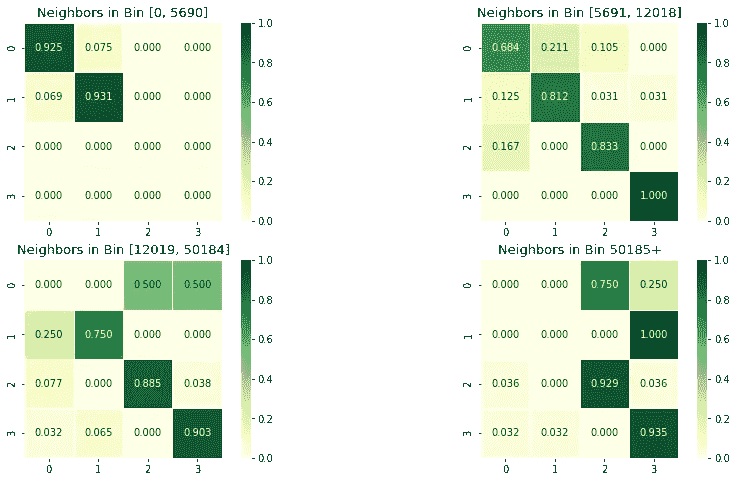
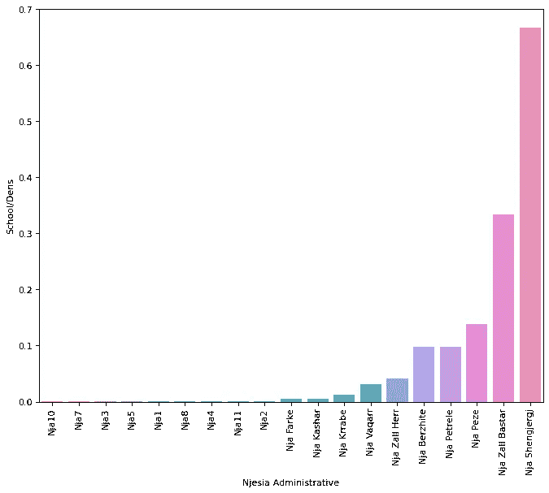
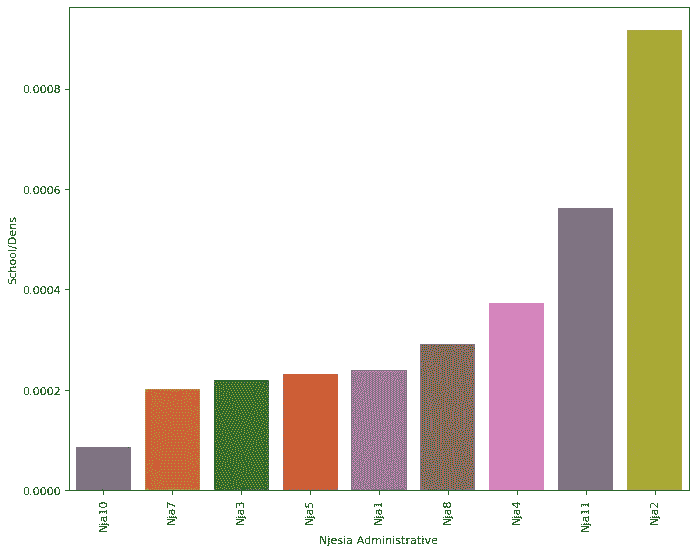
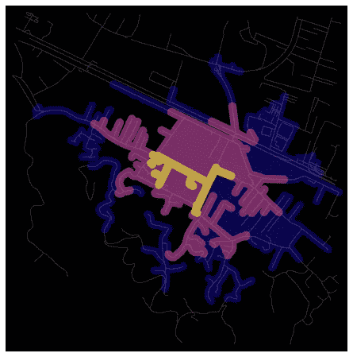
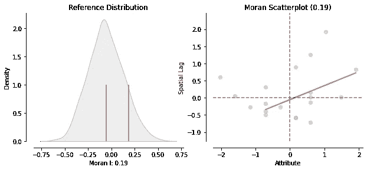

# 城市韧性：空间公平

> 原文：[`towardsdatascience.com/urban-resilience-modeling-spatial-equity-2268ac4ac84?source=collection_archive---------13-----------------------#2023-05-30`](https://towardsdatascience.com/urban-resilience-modeling-spatial-equity-2268ac4ac84?source=collection_archive---------13-----------------------#2023-05-30)

## 使用空间数据科学对人口进行建模 + 分析地拉那的教育公平。

 [Dea Bardhoshi](https://deabardhoshi.medium.com/?source=post_page-----2268ac4ac84--------------------------------)

·

[关注](https://medium.com/m/signin?actionUrl=https%3A%2F%2Fmedium.com%2F_%2Fsubscribe%2Fuser%2Fd61c58ba988e&operation=register&redirect=https%3A%2F%2Ftowardsdatascience.com%2Furban-resilience-modeling-spatial-equity-2268ac4ac84&user=Dea+Bardhoshi&userId=d61c58ba988e&source=post_page-d61c58ba988e----2268ac4ac84---------------------post_header-----------) 发表在 [Towards Data Science](https://towardsdatascience.com/?source=post_page-----2268ac4ac84--------------------------------) ·5 min read·2023 年 5 月 30 日

--

图片由 [Gledisa Golikja](https://unsplash.com/@multipod?utm_source=medium&utm_medium=referral) 提供，来源于 [Unsplash](https://unsplash.com/?utm_source=medium&utm_medium=referral)

你好！

这是城市韧性项目的第二部分 (第一部分在这里)，专注于地拉那的人口趋势！在第一部分中，我们研究了幂律分布，并建立了空间马尔可夫模型以理解人口随时间的变化。在第二部分中，我想*更深入地探讨*这些预测，并了解它们对地拉那特定社区的意义。让我们开始吧！

# 空间马尔可夫模型（续）

上一次，我使用了地拉那开放数据的统计信息（[数据](https://ckan.tirana.al/dataset/popullsia-sipas-viteve-dhe-nja-2009-2022) 许可： [创作共用署名](http://www.opendefinition.org/licenses/cc-by)）来获得这个空间马尔可夫模型矩阵：

空间马尔可夫矩阵结果（图片由作者提供）

让我们来看看这些结果在特定社区中的含义。截至 2021 年，城市中人口最多的区域是 5 区、2 区、7 区、4 区和 11 区，紧随其后的是卡沙尔，这是一座位于地拉那市区之外的市镇，拥有许多新开发项目。这里是一个快速的可视化：

卡沙尔是一个有趣的郊区增长例子，像可口可乐、沃达丰、Top Channel 以及一些小型企业都在这里设立了店铺。2009 年，其人口仅为 20829，但截至 2021 年，已几乎增长到 58664 人。这些增长非常迅速的地区也正是最需要可持续解决方案的地方：卡沙尔每天增长约 11 人，且中位年龄为 33 岁（[来源](https://siu.scan-tv.com/40-fakte-rreth-periferise-se-tiranes-farka-kashari-dhe-dajti-nga-popullsia-biznesi-deri-tek-atraksionet-turistike/)）。

其他高人口地区在过去 12 年中也经历了增长：

有趣的是，这些区域彼此相邻：这加强了这样一种直觉，即周围社区发生的趋势可能也会影响到该社区的特征。

## **一些例子**

让我们稍微关注一下 5 区。其直接邻近的区域是 7 区、10 区和 2 区，人口分别为 77124、27637 和 83827。根据空间马尔可夫结果，考虑到这些邻近区域，**5 区**有约**90%**的机会保持在最高人口区间。它也有约**5%**的机会降到第一个和第二个人口区间。

**10 区**是地拉那的另一个社区，涵盖了城市广场、商业区（Blloku/The Block）以及一些最繁忙的街道。2021 年其人口为 27637，其邻近区域的人口在 77000 到 87000 之间。根据马尔可夫结果，它有约**93%**的机会保持在当前的人口区间。

# 第#2 步：学校数据与空间公平

在可持续发展方面，城市应该致力于为所有社区中的居民提供高质量的资源。地理资源可用性的概念也称为**空间公平**：在一个致力于为所有公民提供类似机会的城市中，这意味着人们将平等地获得公共空间、清洁环境和如学校等机构的访问机会。

在这个背景下，我想探讨学校的分布作为空间公平性的一个标志。地拉那的所有儿童是否都能接受到可及的、高质量的教育？是否存在劣势区域？有哪些学校的趋势和模式？为此，我将使用地拉那中小学（统称为“9-vjecare”）的数据（[链接](https://ckan.tirana.al/dataset/institucionet-arsimore/resource/ff4e6d4b-c812-443d-8222-122c2da7b51e)，该数据拥有创作共用署名许可）。以下是地拉那各行政区学校密度的可视化图：

地拉那各区域的学校密度（图片由作者提供）

这是相同的可视化图，但只关注于 11 个城市区域：

地拉那 11 个城市区域的学校密度（图片由作者提供）

一眼看去，似乎密度最高的区域实际上是那些位于 11 个主要行政区之外的地方。也就是说，像 Shengjergj、Zall Bastar 和 Peze 这样的地方成为了前 3 名。这对那些就读于这些学校的孩子意味着什么？这是否意味着他们上学时的安全性或可靠性更高？

这里是从 Kashar 的一所学校“Sadik Stavileci”出发的步行网络可视化。该图展示了如果以每小时 4.5 公里的速度步行，能在 5、10 或 15 分钟内从学校到达的范围。

从 Kashar 学校步行距离的等时线图（图片由作者提供）

如你所见，孩子们在几分钟内能够覆盖的距离可能并不大。然而，这个工具在规划建筑项目时很有用，以确保一个地方对预期使用者易于到达。步行到学校和从学校回家的合理时间是多少？我们如何改善交通或骑行等服务，以确保孩子们能够安全上学？作为一个起点，计算地拉那所有学校的等时线并与步行距离内的孩子数量进行比较将是很有趣的。

**侧边栏**：我使用了 OSMnx，这是一款结合了 OpenStreetMaps 数据和网络指标的网络分析包来制作这些图表。这里是进行这个操作的源笔记本（[isochrones](https://github.com/gboeing/osmnx-examples/blob/v0.13.0/notebooks/13-isolines-isochrones.ipynb)）。

## 衡量不平等：空间自相关

为了衡量空间分布中的不平等，我们可以使用一些其他指标。**空间自相关**就是其中之一，它包括计算 Moran’s I（我们在第一部分中为人口统计量做了这个）。这是为了检验学校在地拉那是否均匀分布的原假设。测试的结果是**0.186（p 值为 0.111）**。

PySAL 还为我们提供了两种可视化自相关的方法：**Moran 图**和**Moran’s I**在原假设下的**分布**。

Moran 图 + 实证分布（图像来源：作者）

Moran 图显示了**学校数量**与**滞后学校数量**（通过将学校数量与空间权重矩阵相乘得到）之间的关系。定性分析中，我们将图表解释为当数据点表现出高相关性时，显示正的空间自相关。另一方面，分布是实证的：它是通过模拟一系列随机分布学校数量的地图，然后计算每张地图的 Moran’s I 得到的。（蓝线：分布的均值，红线：在地拉那数据中观察到的统计值）

## 📔 结论 + 笔记本

这就结束了该项目的第二部分！总体而言，我认为使用空间数据科学工具是相对未被探索的，特别是在阿尔巴尼亚的背景下，但绝对非常有用。这个项目可以通过更多细化的数据（如学校示例）来丰富。在此之前，这里是更新后的 [笔记本](https://github.com/DeaBardhoshi/AlbaniaExplorations)。

感谢阅读！
